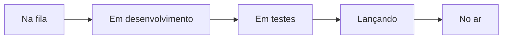

# Novidades do LocFlow

Quer saber se aquela melhoria que você pediu já está sendo feita, ou o que mudou na última atualização? A resposta fica no próprio app: no **sino** (no topo da tela), na aba **Novidades** — ao lado de **Todas** e **Não lidas**.


A aba Novidades **não traz avisos da sua operação** (esses ficam em Todas e Não lidas). Ela mostra o que está mudando **no LocFlow**. Quando chega uma versão nova que você ainda não viu, a aba ganha um ponto. Veja também a [Central de Notificações](../configuracoes/central-de-notificacoes.md).


## A trilha de cinco etapas {#trilha}

Cada pedido de melhoria ou de correção está numa destas etapas:

| Etapa | O que quer dizer |
| --- | --- |
| **Na fila** | Foi aprovado numa reunião e entrou na lista de trabalho. Ainda não começou. |
| **Em desenvolvimento** | Alguém está construindo agora. |
| **Em testes** | Está pronto e sendo conferido. Só sobe depois que passar. |
| **Lançando** | Passou nos testes e está aguardando a próxima atualização do sistema. |
| **No ar** | Já está disponível para você usar, na versão indicada. |

O andamento de cada pedido vem do trabalho real da equipe — não é um texto escrito à parte, que pode ficar velho.

## Como usar a tela {#como-usar}

1. **A trilha é o mapa e o filtro.** No topo (em telas largas, sob o título **Onde cada pedido está**), cada etapa mostra quantos pedidos tem. Toque numa etapa para ver só os dela.
2. **Cada pedido é um cartão curto:** o título, onde ele fica no app, o selo de **Prioridade** quando tem (no celular, uma bandeirinha) e uma mini-trilha com a etapa em que está. Melhorias e correções têm ícones diferentes.
3. **Toque no cartão** para ler a descrição completa.
4. **Procure** por uma novidade, um ajuste ou uma versão no campo de busca.
5. Em **Como funciona**, a própria tela explica cada etapa.


**"No ar" é a sua versão.** A tela diz em que versão você está (*"Você está na…"*) e, em **No ar**, lista o que veio nela. As versões anteriores ficam numa faixa logo abaixo, em **Versões anteriores** — toque numa para ver o que ela trouxe. Quando a lista do aparelho ainda não conhece as versões mais novas, a tela diz isso, em vez de fingir que está em dia.


Quando você abre a aba depois de uma atualização que ainda não tinha visto, ela já começa em **No ar** — é o que mudou para você.

## Como pedir alguma coisa {#como-pedir}

A própria aba indica o caminho:

| Situação | O que fazer |
| --- | --- |
| **Alguma coisa está errada?** | Fale com o suporte. Correção passa na frente da fila. |
| **Tem uma ideia?** | Mande pela comunidade. Entra na pauta da próxima reunião. |
| **É específico da sua operação?** | Converse com os especialistas de negócio do LocFlow. |

Cada um desses cartões é um atalho: tocar nele abre a conversa com o time do LocFlow — no app, **Alguma coisa está errada?** abre o chat do suporte; os outros dois (e todos, no navegador) abrem o WhatsApp do suporte. Os demais canais estão em [Onde tirar dúvidas](../primeiros-passos/onde-tirar-duvidas.md).

## Situações reais {#situacoes-reais}

* **"Pedi uma melhoria. Já estão fazendo?"** Abra **Novidades**, busque pelo assunto e veja a etapa: **Em desenvolvimento** é que alguém está construindo agora.
* **"Atualizei o app. O que mudou?"** A aba abre em **No ar**, com o que veio na sua versão.
* **"Diz Lançando há dias."** Já passou nos testes; entra na próxima atualização do sistema.

## Próximo passo {#proximo-passo}

* Os avisos da sua operação ficam na [Central de Notificações](../configuracoes/central-de-notificacoes.md).
* Dúvidas comuns estão nas [Perguntas frequentes](perguntas-frequentes.md).
