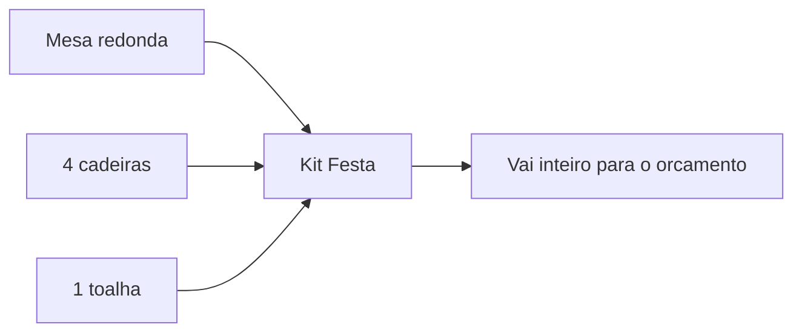

# Catálogo: kits

Um **kit** é um **pacote de produtos** do seu catálogo vendido (ou alugado) como uma coisa só. Em vez de o cliente escolher mesa, cadeiras e toalha um por um, você oferece o "Kit Festa para 10 pessoas" pronto. Menos cliques para você, decisão mais fácil para o cliente.


O kit **combina produtos que já existem** no seu [catálogo](catalogo-produtos.md). Não dá para montar um kit sem ter os produtos cadastrados antes — o kit é a embalagem, os produtos são o conteúdo.


## O que é um kit

Regras importantes do kit:

- Ele junta **produtos do seu catálogo**, cada um com uma **quantidade**.
- Precisa de **pelo menos 2 itens no total** — um "kit" de um item só não é um kit.
- Tem **identidade própria** (nome, foto, categoria) e **preços próprios**.

## Duas formas de montar um kit

Igual aos produtos, ao criar um kit o LocFlow pergunta **como você quer montar**:

| | Catálogo oficial (recomendado) | Por conta própria |
| --- | --- | --- |
| **O que é** | Kits prontos já curados (ex.: jogo 1 mesa + 4 cadeiras) | Você escolhe os produtos do seu catálogo |
| **O que vem pronto** | Itens sugeridos, categoria e preços sugeridos | Nada — você monta a composição |
| **Ideal para** | Combinações clássicas do mercado | Combos exclusivos da sua operação |

## Montando por conta própria

O cadastro do kit é organizado em seções:

### Identidade

Nome do kit, especificações e foto opcional. Dê um nome que venda: "Kit Festa Infantil 20 pessoas" diz mais que "Kit 1".

### Classificação na vitrine

Como qualquer item, o kit precisa de uma **categoria** para aparecer organizado na vitrine, nos filtros e nos relatórios.

### Itens do kit

Aqui você escolhe **quais produtos** entram e **em que quantidade**. Lembre: precisa somar **no mínimo 2 itens**.

### Preços e negócio

O kit tem seus próprios toggles **"você vai alugar?"** e **"você vai vender?"**, com as mesmas **condições de venda** (Novo, Seminovo, Usado) dos produtos.

#### Preço sugerido pela composição

Esta é a mágica do kit: ao montar a composição, o LocFlow **calcula um preço sugerido** somando os preços dos produtos que você colocou (e suas quantidades). Esse valor já aparece pré-preenchido no campo de preço — tanto para aluguel quanto para cada condição de venda.


A sugestão é só um ponto de partida. Você pode **aceitar** ou **digitar outro valor** — por exemplo, dar um desconto de combo para incentivar o cliente a levar o pacote inteiro. O LocFlow nunca sobrescreve um preço que você já digitou.


#### Valor de reposição total

O kit mostra o **valor de reposição somado** de todos os produtos da composição (valor de reposição de cada item × quantidade). É a proteção do pacote inteiro, calculada para você.

## Situação real: o kit de festa

Você atende muitos aniversários e sempre alugam o mesmo conjunto: **1 mesa redonda + 4 cadeiras + 1 toalha**. Em vez de o atendente montar item por item a cada orçamento, você cria um kit:

1. **Itens do kit:** adiciona a mesa (1), as cadeiras (4) e a toalha (1) — 6 itens no total.
2. **Preço sugerido:** o LocFlow soma os aluguéis e sugere, digamos, R$ 95. Você decide fechar o kit em R$ 85 (preço de combo).
3. **Reposição:** já vem somada (mesa + 4 cadeiras + toalha) — sua garantia se algo não voltar.

Agora, quando chega um pedido de festa, o atendente joga **um kit** no orçamento em vez de seis itens. Mais rápido, sem esquecer nada e com um preço de pacote que o cliente sente como vantagem.


**Por que isso aumenta seu faturamento:** vender um pacote pronto fecha o orçamento mais rápido e **aumenta o ticket médio** — o cliente leva o conjunto completo em vez de só a peça que pediu. E como o preço já vem da composição, ninguém erra a conta nem deixa um item de fora.


## Pequeno, médio ou grande

| Porte | Como costuma usar |
| --- | --- |
| **Pequeno** | Um ou dois kits campeões (o "kit festa") para acelerar os pedidos mais comuns. |
| **Médio** | Vários kits por ocasião (infantil, corporativo, casamento), preços de combo definidos por você. |
| **Grande** | Catálogo de kits estruturado, com aluguel e venda por condição, alimentando relatórios por pacote. |

## Próximo passo

Antes de montar kits, garanta que os produtos existem em [Catálogo: produtos](catalogo-produtos.md). Depois, use seus kits em [Criando um orçamento](../orcamentos/criando-um-orcamento.md). Em dúvida sobre um termo? Veja o [Glossário](../primeiros-passos/glossario.md) ou [Onde tirar dúvidas](../primeiros-passos/onde-tirar-duvidas.md).
