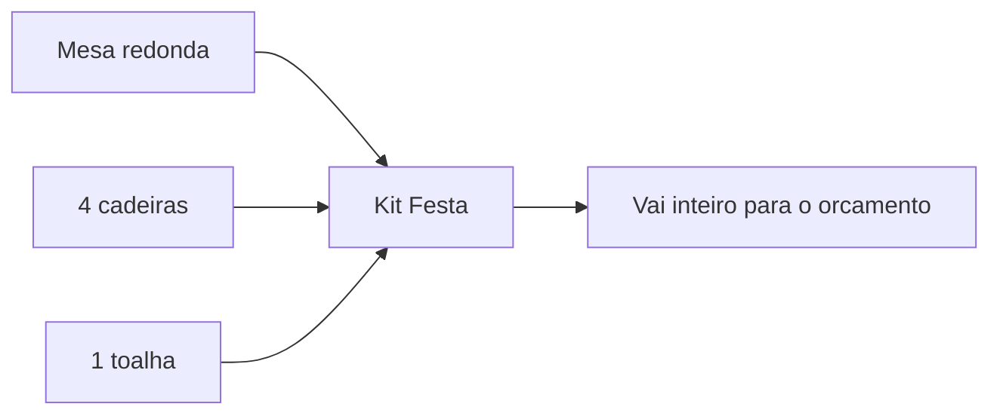
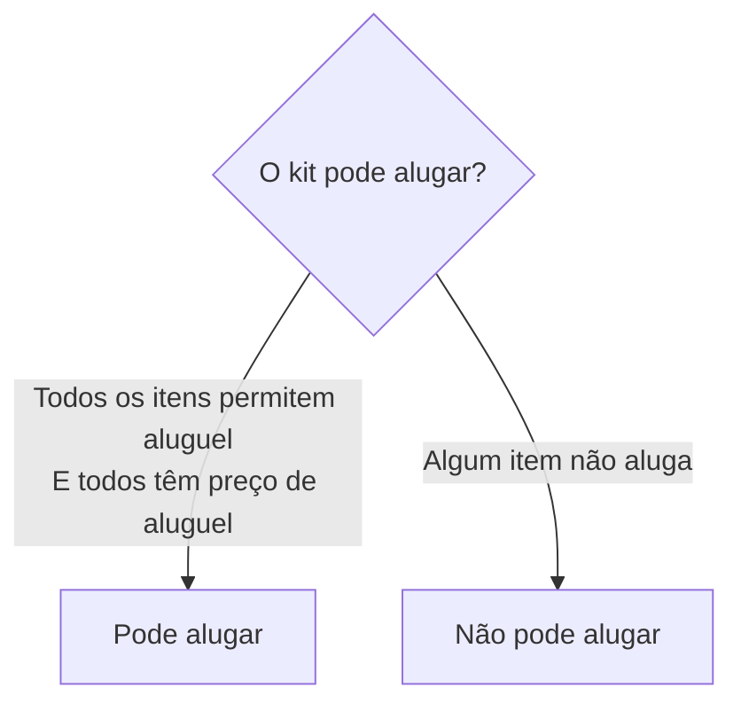
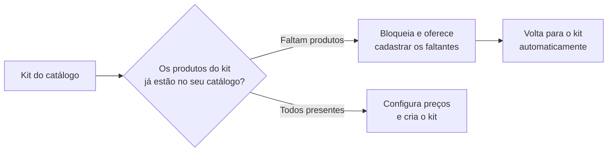

# Catálogo: kits

Um **kit** é um **pacote de produtos** do seu catálogo vendido (ou alugado) como uma coisa só. Em vez de o cliente escolher mesa, cadeiras e toalha um por um, você oferece o "Kit Festa para 10 pessoas" pronto. Menos cliques para você, decisão mais fácil para o cliente.


O kit **combina produtos que já existem** no seu [catálogo](catalogo-produtos.md). Não dá para montar um kit sem ter os produtos cadastrados antes — o kit é a embalagem, os produtos são o conteúdo.


Dentro do cadastro, uma faixa de ajuda resume a ideia: *"Kits combinam produtos do seu catálogo em um pacote único — preços e vitrine ficam aqui."*

## O que é um kit {#o-que-e-um-kit}

Regras importantes do kit:

- Ele junta **produtos do seu catálogo**, cada um com uma **quantidade**.
- Precisa de **pelo menos 2 unidades no total** — um "kit" de uma peça só não é um kit.
- Tem **identidade própria** (nome, especificações, foto) e **preços próprios**.

## Itens distintos x unidades {#itens-distintos-x-unidades}

Vale separar duas contagens que aparecem no cadastro, porque elas significam coisas diferentes:

| Contagem | O que é | Exemplo |
| --- | --- | --- |
| **Itens distintos** | Quantos **produtos diferentes** entram no kit | Mesa, cadeira e toalha = **3 itens distintos** |
| **Unidades** | A **soma das quantidades** de todos os produtos | 1 mesa + 4 cadeiras + 1 toalha = **6 unidades** |

No bloco **Itens do kit**, o resumo mostra as duas: por exemplo, *"3 itens distintos · 6 unidades"*. A regra do "pelo menos 2" é sobre **unidades** — então um kit com **um único produto em quantidade 2** já vale (ex.: 1 produto distinto, 2 unidades).


Para adicionar, busque o produto **pelo nome, marca ou SKU**, toque para incluir e ajuste a quantidade com os botões **+** e **−**. Tocar de novo no mesmo produto soma mais uma unidade ("Adicionar mais"). A quantidade vai de 1 a 999 por item.


## Duas formas de montar um kit {#duas-formas-de-montar}

Igual aos produtos, ao criar um kit o LocFlow pergunta **como você quer montar**:

| | Catálogo oficial (recomendado) | Por conta própria |
| --- | --- | --- |
| **O que é** | Kits prontos já curados (ex.: Jogo 1 mesa + 4 cadeiras) | Você escolhe os produtos do seu catálogo |
| **O que vem pronto** | Itens sugeridos, categoria e preços sugeridos | Nada — você monta a composição |
| **Ideal para** | Combinações clássicas do mercado | Combos exclusivos da sua operação |

A própria tela resume: *"Escolha a forma que melhor se encaixa no que você quer alugar ou vender."* O cartão do catálogo oficial promete *"Escolha kits prontos (ex.: Jogo 1 mesa + 4 cadeiras) e ganhe itens, categoria e preços sugeridos."*; o de conta própria, *"Você escolhe quais produtos entram, em que quantidade, e define os preços. Ideal para combos exclusivos."*

## Montando por conta própria {#montando-por-conta-propria}

O cadastro do kit é organizado em seções:

### Identidade

Nome do kit, **especificações** (opcional, ex.: *"mesa branca plástica + 4 cadeiras plásticas brancas"*) e foto opcional. Dê um nome que venda: "Kit Festa Infantil 20 pessoas" diz mais que "Kit 1".

Aqui também fica a chave **"Disponível para locação/venda?"** — é o **status** do kit (veja abaixo).

### Classificação na vitrine

Como qualquer item, o kit precisa de uma **categoria** para aparecer organizado na vitrine, nos filtros e nos relatórios.

### Itens do kit

Aqui você escolhe **quais produtos** entram e **em que quantidade**. Lembre: precisa somar **no mínimo 2 unidades**.

### Preços e negócio

O kit tem seus próprios toggles **"você vai alugar?"** e **"você vai vender?"**, com as mesmas **condições de venda** (Novo, Seminovo, Usado) dos produtos.

## O status do kit {#status-do-kit}

A chave **"Disponível para locação/venda?"**, na seção Identidade, controla se o kit está **Ativo** ou **Inativo**.

- **Ativo** (chave ligada): o kit aparece e pode ser jogado em um orçamento.
- **Inativo** (chave desligada): o kit fica **recolhido** — na listagem ele aparece esmaecido, com um selo **INATIVO**, e sai do caminho de quem está montando um orçamento.


Deixar inativo é melhor que excluir quando você só quer **pausar** um kit (ex.: combo de fim de ano fora de temporada). Você não perde a composição nem o histórico de preços — é só religar quando voltar a oferecer.


## Quando o kit pode alugar ou vender {#elegibilidade-alugar-ou-vender}

Esta é a regra que diferencia o kit de um produto solto: **o kit só herda o que os seus itens permitem**. Ele não inventa uma modalidade que os produtos dentro dele não têm.

- **Para o kit poder alugar:** **todos** os itens precisam permitir aluguel **e** ter preço de aluguel cadastrado.
- **Para o kit poder vender:** **todos** os itens precisam permitir venda.
- **As condições de venda disponíveis** (Novo, Seminovo, Usado) são a **interseção** — o kit só oferece uma condição se **todos** os itens vendáveis tiverem preço cadastrado naquela condição.

Se você tentar ligar uma opção que a composição não suporta, o LocFlow não deixa em silêncio: ele revela um aviso amigável apontando **exatamente quais itens** travam, por exemplo *"Para alugar este kit, todos os itens precisam permitir aluguel"* ou *"Cadastre o preço de aluguel destes itens antes"*. Resolva no produto correspondente (ligue a modalidade ou cadastre o preço) e a opção destrava sozinha.


Isso evita o erro clássico de oferecer um "kit para venda" em que uma das peças nunca foi marcada como vendável. O kit fica sempre **coerente** com o que você realmente tem para entregar.


## Preço do kit e a sugestão da composição {#preco-e-sugestao}

Esta é a mágica do kit: ao montar a composição, o LocFlow **calcula um preço sugerido** somando os preços dos produtos que você colocou (preço de cada item × quantidade). Esse valor aparece como referência no campo de preço — tanto para o aluguel quanto para cada condição de venda.

Abaixo do campo você vê *"Soma dos itens: R$ …"* com um atalho **"Usar sugestão"**. E quando você digita um valor diferente, o LocFlow mostra o quanto está fora da soma:

| O que aparece | O que significa |
| --- | --- |
| **−R$ … de desconto** | Você fechou o kit **abaixo** da soma das peças (preço de combo). |
| **+R$ … acima da soma** | Você fechou **acima** da soma — geralmente sinal de revisar a conta. |


A sugestão é só um ponto de partida. Você pode **aceitar** ou **digitar outro valor** — por exemplo, dar um desconto de combo para incentivar o cliente a levar o pacote inteiro. O LocFlow **nunca sobrescreve** um preço que você já digitou; ele só preenche o campo que ainda estava em branco.


### O desconto de combo no orçamento {#desconto-de-combo}

O "desconto" do kit não vive só dentro do cadastro. No orçamento, quando os **produtos avulsos** que o atendente colocou formam, juntos, um kit do seu catálogo, o LocFlow percebe e oferece aplicar a **economia do kit** como desconto automático. Esse comportamento é detalhado em [Valores: mão de obra, frete e descontos](../orcamentos/valores.md#desconto-proporcional-aos-kits).

### Valor de reposição total {#valor-de-reposicao-total}

O kit mostra o **valor de reposição somado** de todos os produtos da composição (valor de reposição de cada item × quantidade). É a proteção do pacote inteiro, calculada para você. A ajuda do app explica de onde ele vem:

> *"Somamos o valor de reposição de cada produto do kit (multiplicado pela quantidade no kit). É o quanto você investe pra repor tudo que compõe o kit. Não é editável aqui: ajuste o valor de reposição direto no produto correspondente. Serve como referência para preços, indenização por avaria e NFe."*

## Situação real: o kit de festa {#situacao-real-kit-de-festa}

Você atende muitos aniversários e sempre alugam o mesmo conjunto: **1 mesa redonda + 4 cadeiras + 1 toalha**. Em vez de o atendente montar item por item a cada orçamento, você cria um kit:

1. **Itens do kit:** adiciona a mesa (1), as cadeiras (4) e a toalha (1) — 3 itens distintos, 6 unidades.
2. **Elegibilidade:** como todos os três permitem aluguel e têm preço de aluguel, o kit já pode alugar.
3. **Preço sugerido:** o LocFlow soma os aluguéis e sugere, digamos, R$ 95. Você fecha o kit em R$ 85 — e o app marca *"−R$ 10,00 de desconto"*.
4. **Reposição:** já vem somada (mesa + 4 cadeiras + toalha) — sua garantia se algo não voltar.

Agora, quando chega um pedido de festa, o atendente joga **um kit** no orçamento em vez de seis itens. Mais rápido, sem esquecer nada e com um preço de pacote que o cliente sente como vantagem.


**Por que isso aumenta seu faturamento:** vender um pacote pronto fecha o orçamento mais rápido e **aumenta o ticket médio** — o cliente leva o conjunto completo em vez de só a peça que pediu. E como o preço já vem da composição, ninguém erra a conta nem deixa um item de fora.


## Para quem quer os detalhes: montar vários kits prontos em lote {#fluxo-guiado-em-lote}

Quando você adiciona **vários kits do catálogo oficial de uma vez**, o LocFlow abre um **fluxo guiado** que percorre os kits selecionados, um por um, mostrando *"Kit X de Y"* no topo. Em cada passo você só precisa fechar **preços e disponibilidade** — o nome, a foto, a categoria e a composição já vêm do catálogo.

Como o kit é feito de produtos, o fluxo faz uma verificação antes de liberar os preços:

- Se **faltam produtos** que compõem aquele kit, o fluxo mostra um aviso — *"Cadastre os produtos do kit primeiro"* — lista os que faltam e oferece um botão para **cadastrá-los na hora**. Depois de cadastrar, *"você voltará automaticamente para configurar este kit"*.
- Quando **todos os produtos já existem**, você define os toggles de alugar/vender, os preços (com a mesma sugestão da composição) e cria o kit. Aí o fluxo avança para o próximo da fila.
- Dá para **"Pular para o próximo kit da fila"** ou abrir **"Editar outras informações"** se quiser ajustar nome, foto ou categoria daquele kit específico.


No fluxo guiado, o **valor de reposição total** pode aparecer editável caso ainda não dê para somar pelos produtos locais (por exemplo, antes de todos estarem cadastrados). Sempre que possível, ele é calculado e travado, igual ao cadastro normal.


## Pequeno, médio ou grande {#por-porte}

| Porte | Como costuma usar |
| --- | --- |
| **Pequeno** | Um ou dois kits campeões (o "kit festa") para acelerar os pedidos mais comuns. |
| **Médio** | Vários kits por ocasião (infantil, corporativo, casamento), com preços de combo definidos por você e os inativos pausados fora de temporada. |
| **Grande** | Catálogo de kits estruturado, montado em lote pelo catálogo oficial, com aluguel e venda por condição alimentando relatórios por pacote. |

## Próximo passo {#proximo-passo}

Antes de montar kits, garanta que os produtos existem em [Catálogo: produtos](catalogo-produtos.md). Entenda como aluguel e venda convivem em [Locação e venda](../conceitos/locacao-e-venda.md), e veja o preço do kit no pedido em [Valores: mão de obra, frete e descontos](../orcamentos/valores.md). Depois, use seus kits em [Criando um orçamento](../orcamentos/criando-um-orcamento.md). Em dúvida sobre um termo? Veja o [Glossário](../primeiros-passos/glossario.md) ou [Onde tirar dúvidas](../primeiros-passos/onde-tirar-duvidas.md).
