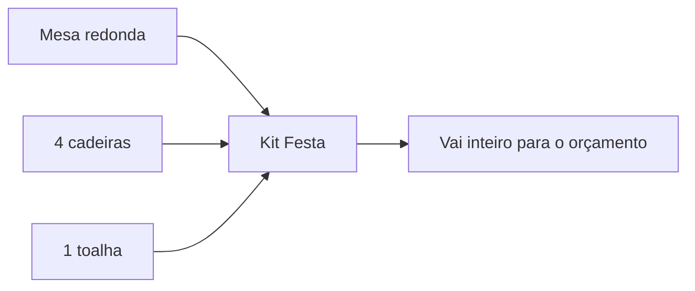
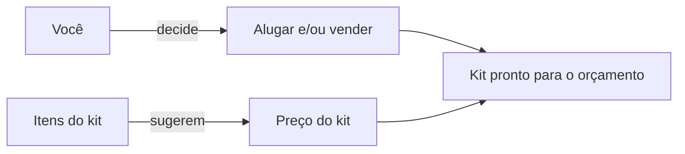
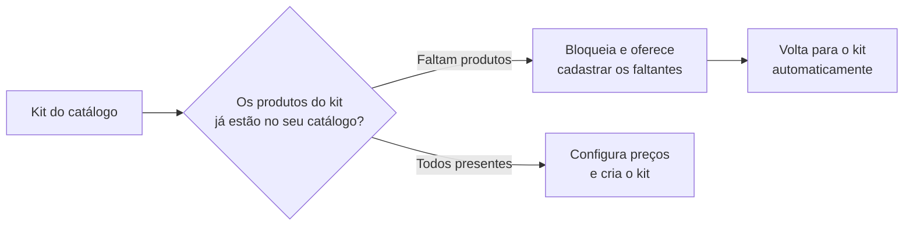

# Catálogo: kits

Um **kit** é um **pacote de produtos** do seu catálogo vendido (ou alugado) como uma coisa só. Em vez de o cliente escolher mesa, cadeiras e toalha um por um, você oferece o "Kit Festa para 10 pessoas" pronto. Menos cliques para você, decisão mais fácil para o cliente.


O kit **combina produtos que já existem** no seu [catálogo](catalogo-produtos.md). Não dá para montar um kit sem ter os produtos cadastrados antes — o kit é a embalagem, os produtos são o conteúdo.


Dentro do cadastro, uma faixa de ajuda resume a ideia: *"Kits combinam produtos do seu catálogo em um pacote único — preços e vitrine ficam aqui."*

## O que é um kit {#o-que-e-um-kit}

```mermaid
flowchart LR
    P1[Mesa redonda] --> K[Kit Festa]
    P2[4 cadeiras] --> K
    P3[1 toalha] --> K
    K --> O[Vai inteiro para o orçamento]
```

Regras importantes do kit:

- Ele junta **produtos do seu catálogo**, cada um com uma **quantidade**.
- Precisa de **pelo menos 2 unidades no total** — um "kit" de uma peça só não é um kit.
- Tem **identidade própria** (nome, especificações, foto) e **preços próprios**.
- Decide **por conta própria** se aluga e/ou vende — a composição só **sugere** o preço (veja [Quando o kit pode alugar ou vender](#elegibilidade-alugar-ou-vender)).

## Itens distintos x unidades {#itens-distintos-x-unidades}

Vale separar duas contagens que aparecem no cadastro, porque elas significam coisas diferentes:

| Contagem | O que é | Exemplo |
| --- | --- | --- |
| **Itens distintos** | Quantos **produtos diferentes** entram no kit | Mesa, cadeira e toalha = **3 itens distintos** |
| **Unidades** | A **soma das quantidades** de todos os produtos | 1 mesa + 4 cadeiras + 1 toalha = **6 unidades** |

No bloco **Itens do kit**, o resumo mostra as duas: por exemplo, *"3 itens distintos · 6 unidades"*. A regra do "pelo menos 2" é sobre **unidades** — então um kit com **um único produto em quantidade 2** já vale (ex.: 1 produto distinto, 2 unidades).


Para adicionar, busque o produto **pelo nome, marca ou SKU**, toque para incluir e ajuste a quantidade com os botões **+** e **−**. Tocar de novo no mesmo produto soma mais uma unidade ("Adicionar mais"). A quantidade vai de 1 a 999 por item.


## Duas formas de montar um kit {#duas-formas-de-montar}

Igual aos produtos, ao criar um kit o LocFlow pergunta **como você quer montar**:

| | Catálogo oficial (recomendado) | Por conta própria |
| --- | --- | --- |
| **O que é** | Kits prontos já curados (ex.: Jogo 1 mesa + 4 cadeiras) | Você escolhe os produtos do seu catálogo |
| **O que vem pronto** | Itens, categoria e preços sugeridos | Nada — você monta a composição |
| **Ideal para** | Combinações clássicas do mercado | Combos exclusivos da sua operação |

A própria tela resume: *"Escolha a forma que melhor se encaixa no que você quer alugar ou vender."* O cartão do catálogo oficial promete *"Escolha kits prontos (ex.: Jogo 1 mesa + 4 cadeiras) e ganhe itens, categoria e preços sugeridos."*; o de conta própria, *"Você escolhe quais produtos entram, em que quantidade, e define os preços. Ideal para combos exclusivos."*

## Montando por conta própria {#montando-por-conta-propria}

O cadastro do kit é organizado em seções:

### Identidade

Nome do kit, **especificações** (opcional, ex.: *"mesa branca plástica + 4 cadeiras plásticas brancas"*) e foto opcional. Dê um nome que venda: "Kit Festa Infantil 20 pessoas" diz mais que "Kit 1".

O **status** do kit (ativo ou inativo) não fica no formulário: ativar e inativar é uma ação própria, com confirmação (veja [O status do kit](#status-do-kit)).

### Classificação na vitrine

A **categoria** ("Minha categoria") é **opcional** no kit, como no produto. Vale preencher mesmo assim: é ela que organiza o kit na vitrine, nos filtros e nos relatórios.

### Itens do kit

Aqui você escolhe **quais produtos** entram e **em que quantidade**. Lembre: precisa somar **no mínimo 2 unidades**.

### Fator de cubagem do kit {#fator-de-cubagem}

Como o produto, o kit pode ter um **fator de cubagem** — o **volume efetivo (m³)** que o kit ocupa numa carga, considerando o **empilhamento do conjunto**. É o que a [estratégia volumétrica de capacidade](frota-capacidade.md#volumetrica) usa para medir o kit ao avaliar se a carga cabe no veículo.


**O fator do kit é próprio — não é a soma das peças.** Um "jogo de mesa" montado ou empilhado ocupa um espaço característico, que raramente é a soma do espaço de cada cadeira e mesa solta. Por isso você informa um fator **para o kit inteiro**. (A contagem, ao contrário, **dilui** o kit nos produtos — são olhares diferentes para a mesma carga; entenda em [Tipos de veículo: capacidade](frota-capacidade.md#volumetrica).)


### Preços e negócio

O kit tem as próprias chaves **Permite aluguel?** e **Permite venda?**, com as mesmas **condições de venda** (Novo, Seminovo, Usado) dos produtos. No fluxo guiado do catálogo oficial, as mesmas perguntas aparecem como *"Você vai alugar este kit?"* e *"Você vai vender este kit?"*. Quem decide é você, não as peças — veja a regra logo abaixo. (Habilitar o kit para **venda** faz parte do plano **Pro**, como toda a venda; o aluguel está em todos os planos.)

## O status do kit {#status-do-kit}

Todo kit nasce **ativo**. Ativar e inativar é uma **ação própria**, com confirmação, disponível no cartão do kit, na linha da tabela (em telas largas) e na ficha do kit (**Inativar kit** / **Ativar kit**).

Antes de inativar, o LocFlow pergunta **"Inativar kit?"** e explica o efeito: o kit *"deixa de aparecer na seleção de novos orçamentos. Orçamentos e histórico já existentes não mudam — dá para ativar de novo quando quiser."*

- **Ativo**: o kit aparece e pode ser jogado em um orçamento.
- **Inativo**: o kit fica **recolhido** — na listagem ele aparece esmaecido, com o selo **INATIVO**, e sai do caminho de quem está montando um orçamento.


Deixar inativo é melhor que excluir quando você só quer **pausar** um kit (ex.: combo de fim de ano fora de temporada). Você não perde a composição nem o histórico de preços — é só ativar de novo quando voltar a oferecer.


## Quando o kit pode alugar ou vender {#elegibilidade-alugar-ou-vender}

**A natureza do kit é do kit.** Um kit pode ser alugado ou vendido **independentemente do que cada peça faz sozinha**: a composição não decide por você.

| Situação | O que acontece |
| --- | --- |
| Cadeiras e mesa cadastradas só para **venda** | O conjunto pode ser **alugado** como kit, se você ligar **Permite aluguel?** no kit. |
| Uma peça que não aluga nem vende sozinha (o parafuso que prende a mesa) | Não impede nada: o kit aluga (ou vende) do mesmo jeito. |
| Algum item sem preço de aluguel | O kit aluga normalmente; esse item só fica **fora da soma** sugerida (veja abaixo). |

```mermaid
flowchart LR
    I[Itens do kit] -->|sugerem| P[Preço do kit]
    D[Você] -->|decide| N[Alugar e/ou vender]
    N --> K[Kit pronto para o orçamento]
    P --> K
```

O que o cadastro cobra é o que está **na tela**: com **Permite aluguel?** ligado, o **preço de aluguel** do kit; com **Permite venda?** ligado, ao menos uma **condição de venda** e um **preço para cada condição** marcada. Se algo faltar, a mensagem aparece no próprio campo — nenhum erro fica escondido.


**Editar um kit não religa nada por conta própria.** Se o aluguel está desligado, ele continua desligado quando você mexe em outra coisa. Para religar de propósito, ligue **Permite aluguel?**: se o kit já tinha um preço de aluguel, ele volta preenchido no campo; confirme ou ajuste e salve — tudo num salvar só. Ligar a venda pela primeira vez já começa o [histórico de preços](historico-de-precos.md) daquela condição.



**Por que isso te dá liberdade:** você monta o pacote que o seu cliente procura — inclusive alugar como conjunto o que você só vende avulso — sem precisar mexer no cadastro de cada peça para "destravar" o kit.


## Preço do kit e a sugestão da composição {#preco-e-sugestao}

Ao montar a composição, o LocFlow **soma os preços dos produtos** que você colocou (preço de cada item × quantidade). Essa soma é só uma **sugestão**: ela aparece embaixo do campo de preço — do aluguel e de cada condição de venda — e quem define o preço do kit é você.

O rodapé do campo muda conforme o que os itens têm de preço:

| O que aparece embaixo do campo | Quando |
| --- | --- |
| *"Soma dos itens: R$ …"* e o atalho **Usar sugestão** | Todos os itens têm preço naquela modalidade. |
| *"Soma parcial dos itens: R$ …"*, **Usar sugestão** e *"Fora da soma (sem preço de aluguel): A e B"* | Alguns itens não têm preço; o rodapé diz quais ficaram de fora. |
| *"Nenhum item tem preço de aluguel: o preço do kit é o que você definir aqui."* | Nenhum item tem preço naquela modalidade. |

Quando a soma está completa e você digita um valor diferente, o LocFlow mostra o quanto está fora dela:

| O que aparece | O que significa |
| --- | --- |
| **−R$ … de desconto** | Você fechou o kit **abaixo** da soma das peças (preço de combo). |
| **+R$ … acima da soma** | Você fechou **acima** da soma — geralmente sinal de revisar a conta. |

Com a soma parcial, essa comparação não aparece: ela seria feita contra um número que não conta todos os itens.


A sugestão é só um ponto de partida. Você pode **aceitar** ou **digitar outro valor** — por exemplo, dar um desconto de combo para incentivar o cliente a levar o pacote inteiro. O LocFlow preenche com a sugestão só o campo de preço que ainda está **em branco** e **nunca sobrescreve** um valor que você digitou. Na **edição**, o preço de aluguel não é preenchido sozinho. Ao adotar um kit do catálogo oficial, a tela avisa: *"Sugerimos preços a partir dos itens que já têm preço. Ajuste para o valor que faz sentido pra você."*


### O desconto de combo no orçamento {#desconto-de-combo}

O "desconto" do kit não vive só dentro do cadastro. No orçamento, quando os **produtos avulsos** que o atendente colocou formam, juntos, um kit do seu catálogo, o LocFlow percebe e **sugere** aplicar a **economia do kit** como desconto — a sugestão aparece na lista de descontos, com o selo **Automático** e o valor já calculado, e entra com um toque em **Usar**. Esse comportamento é detalhado em [Valores: acréscimos, frete e descontos](../orcamentos/valores.md#desconto-proporcional-aos-kits).

### Valor de reposição total {#valor-de-reposicao-total}

O kit mostra o **valor de reposição somado** de todos os produtos da composição (valor de reposição de cada item × quantidade). É a proteção do pacote inteiro, calculada para você. A ajuda do app explica de onde ele vem:

> *"Somamos o valor de reposição de cada produto do kit (multiplicado pela quantidade no kit). É o quanto você investe pra repor tudo que compõe o kit. Não é editável aqui: ajuste o valor de reposição direto no produto correspondente. Serve como referência para preços, indenização por avaria e NFe."*

## Situação real: o kit de festa {#situacao-real-kit-de-festa}

Você atende muitos aniversários e sempre alugam o mesmo conjunto: **1 mesa redonda + 4 cadeiras + 1 toalha**. Em vez de o atendente montar item por item a cada orçamento, você cria um kit:

1. **Itens do kit:** adiciona a mesa (1), as cadeiras (4) e a toalha (1) — 3 itens distintos, 6 unidades.
2. **Aluguel:** deixa **Permite aluguel?** ligado no kit. Não importa se a toalha, sozinha, você só vende: quem decide o que o kit faz é o kit.
3. **Preço sugerido:** o LocFlow soma os aluguéis e sugere, digamos, R$ 95. Você fecha o kit em R$ 85 — e o app marca *"−R$ 10,00 de desconto"*. (Se a toalha não tivesse preço de aluguel, o rodapé mostraria a soma parcial e diria que ela ficou fora da conta.)
4. **Reposição:** já vem somada (mesa + 4 cadeiras + toalha) — sua garantia se algo não voltar.

Agora, quando chega um pedido de festa, o atendente joga **um kit** no orçamento em vez de seis itens. Mais rápido, sem esquecer nada e com um preço de pacote que o cliente sente como vantagem.


**Por que isso aumenta seu faturamento:** vender um pacote pronto fecha o orçamento mais rápido e **aumenta o ticket médio** — o cliente leva o conjunto completo em vez de só a peça que pediu. E como o preço já vem da composição, ninguém erra a conta nem deixa um item de fora.


## Para quem quer os detalhes: montar vários kits prontos em lote {#fluxo-guiado-em-lote}

Quando você adiciona **vários kits do catálogo oficial de uma vez**, o LocFlow abre um **fluxo guiado** que percorre os kits selecionados, um por um, mostrando em que ponto da fila você está (*"2 de 5"*, por exemplo). Em cada passo você só precisa fechar **preços e disponibilidade** — o nome, a foto, a categoria e a composição já vêm do catálogo.

Como o kit é feito de produtos, o fluxo faz uma verificação antes de liberar os preços:

```mermaid
flowchart LR
    A[Kit do catálogo] --> B{Os produtos do kit<br/>já estão no seu catálogo?}
    B -->|Faltam produtos| C[Bloqueia e oferece<br/>cadastrar os faltantes]
    C --> D[Volta para o kit<br/>automaticamente]
    B -->|Todos presentes| E[Configura preços<br/>e cria o kit]
```

- Se **faltam produtos** que compõem aquele kit, o fluxo mostra um aviso — *"Cadastre os produtos do kit primeiro"* — lista os que faltam e oferece um botão para **cadastrá-los na hora**. Depois de cadastrar, *"você voltará automaticamente para configurar este kit"*.
- Quando **todos os produtos já existem**, você responde *"Você vai alugar este kit?"* e *"Você vai vender este kit?"*, define os preços (com a mesma sugestão da composição) e cria o kit. Aí o fluxo avança para o próximo da fila.
- Dá para tocar em **"Pular para o próximo kit"** ou abrir **"Editar outras informações"** se quiser ajustar nome, foto ou categoria daquele kit específico.


No fluxo guiado, o **valor de reposição total** pode aparecer editável caso ainda não dê para somar pelos produtos locais (por exemplo, antes de todos estarem cadastrados). Sempre que possível, ele é calculado e travado, igual ao cadastro normal.


## Pequeno, médio ou grande {#por-porte}

| Porte | Como costuma usar |
| --- | --- |
| **Pequeno** | Um ou dois kits campeões (o "kit festa") para acelerar os pedidos mais comuns. |
| **Médio** | Vários kits por ocasião (infantil, corporativo, casamento), com preços de combo definidos por você e os inativos pausados fora de temporada. |
| **Grande** | Catálogo de kits estruturado, montado em lote pelo catálogo oficial, com aluguel e venda por condição alimentando relatórios por pacote. |

## Próximo passo {#proximo-passo}

Antes de montar kits, garanta que os produtos existem em [Catálogo: produtos](catalogo-produtos.md). Entenda como aluguel e venda convivem em [Locação e venda](../conceitos/locacao-e-venda.md), e veja o preço do kit no pedido em [Valores: acréscimos, frete e descontos](../orcamentos/valores.md). Depois, use seus kits em [Criando um orçamento](../orcamentos/criando-um-orcamento.md). Em dúvida sobre um termo? Veja o [Glossário](../primeiros-passos/glossario.md) ou [Onde tirar dúvidas](../primeiros-passos/onde-tirar-duvidas.md).
