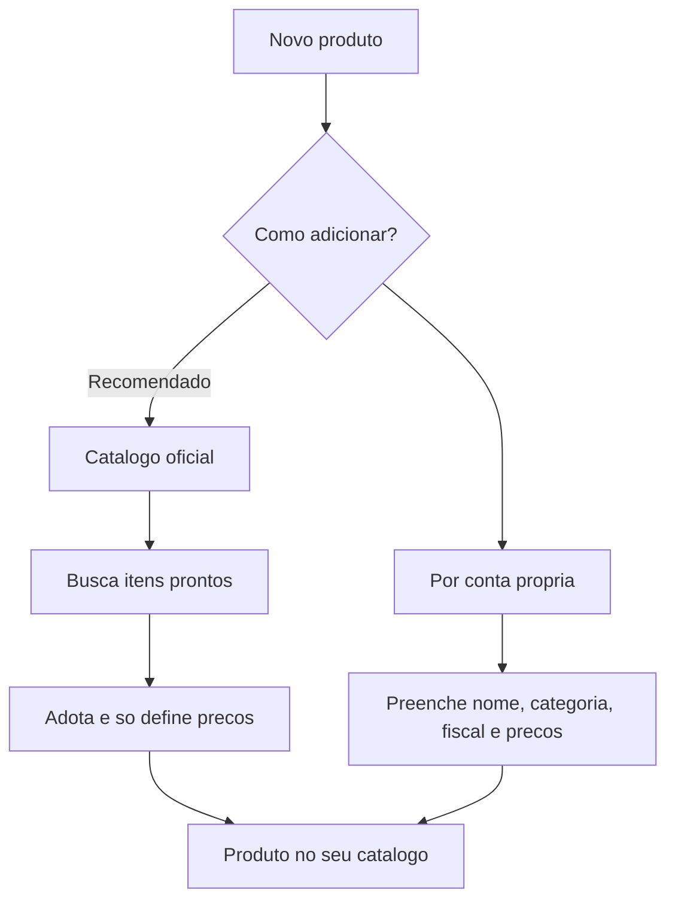

# Catálogo: produtos

O catálogo é a **vitrine** dos seus bens móveis. É daqui que vêm os itens que você coloca em um [orçamento](../orcamentos/criando-um-orcamento.md) — para **alugar**, **vender** ou os dois. Cadastrar bem aqui é o que faz o resto do sistema (preços, disponibilidade, documentos) funcionar redondo.


**Catálogo é cadastro, vitrine e preço — não é estoque.** Quantas peças você tem, em qual galpão e quantas estão livres fica em [Estoque](../estoque/galpoes-e-disponibilidade.md). Aqui você descreve o item e diz por quanto ele sai.


## Duas formas de adicionar um produto

Ao tocar em **novo produto**, o LocFlow pergunta **como você quer adicionar**. São dois caminhos, e os dois levam ao mesmo lugar — um produto pronto no seu catálogo.

| | Catálogo oficial (recomendado) | Por conta própria |
| --- | --- | --- |
| **O que é** | Itens já curados pela equipe LocFlow | Cadastro manual, do zero |
| **O que vem pronto** | Nome, categoria, subcategoria, ficha técnica e foto | Nada — você preenche tudo |
| **Você só informa** | Preços e se vai alugar/vender | Todos os campos |
| **Ideal para** | Itens comuns do mercado (mesas, cadeiras, ferramentas) | Itens exclusivos, personalizados ou sob medida |
| **Velocidade** | Muito rápido | Mais detalhado |


**Por que isso poupa seu tempo:** montar um catálogo do zero costuma ser o que mais trava quem começa. Com o catálogo oficial, você adota um item pronto, informa só o preço e já está vendável. Menos digitação, menos erro, vitrine no ar mais rápido.


## Catálogo oficial: adoção rápida (e em lote)

Quando você escolhe **Catálogo oficial**, abre a busca de itens prontos. Ali você pode **marcar vários de uma vez** e tocar em continuar — entra no **fluxo guiado**.

O fluxo guiado mostra um item de cada vez ("Produto 1 de 5", "Produto 2 de 5"...) e pede só o essencial de cada um:

- **Você vai alugar este produto?** Se sim, informe o **preço de aluguel**.
- **Você vai vender este produto?** Se sim, escolha as **condições** e informe o preço de cada uma.
- **Valor de reposição** (obrigatório — explicado abaixo).

A cada item, você toca em **usar produto** e o LocFlow já cria o produto no seu catálogo e avança para o próximo. Se quiser detalhar mais algum (marca, modelo, SKU), toque em **editar outras informações** — você cai no cadastro completo só daquele item e o fluxo continua depois.


Itens do catálogo oficial **já trazem a ficha fiscal** (NCM/CEST) preenchida e travada para leitura. Você não precisa se preocupar com isso — é uma das maiores vantagens de adotar o item pronto.


## Por conta própria: o cadastro completo

Quando o item é exclusivo (ou você prefere controlar tudo), o cadastro manual organiza as informações em seções:

### Identidade

Nome do produto, especificações e, se quiser, foto, marca, modelo, material e cor. O **nome** é o único campo realmente obrigatório aqui.

### Classificação na vitrine

Toda peça precisa de uma **categoria** e uma **subcategoria**. É isso que organiza filtros, buscas e relatórios. Sem classificar, o item fica difícil de achar quando você está montando um orçamento.

### Preços e negócio

O coração do cadastro. Aqui você responde duas perguntas independentes:

- **Você vai alugar este produto?** Ligando, informe o **preço de aluguel**.
- **Você vai vender este produto?** Ligando, escolha as **condições de venda**.

Um mesmo produto pode estar disponível para **as duas coisas**, só uma, ou — temporariamente — nenhuma (você adiciona os preços depois).

#### Condições de venda e preço por condição

Quando o produto é vendável, você escolhe em **que estado** ele é vendido — e cada estado tem **seu próprio preço**:

| Condição | Quando usar |
| --- | --- |
| **Novo** | Peça zero, pronta para venda |
| **Seminovo** | Peça com pouco uso |
| **Usado** | Peça com mais uso |

Você pode habilitar **mais de uma condição** no mesmo produto. Exemplo: vender a cadeira nova por R$ 120 e a mesma cadeira como seminovo por R$ 70. O LocFlow guarda os dois preços e exige um valor para **cada** condição marcada.

#### Valor de reposição

É **quanto custaria repor** aquele item se ele fosse perdido ou danificado sem conserto. Esse valor é **obrigatório** em todo produto.


O valor de reposição não é o preço de venda. É a sua proteção: ele baliza a cobrança quando um item alugado **não volta** ou volta com avaria grave. Preencha com o custo real de comprar outro igual.


### Fiscal (NCM / CEST) e SKU

No cadastro **por conta própria**, você informa os dados fiscais do item:

- **NCM** — o código de classificação fiscal do produto (8 dígitos).
- **CEST** — quando se aplica ao item (7 dígitos); pode ficar em branco.
- **Origem da mercadoria** — nacional ou importada.

O **SKU** é o seu código interno de identificação do produto (o que você usa para se referir a ele na sua operação). É opcional, mas ajuda a organizar.


Adotou um item do **catálogo oficial**? A parte fiscal já vem preenchida e travada — você não precisa digitar NCM/CEST. Isso só aparece para preencher no cadastro por conta própria.


## Item já cadastrado

Se você tentar adotar do catálogo oficial um item que **já existe** no seu catálogo, o LocFlow avisa ("este item já está cadastrado") e oferece **editar o produto existente** em vez de criar uma cópia. Isso evita duplicatas que bagunçam a vitrine e os relatórios.

## Situações reais

- **Locadora de festa montando a vitrine.** Você tem 200 cadeiras Tiffany, 30 mesas redondas e toalhas. Mesas e cadeiras estão no catálogo oficial: adota tudo em lote pelo fluxo guiado, informa só o preço de aluguel de cada um e em minutos a vitrine está pronta. As toalhas, que são um modelo seu, você cadastra por conta própria.
- **Locadora que também vende o usado.** A furadeira sai por R$ 40/dia no aluguel. Quando uma sai de linha, você vende: liga **"vai vender?"**, marca **Usado** e põe R$ 90. O mesmo produto continua disponível para aluguel e agora também para venda do estoque seminovo/usado.
- **Item exclusivo sob medida.** Você fabricou um painel de LED personalizado que não existe em catálogo nenhum. Cadastra por conta própria, preenche NCM e valor de reposição alto (é um item caro de repor) e define o preço de locação.

## Pequeno, médio ou grande: o catálogo cresce com você

| Porte | Como costuma usar |
| --- | --- |
| **Pequeno** | Adota itens do catálogo oficial, informa só preço e reposição. Vitrine no ar em minutos. |
| **Médio** | Mistura catálogo oficial com itens próprios; usa condições de venda (novo/seminovo/usado) e SKU para organizar. |
| **Grande** | Cadastro próprio detalhado (marca, modelo, material, fiscal completo), classificação rigorosa para relatórios e múltiplas condições de venda. |


**Por que isso aumenta seu faturamento:** quanto mais completo e bem classificado o catálogo, mais rápido você monta um orçamento e menos pedido escapa por "não achei o item" ou "não sei o preço". E habilitar a venda (além do aluguel) abre uma receita que muita locadora deixa na mesa.


## Próximo passo

Monte combos prontos em [Catálogo: kits](catalogo-kits.md), entenda as duas modalidades em [Locação e venda](../conceitos/locacao-e-venda.md) ou comece a usar seus produtos em [Criando um orçamento](../orcamentos/criando-um-orcamento.md). Em dúvida sobre um termo? Consulte o [Glossário](../primeiros-passos/glossario.md) ou veja [Onde tirar dúvidas](../primeiros-passos/onde-tirar-duvidas.md).
