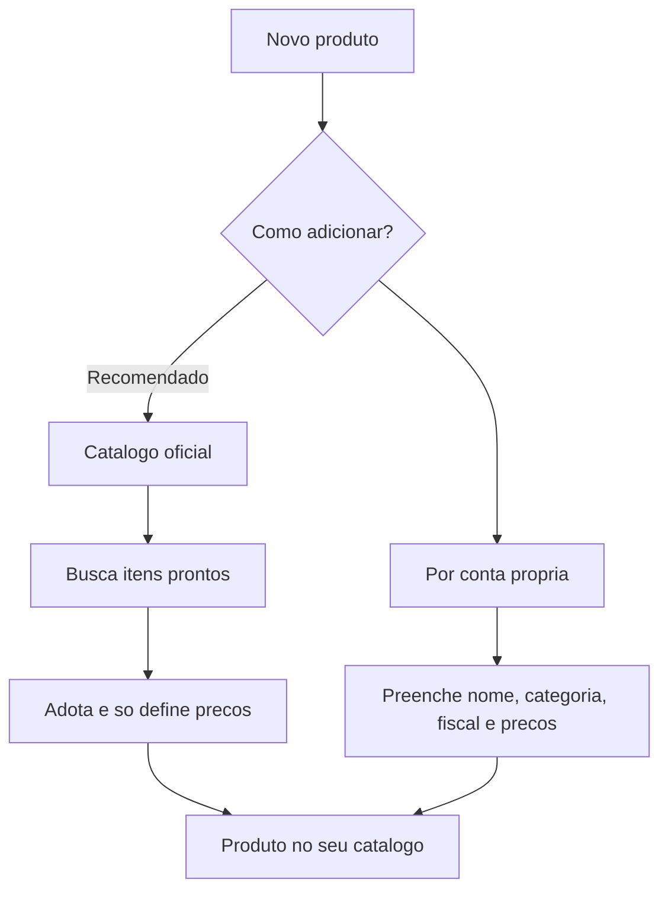

# Catálogo: produtos

O catálogo é a **vitrine** dos seus bens móveis. É daqui que vêm os itens que você coloca em um [orçamento](../orcamentos/criando-um-orcamento.md) — para **alugar**, **vender** ou os dois. Cadastrar bem aqui é o que faz o resto do sistema (preços, disponibilidade, documentos) funcionar redondo.


**Catálogo é cadastro, vitrine e preço — não é estoque.** Quantas peças você tem, em qual galpão e quantas estão livres fica em [Estoque](../estoque/galpoes-e-disponibilidade.md). Aqui você descreve o item e diz por quanto ele sai.


## Duas formas de adicionar um produto {#duas-formas}

Ao tocar em **novo produto**, o LocFlow pergunta **como você quer adicionar**. São dois caminhos, e os dois levam ao mesmo lugar — um produto pronto no seu catálogo.

| | Catálogo oficial (recomendado) | Por conta própria |
| --- | --- | --- |
| **O que é** | Itens já curados pela equipe LocFlow | Cadastro manual, do zero |
| **O que vem pronto** | Nome, categoria, subcategoria, ficha técnica e foto | Nada — você preenche tudo |
| **Você só informa** | Preços e se vai alugar/vender | Todos os campos |
| **Ideal para** | Itens comuns do mercado (mesas, cadeiras, ferramentas) | Itens exclusivos, personalizados ou sob medida |
| **Velocidade** | Muito rápido | Mais detalhado |

A tela inicial deixa isso claro: o cartão **Catálogo oficial** vem com o selo **Recomendado** e a promessa *"Encontre o item e as informações técnicas são preenchidas automaticamente"*. O cartão **Por conta própria** diz *"Preencha nome, categoria e preços você mesmo. Ideal para itens exclusivos ou personalizados"*.


**Por que isso poupa seu tempo:** montar um catálogo do zero costuma ser o que mais trava quem começa. Com o catálogo oficial, você adota um item pronto, informa só o preço e já está vendável. Menos digitação, menos erro, vitrine no ar mais rápido.


## Catálogo oficial: adoção rápida (e em lote) {#catalogo-oficial}

Quando você escolhe **Catálogo oficial**, abre a busca de itens prontos. Ali você pode **marcar vários de uma vez** e tocar em continuar — entra no **fluxo guiado**.

O fluxo guiado mostra um item de cada vez ("Produto 1 de 5", "Produto 2 de 5"...) e pede só o essencial de cada um:

- **Você vai alugar este produto?** Se sim, informe o **preço de aluguel**.
- **Você vai vender este produto?** Se sim, escolha as **condições** e informe o preço de cada uma.
- **Valor de reposição** (obrigatório — explicado abaixo).

A cada item, você toca em **usar produto** e o LocFlow já cria o produto no seu catálogo e avança para o próximo. Se quiser detalhar mais algum (marca, modelo, SKU), toque em **editar outras informações** — você cai no cadastro completo só daquele item e o fluxo continua depois.


Itens do catálogo oficial **já trazem a ficha fiscal** (NCM/CEST) preenchida e travada para leitura. Você não precisa se preocupar com isso — é uma das maiores vantagens de adotar o item pronto.


## Por conta própria: o cadastro completo {#por-conta-propria}

Quando o item é exclusivo (ou você prefere controlar tudo), o cadastro manual organiza as informações em seções recolhíveis.

### Identidade {#identidade}

**Nome de exibição**, especificações técnicas e, se quiser, foto, **fabricante/marca**, **modelo/referência**, **material** e **cor**. O **nome** é o único campo realmente obrigatório aqui. (O modelo só libera depois que você informa a marca.)

### Classificação na vitrine {#classificacao}

Toda peça precisa de uma **categoria** e uma **subcategoria** (a "minha categoria" e "minha subcategoria" da sua locadora). É isso que organiza filtros, buscas e relatórios. Sem classificar, o item fica difícil de achar quando você está montando um orçamento.


Adotou do catálogo oficial? A categoria e a subcategoria correspondentes são **criadas na sua locadora automaticamente** ao salvar. Você também pode criá-las manualmente em "Minha categoria".


### Preços e negócio {#precos-e-negocio}

O coração do cadastro. Aqui você responde duas perguntas independentes:

- **Permite aluguel?** Ligando, informe o **preço de aluguel**.
- **Permite venda?** Ligando, escolha as **condições de venda**.

Um mesmo produto pode estar disponível para **as duas coisas**, só uma, ou — temporariamente — nenhuma (você adiciona os preços depois). Quem decide o que acontece com o item em cada pedido é a **natureza do orçamento**; entenda em [Locação e venda](../conceitos/locacao-e-venda.md).


**Estoques são separados por natureza e condição.** Cada combinação (aluguel, venda novo, venda seminovo, venda usado) é um estoque **independente**, contado e movimentado à parte. Suas 10 unidades de aluguel não diminuem o estoque de venda; vender 1 peça nova não mexe no estoque de usados. Veja [Galpões e disponibilidade](../estoque/galpoes-e-disponibilidade.md).


#### Condições de venda e preço por condição {#condicoes-de-venda}

Quando o produto é vendável, você escolhe em **que estado** ele é vendido — e cada estado tem **seu próprio preço**:

| Condição | Quando usar |
| --- | --- |
| **Novo** | Peça zero, pronta para venda |
| **Seminovo** | Peça com pouco uso |
| **Usado** | Peça com mais uso |

Você pode habilitar **mais de uma condição** no mesmo produto. Exemplo: vender a cadeira nova por R$ 120 e a mesma cadeira como seminovo por R$ 70. O LocFlow guarda os dois preços e exige um valor para **cada** condição marcada.

#### Valor de reposição {#valor-de-reposicao}

É **quanto você investe para comprar 1 unidade** daquele item. É **obrigatório** em todo produto — sem ele o cadastro não salva. E ele não é um número decorativo: o LocFlow o usa em **quatro** lugares (texto da própria ajuda do app):

- **Margem de lucro na venda** — o sistema usa esse valor para calcular quanto você ganha em cada venda.
- **Referência para o aluguel** — ajuda a definir a diária e a amortizar o custo do bem ao longo do tempo.
- **Avarias** — se o cliente danificar o item, esse é o valor cobrado como indenização.
- **NF-e de remessa/retorno** — é exigido pela Receita Federal como custo do bem.


O valor de reposição **não é o preço de venda**. Ele é o custo de comprar outro igual — sua proteção quando um item alugado não volta ou volta com avaria grave, e a base de vários cálculos. Preencha com o custo real.


#### Mudar o preço depois: o histórico {#historico-de-precos}

Já editou um produto que está no catálogo? Ao abrir os preços, o LocFlow avisa: *"Mudança de preço vira novo registro no histórico; orçamentos antigos não mudam."*

Ou seja: alterar o preço de um item **não reescreve o passado**. Cada novo preço entra como um registro datado, e os orçamentos que você já fez continuam exatamente com o valor que tinham na época. Você ajusta a tabela para frente sem bagunçar o que já foi combinado.

### Fiscal e medidas {#fiscal}

No cadastro **por conta própria**, você informa a ficha fiscal e física do item:

- **NCM** — o código de classificação fiscal do produto.
- **CEST** — quando se aplica ao item; pode ficar em branco.
- **Origem da mercadoria** — nacional ou importada.
- **Peso bruto** e **peso líquido** (kg), **unidade de medida** e **dimensões** (altura/largura/profundidade, ou altura/diâmetro para itens cilíndricos).


Adotou um item do **catálogo oficial**? A parte fiscal vem em um bloco **"Dados fiscais do catálogo" (só leitura)** — você não digita NCM/CEST. O bloco editável "Fiscal e medidas" só aparece no cadastro por conta própria.


### SKU: o código interno {#sku}

O **SKU** é o seu código de identificação do produto na operação (etiqueta, separação, conferência). É **opcional**: se você deixar em branco, o LocFlow **gera um automaticamente** (um código começando por `SKU-`). O campo até avisa: *"gerado automaticamente se vazio"*. Preencha o seu padrão (ex.: `MES-001`, `CAD-042`) quando quiser que o código fale a sua língua.

### Status: ativo ou inativo {#status}

Todo produto nasce **ativo** (disponível para entrar em orçamentos). Nas opções, o controle **"Disponível para locação/venda?"** alterna entre:

- **Ativo** — aparece na busca e pode ser orçado normalmente.
- **Inativo** — sai de circulação sem ser apagado. Útil para um item que saiu de linha, está em manutenção ou você não quer mais oferecer — sem perder o histórico nem os orçamentos antigos.

Desativar é reversível: é só religar o controle quando quiser voltar a oferecer o item.

## Item já cadastrado {#item-ja-cadastrado}

Se você tentar adotar do catálogo oficial um item que **já existe** no seu catálogo, o LocFlow avisa e oferece **editar o produto existente** em vez de criar uma cópia. Isso evita duplicatas que bagunçam a vitrine e os relatórios.

## Situações reais {#situacoes-reais}

- **Locadora de festa montando a vitrine.** Você tem 200 cadeiras Tiffany, 30 mesas redondas e toalhas. Mesas e cadeiras estão no catálogo oficial: adota tudo em lote pelo fluxo guiado, informa só o preço de aluguel e o valor de reposição de cada um e em minutos a vitrine está pronta. As toalhas, que são um modelo seu, você cadastra por conta própria.
- **Locadora que também vende o usado.** A furadeira sai por R$ 40/dia no aluguel. Quando uma sai de linha, você vende: liga **"Permite venda?"**, marca **Usado** e põe R$ 90. O mesmo produto continua disponível para aluguel e agora também para venda — em estoques separados.
- **Reajuste de tabela no fim do ano.** Você sobe o aluguel da mesa de R$ 25 para R$ 30. O novo preço passa a valer para os próximos orçamentos; os pedidos já fechados a R$ 25 continuam intactos no histórico.
- **Item que saiu de linha.** Aquele modelo de tenda que você não usa mais: em vez de apagar (e perder o histórico), você marca como **Inativo**. Ele some das buscas, mas os orçamentos antigos seguem válidos.

## Pequeno, médio ou grande: o catálogo cresce com você {#por-porte}

| Porte | Como costuma usar |
| --- | --- |
| **Pequeno** | Adota itens do catálogo oficial, informa só preço e reposição. SKU automático. Vitrine no ar em minutos. |
| **Médio** | Mistura catálogo oficial com itens próprios; usa condições de venda (novo/seminovo/usado), SKU próprio e status ativo/inativo para organizar. |
| **Grande** | Cadastro próprio detalhado (marca, modelo, material, fiscal e medidas completos), classificação rigorosa para relatórios e múltiplas condições de venda. |


**Por que isso aumenta seu faturamento:** quanto mais completo e bem classificado o catálogo, mais rápido você monta um orçamento e menos pedido escapa por "não achei o item" ou "não sei o preço". E habilitar a venda (além do aluguel) abre uma receita que muita locadora deixa na mesa.



**Em breve: catálogo da comunidade.** No cadastro por conta própria, o app já permite **manifestar interesse** em sugerir o seu item para o catálogo curado pela LocFlow. Por enquanto o cadastro fica só na sua locadora — o envio formal e a fila de análise serão liberados em uma próxima atualização.


## Próximo passo {#proximo-passo}

Monte combos prontos em [Catálogo: kits](catalogo-kits.md), entenda as duas modalidades em [Locação e venda](../conceitos/locacao-e-venda.md), veja como o estoque é separado por natureza em [Galpões e disponibilidade](../estoque/galpoes-e-disponibilidade.md) ou comece a usar seus produtos em [Criando um orçamento](../orcamentos/criando-um-orcamento.md). Em dúvida sobre um termo? Consulte o [Glossário](../primeiros-passos/glossario.md) ou veja [Onde tirar dúvidas](../primeiros-passos/onde-tirar-duvidas.md).
