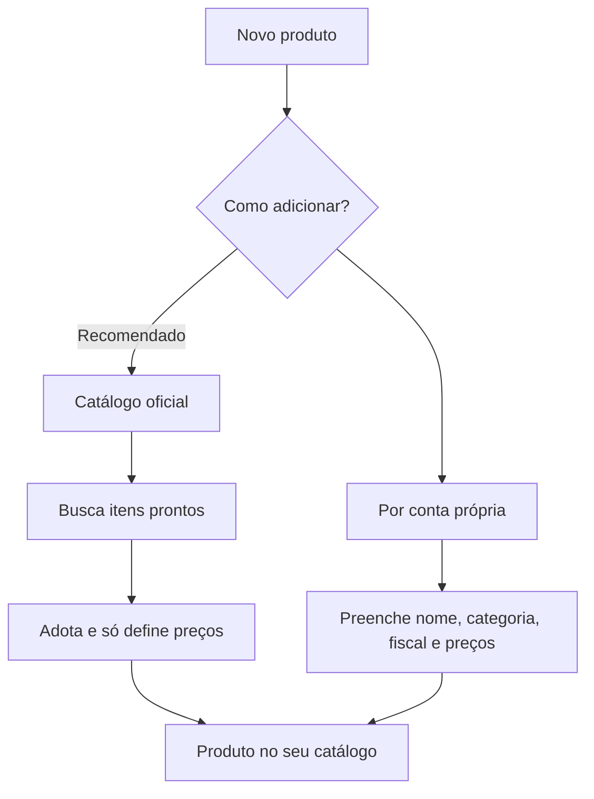

# Catálogo: produtos

O catálogo é a **vitrine** dos seus bens móveis. É daqui que vêm os itens que você coloca em um [orçamento](../orcamentos/criando-um-orcamento.md) — para **alugar**, **vender** ou os dois. Cadastrar bem aqui é o que faz o resto do sistema (preços, disponibilidade, documentos) funcionar redondo.


**Catálogo é cadastro, vitrine e preço — não é estoque.** Quantas peças você tem, em qual galpão e quantas estão livres fica em [Estoque](../estoque/galpoes-e-disponibilidade.md). Aqui você descreve o item e diz por quanto ele sai.


## Duas formas de adicionar um produto {#duas-formas}

Ao tocar em **novo produto**, o LocFlow pergunta **como você quer adicionar**. São dois caminhos, e os dois levam ao mesmo lugar — um produto pronto no seu catálogo.

```mermaid
flowchart TD
    N[Novo produto] --> P{Como adicionar?}
    P -->|Recomendado| C[Catálogo oficial]
    P --> M[Por conta própria]
    C --> CB[Busca itens prontos] --> AD[Adota e só define preços]
    M --> MA[Preenche nome, categoria, fiscal e preços]
    AD --> F[Produto no seu catálogo]
    MA --> F
```

| | Catálogo oficial (recomendado) | Por conta própria |
| --- | --- | --- |
| **O que é** | Itens já curados pela equipe LocFlow | Cadastro manual, do zero |
| **O que vem pronto** | Nome, categoria, subcategoria, ficha técnica e foto | Nada — você preenche tudo |
| **Você só informa** | Preços e se vai alugar/vender | Todos os campos |
| **Ideal para** | Itens comuns do mercado (mesas, cadeiras, ferramentas) | Itens exclusivos, personalizados ou sob medida |
| **Velocidade** | Muito rápido | Mais detalhado |

A tela inicial deixa isso claro: o cartão **Catálogo oficial** vem com o selo **Recomendado** e a promessa *"Encontre o item e as informações técnicas são preenchidas automaticamente"*. O cartão **Por conta própria** diz *"Preencha nome, categoria e preços você mesmo. Ideal para itens exclusivos ou personalizados"*.


**Por que isso poupa seu tempo:** montar um catálogo do zero costuma ser o que mais trava quem começa. Com o catálogo oficial, você adota um item pronto, informa só o preço e já está vendável. Menos digitação, menos erro, vitrine no ar mais rápido.


## Catálogo oficial: adoção rápida (e em lote) {#catalogo-oficial}

Quando você escolhe **Catálogo oficial**, abre a busca de itens prontos. Ali você pode **marcar vários de uma vez** e tocar em continuar — entra no **fluxo guiado**.

O fluxo guiado mostra um item de cada vez ("1 de 5", "2 de 5"...) e pede só o essencial de cada um:

- **Você vai alugar este produto?** Se sim, informe o **preço de aluguel**.
- **Você vai vender este produto?** Se sim, escolha as **condições** e informe o preço de cada uma.
- **Valor de reposição** (obrigatório — explicado abaixo).

A cada item, você toca em **Salvar e avançar** (no último, **Concluir**) e o LocFlow já cria o produto no seu catálogo e avança para o próximo. Se quiser detalhar mais algum (marca, modelo, SKU), toque em **Editar outras informações** — você cai no cadastro completo só daquele item e o fluxo continua depois.


Itens do catálogo oficial **já trazem a ficha fiscal** (NCM/CEST) preenchida e travada para leitura. Você não precisa se preocupar com isso — é uma das maiores vantagens de adotar o item pronto.


## Por conta própria: o cadastro completo {#por-conta-propria}

Quando o item é exclusivo (ou você prefere controlar tudo), o cadastro manual organiza as informações em seções recolhíveis.

### Identidade {#identidade}

**Nome de exibição**, foto e, se quiser, **marca ou fabricante** e **modelo ou referência**. Em **Mais detalhes** ficam **material**, **cor**, **especificações técnicas** e o **SKU**. O **nome** é o único campo realmente obrigatório aqui. (O modelo só libera depois que você informa a marca.)

### Classificação na vitrine {#classificacao}

No cadastro por conta própria, **Minha categoria** e **Minha subcategoria** são **opcionais** — o campo mostra *(opcional)*. Elas só passam a ser obrigatórias, junto com o **NCM**, se você marcar **Quero sugerir este produto ao catálogo da comunidade** (veja [Catálogo da comunidade](#catalogo-da-comunidade)).

Mesmo opcional, classificar compensa: é isso que organiza filtros, buscas e relatórios. Sem categoria, o item fica mais difícil de achar quando você está montando um orçamento.


Adotou do catálogo oficial? A categoria e a subcategoria correspondentes são **criadas na sua locadora automaticamente** ao salvar. Você também pode criá-las manualmente em "Minha categoria".


### Preços e negócio {#precos-e-negocio}

O coração do cadastro. Aqui você responde duas perguntas independentes:

- **Permite aluguel?** Ligando, informe o **preço de aluguel**.
- **Permite venda?** Ligando, escolha as **condições de venda**.

Um mesmo produto pode estar disponível para **as duas coisas**, só uma, ou nenhuma. Quem decide o que acontece com o item em cada pedido é o **tipo de negócio do orçamento** (Aluguel ou Venda); entenda em [Locação e venda](../conceitos/locacao-e-venda.md).


**Estoques são separados por natureza e condição.** Cada combinação (aluguel, venda novo, venda seminovo, venda usado) é um estoque **independente**, contado e movimentado à parte. Suas 10 unidades de aluguel não diminuem o estoque de venda; vender 1 peça nova não mexe no estoque de usados. Veja [Estoque por natureza e condição](estoque-por-natureza-e-condicao.md).



**Vender é recurso do plano Pro.** Habilitar produto e kit para venda, o estoque de venda e o orçamento de venda fazem parte do Pro; o aluguel está em todos os planos. Confira o seu plano em [Minha assinatura e créditos](../configuracoes/assinatura-e-creditos.md).


#### Item de composição: sem preço próprio {#item-de-composicao}

Com **Permite aluguel?** e **Permite venda?** desligados, o produto vira um **item de composição**. A própria tela explica: *"Item de composição: sem preço próprio de aluguel ou venda. Ele acompanha kits (ex.: parafuso do kit da mesa) e não aparece sozinho nos orçamentos."*

É o caso da peça que só existe dentro de um [kit](catalogo-kits.md): o parafuso que prende a mesa, a cadeira que só sai no conjunto. Ela não tem preço avulso, mas tem **estoque de verdade** — de aluguel, se os kits que a usam são alugados. Na ficha do item, no [Painel de Estoque](../estoque/painel.md), esse estoque aparece com o selo **sem preço avulso** e uma frase que diz o porquê (por exemplo, *"usado no kit Mesa redonda 1.60D, que é alugado"*). Veja [Estoque por natureza e condição](estoque-por-natureza-e-condicao.md#estoque-sem-preco-avulso).

#### Condições de venda e preço por condição {#condicoes-de-venda}

Quando o produto é vendável, você escolhe em **que estado** ele é vendido — e cada estado tem **seu próprio preço**:

| Condição | Quando usar |
| --- | --- |
| **Novo** | Peça zero, pronta para venda |
| **Seminovo** | Peça com pouco uso |
| **Usado** | Peça com mais uso |

Você pode habilitar **mais de uma condição** no mesmo produto. Exemplo: vender a cadeira nova por R$ 120 e a mesma cadeira como seminovo por R$ 70. O LocFlow guarda os dois preços e exige um valor para **cada** condição marcada.

#### Valor de reposição {#valor-de-reposicao}

É **quanto você investe para comprar 1 unidade** daquele item. É **obrigatório** em todo produto — sem ele o cadastro não salva. E ele não é um número decorativo: o LocFlow o usa em **quatro** lugares (texto da própria ajuda do app):

- **Margem de lucro na venda** — o sistema usa esse valor para calcular quanto você ganha em cada venda.
- **Referência para o aluguel** — ajuda a definir a diária e a amortizar o custo do bem ao longo do tempo.
- **Avarias** — se o cliente danificar o item, esse é o valor cobrado como indenização.
- **NF-e de remessa/retorno** — é exigido pela Receita Federal como custo do bem.


O valor de reposição **não é o preço de venda**. Ele é o custo de comprar outro igual — sua proteção quando um item alugado não volta ou volta com avaria grave, e a base de vários cálculos. Preencha com o custo real.


O valor de reposição tem **histórico próprio**, com volta a uma versão anterior — veja [Histórico de preços](historico-de-precos.md#valor-de-reposicao).

#### Mudar o preço depois: o histórico {#historico-de-precos}

Já editou um produto que está no catálogo? Ao abrir os preços, o LocFlow avisa: *"Mudança de preço vira novo registro no histórico; orçamentos antigos não mudam."*

Ou seja: alterar o preço de um item **não reescreve o passado**. Cada novo preço entra como um registro datado, e os orçamentos que você já fez continuam exatamente com o valor que tinham na época. Você ajusta a tabela para frente sem bagunçar o que já foi combinado.

### Medidas e dados fiscais {#fiscal}

No cadastro **por conta própria**, a ficha física e a fiscal do item ficam em dois blocos, os dois marcados como **Opcional**:

| Bloco | O que você informa |
| --- | --- |
| **Logística** | **Peso bruto** e **peso líquido** (kg), **fator de cubagem** (m³ — o espaço que o item ocupa numa carga, **considerando empilhamento**, veja abaixo) e **dimensões** (altura/largura/profundidade, ou altura/diâmetro para itens cilíndricos). |
| **Fiscal** | **NCM** (o código de classificação fiscal), **CEST** (quando se aplica; pode ficar em branco), **origem da mercadoria** (nacional ou importada) e **unidade de medida**. |

O produto pode nascer **sem NCM**: quem exige o código é a nota fiscal de venda (veja [Nota fiscal na venda](../conceitos/nota-fiscal-na-venda.md)) — e o cadastro, só quando você sugere o item ao catálogo da comunidade.


Adotou um item do **catálogo oficial**? O bloco **Fiscal** vem **só para leitura** (*"Informação homologada pela equipe; não editável no app."*) — você não digita NCM/CEST — e as medidas vêm do catálogo. Os blocos editáveis de logística e fiscal só aparecem no cadastro por conta própria.


#### Fator de cubagem {#fator-de-cubagem}

O **fator de cubagem** é o **volume efetivo (m³)** que uma unidade do produto ocupa **quando carregada no veículo** — já contando o **empilhamento**. É o que a [estratégia volumétrica de capacidade](frota-capacidade.md#volumetrica) usa para saber se a carga cabe no baú.

Ele é **empírico**: você afere na prática, não é a multiplicação das medidas. Uma cadeira empilhável pode ter caixa de 0,18 m³, mas, empilhada, ocupar na média **0,06 m³** por unidade — esse 0,06 é o fator de cubagem. Quem carrega o veículo sabe esse número melhor que qualquer conta.


**Regra de segurança:** o fator de cubagem **não pode passar do volume das dimensões** do item (a caixa dele). Empilhar só reduz ou mantém o espaço ocupado — nunca aumenta. Quando você informa as dimensões, o app usa esse volume como **teto** do fator.



Cadastrar o fator é o que **liga a verificação por volume** para esse item. Sem ele, quando a carga cair na volumétrica (sem limite de contagem), o app avisa que falta o fator daquele item — então vale preencher nos produtos que você costuma transportar.


### SKU: o código interno {#sku}

O **SKU** é o seu código de identificação do produto na operação (etiqueta, separação, conferência). Ele fica em **Identidade › Mais detalhes**, no campo **SKU (código interno)**, e é **opcional**: se você deixar em branco, o LocFlow **gera um automaticamente** (um código começando por `SKU-`). O próprio campo avisa: *"gerado automaticamente se vazio"*. Preencha o seu padrão (ex.: `MES-001`, `CAD-042`) quando quiser que o código fale a sua língua.

### Manutenção e giro {#manutencao-e-giro}

Ao **editar** um produto aparece o bloco **Manutenção e giro**. É ali que você diz se o item precisa de preparo quando volta do cliente — e é isso que o LocFlow usa para saber **quando o material volta a ficar disponível**. (No cadastro novo, o bloco só avisa que fica disponível depois de salvar.)

| Campo | O que significa |
| --- | --- |
| **Precisa de preparo no retorno?** | Limpeza, inspeção, conserto — antes de ficar disponível de novo. |
| **Tempo de preparo (minutos)** | Quanto tempo o preparo leva (ex.: 1440 = 1 dia). Deixe vazio se não dá para prever: o item só volta com liberação manual. |
| **Durante o preparo** | Aparece quando há tempo de preparo. **Com aviso** — pode ser alocado já durante o preparo, com um aviso para a equipe (que você escreve em **Aviso para a equipe**). **Bloqueia** — fica bloqueado até o preparo terminar. |
| **O que costuma ser feito** | Só para itens de aluguel: a lista de serviços (ex.: *Lavagem externa*, com o detalhe *com hidrojato*), até 20. Vira o roteiro que aparece para quem faz a manutenção deste item. Opcional. |

Esse bloco tem o próprio botão **Salvar manutenção**. A previsão de estoque usa esse tempo para dizer quando o item estará livre de novo — veja [O estoque de agora e a previsão](../estoque/posicao-e-previsao.md) e [Manutenção: o desfecho do reparo](../estoque/manutencao.md).

### Galpões: do cadastro ao estoque {#galpoes}

Também na edição, o bloco **Galpões** leva o produto direto para o estoque, sem você procurar por ele de novo:

- **Registrar entrada** — abre a entrada de estoque com este produto já escolhido.
- **Ver no estoque** — saldo por galpão, reservas e histórico.

Logo abaixo fica um resumo (somente leitura) do que existe em cada galpão; ele aparece depois da primeira entrada.

### Status: ativo ou inativo {#status}

Todo produto nasce **ativo** (disponível para entrar em orçamentos). Ativar e inativar **não é um campo do formulário**: é uma ação própria, com confirmação, no cartão do produto, na linha da tabela (em telas largas) e na ficha (**Inativar produto** / **Ativar produto**).

- **Ativo** — aparece na busca e pode ser orçado normalmente.
- **Inativo** — sai de circulação sem ser apagado. Útil para um item que saiu de linha ou que você não quer mais oferecer.

Antes de inativar, o LocFlow pergunta **"Inativar produto?"** e diz o efeito: o item *"deixa de aparecer na seleção de novos orçamentos. Orçamentos e histórico já existentes não mudam — dá para ativar de novo quando quiser."* Editar o produto não reativa um item inativo sem você pedir.

## Item já cadastrado {#item-ja-cadastrado}

Se você tentar adotar do catálogo oficial um item que **já existe** no seu catálogo, o LocFlow avisa e oferece **editar o produto existente** em vez de criar uma cópia. Isso evita duplicatas que bagunçam a vitrine e os relatórios.

## Situações reais {#situacoes-reais}

- **Locadora de festa montando a vitrine.** Você tem 200 cadeiras Tiffany, 30 mesas redondas e toalhas. Mesas e cadeiras estão no catálogo oficial: adota tudo em lote pelo fluxo guiado, informa só o preço de aluguel e o valor de reposição de cada um e em minutos a vitrine está pronta. As toalhas, que são um modelo seu, você cadastra por conta própria.
- **Locadora que também vende o usado.** A furadeira sai por R$ 40/dia no aluguel. Quando uma sai de linha, você vende: liga **"Permite venda?"**, marca **Usado** e põe R$ 90. O mesmo produto continua disponível para aluguel e agora também para venda — em estoques separados.
- **Reajuste de tabela no fim do ano.** Você sobe o aluguel da mesa de R$ 25 para R$ 30. O novo preço passa a valer para os próximos orçamentos; os pedidos já fechados a R$ 25 continuam intactos no histórico.
- **Item que saiu de linha.** Aquele modelo de tenda que você não usa mais: em vez de apagar (e perder o histórico), você toca em **Inativar produto** e confirma. Ele some da seleção de novos orçamentos, mas os orçamentos antigos seguem válidos.
- **O parafuso do kit.** A mesa redonda é alugada sempre com o parafuso que a prende, que ninguém aluga sozinho. Você cadastra o parafuso com **Permite aluguel?** e **Permite venda?** desligados — ele vira item de composição, entra no kit da mesa e tem o seu estoque de aluguel contado, sem aparecer avulso nos orçamentos.

## Pequeno, médio ou grande: o catálogo cresce com você {#por-porte}

| Porte | Como costuma usar |
| --- | --- |
| **Pequeno** | Adota itens do catálogo oficial, informa só preço e reposição. SKU automático. Vitrine no ar em minutos. |
| **Médio** | Mistura catálogo oficial com itens próprios; usa condições de venda (novo/seminovo/usado), SKU próprio e status ativo/inativo para organizar. |
| **Grande** | Cadastro próprio detalhado (marca, modelo, material, fiscal e medidas completos), classificação rigorosa para relatórios e múltiplas condições de venda. |


**Por que isso aumenta seu faturamento:** quanto mais completo e bem classificado o catálogo, mais rápido você monta um orçamento e menos pedido escapa por "não achei o item" ou "não sei o preço". E habilitar a venda (além do aluguel) abre uma receita que muita locadora deixa na mesa.


## Catálogo da comunidade {#catalogo-da-comunidade}

Vai cadastrar por conta própria um item que outras locadoras também teriam? Você pode **sugeri-lo ao catálogo da comunidade** — o catálogo curado que os outros locadores usam para cadastrar mais rápido. A sugestão é feita no próprio cadastro: um produto já salvo não mostra mais esse bloco.

1. No cadastro **por conta própria** de um produto novo, desça até o bloco **Catálogo da comunidade**.
2. Ligue **Quero sugerir este produto ao catálogo da comunidade**. A partir daí, **Minha categoria**, **Minha subcategoria** e o **NCM** passam a ser obrigatórios — o item precisa chegar classificado à análise.
3. Salve o produto normalmente.

A equipe do LocFlow analisa **nome, imagem e dados fiscais** antes de publicar. Enquanto isso, **nada muda na sua operação**: o cadastro segue só seu e você usa o produto normalmente.

Para acompanhar, abra **Catálogo › Minhas sugestões**. Cada sugestão aparece com um selo:

| Selo | O que significa |
| --- | --- |
| **Em análise** | A equipe ainda está avaliando — você é avisado quando houver decisão. |
| **Publicado** | Já está no catálogo curado, disponível para outras locadoras. |
| **Recusado** | Não foi aceito; o cartão mostra o **motivo**. Dá para **corrigir e reenviar** (nome, marca, modelo e NCM), e a sugestão volta para análise. |

## Próximo passo {#proximo-passo}

Monte combos prontos em [Catálogo: kits](catalogo-kits.md), entenda as duas modalidades em [Locação e venda](../conceitos/locacao-e-venda.md), veja como o estoque é separado por natureza em [Estoque por natureza e condição](estoque-por-natureza-e-condicao.md) ou comece a usar seus produtos em [Criando um orçamento](../orcamentos/criando-um-orcamento.md). Em dúvida sobre um termo? Consulte o [Glossário](../primeiros-passos/glossario.md) ou veja [Onde tirar dúvidas](../primeiros-passos/onde-tirar-duvidas.md).
