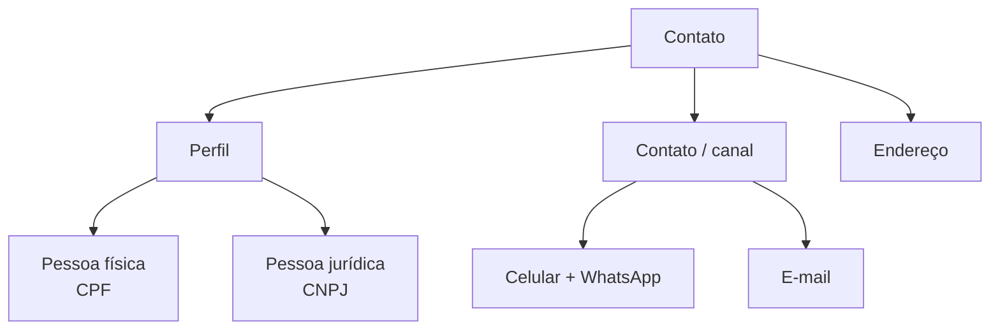
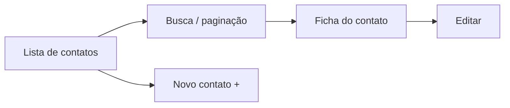

# Contatos

O módulo de **Contatos** é a sua agenda dentro do LocFlow: clientes e fornecedores, pessoas físicas ou jurídicas. Cada [contato](../primeiros-passos/glossario.md) que você cadastra fica disponível para ser **reaproveitado** em qualquer orçamento — você digita os dados uma vez e nunca mais precisa redigitar nome, celular ou endereço.


**Por que isso te faz faturar mais:** uma base de clientes organizada é uma base que **recompra**. Quando todo cliente já está cadastrado, com canal de contato e histórico, fazer follow-up vira questão de minutos — e cliente que você consegue chamar de volta é cliente que aluga de novo.


## O que é um contato

Um contato representa **uma pessoa ou empresa** com quem você se relaciona — quase sempre um cliente, mas também fornecedores. O cadastro é enxuto de propósito: para começar, basta o nome e **um canal de contato** (celular ou e-mail). O resto é opcional e você completa quando precisar.

### Perfil: pessoa física ou jurídica

| Tipo | Documento | Campos extras |
| --- | --- | --- |
| **Pessoa física** | CPF | Nome completo |
| **Pessoa jurídica** | CNPJ | Razão social, Nome fantasia, Inscrição estadual (IE), Contribuinte ICMS |

O **documento (CPF/CNPJ) é opcional** no cadastro — você pode salvar um contato só com o nome e o telefone. A obrigatoriedade do documento aparece mais adiante, quando a operação realmente exige (por exemplo, na emissão fiscal). Para uma empresa, ao informar a IE você ainda marca se ela é **Contribuinte ICMS**.

### Canal de contato: celular, WhatsApp e e-mail

- **Celular** — ao preencher, surge a pergunta **"Este número é WhatsApp?"**. Marque sim quando for o caso; isso ajuda a equipe a saber por onde falar com o cliente.
- **E-mail** — usado para envio de proposta e comunicação.
- Se o cliente realmente não tem um dos canais, há os atalhos **"Não possui celular"** e **"Não possui e-mail"**.


O cadastro pede **ao menos um canal**: celular **ou** e-mail. Sem um meio de contato, você não consegue dar follow-up — por isso o sistema garante esse mínimo.


### Endereço

O endereço fica em **"Editar mais informações"** (junto de CPF/CNPJ e demais dados opcionais). Você informa o **CEP** e o sistema **completa logradouro, bairro e cidade automaticamente** — depois é só ajustar número e complemento. Dá ainda para classificar o **tipo do local** (Residencial ou Condomínio); em condomínio, o complemento (bloco, torre ou apartamento) passa a ser pedido para que a entrega chegue certo.

Esse endereço não é decorativo: ele é reaproveitado no orçamento como **endereço de entrega** (veja [mais abaixo](#reaproveitar-no-orcamento)).

### O estágio de funil (categoria)

Todo contato tem um **estágio de funil**, que o LocFlow calcula sozinho a partir das reservas fechadas:

| Estágio | O que significa |
| --- | --- |
| **Contato qualificado (lead)** | Ainda não fechou nenhuma reserva. É o registro mínimo para acompanhar antes da primeira locação. |
| **Cliente ativo** | Já fechou ao menos uma reserva com você. |
| **Cliente fidelizado** | Tem duas ou mais reservas fechadas — recorrência e fidelidade. |

Você não precisa mexer nisso no cadastro: o estágio **evolui automaticamente** conforme o cliente fecha pedidos. Apenas na **edição** de um contato é possível fixar o estágio manualmente (opção **Automático** ou um estágio fixo), e isso deve ser exceção — por exemplo, marcar um cliente VIP.

## Criar, buscar e filtrar

### Criar um contato

Na lista de contatos, toque no botão **+** para abrir o cadastro. Preencha o **Nome** e um canal (celular ou e-mail) e salve — só isso já cria o contato. Precisa de mais dados (CPF/CNPJ, endereço)? Abra **"Editar mais informações"** e complete. Para uma empresa, troque o perfil para **Pessoa Jurídica** e o rótulo do nome muda para **Razão Social**.


Começou a digitar e precisou sair? O LocFlow guarda um **rascunho** do cadastro e pergunta se quer retomar depois — você não perde o que já tinha preenchido.


### Buscar e filtrar na lista

A lista tem uma **busca inteligente** no topo: digite nome, documento, parte do telefone ou e-mail e os resultados se ajustam. Quando a base cresce, a lista é **paginada** (você escolhe quantos por página e navega entre as páginas). Tocar em um contato abre a **ficha** com Perfil, Contato e Endereço; o lápis leva direto para a edição.

## Reaproveitar no orçamento

Aqui está o ganho real da base de contatos: ao [criar um orçamento](../conceitos/ciclo-de-um-pedido.md), você **seleciona um contato já cadastrado** em vez de redigitar tudo. Os dados do cliente entram no pedido na hora — e o **endereço do contato** vira opção de entrega.

No orçamento, o endereço de entrega pode ser:

| Opção | Quando usar |
| --- | --- |
| **Endereço do contato** | Entrega no endereço já cadastrado na ficha do cliente. |
| **Endereço salvo** | Um endereço recorrente que você guardou (ex.: um galpão de cliente). |
| **Endereço exclusivo** | Um endereço só daquele pedido (ex.: um evento pontual). |

Se o contato ainda **não tem endereço** quando você escolhe "Endereço do contato", o LocFlow te leva direto para completar o endereço dele e **volta para o orçamento** com o dado preenchido — sem você se perder no caminho. Da mesma forma, dá para **criar um contato novo** no meio do orçamento e retornar com ele já selecionado.

## Situações reais

- **Cliente recorrente:** o Buffet do Marcos alugou mesas com você há dois meses. Hoje ele liga pedindo de novo. Você busca "Marcos" na lista, o contato aparece com celular, WhatsApp e endereço — em segundos você abre um orçamento já com tudo preenchido. Como ele já tem reservas fechadas, aparece como **Cliente ativo** (ou **fidelizado**, se for a segunda vez).
- **Lead que ainda não fechou:** um possível cliente pediu cotação pelo WhatsApp. Você cadastra só **nome + celular (WhatsApp)** e manda a proposta. Ele entra como **Contato qualificado (lead)** — e fica na sua lista para o follow-up.
- **Empresa com nota fiscal:** uma construtora vai alugar andaimes e precisa de nota. Você cadastra como **Pessoa Jurídica**, com CNPJ, Razão Social, Nome fantasia e IE — pronto para a operação fiscal quando ela exigir.


**Filosofia por porte:** quem está começando cadastra só nome e telefone e segue em frente. Quem cresceu vai preenchendo documento, endereço e dados fiscais conforme precisa. O cadastro **abstrai para o pequeno e revela para o grande** — você nunca é obrigado a preencher o que não usa.


## Próximo passo

Veja como o contato entra no fluxo em [O ciclo de um pedido](../conceitos/ciclo-de-um-pedido.md), ou tire dúvidas em [Onde tirar dúvidas](../primeiros-passos/onde-tirar-duvidas.md).
