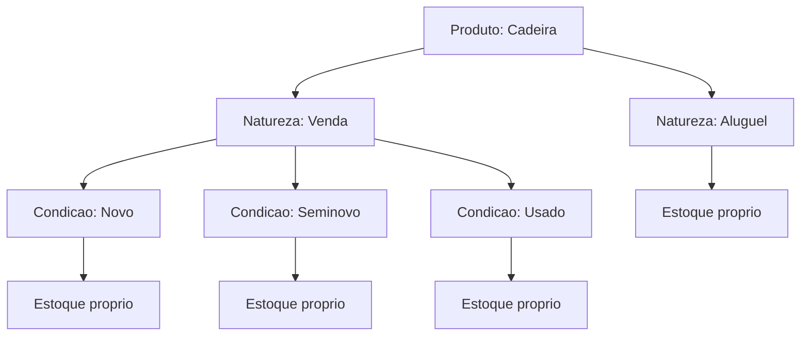

# Estoque por natureza e condição

Um mesmo produto no seu catálogo pode servir a propósitos diferentes: a furadeira que você **aluga** não é, para o sistema, o mesmo monte de peças que a furadeira que você **vende como usada**. Por isso o LocFlow trata o estoque de cada produto **separado por dois eixos**: a **natureza** (aluguel ou venda) e, dentro da venda, a **condição** (novo, seminovo ou usado).

Entender essa separação é o que faz a sua disponibilidade bater com a realidade: vender uma peça não tira uma do aluguel, e alugar não consome o que você reservou para vender.


Esta página é sobre **como o estoque é organizado** (os eixos). Onde você descreve o produto e define os preços é em [Catálogo: produtos](catalogo-produtos.md). A regra que impede alugar o mesmo item para dois clientes no mesmo período fica em [Galpões e disponibilidade](../estoque/galpoes-e-disponibilidade.md).


## Os dois eixos da separação {#os-dois-eixos}

No cadastro do produto, na seção **Preços e negócio**, o LocFlow mostra um aviso e um botão de ajuda dizendo, em poucas palavras, o princípio inteiro:

> **Estoques são separados por natureza e condição.**

Tocando na ajuda, o sistema explica o porquê — exatamente como aparece no app:

> Cada combinação de natureza + condição é um estoque independente, contado e movimentado separadamente.
>
> - Estoque de aluguel: peças que você empresta e devolvem.
> - Estoque de venda (Novo): peças zero km, prontas para venda.
> - Estoque de venda (Seminovo): peças com pouco uso, vendidas como seminovo.
> - Estoque de venda (Usado): peças com mais uso, vendidas como usado.

### Eixo 1 — Natureza: aluguel x venda {#eixo-natureza}

A **natureza** responde "o que acontece com a peça": ela **vai e volta** (aluguel) ou **sai em definitivo** (venda). No produto, isso são duas perguntas independentes que você liga ou desliga:

- **Você vai alugar este produto?** — habilita o **preço de aluguel**.
- **Você vai vender este produto?** — habilita as **condições de venda**.

Um produto pode estar disponível para **as duas coisas**, só uma, ou — temporariamente — nenhuma. Quem decide o que de fato acontece com a peça é a **natureza do orçamento**: cada orçamento é ou de locação, ou de venda (veja [Locação e venda](../conceitos/locacao-e-venda.md)).

### Eixo 2 — Condição: novo, seminovo, usado {#eixo-condicao}

A **condição** só existe **dentro da venda** e diz o **estado** da peça vendida. São três:

| Condição | Quando usar |
| --- | --- |
| **Novo** | Peça zero, pronta para venda |
| **Seminovo** | Peça com pouco uso |
| **Usado** | Peça com mais uso |

Você pode habilitar **mais de uma condição** no mesmo produto, e **cada uma tem o seu próprio preço**. O estoque de venda **Novo** é um pote; o de **Seminovo**, outro; o de **Usado**, um terceiro. Vender uma peça nova não mexe no que você tem de usadas.


**E os kits?** Um [kit](catalogo-kits.md) não responde "aluguel ou venda" nem "condição" — a natureza e a condição do kit **vêm dos itens** que ele contém. Por isso essa separação aparece só no cadastro de **produto**.


## Por que separar: o exemplo das 10 unidades {#exemplo-10-unidades}

A ajuda do app fecha com o exemplo que torna tudo concreto:

> Exemplo: 10 unidades para aluguel não diminuem o estoque de venda. Da mesma forma, vender 1 unidade nova não afeta o estoque de usados.

Imagine que você tem cadeiras divididas assim:

| Estoque | Eixo | Para que serve |
| --- | --- | --- |
| **Aluguel** | Natureza: aluguel | Vão à festa e voltam |
| **Venda — Novo** | Venda + Novo | Saem para venda em definitivo, zero uso |
| **Venda — Usado** | Venda + Usado | Saem para venda em definitivo, com uso |

Como são **estoques independentes**:

- Reservar cadeiras de **aluguel** para um evento **não** reduz o que você tem para **vender**.
- **Vender** uma cadeira **nova** **não** muda o seu estoque de **usadas**.
- Cada pote tem o seu próprio preço e a sua própria contagem.

É isso que evita o erro silencioso de "achei que tinha, mas era do outro estoque" — você nunca promete para venda o que estava destinado ao aluguel, nem o contrário.

## Como isso afeta a disponibilidade no orçamento {#disponibilidade-no-orcamento}

Quando você monta um orçamento, a **natureza do orçamento** decide de qual estoque o item sai:

- Orçamento de **locação** → consome do estoque de **aluguel** (e o item fica **reservado** pela janela do evento, voltando para o estoque na devolução).
- Orçamento de **venda** → consome do estoque de **venda** da **condição escolhida** (e a peça sai em **definitivo**, sem volta).

Por isso uma unidade comprometida para venda **não** entra na conta do aluguel, e vice-versa. A separação acontece **antes** da regra de tempo: primeiro o sistema sabe de qual pote o item sai, depois aplica o [bloqueio de estoque](../estoque/galpoes-e-disponibilidade.md) — a janela em que uma peça de **aluguel** fica indisponível para outro cliente.


**Trocar a natureza do orçamento recomeça os itens.** Se você muda um orçamento de Locação para Venda (ou o contrário) depois de já ter adicionado itens, o LocFlow limpa a lista — porque o significado de cada item muda e o estoque de origem também. O sistema avisa antes.


## Pequeno, médio ou grande: a separação cresce com você {#por-porte}

| Porte | Como costuma usar |
| --- | --- |
| **Pequeno** | Só aluguel, na maioria. A natureza fica em "aluga" e pronto — a separação trabalha por baixo sem você pensar nela. |
| **Médio** | Começa a vender o que sai de linha: liga a venda, marca **Usado** e ganha um estoque de venda sem misturar com o de aluguel. |
| **Grande** | Usa as três condições de venda com preços distintos e trata cada estoque (aluguel, novo, seminovo, usado) como uma linha de receita própria. |

## Situações reais {#situacoes-reais}

- **A locadora que também vende o usado.** A furadeira sai por R$ 40/dia no aluguel. Quando uma envelhece, você a tira do giro e vende: liga "vai vender?", marca **Usado** e põe R$ 90. A peça que você vendeu **não** sai do estoque de aluguel — são potes diferentes. Você continua alugando as outras normalmente.
- **Mostruário novo e seminovo lado a lado.** Você vende a mesma luminária **Nova** por R$ 300 e, as de mostruário, como **Seminovo** por R$ 180. São dois preços e dois estoques: esgotar as novas não deixa as seminovas indisponíveis.
- **Alugar e vender para o mesmo cliente.** O cliente quer alugar a estrutura e comprar os consumíveis. Como cada orçamento tem **uma** natureza, você faz **dois orçamentos** — um de locação, um de venda. Cada um puxa do seu estoque e gera a sua própria cobrança.

## Para quem quer os detalhes {#avancado}


**Histórico de preço por estoque.** Cada estoque guarda o **seu** preço com histórico (a "máquina do tempo" de preços). Mudar o preço de venda do **Usado** cria um novo registro e **não** mexe no preço do **Novo** nem no de aluguel — e orçamentos antigos continuam com o preço que tinham quando foram feitos. Veja como o preço entra na conta em [Valores: mão de obra, frete e descontos](../orcamentos/valores.md).



**Valor de reposição é único do produto.** Diferente do preço (um por estoque), o **valor de reposição** é um só, do produto inteiro — é o custo de repor uma unidade, usado para calcular margem na venda, balizar avarias e o aluguel. Ele não se divide por natureza nem condição.



**Contagem numérica por estoque está chegando.** Hoje o LocFlow já **organiza** o estoque pelos dois eixos e protege a disponibilidade de **aluguel** pelo [bloqueio de estoque](../estoque/galpoes-e-disponibilidade.md) (a janela de reserva). A visão de **quantas peças** você tem em cada estoque — com movimentações, baixas e giro por produto — é parte do módulo de estoque que está em evolução. Acompanhe em [Galpões e disponibilidade](../estoque/galpoes-e-disponibilidade.md).


## Próximo passo

Cadastre os preços de cada estoque em [Catálogo: produtos](catalogo-produtos.md), entenda as duas modalidades em [Locação e venda](../conceitos/locacao-e-venda.md) e veja como a reserva protege o aluguel em [Galpões e disponibilidade](../estoque/galpoes-e-disponibilidade.md). Em dúvida sobre um termo? Consulte o [Glossário](../primeiros-passos/glossario.md) ou veja [Onde tirar dúvidas](../primeiros-passos/onde-tirar-duvidas.md).
