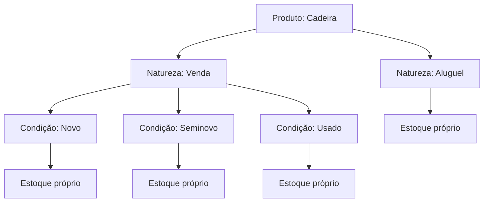

# Estoque por natureza e condição

Um mesmo produto no seu catálogo pode servir a propósitos diferentes: a furadeira que você **aluga** não é, para o sistema, o mesmo monte de peças que a furadeira que você **vende como usada**. Por isso o LocFlow trata o estoque de cada produto **separado por dois eixos**: a **natureza** (aluguel ou venda) e, dentro da venda, a **condição** (novo, seminovo ou usado).

Entender essa separação é o que faz a sua disponibilidade bater com a realidade: vender uma peça não tira uma do aluguel, e alugar não consome o que você reservou para vender.


Esta página é sobre **como o estoque é organizado** (os eixos). Onde você descreve o produto e define os preços é em [Catálogo: produtos](catalogo-produtos.md). A regra que impede alugar o mesmo item para dois clientes no mesmo período fica em [Galpões e disponibilidade](../estoque/galpoes-e-disponibilidade.md).


## Os dois eixos da separação {#os-dois-eixos}

No cadastro do produto, na seção **Preços e negócio**, o LocFlow mostra um aviso e um botão de ajuda dizendo, em poucas palavras, o princípio inteiro:

> **Estoques são separados por natureza e condição.**

Tocando na ajuda, o sistema explica o porquê — exatamente como aparece no app:

> Cada combinação de natureza + condição é um estoque independente, contado e movimentado separadamente.
>
> - Estoque de aluguel: peças que você empresta e devolvem.
> - Estoque de venda (Novo): peças zero km, prontas para venda.
> - Estoque de venda (Seminovo): peças com pouco uso, vendidas como seminovo.
> - Estoque de venda (Usado): peças com mais uso, vendidas como usado.

### Eixo 1 — Natureza: aluguel x venda {#eixo-natureza}


Nas telas este eixo aparece como **"Tipo de negócio"** — é a mesma coisa. "Natureza" é como o
LocFlow o chama por dentro, e continua no cabeçalho do relatório contábil em CSV, que a
contabilidade já importa.


A **natureza** responde "o que acontece com a peça": ela **vai e volta** (aluguel) ou **sai em definitivo** (venda). No cadastro do produto, isso são duas perguntas independentes que você liga ou desliga (no fluxo guiado do catálogo oficial elas aparecem como *"Você vai alugar este produto?"* e *"Você vai vender este produto?"*):

- **Permite aluguel?** — habilita o **preço de aluguel**.
- **Permite venda?** — habilita as **condições de venda**.

Um produto pode estar disponível para **as duas coisas**, só uma, ou nenhuma (o **item de composição**, que só acompanha kits). Quem decide o que de fato acontece com a peça em cada pedido é o **tipo de negócio do orçamento**: cada orçamento é ou de aluguel, ou de venda (veja [Locação e venda](../conceitos/locacao-e-venda.md)).


O estoque de **venda** — e a própria venda — faz parte do plano **Pro**. O estoque de aluguel está em todos os planos.


### O estoque não depende do preço {#estoque-sem-preco-avulso}

O preço é o que o cliente vê no catálogo; o estoque é **onde o material está separado** no galpão. Por isso um produto pode ter estoque de aluguel **sem ter preço de aluguel** no cadastro.

É o caso do **item de composição**: a peça que só acompanha kits — o parafuso que prende a mesa, a cadeira que só sai no conjunto. Ela tem estoque de aluguel de verdade, porque os kits que a usam são alugados. Na ficha do item, no [Painel de Estoque](../estoque/painel.md), esse estoque aparece com o selo **sem preço avulso** e uma frase que explica o porquê — por exemplo, *"Sem preço de aluguel avulso — usado no kit Mesa redonda 1.60D, que é alugado."* É um aviso, não um erro.

Pelo mesmo motivo, a **entrada de estoque** pergunta **"É de aluguel ou venda?"** sempre:

- o cadastro **sugere** — a opção que combina com o produto já vem marcada (*"Sugerido pelo cadastro deste produto — troque se o material for para o outro lado."*);
- a outra fica **a um toque**. Se você escolher um lado sem preço no catálogo, a tela explica que tudo bem: *"Este produto não tem preço de aluguel avulso no cadastro. Tudo bem: o estoque de aluguel pode existir para os kits que usam esta peça."*

E **reclassificar** material para um estoque sem preço no catálogo também é permitido. Se uma reclassificação for recusada, a tela mostra o motivo real.

### Eixo 2 — Condição: novo, seminovo, usado {#eixo-condicao}

A **condição** só existe **dentro da venda** e diz o **estado** da peça vendida. São três:

| Condição | Quando usar |
| --- | --- |
| **Novo** | Peça zero, pronta para venda |
| **Seminovo** | Peça com pouco uso |
| **Usado** | Peça com mais uso |

Você pode habilitar **mais de uma condição** no mesmo produto, e **cada uma tem o seu próprio preço**. O estoque de venda **Novo** é um pote; o de **Seminovo**, outro; o de **Usado**, um terceiro. Vender uma peça nova não mexe no que você tem de usadas.

```mermaid
flowchart TD
    P[Produto: Cadeira] --> AL[Natureza: Aluguel]
    P --> VE[Natureza: Venda]
    VE --> N[Condição: Novo]
    VE --> S[Condição: Seminovo]
    VE --> U[Condição: Usado]
    AL --> E1[Estoque próprio]
    N --> E2[Estoque próprio]
    S --> E3[Estoque próprio]
    U --> E4[Estoque próprio]
```


**E os kits?** Um [kit](catalogo-kits.md) tem a **própria natureza**: ele pode ser alugado ou vendido independentemente do que cada peça faz sozinha — cadeiras e mesa cadastradas só para venda podem ser alugadas como conjunto, e o parafuso que prende a mesa não precisa alugar nem vender para o kit alugar. As **condições de venda** (Novo, Seminovo, Usado) também são escolhidas no próprio kit, e o preço do kit é o que você definir nele — a soma dos itens é só sugestão.

O que o kit **não** tem é estoque próprio: quando ele sai num pedido, o LocFlow conta as **peças** que o compõem — do estoque de aluguel delas, num aluguel; do estoque de venda delas, na condição escolhida, numa venda.


## Por que separar: o exemplo das 10 unidades {#exemplo-10-unidades}

A ajuda do app fecha com o exemplo que torna tudo concreto:

> Exemplo: 10 unidades para aluguel não diminuem o estoque de venda. Da mesma forma, vender 1 unidade nova não afeta o estoque de usados.

Imagine que você tem cadeiras divididas assim:

| Estoque | Eixo | Para que serve |
| --- | --- | --- |
| **Aluguel** | Natureza: aluguel | Vão à festa e voltam |
| **Venda — Novo** | Venda + Novo | Saem para venda em definitivo, zero uso |
| **Venda — Usado** | Venda + Usado | Saem para venda em definitivo, com uso |

Como são **estoques independentes**:

- Reservar cadeiras de **aluguel** para um evento **não** reduz o que você tem para **vender**.
- **Vender** uma cadeira **nova** **não** muda o seu estoque de **usadas**.
- Cada pote tem o seu próprio preço e a sua própria contagem.

É isso que evita o erro silencioso de "achei que tinha, mas era do outro estoque" — você nunca promete para venda o que estava destinado ao aluguel, nem o contrário.

## Como isso afeta a disponibilidade no orçamento {#disponibilidade-no-orcamento}

Quando você monta um orçamento, o **tipo de negócio** do orçamento (Aluguel ou Venda) decide de qual estoque o item sai:

- Orçamento de **aluguel** → consome do estoque de **aluguel** (e o item fica **reservado** pela janela do evento, voltando para o estoque na devolução).
- Orçamento de **venda** → consome do estoque de **venda** da **condição escolhida** (e a peça sai em **definitivo**, sem volta).

Por isso uma unidade comprometida para venda **não** entra na conta do aluguel, e vice-versa. A separação acontece **antes** da regra de tempo: primeiro o sistema sabe de qual pote o item sai, depois aplica o [bloqueio de estoque](../estoque/galpoes-e-disponibilidade.md) — a janela em que uma peça de **aluguel** fica indisponível para outro cliente.


**Trocar o tipo de negócio recomeça os itens.** Se você muda um orçamento de Aluguel para Venda (ou o contrário) depois de já ter adicionado itens, o LocFlow pergunta antes — *"Trocar para venda?"* (ou *"Trocar para aluguel?"*) — e explica, por exemplo: *"Os 3 itens já adicionados serão removidos: os preços de aluguel e de venda são diferentes, e um orçamento usa uma tabela só."* Só ao tocar em **Trocar e limpar itens** a lista é esvaziada. Com o carrinho vazio, a troca é imediata.


## Pequeno, médio ou grande: a separação cresce com você {#por-porte}

| Porte | Como costuma usar |
| --- | --- |
| **Pequeno** | Só aluguel, na maioria. A natureza fica em "aluga" e pronto — a separação trabalha por baixo sem você pensar nela. |
| **Médio** | Começa a vender o que sai de linha: liga a venda, marca **Usado** e ganha um estoque de venda sem misturar com o de aluguel. |
| **Grande** | Usa as três condições de venda com preços distintos e trata cada estoque (aluguel, novo, seminovo, usado) como uma linha de receita própria. |

## Situações reais {#situacoes-reais}

- **A locadora que também vende o usado.** A furadeira sai por R$ 40/dia no aluguel. Quando uma envelhece, você a tira do giro e vende: liga **Permite venda?**, marca **Usado** e põe R$ 90. A peça que você vendeu **não** sai do estoque de aluguel — são potes diferentes. Você continua alugando as outras normalmente. (Para a peça que já estava no aluguel passar a contar no estoque de venda usada, ela é **reclassificada** no estoque.)
- **Mostruário novo e seminovo lado a lado.** Você vende a mesma luminária **Nova** por R$ 300 e, as de mostruário, como **Seminovo** por R$ 180. São dois preços e dois estoques: esgotar as novas não deixa as seminovas indisponíveis.
- **Alugar e vender para o mesmo cliente.** O cliente quer alugar a estrutura e comprar os consumíveis. Como cada orçamento tem **um** tipo de negócio, você faz **dois orçamentos** — um de aluguel, um de venda. Cada um puxa do seu estoque e gera a sua própria cobrança.
- **O parafuso que só existe no kit.** O kit da mesa redonda leva um parafuso que ninguém aluga sozinho. O parafuso é um item de composição, sem preço de aluguel — e mesmo assim você registra a entrada dele como **aluguel**, porque o kit é alugado. Na ficha dele no Painel de Estoque, esse estoque aparece com o selo **sem preço avulso**.

## Para quem quer os detalhes {#avancado}


**Histórico de preço por estoque.** Cada estoque guarda o **seu** preço com histórico (a "máquina do tempo" de preços). Mudar o preço de venda do **Usado** cria um novo registro e **não** mexe no preço do **Novo** nem no de aluguel — e orçamentos antigos continuam com o preço que tinham quando foram feitos. Veja como o preço entra na conta em [Valores: acréscimos, frete e descontos](../orcamentos/valores.md).



**Valor de reposição é único do produto.** Diferente do preço (um por estoque), o **valor de reposição** é um só, do produto inteiro — é o custo de repor uma unidade, usado para calcular margem na venda, balizar avarias e o aluguel. Ele não se divide por natureza nem condição.



**Onde ver quantas peças há em cada estoque.** No **Painel de Estoque** (menu **Estoque**), a lista de **Itens** mostra o saldo de cada produto separado por tipo de negócio e condição, com filtros para aluguel ou venda e para Novo, Seminovo ou Usado. As **Movimentações** têm o filtro **Vendas** (o que já saiu em definitivo), e a ação **Reclassificar** move material de um estoque para outro — por exemplo, do aluguel para a venda como usado. Veja [Painel de Estoque](../estoque/painel.md) e [Posição e previsão de estoque](../estoque/posicao-e-previsao.md).


## Próximo passo

Cadastre os preços de cada estoque em [Catálogo: produtos](catalogo-produtos.md), entenda as duas modalidades em [Locação e venda](../conceitos/locacao-e-venda.md) e veja como a reserva protege o aluguel em [Galpões e disponibilidade](../estoque/galpoes-e-disponibilidade.md). Em dúvida sobre um termo? Consulte o [Glossário](../primeiros-passos/glossario.md) ou veja [Onde tirar dúvidas](../primeiros-passos/onde-tirar-duvidas.md).
