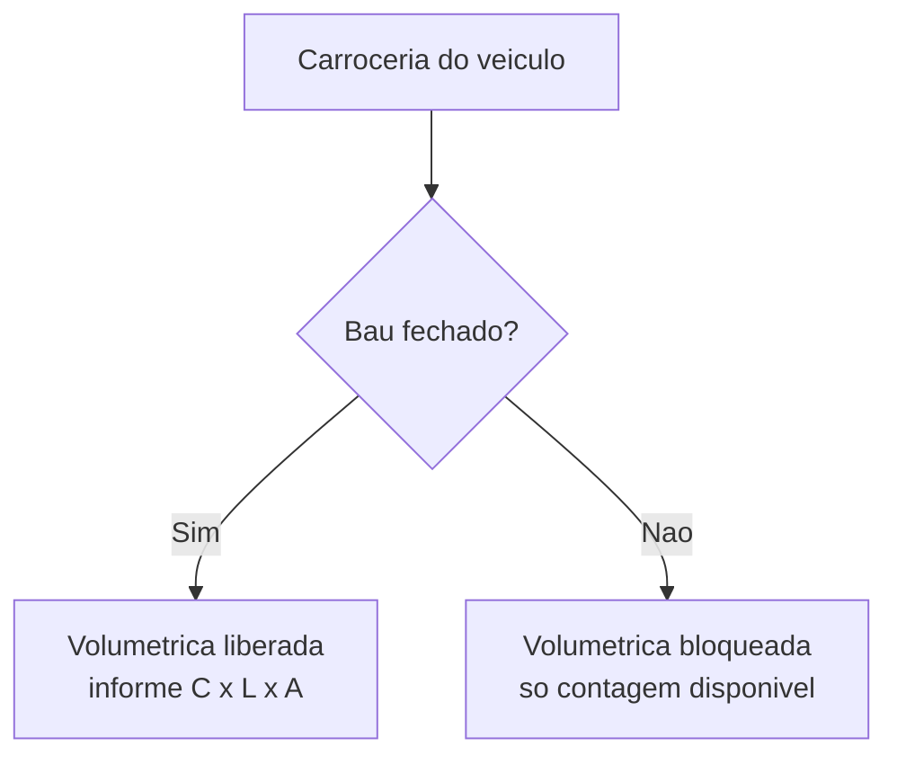

# Especificações: capacidade

A **capacidade** é o que diz ao LocFlow se a carga de uma viagem **cabe** no veículo. Você configura a capacidade dentro de cada [especificação](frota.md) (a ficha técnica de um modelo), e o app usa essa configuração na hora de [planejar o roteiro](../logistica/planejando-o-roteiro.md): conforme você monta a rota, ele soma o que vai ser transportado e compara com o que o veículo comporta.

É sempre um **aviso, nunca um bloqueio**. Quando a carga não cabe, o app destaca o problema para você decidir — tirar uma parada, dividir em duas viagens ou trocar o veículo. Você nunca fica travado.


A capacidade é **opcional**. Uma especificação sem capacidade configurada funciona normalmente — o app só não consegue avaliar se a carga cabe (mostra um aviso de "não verificado", e segue). Veja a [escada da frota](frota.md#a-escada-da-frota): você sobe esse degrau quando faz sentido.


## As estratégias de capacidade {#estrategias}

No LocFlow, "capacidade" não é um número único. São **estratégias** diferentes de medir o que cabe, cada uma boa para um tipo de carga. Na tela de capacidade da especificação, você ativa uma ou mais — cada uma com seu próprio cartão numerado.

| # | Estratégia | O que mede | Selo |
| --- | --- | --- | --- |
| 1 | **Contagem de itens** | Quantos de cada produto ou kit cabem fisicamente | `EMPÍRICA` |
| 2 | **Volumétrica (m³)** | O volume do baú (C × L × A) contra a cubagem da carga | `CUBAGEM` |
| 3 | **Empacotamento inteligente (3D)** | Simulação do arranjo da carga | `EM BREVE` |


A tela traz um quadro lateral **"Como a capacidade é calculada"** que resume tudo isto numa linha do tempo. O texto de abertura: *"Na operação, as estratégias ativas rodam em ordem. A primeira que reprovar limita a carga."*


### 1 · Contagem de itens {#contagem}

A contagem é a forma mais direta — e a mais fácil de configurar. Você responde, na prática: **"quantas unidades de cada item cabem nessa viagem?"**

O cartão a descreve como *"Quantos produtos/kits cabem fisicamente. Avaliada primeiro."* — por isso o selo **EMPÍRICA**: é o número que você sabe de cabeça, da experiência ("no Toco cabem 10 tendas").

Para configurar, você adiciona **linhas de limite**:

- **Item** — escolhido do seu [catálogo](catalogo-produtos.md): um **produto** avulso ou um **kit**.
- **Quantidade** — quantas unidades daquele item cabem (um número inteiro, maior que zero).

Você adiciona quantas linhas quiser, uma por item. Não dá para repetir o mesmo item duas vezes — o app avisa *"Este item já foi adicionado."*


**Por que isso te ajuda:** a contagem é a régua que você já tem na cabeça, agora dentro do sistema. Se "cabem 10 tendas no Toco", o app passa a alertar quando a viagem do dia tenta levar a décima primeira — antes de o motorista descobrir na rampa de carga.


Você pode deixar a contagem **ativa sem nenhuma linha**. Nesse caso o app mostra *"Nenhum limite adicionado. A capacidade pode ficar sem limites por item."* — ou seja, ela existe mas não restringe nada ainda.

### 2 · Volumétrica (m³) {#volumetrica}

A volumétrica raciocina por **espaço**, não por contagem: ela calcula o **volume útil do baú** e compara com o volume que a carga ocupa.

Você informa as **três medidas do baú em metros** — **comprimento**, **largura** e **altura** — e o LocFlow calcula o **volume (m³)** sozinho (largura × comprimento × altura), mostrando o resultado na hora em "Volume calculado". É **tudo-ou-nada**: ou você preenche as três medidas (todas maiores que zero), ou nenhuma.

O cartão resume: *"Volume do baú (C×L×A) vs. cubagem da carga."* O selo é **CUBAGEM**.


**Por que a volumétrica importa para carga mista:** quando a viagem leva itens variados (mesa, tenda, gerador), contar "quantos de cada" não responde se tudo cabe junto. O volume responde: a soma do que vai ocupando precisa caber no espaço do baú.


## O baú fechado libera a volumétrica {#bau-fechado}

Aqui está a regra que confunde quem chega na tela: **a estratégia volumétrica só fica disponível se o baú do veículo for fechado.**

Logo acima das estratégias, na seção **Carroceria**, há uma chave **"Baú fechado"** — *"Carroceria fechada e cubável. Habilita a estratégia volumétrica abaixo."* Enquanto ela estiver desligada, o cartão da volumétrica fica **bloqueado**, com o aviso:

> **Disponível apenas para baú fechado.** Esta carroceria não é cubável — ative "Baú fechado" acima para liberar.

O quadro lateral reforça: *"A volumétrica exige **baú fechado** — só carrocerias cubáveis têm volume confiável."*

**Por quê?** Um caminhão de carroceria aberta (uma prancha, um carro-de-boi) não tem um "espaço fechado" com volume confiável: a carga pode passar das laterais, empilhar para cima. Medir C × L × A só faz sentido quando existe uma caixa de verdade — o baú. Por isso o LocFlow só libera o cálculo por volume quando você confirma que o veículo é cubável.


A **contagem** não depende do baú fechado — você pode usá-la em qualquer veículo. Só a **volumétrica** é que fica gateada pela chave "Baú fechado". E se você desligar a chave depois, a volumétrica é desativada junto.


## Como o app decide se a carga cabe {#avaliacao}

Quando você [planeja um roteiro](../logistica/planejando-o-roteiro.md) com um veículo (ou só a especificação) escolhido, o LocFlow avalia a capacidade automaticamente. Vale entender o que ele faz por baixo:

1. **Carga vazia ou sem alvo concreto** → não há o que avaliar: o app aprova com um aviso (por exemplo, quando você escolheu uma *classe* de veículo em vez de um veículo específico, ou nenhum).
2. **Carga de um único item** (só tendas, por exemplo) → entra a **contagem**: ele soma a quantidade total e compara com o limite que você cadastrou para aquele item.
3. **Carga com itens diferentes** (mistura de produtos/kits) → entra a **volumétrica**: ele soma a cubagem de tudo e compara com o volume do baú.

Em qualquer caso, se a estratégia escolhida **não tem configuração** (item sem limite cadastrado, ou baú sem dimensões), o app **não bloqueia** — só avisa que aquela capacidade "não foi verificada".


A avaliação olha o **pico** da viagem, não só o fim. Numa rota com várias entregas e retiradas, o ponto mais cheio pode estar no meio do caminho — é esse momento que o app verifica, porque é onde a carga corre risco de não caber.


A mensagem que aparece quando estoura é direta. Pela contagem: *"A carga (12) excede o limite de 10 unidade(s) deste item."* Pela volumétrica: *"O volume da carga excede o volume do baú."*


**É sempre um aviso, não um bloqueio.** Mesmo quando a carga não cabe, você consegue criar o roteiro — o LocFlow destaca a parada crítica e deixa a decisão com você. A filosofia é a mesma da [frota como um todo](frota.md): nunca travar o caminho da operação.


## Bloco avançado {#avancado}

Combinando estratégias e o empacotamento 3D

**Posso ativar contagem e volumétrica ao mesmo tempo?** Sim — a seção de capacidade diz *"Ative uma ou mais estratégias... pode combinar contagem e volumétrica."* Na configuração, as duas convivem: você define limites por item **e** as dimensões do baú na mesma especificação.

**Empacotamento inteligente (3D).** O terceiro cartão — *"Simulação 3D do arranjo da carga para máximo aproveitamento."* — está marcado **EM BREVE** e ainda não pode ser ativado. A ideia futura é simular como as peças se encaixam de fato no baú (não só o volume bruto), para apertar ao máximo cada viagem.


**Em breve:** o empacotamento 3D vai além de somar volumes — ele considera o formato e o encaixe das peças. Por enquanto, contagem e volumétrica já cobrem a grande maioria das operações.


## Situações reais {#situacoes}

- **Locadora de tendas, um produto só:** a viagem leva só tendas. Você cadastra na contagem "10 tendas" no caminhão Toco. Quando o roteiro do dia tenta levar 12, o app avisa que a carga excede o limite — você divide em duas viagens antes de sair.
- **Festa completa, carga mista:** mesas, cadeiras, tendas e som na mesma rota. Aqui a contagem não basta. Você marca o baú como fechado, informa as medidas (4,20 × 2,10 × 2,10 m → o app calcula ~18,5 m³) e o LocFlow passa a somar o volume de tudo e avisar quando não cabe junto.
- **Caminhão de carroceria aberta:** uma prancha que leva andaimes. Você tenta ligar a volumétrica e ela aparece bloqueada — "Disponível apenas para baú fechado". Faz sentido: sem caixa fechada, não há volume confiável. Você usa a contagem ("cabem 30 quadros de andaime") e segue.

## Próximo passo {#proximo-passo}

A capacidade é só um dos blocos da especificação. Veja a página principal de [Frota](frota.md) para entender classes, veículos e a vistoria. Para ver a capacidade em ação, vá a [Planejando o roteiro](../logistica/planejando-o-roteiro.md) — é lá que o aviso "a carga cabe?" aparece. Em dúvida sobre um termo? Consulte o [Glossário](../primeiros-passos/glossario.md).
