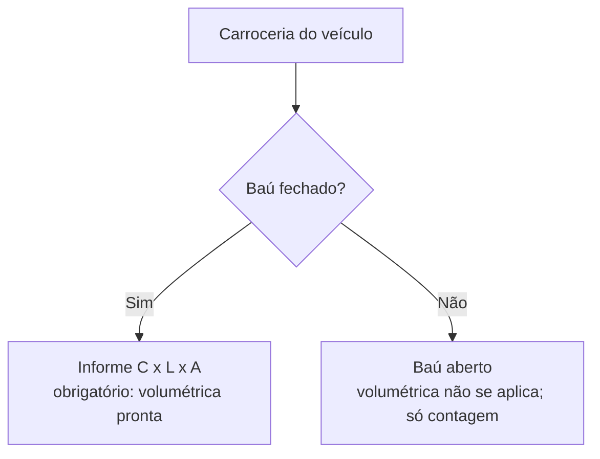

# Tipos de veículo: capacidade

A **capacidade** é o que diz ao LocFlow se a carga de uma viagem **cabe** no veículo. Você configura a capacidade dentro de cada [tipo de veículo](frota-ficha-tecnica.md) — no bloco **Capacidade · estratégias** —, e ela vale para todos os veículos daquele tipo. As [extensões](frota-extensoes.md) têm capacidade própria, configurada do mesmo jeito. O app usa essa configuração na hora de [planejar o roteiro](../logistica/planejando-o-roteiro.md): conforme você monta a rota, ele soma o que vai ser transportado e compara com o que o veículo comporta.

É sempre um **aviso, nunca um bloqueio**. Quando a carga não cabe, o app destaca o problema para você decidir — tirar uma parada, dividir em duas viagens ou trocar o veículo. Você nunca fica travado.


A capacidade é **opcional**. Um tipo sem capacidade configurada funciona normalmente — mas a tela avisa: *"Tipo sem contagem, volume ou peso cadastrados: o sistema não confere carga nem sugere agrupamento para ela."* Vale preencher pelo menos uma medida. **A exceção:** se você marcar o veículo como **baú fechado**, aí as dimensões do baú passam a ser **obrigatórias** (veja abaixo).


## As estratégias de capacidade {#estrategias}

No LocFlow, "capacidade" não é um número único. São **estratégias** diferentes de medir o que cabe, cada uma boa para um tipo de carga. No bloco **Capacidade · estratégias** do tipo de veículo, cada uma tem o seu cartão numerado:

| # | Estratégia | O que mede | Selo |
| --- | --- | --- | --- |
| 1 | **Contagem de itens** | Quantos de cada **produto** cabem — os kits entram **diluídos** nos seus produtos | `EMPÍRICA` |
| 2 | **Volumétrica (m³)** | O volume do baú (C × L × A) contra a **cubagem** da carga (o fator de cubagem de cada item) | `CUBAGEM` |
| 3 | **Peso máximo de carga** | Quanto a carga pode pesar, no total | `PESO` |
| 4 | **Empacotamento inteligente (3D)** | Simulação do arranjo da carga | `EM BREVE` |


O botão **?** do bloco (*"Quanto cabe no veículo"*) resume a regra: *"Você ativa uma ou mais formas de medir; na operação elas são avaliadas em ordem e a primeira que reprovar limita a carga. É sempre um aviso, nunca um bloqueio."* No topo do bloco, um selo lembra se o tipo tem **Baú fechado** ou **Sem baú fechado**.


### 1 · Contagem de itens {#contagem}

A contagem é a forma mais direta — e a mais fácil de configurar. Você responde, na prática: **"quantas unidades cabem nessa viagem?"**

O cartão a descreve como *"Quantos produtos/kits cabem fisicamente."* — e leva o selo **EMPÍRICA** porque é o número que você sabe de cabeça, da experiência ("no Toco cabem 30 jogos de mesa"). Na operação, é a primeira a ser avaliada.

Para configurar, você liga a contagem e adiciona **linhas de limite** — e pode cadastrar o limite **por produto OU por kit**:

- **Item (produto ou kit)** — escolhido do seu [catálogo](catalogo-produtos.md) numa **busca única**: produtos **e** kits aparecem juntos (como no orçamento), cada um com a **miniatura**, o **nome** e a etiqueta **Produto** ou **Kit**. Você não escolhe a "natureza" antes — busca direto pelo nome e toca no item. Itens inativos aparecem esmaecidos, com o selo **Inativo**, e não podem ser escolhidos.
- **Quantidade** — quantas unidades daquele item cabem (um número inteiro, maior que zero); depois toque em **Adicionar item**.

Você adiciona quantas linhas quiser, uma por item. Cada uma entra na lista com a miniatura e o **nome** do item (não o código). Não dá para repetir o mesmo item duas vezes — o app avisa *"Este item já foi adicionado."*


**O kit é diluído nos seus produtos.** Quando você cadastra um limite por **kit**, o LocFlow o entende como o limite dos **produtos que compõem o kit**. Exemplo: se *1 jogo = 1 mesa + 4 cadeiras* e você diz que **cabem 30 jogos** no caminhão, isso vira **30 mesas e 120 cadeiras**. A régua passa a ser o produto, não o pacote — e é isso que faz a contagem funcionar com qualquer combinação de carga.


**Por que isso resolve a carga misturada.** Como o limite é por produto, a contagem soma **o que vem do kit com o que vem avulso**, do mesmo produto. Uma viagem com **25 jogos + 10 cadeiras avulsas** é avaliada assim: 25 jogos = 25 mesas e 100 cadeiras; somando as 10 cadeiras avulsas dá **110 cadeiras** (contra o limite de 120) e **25 mesas** (contra 30) → **cabe**. Você não precisa que a viagem seja de um item só.


**Limite por kit OU por produto — não os dois para o mesmo produto.** Se você já tem um limite de um kit que contém "cadeira", o app **não deixa** cadastrar também um limite avulso de "cadeira" (e vice-versa): seria ambíguo qual régua vale para a cadeira. Escolha um caminho — pelo kit (mais prático quando você pensa em "jogos") ou por produto (quando quer controlar cada item).


Você pode deixar a contagem **ativa sem nenhuma linha**. Nesse caso o app mostra *"Nenhum item adicionado. A capacidade pode ficar sem limites por item."* — ou seja, ela existe mas não restringe nada ainda.

### 2 · Volumétrica (m³) {#volumetrica}

A volumétrica raciocina por **espaço**, não por contagem: ela compara o **volume útil do baú** com o **espaço que a carga realmente ocupa lá dentro**.

Esse "espaço que a carga ocupa" vem do **fator de cubagem** de cada item — um valor em m³ que você cadastra no [produto](catalogo-produtos.md#fator-de-cubagem) e no [kit](catalogo-kits.md#fator-de-cubagem). Para a carga da viagem, a volumétrica soma **quantidade × fator de cubagem** de cada item e confere se cabe no baú.


**Por que não é "altura × largura × profundidade" da peça.** O fator de cubagem é **empírico**: é o espaço que o item ocupa **na prática**, já contando o **empilhamento**. Dez cadeiras empilhadas ocupam bem menos que dez vezes a caixa de uma cadeira — e quem sabe disso é você, que carrega o caminhão. Por isso o fator é um número que você **afere na operação**, não uma conta automática das medidas. (Regra de segurança: o app não deixa o fator passar do volume da própria caixa do item — empilhar nunca faz ocupar *mais* espaço do que sem empilhar.)


As **medidas do baú** ficam no bloco **2 · Carroceria** (não dentro do cartão da estratégia): ao ligar **"Baú fechado"**, aparecem ali as **Dimensões internas do baú** — **comprimento**, **largura** e **altura**, em metros — e o LocFlow calcula o **Volume do baú** (m³) sozinho, mostrando o resultado na hora.

Por isso, no tipo de veículo, o cartão da volumétrica é **só informativo** (não tem campos): ele mostra o **status** — *"Pronta — volume do baú X m³"* quando as medidas estão cadastradas, *"Informe as dimensões do baú (passo 2 · Carroceria)."* quando faltam, ou *"Requer baú fechado (passo 2 · Carroceria)."* quando o baú não é fechado. O selo é **CUBAGEM**, e ela entra **automaticamente como alternativa** quando **não há limite de contagem** cadastrado para os produtos daquela carga (não é uma chave que você liga/desliga). Na [extensão](frota-extensoes.md), que não tem carroceria com medidas, o volume entra direto no campo **Volume útil (m³)**.


**O kit usa o fator dele, inteiro — não a soma das peças.** Diferente da contagem (que dilui o kit nos produtos), a volumétrica usa o **fator de cubagem do próprio kit**. Faz sentido: um "jogo de mesa" montado/empilhado ocupa um espaço próprio, que nem sempre é a soma do espaço de cada peça solta. Cadastre o fator no kit para a volumétrica saber medi-lo.



**Quando a volumétrica entra:** ela é a **rede de segurança** para quando você ainda não cadastrou limites de contagem. Tendo os limites, a contagem por produto já resolve — inclusive carga misturada. Sem eles, o volume garante que a operação não fique **sem nenhuma verificação**: a soma da cubagem da carga precisa caber no espaço do baú.



**Item sem fator de cubagem.** Se um produto ou kit da carga **não tem** fator cadastrado, a volumétrica não consegue medir aquele item — o app avisa para **cadastrar o fator de cubagem** daquele item, em vez de chutar um valor. É uma lacuna a corrigir no catálogo, não um bloqueio.


### 3 · Peso máximo de carga {#peso}

O cartão **Peso máximo de carga** (*"Quanto a carga pode pesar, no total."*) tem um campo só: **Peso máximo (kg)**. Preenchido, ele vira mais uma régua de capacidade — pela **balança**.

É o caso clássico de carga **pesada e pequena** (sacos de cimento, peças de ferro): cabe no baú de sobra, mas estoura o eixo. A **otimização inteligente** da rota respeita o peso: ela deixa de fora uma parada cuja carga faria o veículo passar do limite, com o motivo *"acima do peso máximo do veículo"*. E o aviso de capacidade do roteiro também olha o **pico de peso** ao longo da rota: se em algum momento a carga a bordo passa do limite, ele avisa — mesmo que caiba em volume.

### 4 · Empacotamento inteligente (3D) {#empacotamento-3d}

O quarto cartão — *"Simulação 3D do arranjo da carga para máximo aproveitamento."* — está marcado **EM BREVE** e ainda não pode ser ativado (veja o [bloco avançado](#avancado)).

## O baú fechado e suas dimensões {#bau-fechado}

A chave que liga tudo isso é **"Baú fechado"**, no bloco **2 · Carroceria** — *"Carroceria fechada e cubável — habilita a volumétrica e pede as dimensões abaixo."*

A regra é direta: **um baú fechado é cubável e por isso exige as três medidas cadastradas.** Ao marcar "Baú fechado", os campos de comprimento, largura e altura aparecem logo abaixo e passam a ser **obrigatórios** — sem eles, o app **não deixa salvar** o tipo de veículo (*"Baú fechado exige as três medidas (comprimento, largura e altura, em metros, maiores que zero)."*). É o que fecha a lacuna do "volume não verificado": se o baú é fechado, o volume tem que estar lá.

**E o baú aberto?** Um caminhão de carroceria aberta (uma prancha, um carro-de-boi) não tem um espaço fechado com volume confiável — a carga passa das laterais, empilha para cima. Para esses, você **deixa "Baú fechado" desligado**: não há dimensões a informar e a volumétrica simplesmente **não se aplica** (a contagem continua disponível normalmente).


A **contagem** não depende do baú — você pode usá-la em qualquer veículo. A diferença entre baú **aberto** e **fechado** é o que decide se a volumétrica entra em cena: aberto → não se aplica; fechado → exige as dimensões e fica pronta.


```mermaid
flowchart TD
    A[Carroceria do veículo] --> B{Baú fechado?}
    B -- Sim --> C[Informe C x L x A<br/>obrigatório: volumétrica pronta]
    B -- Não --> D[Baú aberto<br/>volumétrica não se aplica; só contagem]
```

## Custo operacional: combustível {#custo-operacional}

O tipo de veículo tem um bloco **opcional** chamado **"Custo operacional"** — separado dos demais porque o cadastro já é longo. Ligue **Ativar custo operacional** (*"Custo de combustível. Refina a otimização de rota."*) e preencha:

| Campo | Para que serve |
| --- | --- |
| **Consumo (km/L)** | Quantos quilômetros o veículo faz por litro. |
| **Preço do combustível (R$/L)** | Quanto custa o litro abastecido. |


**E o peso máximo?** Ele já morou neste bloco. Hoje o **peso máximo de carga** é uma das estratégias de capacidade — veja [Peso máximo de carga](#peso).


**Consumo e preço andam juntos** — informe os dois (sozinhos, um não vira custo; a tela pede *"Para o custo de combustível, informe o consumo (km/L) e o preço por litro juntos."*). Com eles, o próprio cadastro já mostra a **prévia**: *"Custo de combustível estimado: R$ … por km rodado."* — e o LocFlow usa esse custo por km nas estimativas de custo da rota.


São **estimativas de planejamento**, baseadas no consumo médio que você declarou — servem para comparar rotas e decidir, não são um valor cobrado. Veja onde aparecem em [Planejando o roteiro](../logistica/planejando-o-roteiro.md#o-resumo-ida-e-volta).


## Como o app decide se a carga cabe {#avaliacao}

Quando você [planeja um roteiro](../logistica/planejando-o-roteiro.md) escolhendo o grupo do veículo (no campo **Tipo de veículo (classe)**), o LocFlow avalia a capacidade automaticamente. Vale entender o que ele faz por baixo:

1. **Carga vazia ou nenhum alvo escolhido** → não há o que avaliar: o app aprova com um aviso.
2. **Há limite de contagem para algum produto da carga** (inclusive vindo de kits diluídos) → entra a **contagem por produto**: o app **dilui os kits** em produtos, soma a quantidade de cada produto — juntando o que vem de kit e o que vem avulso — e compara com o limite cadastrado. Vale tanto para carga de um item só quanto para **carga misturada**.
3. **Sem nenhum limite de contagem aplicável** → entra a **volumétrica** como alternativa: o app soma o **fator de cubagem** de cada item da carga (quantidade × fator) e compara com o volume do baú.


**O roteiro escolhe um grupo, não um tipo.** Por isso não é a capacidade de um tipo só que entra nessa conta — é a **capacidade do grupo**: se dois ou mais tipos do grupo carregam o mesmo tanto, o app confere cheio (capacidade **verificada**); se divergem, confere pela menor em comum, com aviso; e se o grupo tem um **único** tipo com capacidade, ele usa a capacidade dele, mas não chama de verificada — falta um segundo tipo para comparar. Com uma [extensão](frota-extensoes.md) engatada, a capacidade planejada é a do conjunto: veículo **mais** extensão. Veja os selos em [Grupos da frota](frota-grupos.md#alvo-do-roteiro).


Quando a estratégia escolhida **não tem como verificar**, o app **não bloqueia** — e diz o **motivo exato**, em vez de um "não verificado" genérico:

- **Baú aberto** → a volumétrica não se aplica (o veículo não é cubável).
- **Baú fechado sem dimensões** → falta cadastrar as medidas do baú no tipo de veículo (a corrigir).
- **Sem limite dos produtos da carga** → falta cadastrar a quantidade-limite (por produto ou por kit) para a contagem.
- **Item sem fator de cubagem** → na volumétrica, falta cadastrar o fator de cubagem de algum produto ou kit da carga (no [catálogo](catalogo-produtos.md#fator-de-cubagem)).


A avaliação olha o **pico** da viagem, não só o fim. Numa rota com várias entregas e retiradas, o ponto mais cheio pode estar no meio do caminho — é esse momento que o app verifica, porque é onde a carga corre risco de não caber.


No planejamento do roteiro, esse raciocínio aparece **didático**: o cartão da situação da rota mostra o veredito com um selo da estratégia usada (**CONTAGEM** ou **VOLUME**) e, ao tocar nele, abre o passo a passo — **1 · Contagem por produto**, **2 · Volumétrica (m³)** e **3 · Inteligente 3D** —, cada um com o seu desfecho: *Aplicada*, *Não coube*, *Falta cadastro* ou *Não usada*. Assim você entende **por que** aquela estratégia foi usada, não só o resultado.

A mensagem que aparece quando estoura é direta e **aponta o produto que estourou**. Pela contagem: *"Cadeira excede a capacidade (130 de 120)."* — assim você sabe exatamente qual item dividir ou deixar para a próxima viagem. Pela volumétrica, ela compara os dois volumes: *"A cubagem da carga (… m³) excede o volume do baú (… m³)."*


**É sempre um aviso, não um bloqueio.** Mesmo quando a carga não cabe, você consegue criar o roteiro — o LocFlow destaca a parada crítica e deixa a decisão com você. A filosofia é a mesma da [frota como um todo](frota.md): nunca travar o caminho da operação.


## Bloco avançado {#avancado}

Combinando estratégias e o empacotamento 3D

**Posso usar contagem, volume e peso ao mesmo tempo?** Sim. Na configuração, as estratégias convivem: você define limites por item, as dimensões do baú e o peso máximo no mesmo tipo de veículo. Na avaliação da carga, a contagem vem primeiro e a volumétrica entra quando não há limite de contagem para os produtos da carga; o peso é conferido à parte — a otimização inteligente da rota o respeita, e o aviso de capacidade do roteiro avisa quando o pico de peso passa do limite.

**Empacotamento inteligente (3D).** O quarto cartão — *"Simulação 3D do arranjo da carga para máximo aproveitamento."* — está marcado **EM BREVE** e ainda não pode ser ativado. A ideia futura é simular como as peças se encaixam de fato no baú (não só o volume bruto), para apertar ao máximo cada viagem.


**Em breve:** o empacotamento 3D vai além de somar volumes — ele considera o formato e o encaixe das peças. Por enquanto, contagem, volume e peso já cobrem a grande maioria das operações.


## Situações reais {#situacoes}

- **Locadora de tendas, um produto só:** a viagem leva só tendas. Você cadastra na contagem "10 tendas" no caminhão Toco. Quando o roteiro do dia tenta levar 12, o app avisa que a carga excede o limite — você divide em duas viagens antes de sair.
- **Jogos de mesa + cadeiras avulsas (carga mista):** você cadastra "30 jogos" (e cada jogo é 1 mesa + 4 cadeiras). A viagem leva **25 jogos e mais 10 cadeiras avulsas**. O LocFlow dilui: 25 jogos viram 25 mesas e 100 cadeiras; com as 10 avulsas dá **110 cadeiras** (limite 120) e **25 mesas** (limite 30) → **cabe**. A contagem resolve mesmo com a carga misturada, sem você precisar mexer em volume.
- **Sem limites cadastrados ainda, carga variada:** mesas, tendas e som na mesma rota, e você não cadastrou contagem. Aí entra a **volumétrica**: marque o baú como fechado, informe as medidas (4,20 × 2,10 × 2,10 m → o app calcula ~18,5 m³) e cadastre o **fator de cubagem** de cada item; o LocFlow passa a somar a cubagem de tudo e avisar quando não cabe junto.
- **Caminhão de carroceria aberta:** uma prancha que leva andaimes. O cartão da volumétrica mostra *"Requer baú fechado (passo 2 · Carroceria)."* Faz sentido: sem caixa fechada, não há volume confiável. Você usa a contagem ("cabem 30 quadros de andaime") e segue.
- **Carga pesada que cabe no baú:** o furgão leva sacos de cimento. O volume sobra, mas o eixo não aguenta tudo. Você preenche **Peso máximo (kg)** no tipo de veículo — e a otimização inteligente passa a deixar de fora a parada que faria o veículo passar do peso, avisando *"acima do peso máximo do veículo"*.

## Próximo passo {#proximo-passo}

A capacidade é só um dos blocos do tipo de veículo. Veja o cadastro completo em [Tipos de veículo](frota-ficha-tecnica.md), a visão geral em [Frota](frota.md) e como o grupo confere a carga em [Grupos da frota](frota-grupos.md). Para ver a capacidade em ação, vá a [Planejando o roteiro](../logistica/planejando-o-roteiro.md) — é lá que o aviso "a carga cabe?" aparece. Em dúvida sobre um termo? Consulte o [Glossário](../primeiros-passos/glossario.md).
