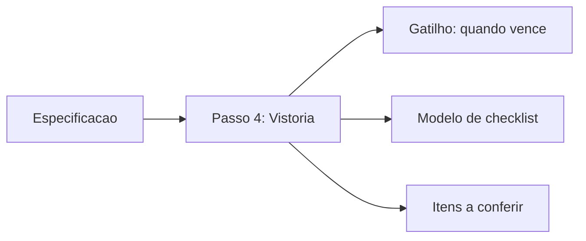
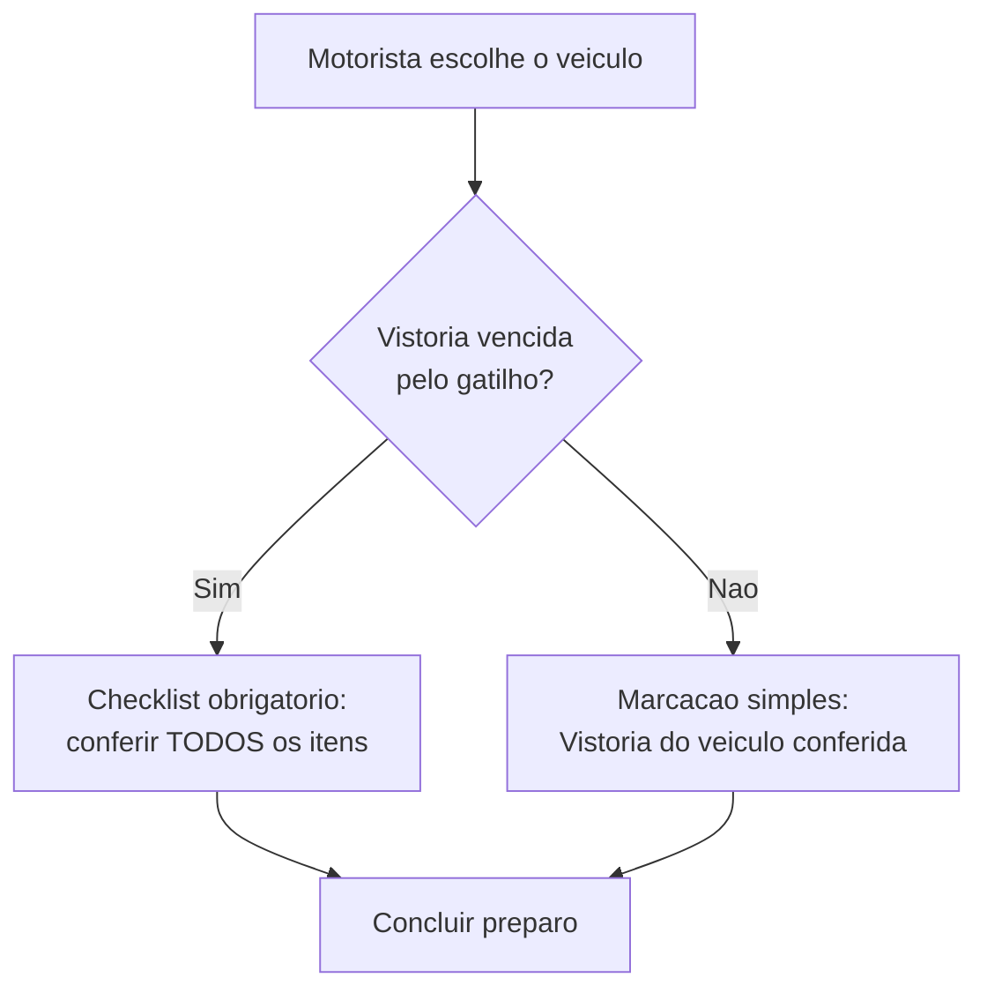

# Especificações: vistoria

A **vistoria** é o checklist de checagem do veículo — o que conferir antes de sair com a carga. Você a configura **dentro da especificação** (a ficha técnica do modelo), e ela aparece sozinha para o motorista **no preparo da rota**, na hora certa.

A ideia é simples: você decide **quando** o veículo precisa ser checado e **o que** olhar. O LocFlow faz o resto — avisa o motorista quando a vistoria vence e só libera a saída depois que ele confere os itens.


A vistoria faz parte da **Frota**, um recurso **Pro**. Se você ainda não vê o módulo, é porque seu plano não o inclui — dá para operar entregas sem ela. Veja [Frota](frota.md).



**Por que isso te faz ganhar:** um carro que quebra no meio da rota é frete perdido, cliente irritado e material avariado. A vistoria em dia mantém a frota rodando sem surpresa — e o registro fica salvo, então você sabe quem checou o quê e quando.


## Onde fica e como ligar {#onde-fica}

A vistoria é o **Passo 4** do formulário de especificação (depois de Identificação, Carroceria e Capacidade). Ela é **opcional**: começa desligada.

Quando está desligada, a tela explica:

> Checklist de inspeção do veículo, com a frequência por gatilho de operação. Configure separadamente da capacidade.

Ligue o botão e três blocos aparecem: **quando** fazer a vistoria (o gatilho), **qual modelo** de checklist usar e **os itens** a conferir. Ao ligar, o LocFlow já sugere o começo mais comum — uma vistoria **a cada 30 dias** com o **checklist padrão** — e você ajusta a partir daí.

## Os gatilhos: quando a vistoria vence {#gatilhos}

A frequência da vistoria **não é só "a cada N dias"**. O LocFlow trabalha com **cinco gatilhos** — cada um casa com um jeito diferente de operar. Você escolhe **um** por especificação.

| Gatilho | Quando gera uma vistoria | Bom para |
| --- | --- | --- |
| **A cada roteiro finalizado** | Sempre que uma viagem/roteiro é concluído | Operação intensa, em que cada viagem castiga o carro |
| **Primeira saída do dia** | Uma vez por dia, no primeiro uso do veículo | Quem quer um check rápido toda manhã |
| **Dias da semana** | Em dias fixos — ex.: toda segunda e sexta | Rotina semanal previsível |
| **A cada N dias** | Ciclo por tempo — ex.: a cada 30 dias | Manutenção preventiva por calendário |
| **A cada N roteiros** | Por uso acumulado — ex.: a cada 5 viagens | Quem mede desgaste por uso, não por tempo |

Conforme você escolhe o gatilho, o LocFlow mostra uma **frase-resumo** confirmando a regra. Por exemplo:

> Uma vistoria a cada 30 dias.

> Toda Seg, Sex.

> Uma vistoria a cada roteiro finalizado.

### Os gatilhos que pedem um ajuste

Três gatilhos têm uma configuração extra que aparece logo abaixo quando você os seleciona:

- **A cada N dias** — um seletor para o número de dias. O mínimo é **1** dia e o máximo é **365**.
- **A cada N roteiros** — um seletor para o número de roteiros (viagens). O mínimo é **1** e o máximo é **50**.
- **Dias da semana** — botões de **D S T Q Q S S** (domingo a sábado). Marque **pelo menos um** dia; se nenhum estiver marcado, o LocFlow avisa e não deixa salvar:

> Selecione ao menos um dia da semana para a vistoria.

Os outros dois gatilhos — **a cada roteiro finalizado** e **primeira saída do dia** — não precisam de nenhum número: a regra já está completa.


Os gatilhos que contam **roteiros** ("a cada roteiro" e "a cada N roteiros") olham para quantas viagens o **veículo** concluiu desde a última vistoria. Os gatilhos por **tempo** ("a cada N dias", "primeira saída do dia", "dias da semana") olham para o calendário. Você escolhe o que faz sentido para o seu desgaste.


## Os modelos de checklist {#modelos}

O **modelo** carrega um conjunto de itens pronto, para você não começar do nada. A tela explica:

> Carrega um conjunto de itens pronto — você edita depois.

São três opções:

| Modelo | O que traz | Descrição na tela |
| --- | --- | --- |
| **Checklist padrão** | 4 itens essenciais do dia a dia | "Itens essenciais do dia a dia — pneus, lona, faróis e documentos." |
| **Inspeção de frota** | 7 itens — uma checagem completa | "Inspeção completa de frota — óleo, freios, itens de segurança e avarias." |
| **Começar do zero** | Lista vazia, você monta tudo | "Lista vazia: adicione os itens manualmente abaixo." |

Os presets que cada modelo traz:

- **Checklist padrão:** Checar pneus · Checar lona traseira · Faróis, setas e lanternas · Documentos do veículo (CRLV).
- **Inspeção de frota:** Pneus e estepe · Nível de óleo e fluidos · Freios · Faróis, setas e lanternas · Extintor e triângulo · Documentos (CRLV) · Limpeza e avarias na carroceria.
- **Começar do zero:** nenhum item — você adiciona o que quiser.


Escolher um modelo é só um **ponto de partida**. Depois de carregá-lo, você adiciona, remove e renomeia os itens livremente. Trocar de modelo recarrega a lista daquele modelo — então monte os itens **depois** de definir o modelo.


## Os itens do checklist {#itens}

Abaixo do modelo fica a lista de itens — o que o motorista vai conferir, um a um, antes de sair. Cada item é uma frase curta que você escreve, com um campo de exemplo:

> Ex.: Pneus, lona traseira, faróis…

Toque em **Adicionar** (ou no **+**) para incluir. O LocFlow não deixa repetir o mesmo item:

> Este item já foi adicionado.

A lista pode até ficar vazia — não é obrigatório ter itens:

> Nenhum item ainda — o checklist pode ficar vazio.

Mas vale a pena ter pelo menos os básicos: um checklist vazio na hora da saída vira só uma marcação simples (veja a seguir), e você perde o ganho de listar o que importa.

## Como isso aparece para o motorista {#na-execucao}

Aqui está a parte que conecta o cadastro à rua. Quando o motorista vai preparar a saída (no [preparo da rota](../logistica/execucao-em-campo.md)), o **Passo 3 — Vistoria** verifica a vistoria do veículo escolhido. O comportamento depende do gatilho que você configurou:

- **Se a vistoria estiver vencida** (o gatilho disparou), aparece o **checklist obrigatório**. O app avisa: *"A vistoria está vencida. Confira todos os itens antes de sair."* O motorista precisa marcar **todos os itens** para poder avançar.
- **Se não estiver vencida**, há apenas uma marcação simples: **"Vistoria do veículo conferida"** — o motorista confirma que o veículo está em condições de rodar.

Na **revisão final** (Passo 4), a vistoria aparece como **Checklist completo**, **Conferida** ou **Pendente** — e fica em destaque âmbar se ainda faltar algo. Tudo isso fica registrado na viagem.


**Veículo sem vistoria configurada?** Sem problema. Se a especificação não tem vistoria ligada, o motorista vê só a marcação simples "Vistoria do veículo conferida". Você nunca trava a saída por falta de cadastro.



**Primeira vez sempre vence.** Se o veículo **nunca passou por uma vistoria**, ela é exigida na primeira saída, qualquer que seja o gatilho. A partir daí, a contagem (de dias ou de roteiros) começa a valer.


## Situações reais {#situacoes}

- **Festas no fim de semana:** a locadora usa o gatilho **dias da semana** e marca **sexta**. Toda sexta, antes do primeiro carregamento, o motorista confere o checklist padrão — pneus, lona, faróis, documentos. Durante a semana, sai com a marcação simples.
- **Frota pesada que roda muito:** caminhões com baú fechado usam **a cada N roteiros**, fixado em 5. A cada cinco viagens concluídas, o motorista é obrigado a passar pela **inspeção de frota** completa (óleo, freios, extintor, avarias). Manutenção amarrada ao uso real, não ao calendário.
- **Carro de uso esporádico:** a van que só sai em pedidos grandes usa **a cada N dias**, com 30. Mesmo parada, ela é checada de mês em mês quando volta a rodar — sem deixar passar a manutenção preventiva.

## Próximo passo {#proximo-passo}

A vistoria mora na especificação — entenda o resto da ficha em [Frota](frota.md). Para ver a vistoria em ação, leia [Execução em campo](../logistica/execucao-em-campo.md) (o preparo da rota). E, para enxergar o veículo certo no planejamento, veja [Planejando o roteiro](../logistica/planejando-o-roteiro.md). Em dúvida sobre um termo? Consulte o [Glossário](../primeiros-passos/glossario.md).
