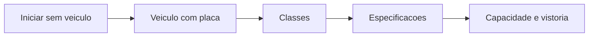
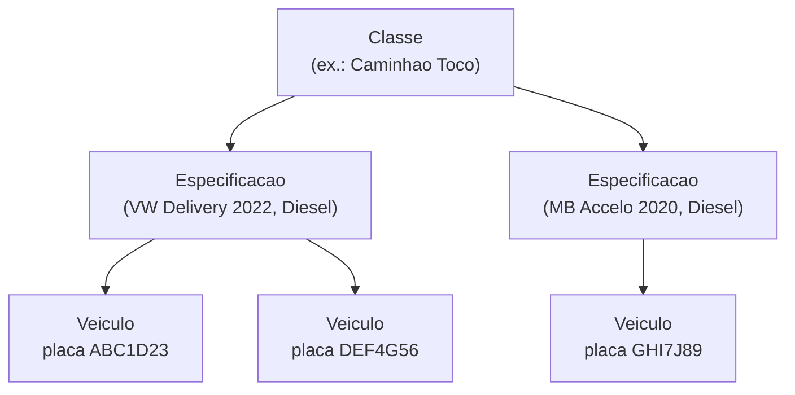

# Frota

A frota é o conjunto de veículos que leva seus [bens móveis](../primeiros-passos/glossario.md) até o cliente e os traz de volta. No LocFlow, você cadastra a frota para **planejar roteiros com veículo e capacidade** — saber o que cabe em cada carro, quem está disponível e quanto a entrega vai render.

Mas calma: cadastrar a frota **não é obrigatório para começar**. O LocFlow abstrai para quem está começando e revela detalhe para quem cresceu. Você sobe a escada no seu ritmo.


A Frota faz parte de um plano superior. Se você ainda não vê o módulo, é porque seu plano não o inclui — e tudo bem: dá para operar entregas sem ele (veja a seguir). Para liberar, vá em [Minha assinatura e créditos](../configuracoes/assinatura-e-creditos.md).


## A escada da frota 

Você não precisa configurar tudo de uma vez. Cada degrau acrescenta controle, sem travar o anterior.

| Degrau | O que você ganha | Para quem |
| --- | --- | --- |
| **Iniciar sem veículo** | Entrega sai mesmo sem frota cadastrada | Quem está começando ou faz entrega avulsa |
| **Veículo com placa** | Saber qual carro saiu e seu status | Quem tem 1 ou 2 carros próprios |
| **Classes** | Agrupar a frota por porte (carro, caminhão, moto) | Quem tem veículos variados |
| **Especificações** | Ficha técnica por modelo (marca, ano, combustível) | Quem quer organizar por modelo |
| **Capacidade e vistoria** | Saber o que cabe e checar o carro antes de rodar | Quem otimiza carga e cuida da manutenção |

### Degrau 1 — Iniciar sem veículo (opcional) 

Você pode **iniciar uma entrega ou retirada sem selecionar nenhum veículo**. O LocFlow nunca trava o caminho mais simples: se você ainda não cadastrou a frota, ou se a entrega é avulsa, o sistema segue com um aviso suave (não bloqueante) de que o registro ficará sem veículo.


**Por que isso te ajuda:** ninguém deixa de entregar por falta de cadastro. Você começa a faturar hoje e organiza a frota depois, quando fizer sentido. Zero fricção para quem está começando.


### Degrau 2 — Veículo com placa e status 

Quando quiser controle, cadastre o veículo. O essencial é simples:

- **Especificação veicular** — qual ficha técnica esse veículo segue (veja os degraus 3 e 4). Você busca por marca ou modelo e seleciona.
- **Identificador interno** — opcional, o apelido que sua equipe usa (ex.: "Caminhão 01").
- **Placa** — obrigatória (ex.: `ABC1D23`). É o que identifica o veículo na rua.

Todo veículo **nasce Ativo**. O status muda por **ações** na lista da frota, não no cadastro:

| Status | O que significa |
| --- | --- |
| **Ativo** | Disponível para receber roteiros |
| **Manutenção** | Parado para reparo — não entra em novas atribuições |
| **Inativo** | Fora de operação — não aparece para atribuir |

Na lista de veículos, cada carro tem as ações de status conforme onde está: **Enviar para manutenção** e **Inativar** (a partir de Ativo), **Reativar** e **Inativar** (a partir de Manutenção) ou **Reativar** (a partir de Inativo).


**Em trânsito.** Quando um veículo está rodando em um roteiro ainda não concluído, ele aparece como **Em trânsito**, mesmo estando Ativo. É um status visual (derivado da operação, não algo que você define) — assim você não atribui dois roteiros ao mesmo carro por engano.


### Degraus 3 e 4 — Classes e Especificações 

Aqui está a organização que dá inteligência à frota. São três níveis encaixados — é a **hierarquia da frota**:

- **Classe** é só o **nome** que você dá a um tipo de veículo (ex.: "Caminhão Toco", "Van Furgão"). Você informa o nome e escolhe o **tipo de veículo** entre **Carros**, **Caminhões** ou **Motos** (base do catálogo FIPE). O sistema gera um código por trás automaticamente — você não precisa se preocupar com ele.
- **Especificação** é a **ficha técnica** de um modelo dentro de uma classe. Você escolhe a classe e, em seguida, **marca, modelo e ano** vêm prontos do catálogo FIPE (basta buscar e selecionar). O **combustível** vem sugerido pela FIPE, e você pode ajustar (Gasolina, Etanol, Diesel, Flex, GNV, Elétrico).
- **Veículo** é a unidade real, com **placa**, ligada a uma especificação.

Pense assim: a **Classe** diz *que tipo* de veículo é, a **Especificação** diz *qual modelo*, e o **Veículo** diz *qual carro* (a placa). No app, a tela inicial da Frota (o **hub**) resume isso: _"Classe define o porte → Especificação descreve um modelo e sua capacidade → Veículo é a unidade física com placa."_


**Por que essa hierarquia?** Você descreve o **modelo uma vez** (na especificação) e cadastra **vários veículos** com a mesma ficha — só mudando a placa. Capacidade e vistoria ficam na especificação e valem para todos os carros daquele modelo.


### A especificação guarda capacidade e vistoria 

Ao criar uma especificação, dois blocos **opcionais** dão superpoderes à frota.

#### Capacidade — o que cabe no veículo 

Você descreve **o que cabe** naquele modelo — por **contagem de itens** (ex.: "10 tendas") e, em baús fechados, pela **volumétrica** (a cubagem do baú). Com isso, ao montar o roteiro, o LocFlow avalia se a carga cabe e avisa quando não cabe. Os detalhes — como o app **escolhe a estratégia** e por que a volumétrica **exige baú fechado** — estão em [Especificações: capacidade](frota-capacidade.md).

#### Vistoria — o checklist de checagem do veículo 

Você define **quando** o veículo deve ser conferido (na primeira saída do dia, a cada N dias, a cada N roteiros…) e **o que** conferir, partindo de um modelo de checklist pronto. É esse checklist que aparece ao motorista no **preparo da saída**. Os gatilhos e os modelos estão em [Especificações: vistoria](frota-vistoria.md).


**Por que capacidade e vistoria fazem você ganhar mais:** com a capacidade definida, o LocFlow avalia se a carga cabe e ajuda a otimizar o roteiro — menos viagens, mais entregas por dia. Com a vistoria em dia, você evita o carro quebrar no meio da rota (frete perdido, cliente irritado, avaria no material). Frota organizada = operação que não para.


## Situações reais 

- **Locadora de festas começando:** ainda não cadastrou frota. Recebe um pedido, despacha a entrega **sem veículo** e entrega na hora. Mês que vem, cadastra a Kombi com placa para começar a controlar.
- **Quem tem caminhão e van:** cria duas classes ("Caminhão Toco" e "Van Furgão"), uma especificação por modelo e os veículos com placa. Agora sabe, na hora de planejar, qual carro tem baú maior para a carga do dia.
- **Frota que cresceu:** liga a estratégia de **contagem** ("cabem 10 tendas no Toco") e, no baú fechado, também a **volumétrica**. O sistema passa a alertar quando a carga não cabe — e a vistoria a cada 30 dias mantém os caminhões rodando sem surpresa.
- **Carro parado para reparo:** o operador envia o veículo para **Manutenção** na lista da frota. Ele some das atribuições até alguém **Reativar**, sem risco de cair num roteiro do dia.

## Próximo passo 

Com a frota pronta, veja como ela entra no dia a dia em [Planejando o roteiro](../logistica/planejando-o-roteiro.md) (veículo e capacidade na montagem da rota) e [Execução em campo](../logistica/execucao-em-campo.md) (a vistoria no preparo da saída). Em dúvida sobre um termo? Consulte o [Glossário](../primeiros-passos/glossario.md) ou veja [Onde tirar dúvidas](../primeiros-passos/onde-tirar-duvidas.md).
