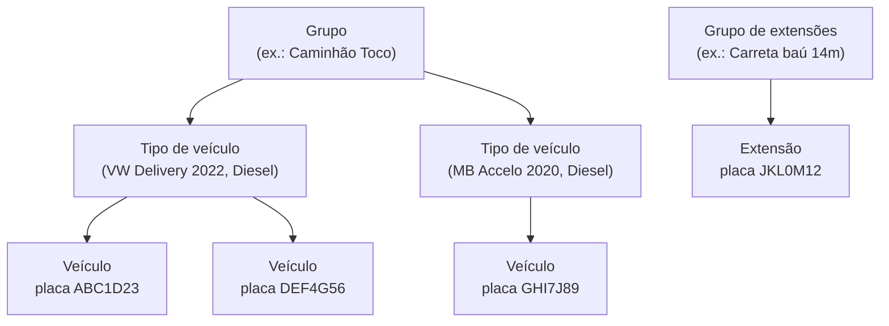

# Frota

A frota é o conjunto de veículos que leva seus [bens móveis](../primeiros-passos/glossario.md) até o cliente e os traz de volta — sejam eles da sua organização ou de um **fornecedor de frete** que você opera. No LocFlow, você cadastra a frota para **planejar roteiros com veículo e capacidade** — saber o que cabe em cada um, qual está disponível e quanto a entrega vai render.


A Frota faz parte do plano **Pro**. Se o item **Frota** aparece com um cadeado no menu, é porque o seu plano não o inclui — e dá para operar entregas sem ele (veja [Na hora de rodar](#iniciar-sem-veiculo)). Para liberar, vá em [Minha assinatura e créditos](../configuracoes/assinatura-e-creditos.md).


## A frota numa tela só 

Em **Logística › Frota**, a tela abre com **todos os seus veículos**, reunidos por grupo. O resto fica em abas, na mesma tela:

| Aba | O que mostra | Botão de cadastro |
| --- | --- | --- |
| **Veículos** | A frota inteira, agrupada. Busca por placa e filtros por **Situação** e **Grupo**. | **Novo veículo** |
| **Tipos de veículo** | *"O que cada modelo carrega"* — marca, modelo, baú, capacidade e vistoria. | **Novo tipo** |
| **Extensões** | *"Reboques e tudo que engata"* — carretinhas, reboques e carretas. | **Nova extensão** |

Os conceitos ficam atrás do botão **?** de cada aba — a tela mostra os veículos, e a explicação aparece quando você pede.

## Como a frota se organiza 

São três níveis encaixados — e as extensões ao lado:

```mermaid
flowchart TD
    G["Grupo<br/>(ex.: Caminhão Toco)"] --> T1["Tipo de veículo<br/>(VW Delivery 2022, Diesel)"]
    G --> T2["Tipo de veículo<br/>(MB Accelo 2020, Diesel)"]
    T1 --> V1["Veículo<br/>placa ABC1D23"]
    T1 --> V2["Veículo<br/>placa DEF4G56"]
    T2 --> V3["Veículo<br/>placa GHI7J89"]
    GE["Grupo de extensões<br/>(ex.: Carreta baú 14m)"] --> E1["Extensão<br/>placa JKL0M12"]
```

- **[Grupo](frota-grupos.md)** — reúne tipos que **carregam a mesma coisa**. Na hora de montar o roteiro, qualquer veículo do grupo é tratado como equivalente. É o nome que aparece no planejamento, no frete e nas telas que o seu cliente vê.
- **[Tipo de veículo](frota-ficha-tecnica.md)** — descreve **o que um modelo carrega**: marca, modelo, ano, combustível, se tem baú fechado, quanto cabe e com que frequência passa por vistoria. Vários veículos iguais **compartilham o mesmo tipo**: cinco Fiorinos iguais são um tipo e cinco veículos.
- **Veículo** — a unidade real, com **placa**, identificador interno, documento e situação.
- **[Extensão](frota-extensoes.md)** — o que se acopla a um veículo para aumentar o que ele leva (reboque, carretinha). Tem placa, documento e situação próprios.

Pense assim: o **grupo** diz *quais veículos se substituem*, o **tipo** diz *o que aquele modelo carrega* e o **veículo** diz *qual carro* (a placa).


**Mudou o nome, não a ideia.** O que antes se chamava **especificação** (ou **ficha técnica**) hoje é **tipo de veículo**, e o que se chamava **classe** hoje é **grupo**. Alguns pontos do app ainda usam as palavras antigas — por exemplo, no planejamento do roteiro o campo aparece como **"Tipo de veículo (classe)"**, e a classe ali é o grupo.


## Cadastrar um veículo: três passos 

O cadastro começa pelo que você tem na mão — o veículo. Na aba **Veículos**, toque em **Novo veículo**:

1. **Veículo** — a **Placa** (obrigatória, ex.: `ABC1D23`), o **Identificador interno** (opcional — o apelido que a equipe usa, ex.: "Caminhão 01") e o **Documento do veículo (CRLV)** (veja [abaixo](#documento-crlv)).
2. **Tipo** — escolha entre **Usar uma ficha existente** (busque por marca ou modelo) ou **Criar uma ficha nova**. Criando na hora, você preenche a identificação, a carroceria, a capacidade e o **grupo** do tipo; vistoria, custo de combustível e titular ficam no cadastro completo do tipo, na aba **Tipos de veículo**.
3. **Confirmar** — um resumo com placa, identificação, tipo, documento e capacidade. Toque em **Cadastrar veículo**.


**Atalho:** na ficha de um tipo de veículo, **Adicionar veículo com esta ficha** abre o cadastro do veículo com o tipo já escolhido. Para editar um veículo depois, o formulário é simples, sem passos: tipo, placa, identificador e documento.


### Identificador do veículo e identificação do tipo 

São dois apelidos diferentes, e cada um tem o seu lugar:

- O **identificador interno do veículo** (ex.: "Caminhão 01", "Strada da equipe A") diferencia um carro do outro. Na lista da frota, é ele que aparece primeiro — ou a placa, se você não der um.
- A **identificação interna do tipo** (ex.: "Baú grande") é o nome curto do modelo, mostrado nas listas de tipos e ao montar o roteiro. O LocFlow sugere um nome assim que você informa marca, modelo e ano. Veja [Tipos de veículo](frota-ficha-tecnica.md#identificacao).

## Situação do veículo 

Todo veículo **nasce Ativo**. A situação muda por **ações** na lista da frota, não no cadastro:

| Situação | O que significa |
| --- | --- |
| **Ativo** | Disponível para sair em roteiros |
| **Manutenção** | Parado para reparo — não sai em novas viagens |
| **Inativo** | Fora de operação — aparece esmaecido e não pode ser escolhido para sair |

Na lista de veículos, cada carro tem as ações conforme onde está: **Enviar para manutenção** e **Inativar** (a partir de Ativo), **Reativar** e **Inativar** (a partir de Manutenção) ou **Reativar** (a partir de Inativo).


**Em trânsito.** Quando um veículo está rodando em um roteiro ainda não concluído, ele aparece como **Em trânsito**, mesmo estando Ativo. É uma situação visual (derivada da operação, não algo que você define) — assim ninguém escolhe para outra viagem um carro que está na rua.


## Documento do veículo (CRLV) 

No cadastro do veículo (e no da extensão), o bloco **Documento do veículo (CRLV)** guarda a **validade do licenciamento**: o campo **Documento válido até**, escolhido num calendário. A tela lembra por quê: *"O licenciamento vence na data impressa no CRLV — cada estado tem o seu calendário."*

| Situação do documento | O que acontece na saída |
| --- | --- |
| **Em dia** | Nada a fazer. |
| **Vence em poucos dias** | O selo avisa com antecedência (*"Documento vence em 12 dias"*; no cartão do celular, abreviado como *"Doc. em 12d"*), a partir de 30 dias antes. |
| **Vencido** | **Bloqueia a saída** do roteiro: o veículo aparece esmaecido, com o selo **Documento vencido**, e não pode ser escolhido. É impedimento legal, não divergência de planejamento. |
| **Não cadastrado** | A saída continua liberada — o sistema **apenas avisa** que não conseguiu conferir o documento. |

Errou a data? Use **Remover a validade** para voltar a "não cadastrado".


**Reboque, semirreboque e carreta têm placa e CRLV próprios** — a carreta não se licencia pelo cavalo. Por isso o mesmo campo existe no cadastro das [extensões](frota-extensoes.md), com a mesma regra: vencido bloqueia, ausente avisa.


## Na hora de rodar: planejamento e saída 

O veículo entra em momentos diferentes da operação, e cada etapa pede uma coisa:

| Etapa | O veículo é… | O que acontece |
| --- | --- | --- |
| **Planejar o roteiro** | Opcional — você escolhe o **grupo** (no campo **Tipo de veículo (classe)**), não a placa | Sem grupo escolhido, a tela avisa *"Sem veículo definido, a carga não é avaliada agora — dá para seguir assim."* |
| **Sair para a rota** (execução passo a passo no app) | **Obrigatório**: um veículo **ativo**, do grupo planejado e com documento em dia | Sem veículo, o app pede *"Escolha um veículo ativo para a viagem."* Os indisponíveis aparecem com o motivo — Em trânsito, Em manutenção, Inativo, Documento vencido ou Classe diferente (de outro grupo). |
| **Registrar em lote** (depois do fato) | Não é pedido | O roteiro é registrado sem veículo. |

Sem a Frota, a entrega continua possível: o pedido avança pelas etapas da logística, o roteiro pode ser planejado sem grupo de veículo e registrado em lote. A execução passo a passo, com o motorista registrando no app, é que pede um veículo cadastrado. Veja [Planejando o roteiro](../logistica/planejando-o-roteiro.md), [Execução em campo](../logistica/execucao-em-campo.md) e [Execução em lote](../logistica/execucao-em-lote.md).

## De quem é o tipo (titular) 

Todo tipo de veículo tem um **titular**. Quase sempre é a **sua empresa**. Quando você contrata frete de terceiros, pode cadastrar o tipo do veículo **do fornecedor** — aí o titular é ele, e o preço daquela viagem sai do motor de frete dele, não do seu. Os tipos de um fornecedor formam a **frota-espelho** dele dentro do LocFlow, e o cartão do tipo mostra um **selo com o nome do fornecedor**.

O campo do titular só aparece se o seu plano e as suas permissões liberam frete por fornecedor. Como escolher, trocar e o que isso muda nos grupos: [Titular do tipo](frota-titular.md).

Os **fornecedores de frete** são a forma **mais simples** de usar estrutura de fora: o fornecedor é um terceiro que **você gerencia por completo** (você o cadastra, monta a frota-espelho dele e configura o motor de frete que ele cobra) e que **não tem login** no LocFlow — quem opera tudo é você.

Quando você precisa de mais do que isso — um parceiro com **conta e estrutura próprias**, que monta o roteiro dele, executa e recebe por isso —, o caminho é a [Rede de Parceiros](../parcerias/visao-geral.md), que é uma seção inteira à parte. Para cadastrar um fornecedor e montar a frota-espelho, veja [Fornecedores de frete](../parcerias/fornecedores-de-frete.md).

## Capacidade e vistoria 

Os dois blocos que dão inteligência à frota moram no **tipo de veículo** e valem para todos os veículos daquele tipo.

#### Capacidade — o que cabe no veículo 

Você descreve **o que cabe** naquele modelo — por **contagem de itens** (ex.: "10 tendas"), pelo **volume** do baú fechado e pelo **peso máximo**. Com isso, ao montar o roteiro, o LocFlow avalia se a carga cabe e avisa quando não cabe. Os detalhes estão em [Tipos de veículo: capacidade](frota-capacidade.md).

#### Vistoria — o checklist do veículo 

Você define **quando** o veículo deve ser conferido (na primeira saída do dia, a cada N dias, a cada N roteiros…) e **o que** conferir, partindo de um modelo de checklist pronto. É esse checklist que aparece ao motorista no **preparo da saída**. Os gatilhos e os modelos estão em [Tipos de veículo: vistoria](frota-vistoria.md).


**Por que capacidade e vistoria fazem você ganhar mais:** com a capacidade definida, o LocFlow avalia se a carga cabe e ajuda a otimizar o roteiro — menos viagens, mais entregas por dia. Com a vistoria e o documento em dia, você evita o carro quebrar (ou ser parado) no meio da rota — frete perdido, cliente irritado, avaria no material. Frota organizada = operação que não para.


## Situações reais 

- **Locadora de festas começando:** ainda não usa a Frota. Recebe um pedido, faz a entrega e avança o pedido pelas etapas da logística — ou registra o roteiro em lote depois. Mês que vem, cadastra a Kombi com placa para o motorista registrar a rota no app.
- **Quem tem caminhão e van:** cadastra cada veículo pela aba **Veículos** — placa primeiro, depois o tipo (criado na hora, com o grupo "Caminhão Toco" ou "Van Furgão"). Agora sabe, na hora de planejar, qual grupo tem baú maior para a carga do dia.
- **Três Fiorinos iguais:** um tipo só, "Fiorino baú", e três veículos com placas diferentes. Quando o baú foi medido de novo, a medida mudou num lugar e valeu para os três.
- **Licenciamento vencendo:** o selo **Documento vence em 12 dias** aparece na lista. O dono renova, atualiza a data no veículo e o selo volta a **Documento em dia** — sem roteiro travado na saída.
- **Carro parado para reparo:** o operador envia o veículo para **Manutenção** na lista da frota. Ele não pode ser escolhido para sair até alguém **Reativar**.

## Próximo passo 

Entenda cada peça da frota em [Tipos de veículo](frota-ficha-tecnica.md), [Grupos da frota](frota-grupos.md), [Extensões](frota-extensoes.md) e [Titular do tipo](frota-titular.md). Para ver a frota no dia a dia, vá a [Planejando o roteiro](../logistica/planejando-o-roteiro.md) (o tipo de veículo e a capacidade na montagem da rota) e [Execução em campo](../logistica/execucao-em-campo.md) (o veículo, o documento e a vistoria no preparo da saída). Em dúvida sobre um termo? Consulte o [Glossário](../primeiros-passos/glossario.md) ou veja [Onde tirar dúvidas](../primeiros-passos/onde-tirar-duvidas.md).
