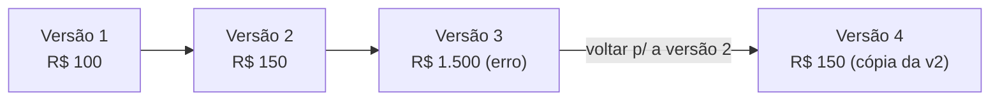

# Histórico de preços

Toda vez que você muda o **preço** de um produto ou de um kit — seja o de aluguel, seja o de venda — o LocFlow **guarda o valor antigo**. Nada é sobrescrito em silêncio: cada mudança vira uma **versão** numerada, e a lista inteira fica disponível para você consultar e, se precisar, **voltar atrás**.

É a sua trilha de auditoria de preços: o que você cobrava no mês passado, o valor de antes da última tabela, o número que estava lá antes daquele ajuste apressado de sexta à tarde.


**Histórico de preço é do catálogo, não do orçamento.** Aqui falamos do preço **de tabela** que você cadastra no produto/kit. O preço que aparece **dentro de um orçamento** pode ser ajustado caso a caso e segue outra lógica — veja [Valores](../orcamentos/valores.md). E mexer no preço de tabela **não muda orçamentos antigos**: eles guardam o valor que tinham na hora.


## Para que serve {#para-que-serve}

Duas situações cobrem quase tudo:

- **Auditoria / memória.** "Quanto eu cobrava por esta cadeira antes do reajuste?" O histórico responde sem você precisar lembrar nem anotar em planilha à parte.
- **Voltar atrás de um erro.** Digitou R$ 1.500 onde era R$ 15,00? Aplicou uma tabela nova que não colou com a clientela? Em vez de redigitar o valor certo, você **volta para a versão anterior** com um toque.


**Por que isso te dá tranquilidade:** você pode reajustar preço sem medo. Se errar a mão, o valor de antes está guardado e a volta é imediata — não existe "mudança sem retorno".


## Onde fica {#onde-fica}

O histórico vive **dentro de cada produto e de cada kit**, não numa tela à parte:

1. Abra o **Catálogo** e toque no **produto** (ou no **kit**) que te interessa.
2. Na ficha que abre, encontre o atalho **"Ver histórico de preços"**.
3. Abre uma lista com todas as versões daquele item.

Como o histórico é por item, ele só existe para quem já teve **alguma** mudança de preço. Um item recém-cadastrado, que nunca teve o preço alterado, mostra pouca coisa — ou, no caso do kit, o aviso *"Sem histórico de preços ainda para este kit."*

## Como ler uma versão {#como-ler-uma-versao}

Cada linha do histórico é uma **versão** e traz três informações:

| O que aparece | O que significa |
| --- | --- |
| **Versão N** | O número da mudança. Quanto **maior** o número, mais **recente** o preço. A lista vem da mais nova para a mais antiga. |
| **Aluguel** ou **Venda** | A qual lado do preço aquela versão se refere (a *natureza*). |
| **O valor** (em R$) | Quanto valia o preço naquela versão. Em venda, vem também a **condição** (Novo, Seminovo ou Usado). |

> O número da versão **não** é uma data; é a ordem das mudanças. A versão mais alta é o preço que está valendo agora.

## Aluguel e venda andam separados {#aluguel-e-venda}

Um produto pode ter **preço de aluguel** e **preço de venda** ao mesmo tempo — e a venda ainda se divide por **condição** (Novo, Seminovo, Usado). O histórico respeita essa separação: cada combinação tem a **sua própria** sequência de versões.

Na prática, isso quer dizer que você pode ter, lado a lado:

- Aluguel na versão 3;
- Venda (Novo) na versão 2;
- Venda (Usado) na versão 1.

Mexer no preço de aluguel cria uma versão **só** na trilha do aluguel; mexer no preço de venda (Novo) cria versão **só** na trilha de venda Novo. Um não interfere no outro.


**Para entender "natureza" e "condição":** *natureza* é se o item vai e volta (aluguel) ou sai em definitivo (venda); *condição* (Novo / Seminovo / Usado) é o estado do item na venda. A página [Locação e venda](../conceitos/locacao-e-venda.md) explica os dois conceitos com calma.


## Voltar para uma versão {#voltar-para-uma-versao}

Achou a versão para a qual quer voltar? Toque em **"Voltar para esta versão"** naquela linha. Pronto: o preço atual do item passa a valer aquele valor antigo.

A volta funciona para **aquele preço específico**: se você reverte uma versão de aluguel, só o preço de aluguel muda; se reverte uma de venda Novo, só a venda Novo muda. O resto fica como estava.


**Quem pode reverter mexe no preço de tabela do item para todo mundo.** Vale a mesma regra de editar o produto/kit: a mudança vale daqui pra frente, em **novos** orçamentos. Os orçamentos já criados continuam com o valor que tinham. Confira quem na sua equipe pode editar o catálogo em [Colaboradores e acessos](../configuracoes/colaboradores-e-acessos.md).


## Reverter não apaga o passado {#reverter-nao-mexe-no-passado}

Este é o ponto que dá segurança: **voltar para uma versão não destrói nenhuma versão**. O LocFlow não "desfaz" a sua tabela atual — ele **copia** o valor antigo para uma **versão nova** no topo da lista.

Ou seja, depois de reverter você fica com **mais** uma versão no histórico, não com menos. O caminho inteiro permanece registrado:

Repare: a versão 3 com o erro **continua lá** — ela não some. Você só ganhou uma versão 4 com o valor correto de novo. Isso mantém a auditoria honesta: dá pra ver que houve um erro e que ele foi corrigido.

## Por porte {#por-porte}

| Se você é… | Como o histórico costuma servir |
| --- | --- |
| **Autônomo / MEI / micro** | Rede de segurança. Você quase não olha o histórico — ele está ali para o dia em que você errar um valor e quiser voltar num toque. |
| **Médio** | Memória da sua política de preços ao longo das temporadas: comparar a tabela de antes e depois de um reajuste, reverter um teste de preço que não vingou. |
| **Grande / muitas mãos no catálogo** | Auditoria. Com mais pessoas mexendo nos preços, o histórico mostra o que mudou em cada item e permite reverter um ajuste indevido sem perder o rastro. |

## Para quem quer os detalhes {#para-quem-quer-os-detalhes}

- **A versão é por trilha, não por item.** Cada par *natureza × condição* (aluguel; venda Novo; venda Seminovo; venda Usado) tem sua própria numeração de versões, contada de forma independente.
- **Reverter é uma nova alteração de preço.** Sob o capô, "voltar para a versão N" pega o valor daquela versão e o aplica como se você tivesse digitado o mesmo número à mão. Por isso ele gera uma versão nova no fim da fila.
- **Não há limite prático de versões guardadas** que você precise gerenciar — o histórico cresce conforme você ajusta preços e a lista é paginada, então itens com muito histórico carregam aos poucos.
- **O valor de reposição não entra aqui.** O histórico cobre **preço de aluguel** e **preço de venda**. O *valor de reposição* (quanto custa repor o item) é outro campo, com outra finalidade — veja a explicação dele em [Catálogo: produtos](catalogo-produtos.md).


Quando você edita um produto ou kit, o app já avisa o que vai acontecer: *"Mudança de preço vira novo registro no histórico; orçamentos antigos não mudam."* É exatamente esta mecânica.


## Situações reais {#situacoes-reais}

- **Erro de digitação.** Você quis pôr R$ 80 de diária e saiu R$ 800. Abre o produto, "Ver histórico de preços", acha a versão de R$ 80 e toca em **"Voltar para esta versão"**. O preço certo volta na hora; o erro fica registrado, mas não vale mais.
- **Reajuste que não colou.** Subiu o aluguel de uma linha de itens em 20% e a procura caiu. Você reverte cada item para a versão anterior ao reajuste e volta à tabela de antes — sem precisar lembrar os números antigos.
- **"Quanto eu cobrava no verão passado?"** Antes de fechar uma proposta grande, você confere no histórico o valor que praticava na temporada anterior para decidir o desconto com base em fato, não em memória.
- **Auditoria de equipe.** Um item está mais barato do que devia. No histórico você vê a versão que mudou o preço e reverte para a correta, deixando o registro de que houve a correção.

## Próximo passo {#proximo-passo}

- Quer entender o campo de preço em si (aluguel, venda por condição, valor de reposição)? Veja [Catálogo: produtos](catalogo-produtos.md) e [Catálogo: kits](catalogo-kits.md).
- Curioso sobre **natureza** e **condição**? Leia [Locação e venda](../conceitos/locacao-e-venda.md).
- Quer saber como o preço se comporta **dentro** de um orçamento? Veja [Valores](../orcamentos/valores.md).
- Dúvida em algum termo? Consulte o [glossário](../primeiros-passos/glossario.md).
