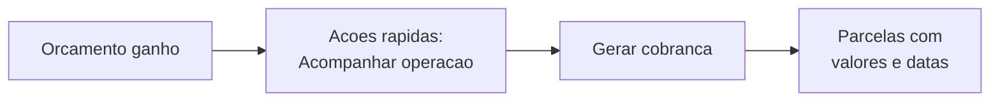

# Emitindo a cobrança

A [fatura](faturas-e-parcelas.md) nasce sozinha quando você ganha o orçamento. Mas é na hora de **emitir a cobrança** que você diz **como o cliente vai pagar**: tudo de uma vez, com uma entrada, ou parcelado — e em **quais datas**. É o passo que tira o valor do papel e o transforma em parcelas reais, com vencimentos que a sua operação vai acompanhar.


**Por que isso importa:** o jeito de cobrar é uma decisão de negócio, não um detalhe técnico. Pedir um sinal segura o compromisso; parcelar ajuda o cliente a fechar; o pagamento a prazo é o que o cliente PJ espera. Emitir a cobrança certa é o que faz o dinheiro entrar do jeito que combina com você.


## O que significa emitir a cobrança

Emitir a cobrança é pegar o **total do orçamento** e reparti-lo em **parcelas** com **datas de vencimento**. Você não digita o valor — ele vem do orçamento, que é a fonte da verdade. Você escolhe **o formato** e o LocFlow calcula o resto.


A tela diz, com todas as letras: *"O valor é o total do orçamento. Escolha como o cliente vai pagar — as parcelas são calculadas automaticamente."*


Vale tanto para **locação** quanto para **venda** — o que muda é a sua escolha de formato, não a mecânica.

## Onde emitir

Abra as **Ações rápidas** do orçamento. Depois do ganho (reservado, na locação; vendido, na venda), elas mostram a seção **Acompanhar operação**, com o estado da cobrança e da logística lado a lado. Ali há o botão **Gerar cobrança** — ele abre a folha onde você monta a cobrança.

## Escolha como o cliente vai pagar

São três formatos. Você toca em um cartão no topo da folha e o restante da tela se ajusta ao que aquele formato precisa.

| Formato | Para que serve | Resultado |
| --- | --- | --- |
| **À vista** | Pagamento único. | Uma parcela só, com o total. |
| **Sinal + restante** | Entrada agora, o resto depois. | Duas parcelas: o sinal e o restante. |
| **Parcelado** | Dividir em várias vezes. | Tantas parcelas quantas você definir. |

### À vista

O caminho mais simples: **uma parcela** com o valor cheio do orçamento, vencendo na data que você escolher. É o padrão para quem recebe tudo de uma vez — comum na **venda** e em locações de curta duração.

### Sinal + restante

Para "segurar" o compromisso. Você define **só o sinal** (a entrada) de duas formas:

* **Percentual** — uma fatia do total (ex.: 50%). Precisa ser maior que zero e menor que 100%.
* **Valor fixo** — um valor em reais (ex.: R$ 300,00).

O **restante é deduzido automaticamente** — você não calcula nada. O LocFlow garante que **sinal + restante = total**.


**O sinal vence na hora.** A entrada é para confirmar agora, então ela já nasce vencendo hoje. Só o **restante** usa a data de vencimento que você escolher (e o prazo, se você ativar o "a prazo"). É o típico "entrada na reserva, restante na entrega".


### Parcelado

Para dividir em várias vezes. Aqui você define:

* **Número de parcelas** — quantas vezes.
* **Intervalo** — de quanto em quanto tempo elas vencem: **Mensal** (a cada 30 dias) ou **Quinzenal** (a cada 15 dias).

A partir da **data de vencimento** da primeira, o LocFlow espaça as demais pelo intervalo escolhido. Por padrão, ele **divide o total igualmente** entre as parcelas (qualquer sobra de centavos vai para a última). Se você quiser controlar o valor de cada uma, dá — veja [Definir o valor exato de cada parcela](#definir-o-valor-exato-de-cada-parcela).

## Data de vencimento

Todo formato pede uma **data de vencimento** base. O LocFlow já chega com uma **sugestão** para você não começar do zero: ele propõe a data em que **o uso do item começa** (a entrega, na prática). Você confirma ou troca — não pode ser uma data no passado.

* **À vista:** é a data em que a parcela única vence.
* **Sinal + restante:** é a data do **restante** (o sinal vence hoje).
* **Parcelado:** é a data da **primeira** parcela; as outras vão se espaçando a partir dela.

## Pagamento a prazo (D+X)

Quer dar um **prazo** ao cliente — pagar 30 dias depois, por exemplo? Ative **Pagamento a prazo** e escolha **D+X**: D+15, D+30, D+45, ou um número livre de dias.

O que o prazo desloca depende do formato:

| Formato | O que o "a prazo" desloca |
| --- | --- |
| **À vista** | O vencimento da parcela única. |
| **Sinal + restante** | Só o **restante** (o sinal continua vencendo hoje). |
| **Parcelado** | O vencimento de **todas** as parcelas. |


**A prazo mexe nas DATAS, não nos valores.** D+30 adia o vencimento; não muda quanto se cobra em cada parcela. É o "pagamento faturado" que o cliente PJ costuma pedir — entrega agora, pagamento daqui a X dias.


## O resumo das parcelas

Enquanto você mexe nas opções, a folha mostra um **Resumo das parcelas** ao vivo: cada linha com o rótulo (Sinal, Restante, Parcela 1, 2…), a **data em que vence** e o **valor**, mais o **total** no rodapé. É a sua conferência antes de confirmar — o que você vê ali é exatamente o que será gerado.

Quando o resumo estiver do seu jeito, toque em **Gerar cobrança**. Pronto: o orçamento ganho vira parcelas reais, com datas, prontas para receber.

## Definir o valor exato de cada parcela

No **Parcelado**, o padrão é dividir o total por igual. Mas às vezes você quer uma **primeira parcela maior**, ou valores combinados caso a caso. Para isso, ative a opção de definir o valor de cada parcela.


O texto na tela: *"Padrão: dividido igualmente. Ative para definir o valor exato de cada parcela."*


Ao ativar, cada parcela ganha um campo de valor. Uma regra te protege de errar: a **soma das parcelas precisa fechar o total** do orçamento. Se passar ou faltar, o LocFlow avisa quanto sobra ou falta — e só libera a emissão quando a conta bate. Assim a cobrança nunca sai cobrando a mais nem a menos do que o pedido.

## Editar vencimento de uma parcela

Combinou uma data e depois precisou empurrar? Você pode **reagendar o vencimento** de uma parcela **ainda não paga** — pelo ícone de lápis na linha da parcela (com a permissão certa). Escolha a nova data e salve.


**Se a parcela já tem um boleto em aberto**, mudar a data atualiza o próprio boleto — e o LocFlow avisa: *"O boleto em aberto terá o vencimento atualizado — a linha digitável continua a mesma."* Ou seja: o cliente continua usando o mesmo boleto, só com o novo vencimento. Não é preciso gerar outro.


Reagendar muda **a data**. Para mudar **valores** depois de emitida, o caminho é o orçamento: como a fatura deriva do orçamento ganho, editar o orçamento (valor, itens, frete) reflete na cobrança. Veja [Acompanhando e fechando](../orcamentos/acompanhando-e-fechando.md).

## Casos em que a cobrança não é gerada

Dois pontos para não tropeçar:

* **Orçamento de valor zero** (por exemplo, um desconto que zera o total): nenhuma cobrança é gerada — não há o que receber.
* **Já existe cobrança para este orçamento:** o LocFlow não emite uma segunda. Cada orçamento ganho tem **uma** fatura. Para ajustar o que já foi emitido, você reagenda parcelas ou edita o orçamento — não emite de novo.

## Por porte

| Porte | Como costuma emitir |
| --- | --- |
| **Pequeno** | Quase sempre **À vista**, na data da entrega. Um toque e a cobrança está pronta — sem pensar em parcela. |
| **Médio** | **Sinal + restante** para segurar reservas e **Parcelado** para fechar negócios maiores; começa a usar o **a prazo** para clientes recorrentes. |
| **Grande** | Controla **o valor de cada parcela**, usa **D+X** como política de faturamento PJ e reagenda vencimentos conforme o combinado com cada cliente. |

A ideia é a mesma de todo o LocFlow: **simples para quem quer simples, flexível para quem precisa de controle**.

## Situações reais

* **Festa do fim de semana, venda à vista:** orçamento ganho, você abre Gerar cobrança, deixa em **À vista** com vencimento na entrega e confirma. Uma parcela, pronto.
* **Reserva de um mês com entrada:** você escolhe **Sinal + restante**, define 30% de sinal — vence hoje — e o restante para a data da entrega. O cliente confirma pagando a entrada.
* **Cliente PJ que paga faturado:** **À vista**, mas com **a prazo D+30**: você entrega agora e a cobrança vence daqui a 30 dias.
* **Locação grande dividida:** **Parcelado** em 3x mensais. Você ativa o valor por parcela, deixa a primeira maior (a "entrada") e ajusta as outras até a soma fechar o total.
* **Precisou empurrar uma parcela:** o cliente pediu mais uma semana. Você abre a parcela em aberto, troca a data no lápis e salva — se havia boleto, ele continua o mesmo, só com o novo vencimento.

## Para quem quer os números

Só para os curiosos — o LocFlow faz isso por você.

* **À vista:** 1 parcela = total, vencendo na data escolhida (mais o D+X, se ativo).
* **Sinal + restante:**
  * Sinal por **percentual**: `sinal = total × percentual ÷ 100`.
  * Sinal por **valor fixo**: exatamente o valor que você digitou.
  * **Restante** = `total − sinal` (sempre, para fechar o total).
  * O sinal vence **hoje**; o restante na data escolhida + D+X.
* **Parcelado (divisão igual):** cada parcela = `total ÷ nº de parcelas`, arredondado; **a sobra de centavos vai para a última** parcela — então a soma fecha o total ao centavo.
* **Parcelado (valor por parcela):** você define cada valor; o LocFlow exige que a **soma seja igual ao total** antes de emitir.
* **A prazo (D+X):** soma X dias corridos à data de vencimento (e a todas as parcelas, no parcelado) — **sem** tocar nos valores.

## Próximo passo

* Para entender a fatura, as parcelas e o que cada status significa: [Faturas e parcelas](faturas-e-parcelas.md).
* Para registrar o dinheiro que entrou (na mão ou pelo motorista): [Recebendo pagamentos](recebendo-pagamentos.md).
* Para cobrar com link de PIX, cartão ou boleto: [Pagamento online](pagamento-online.md).
* Para o panorama do funil e o ganho que dá origem à cobrança: [Acompanhando e fechando](../orcamentos/acompanhando-e-fechando.md).
