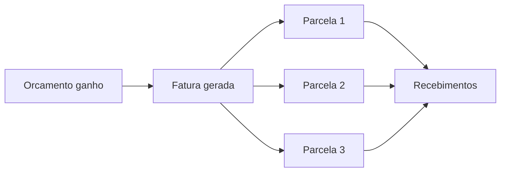
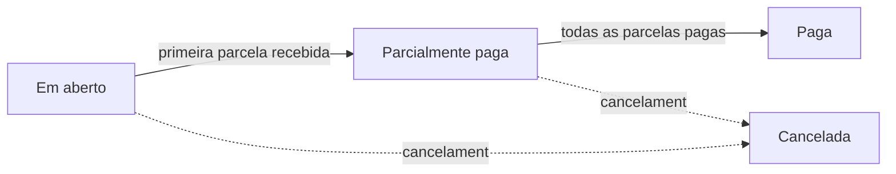

# Faturas e parcelas

Quando um orçamento é ganho, o LocFlow gera a **fatura** automaticamente — o documento que organiza tudo o que o cliente tem a pagar. Você não precisa "montar" nada na mão: a fatura nasce junto com o ganho e acompanha o orçamento.


**Por que isso te faz faturar mais:** a cobrança começa no mesmo instante em que o negócio fecha. Sem fatura esquecida, sem "depois eu lanço", sem pedido entregue e nunca cobrado. Tudo o que foi vendido vira algo a receber — na hora.


## A fatura nasce do orçamento

A fatura reflete o valor do orçamento: ela mostra o **total da cobrança**, o que já foi pago e o que ainda falta receber. Como ela é gerada a partir do orçamento ganho, o orçamento é sempre a fonte da verdade — se você editar um orçamento já ganho (mudar valor, itens, frete), a fatura se ajusta para acompanhar.

A fatura sempre aponta de volta para o **orçamento de origem** — pelo detalhe da cobrança você abre o orçamento com um toque.

## Parcelas: onde o dinheiro entra

Uma fatura é dividida em **parcelas**. Cada parcela tem o seu próprio **valor**, **vencimento** e **status**. É na parcela que o pagamento acontece — não na fatura como um todo.

A parcela pode ter um papel, que aparece como rótulo:

| Papel | O que significa |
| --- | --- |
| **Parcela única** | A fatura inteira em uma só cobrança. |
| **Sinal** | A entrada — o que o cliente paga para confirmar. |
| **Restante** | O que falta depois do sinal. |
| **Parcela** | Uma das parcelas de um parcelamento. |

Você pode **reagendar o vencimento** de uma parcela em aberto pelo ícone de lápis na linha (com a permissão certa). E o ícone de relógio mostra o **histórico** de tentativas e recebimentos daquela parcela.

## A parcela é atômica

Esta é a regra mais importante para entender a cobrança no LocFlow: **a parcela é atômica**. Não existe parcela "meio paga". Uma parcela está em aberto, em conferência, paga ou congelada — nunca "50% paga".

E o que acontece quando o cliente paga **só uma parte**? A parcela **se desdobra**:

A parte recebida vira uma parcela **paga**; o restante vira uma **nova parcela em aberto**, com um vencimento que você escolhe na hora. Assim cada parcela continua casando com exatamente um recebimento — o que mantém o seu controle limpo e o histórico fácil de ler.


**Por que atômica?** Porque "parcela meio paga" esconde problema. Desdobrando, você sempre enxerga, separadamente, o que já entrou e o que ainda falta — com data própria. Nada de saldo confuso no meio do caminho.


## Status: da parcela e da fatura

O status **não é escolhido** — ele é **derivado** do que já entrou. Você nunca "marca" uma parcela como paga na mão: registra o recebimento, e o status se atualiza sozinho.

### Status da parcela

| Status | O que significa |
| --- | --- |
| **Em aberto** | Nada recebido ainda (nem em conferência). |
| **Aguardando conferência** | Há um recebimento da rua registrado, esperando a tesouraria conferir. |
| **Paga** | Valor integralmente recebido. |
| **Congelada** | Bloqueada por uma divergência de caixa, até ser destravada. |

### Status da fatura

A fatura resume o estado das suas parcelas:

| Status | O que significa |
| --- | --- |
| **Em aberto** | Nenhuma parcela recebida. |
| **Parcialmente paga** | Pelo menos uma parcela recebida, mas ainda falta. |
| **Paga** | Todas as parcelas quitadas. |
| **Cancelada** | A cobrança foi cancelada. |

Quando há um recebimento da rua aguardando conferência, a fatura mostra isso como um aviso à parte ("em verificação") — é uma sinalização para a tesouraria, não um status separado.

## Valores a favor do cliente

Às vezes sobra um valor a favor do cliente — por exemplo, quando uma edição reduz o total **depois** de algo já ter sido pago, ou quando entra um pagamento a mais. O LocFlow resolve isso pela **política da sua locadora**, de dois jeitos:

| Forma | O que acontece | Quando faz sentido |
| --- | --- | --- |
| **Crédito / vale-locação** | O valor vira crédito para a próxima locação. | Cliente recorrente, que vai voltar a alugar. |
| **Reembolso em dinheiro** | O valor é devolvido ao cliente. | Cliente eventual, ou quando ele pede de volta. |

Você define o padrão em [Motores operacionais](../configuracoes/motores-operacionais.md) e pode ajustar caso a caso.

## Situações reais

- **Locação de evento com sinal:** o orçamento é ganho com uma parcela de **sinal** e uma de **restante**. O cliente paga o sinal por PIX (parcela "Sinal" fica Paga); o restante segue em aberto até o vencimento. A fatura mostra **Parcialmente paga**.
- **Cliente paga "o que dá" no balcão:** a parcela de R$ 1.000 recebe R$ 600 em dinheiro. Ela se desdobra: R$ 600 vira uma parcela **Paga** e R$ 400 vira uma **nova parcela em aberto**, com vencimento para a semana que vem.
- **Edição depois do ganho:** você tira um item do pedido e o total cai R$ 300, mas o cliente já tinha pago tudo. Sobra R$ 300 a favor dele — o LocFlow aplica a sua política (vira **vale** para a próxima ou volta como **reembolso**).


**Menos retrabalho, menos furo de caixa:** com status derivado dos recebimentos, ninguém precisa "lembrar" de atualizar a fatura. O que está pago, está pago; o que falta, aparece com data. A equipe inteira lê a mesma verdade.


## Próximo passo

Para registrar o que entra, veja [Recebendo pagamentos](recebendo-pagamentos.md). Para receber sem trabalho manual e em tempo real, configure o [Pagamento online](pagamento-online.md).
