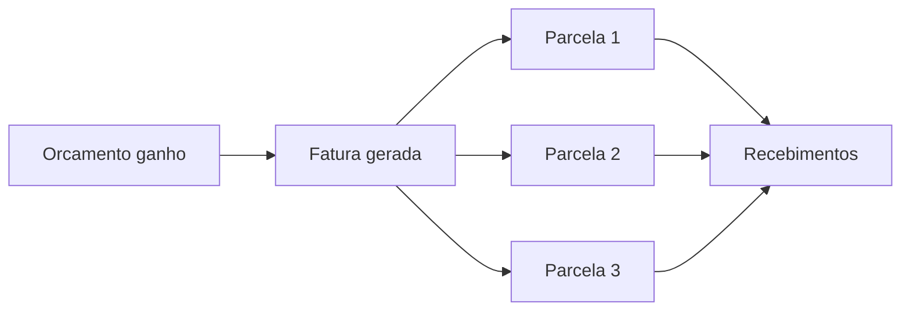
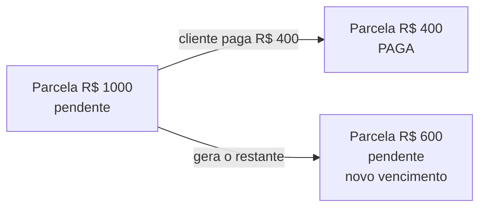
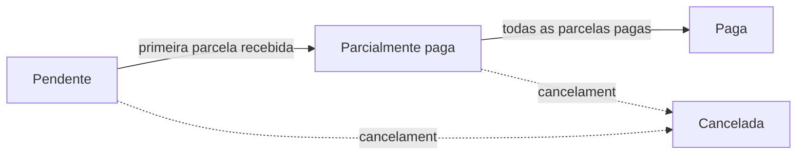

# Faturas e parcelas

Quando um orçamento é ganho — **Reservado** na locação ou **Vendido** na venda — o LocFlow gera a **fatura** automaticamente. É o documento que organiza tudo o que o cliente tem a pagar daquele pedido. Você não precisa "montar" nada na mão: a fatura nasce junto com o ganho e fica grudada no orçamento.


**Por que isso te faz receber melhor:** a cobrança começa no mesmo instante em que o negócio fecha. Sem fatura esquecida, sem "depois eu lanço", sem pedido entregue e nunca cobrado. Tudo o que foi alugado ou vendido vira algo a receber — na hora.


## A fatura nasce do orçamento

A fatura **espelha** o orçamento: mostra o **total da cobrança**, o que já entrou e o que ainda falta. Como ela nasce do orçamento ganho, **o orçamento é sempre a fonte da verdade**. Você nunca edita a fatura "por dentro" — se precisar mudar valor, itens ou frete, você edita o **orçamento**, e a fatura se ajusta sozinha para acompanhar (veja [Acompanhando e fechando](../orcamentos/acompanhando-e-fechando.md)).

No detalhe da cobrança, a fatura sempre aponta de volta para o **orçamento de origem** — você abre o orçamento com um toque.


**A fatura não tem "editar".** Ela não é editável por si só. Qualquer mudança de valor vem do orçamento; a fatura apenas reflete. Isso garante que o que você cobra é sempre igual ao que você combinou no pedido.


## Parcelas: onde o dinheiro entra

Uma fatura é dividida em **parcelas**. Cada parcela tem o seu próprio **valor**, **vencimento** e **status**. É na parcela que o pagamento acontece — não na fatura como um todo.

Como a fatura é dividida depende do **modelo de cobrança** que você usou ao gerar a cobrança:

| Modelo | Como fica | Quando faz sentido |
| --- | --- | --- |
| **À vista (parcela única)** | Uma só parcela, com a fatura inteira, vencendo na entrega. | Pedido simples, pagamento de uma vez. |
| **Sinal + restante** | Duas parcelas: o **sinal** (entrada, vence já) e o **restante** (vence na entrega/combinado). | Eventos e locações — garantir o cliente com uma entrada. |
| **Faturado (a prazo)** | Parcela que vence **depois** da entrega, no prazo combinado. | Cliente PJ com prazo de pagamento. |

No **sinal + restante**, você só informa o sinal (uma porcentagem ou um valor fixo) — o restante é **calculado sozinho**, de modo que sinal + restante sempre fecha o total. Sem conta na mão.

Cada parcela mostra um **rótulo** com o papel dela:

| Rótulo | O que significa |
| --- | --- |
| **Parcela única** | A fatura inteira em uma só cobrança. |
| **Sinal** | A entrada — o que o cliente paga para confirmar. |
| **Restante** | O que falta depois do sinal. |
| **Parcela** | Uma parcela de um faturamento a prazo (ou criada por um ajuste). |

Na linha de cada parcela em aberto você tem dois ícones:

* **lápis** — **reagenda o vencimento** da parcela (precisa da permissão certa; não aparece em parcela já paga ou congelada);
* **relógio** — abre o **histórico** de tentativas e recebimentos daquela parcela.

## A parcela é atômica

Esta é a regra mais importante da cobrança no LocFlow: **a parcela é atômica**. Não existe parcela "meio paga". Uma parcela está **pendente**, **aguardando conferência**, **paga** ou **congelada** — nunca "50% paga".

E quando o cliente paga **só uma parte**? A parcela **se desdobra**:

A parte recebida vira uma parcela **paga**; o restante vira uma **nova parcela pendente**, com um vencimento que você escolhe na hora (ou herda o da original). Assim cada parcela continua casando com exatamente **um** recebimento — o que mantém o seu controle limpo e o histórico fácil de ler.


**Por que atômica?** Porque "parcela meio paga" esconde problema. Desdobrando, você sempre enxerga, separadamente, o que já entrou e o que ainda falta — cada parte com data própria. Nada de saldo confuso no meio do caminho.



**Pagamento parcial vale para dinheiro de fora.** O desdobramento acontece quando entra um pagamento real menor que o saldo (PIX, cartão, ou uma baixa de dinheiro/maquininha). Numa **baixa manual**, o LocFlow **não deixa** você registrar mais do que o saldo em aberto da parcela — isso seria erro de digitação, não crédito. Veja [Recebendo pagamentos](recebendo-pagamentos.md).


## Status: a fatura não é "marcada", ela é calculada

O status **não é escolhido** — ele é **derivado** do que já entrou. Você nunca "marca" uma parcela como paga na mão: registra o recebimento, e o status se atualiza sozinho. Quem lê a fatura está sempre vendo a verdade dos números, não um rótulo que alguém esqueceu de mudar.

### Status da parcela

| Status | O que significa |
| --- | --- |
| **Pendente** | Nada recebido ainda (nem em conferência). |
| **Aguardando conferência** | Há um recebimento de rua registrado, esperando a tesouraria conferir. |
| **Paga** | Valor integralmente recebido. |
| **Congelada** | Travada por uma divergência de caixa, até alguém destravar. |

### Status da fatura

A fatura resume o estado das suas parcelas:

| Status | O que significa |
| --- | --- |
| **Pendente** | Nenhuma parcela recebida. |
| **Parcialmente paga** | Pelo menos uma parcela recebida (no todo ou em parte), mas ainda falta. |
| **Paga** | Todas as parcelas quitadas. |
| **Cancelada** | A cobrança foi cancelada. |


**"Em verificação" não é um status à parte.** Quando há um recebimento de rua esperando conferência, a fatura mostra isso como um **aviso** — uma sinalização para a tesouraria conferir, e não um status separado de pagamento.


## Parcela congelada e fatura travada

Duas situações deixam algo **somente leitura** — e cada uma por um motivo diferente:

* **Parcela congelada** — uma **divergência de caixa** (o valor que o motorista trouxe da rua não bate com o registrado) congela aquela parcela. Ela fica travada: não recebe pagamento nem reagendamento até alguém **destravar**. É uma trava de segurança para o dinheiro não "sumir" no acerto.
* **Fatura cancelada** — uma fatura cancelada vira **read-only por inteiro**: não aceita mais nenhum recebimento. (E o contrário também vale: uma fatura que já tem um pagamento **online confirmado** não pode ser cancelada — dinheiro online já movimentado não se desfaz por aqui.)

## Valor a favor do cliente (saldo a favor)

Às vezes sobra um valor **a favor do cliente**. O caso mais comum: uma edição **reduz** o total do pedido **depois** de o cliente já ter pago algo — aí o que ele pagou a mais vira um **saldo a favor** dele. (Também pode acontecer de um pagamento entrar acima do saldo: o excedente vira **crédito** automaticamente.)

Esse saldo a favor você resolve de dois jeitos, conforme a **política da sua locadora**:

| Forma | O que acontece | Quando faz sentido |
| --- | --- | --- |
| **Crédito / vale-locação** | O valor vira crédito reaproveitável na próxima locação, sem operação bancária. | Cliente recorrente, que vai voltar a alugar. |
| **Reembolso em dinheiro** | O valor é devolvido ao cliente. | Cliente eventual, ou quando ele pede de volta. |

Você define o **padrão** em [Motores operacionais](../configuracoes/motores-operacionais.md) (o Motor de Cobrança) e pode **ajustar caso a caso** na hora de resolver.


**O total nunca muda por baixo dos panos.** Mesmo quando há saldo a favor, o valor total da fatura continua sendo o do orçamento — o saldo a favor é tratado à parte (vira vale ou reembolso), com rastro no histórico. Você sempre sabe de onde veio.


## Por porte: cada um cobra do seu jeito

| Porte | Como costuma usar |
| --- | --- |
| **Pequeno** | "À vista, uma parcela." A fatura nasce pronta, você recebe e marca; status se cuida sozinho. Não precisa pensar em sinal nem em conferência. |
| **Médio** | Usa **sinal + restante** para garantir o cliente, reagenda vencimento quando o cliente pede mais prazo e começa a usar o **vale-locação** com quem volta sempre. |
| **Grande** | **Faturado a prazo** para PJ, **conferência de caixa** do dinheiro da rua (parcela congelada quando não bate) e política de reembolso definida no Motor de Cobrança, igual para o time inteiro. |

## Situações reais

* **Locação de evento com sinal:** o orçamento é ganho com uma parcela de **sinal** e uma de **restante**. O cliente paga o sinal por PIX (a parcela "Sinal" fica **Paga**); o restante segue **pendente** até o vencimento. A fatura mostra **Parcialmente paga**.
* **Cliente paga "o que dá" no balcão:** a parcela de R$ 1.000 recebe R$ 600. Ela se desdobra: R$ 600 vira uma parcela **Paga** e R$ 400 vira uma **nova parcela pendente**, com vencimento para a semana que vem.
* **Edição depois do ganho:** você tira um item do pedido e o total cai R$ 300, mas o cliente já tinha pago tudo. Sobra R$ 300 a favor dele — o LocFlow aplica a sua política (vira **vale** para a próxima ou volta como **reembolso**).
* **Dinheiro da rua que não bateu:** o motorista trouxe um valor diferente do registrado. A parcela fica **congelada** até a tesouraria acertar — ninguém recebe nem reagenda nela enquanto isso.


**Menos retrabalho, menos furo de caixa:** com status calculado dos recebimentos, ninguém precisa "lembrar" de atualizar a fatura. O que está pago, está pago; o que falta, aparece com data. A equipe inteira lê a mesma verdade.


## Para quem quer os números

> Detalhe opcional. Pule se você só quer cobrar e receber — nada aqui muda o seu dia a dia.

A cobrança trabalha com dois números por parcela: **V** (o valor da parcela) e o quanto dela já foi **recebido e confirmado**. O status sai dessa comparação:

* recebido confirmado **≥ V** → **Paga**;
* tem dinheiro de rua **em conferência** (ainda não confirmado) → **Aguardando conferência**;
* nada disso → **Pendente**.

E a fatura inteira:

* **todas** as parcelas pagas → **Paga**;
* **alguma** parcela com recebimento → **Parcialmente paga**;
* nenhum recebimento → **Pendente**.

A regra de ouro é que **a soma das parcelas é sempre igual ao total da fatura**. Por isso todo ajuste se "fecha": desdobrar um pagamento parcial tira de uma parcela exatamente o que põe na outra; reduzir o pedido consome das parcelas pendentes; e quando a redução invade o que **já foi pago**, o excedente (**pago − novo total**) não some — ele sai dessa conta e vira o **saldo a favor do cliente**, que você resolve depois como vale ou reembolso.

Uma parcela também pode estar **vencida**: é qualquer parcela **não paga** cujo vencimento já passou. "Vencida" é um aviso para você cobrar — não muda o valor nem o status de pagamento dela.

## Próximo passo

Para registrar o que entra (PIX, dinheiro, maquininha), veja [Recebendo pagamentos](recebendo-pagamentos.md). Para receber sem trabalho manual e em tempo real, configure o [Pagamento online](pagamento-online.md). Para definir o padrão de vale ou reembolso, vá a [Motores operacionais](../configuracoes/motores-operacionais.md).
