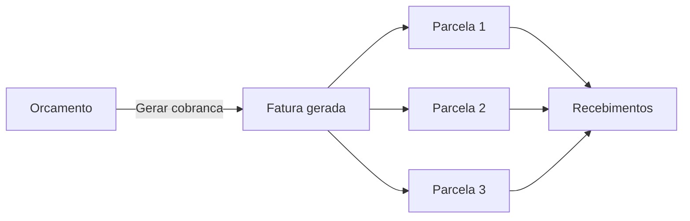
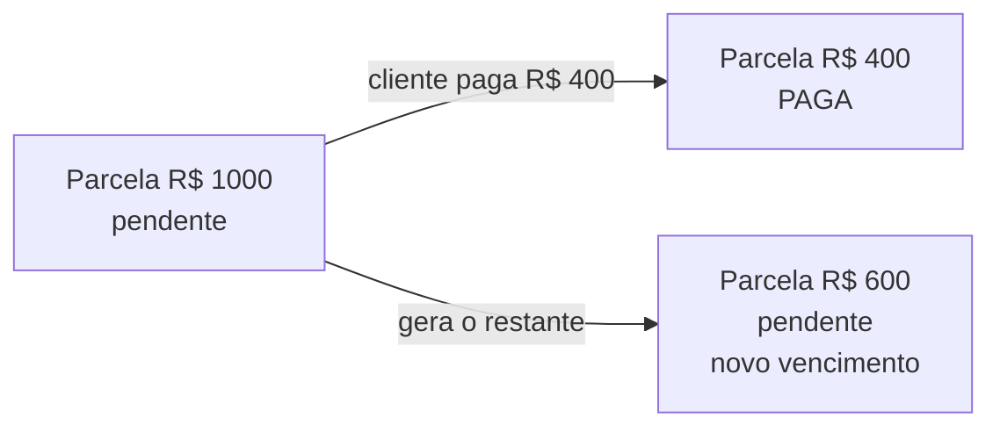
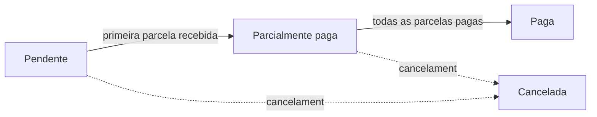

# Faturas e parcelas

Quando você toca em **Gerar cobrança**, o LocFlow cria a **fatura** do orçamento. É a **conta** que organiza tudo o que o cliente tem a pagar daquele pedido e continua ligada a ele durante todo o fluxo.

Você pode gerar a cobrança antes da reserva. O LocFlow apenas recomenda **Pré-reserva** ou **Reservado**, quando há mais certeza de faturamento. Se o Motor Operacional exigir cobrança para reservar, as duas ações são feitas juntas; caso contrário, cobrar continua opcional.


**Por que isso te faz receber melhor:** você escolhe o momento comercial da cobrança sem perder o vínculo com o pedido. Quando a sua regra exigir pagamento para reservar, o LocFlow garante que a cobrança seja criada junto.



**Duas coisas se chamam "fatura" — não confunda.** Nesta página, **fatura** é a **conta** do pedido: a estrutura viva que soma o que o cliente deve, guarda as parcelas e calcula o que já entrou. É diferente da **"Fatura de locação em PDF"**, que é um **documento** que você gera nas Ações Rápidas do orçamento (só para **locação**) para enviar ao cliente com valores, parcelas e vencimentos. O PDF é uma foto para imprimir ou mandar; a conta é o controle que se atualiza sozinho a cada recebimento.


## A fatura parte do orçamento

A fatura **espelha** o orçamento: mostra o **total da cobrança**, o que já entrou e o que ainda falta. Como ela é criada a partir dele, **o orçamento é sempre a fonte da verdade**. Você nunca edita a fatura "por dentro" — se precisar mudar valor, itens ou frete, você edita o **orçamento**, e a fatura se ajusta sozinha para acompanhar (veja [Acompanhando e fechando](../orcamentos/acompanhando-e-fechando.md)).

```mermaid
flowchart LR
    O[Orcamento] -->|Gerar cobranca| F[Fatura gerada]
    F --> P1[Parcela 1]
    F --> P2[Parcela 2]
    F --> P3[Parcela 3]
    P1 --> PG[Recebimentos]
    P2 --> PG
    P3 --> PG
```

No detalhe da cobrança, a fatura sempre aponta de volta para o **orçamento de origem** — você abre o orçamento com um toque.


**A fatura não tem "editar".** Ela não é editável por si só. Qualquer mudança de valor vem do orçamento; a fatura apenas reflete. Isso garante que o que você cobra é sempre igual ao que você combinou no pedido.


## Parcelas: onde o dinheiro entra

Uma fatura é dividida em **parcelas**. Cada parcela tem o seu próprio **valor**, **vencimento** e **status**. É na parcela que o pagamento acontece — não na fatura como um todo.

Como a fatura é dividida depende do **modelo de cobrança** que você usou ao gerar a cobrança:

| Modelo | Como fica | Quando faz sentido |
| --- | --- | --- |
| **À vista (parcela única)** | Uma só parcela, com a fatura inteira, vencendo na entrega. | Pedido simples, pagamento de uma vez. |
| **Sinal + restante** | Duas parcelas: o **sinal** (entrada, vence já) e o **restante** (vence na entrega/combinado). | Eventos e locações — garantir o cliente com uma entrada. |
| **Faturado (a prazo)** | Parcela que vence **depois** da entrega, no prazo combinado. | Cliente PJ com prazo de pagamento. |

No **sinal + restante**, você só informa o sinal (uma porcentagem ou um valor fixo) — o restante é **calculado sozinho**, de modo que sinal + restante sempre fecha o total. Sem conta na mão.

Cada parcela mostra um **rótulo** com o papel dela:

| Rótulo | O que significa |
| --- | --- |
| **Parcela única** | A fatura inteira em uma só cobrança. |
| **Sinal** | A entrada — o que o cliente paga para confirmar. |
| **Restante** | O que falta depois do sinal. |
| **Parcela** | Uma parcela de um faturamento a prazo (ou criada por um ajuste). |

Na linha de cada parcela em aberto você tem dois ícones:

* **lápis** — **reagenda o vencimento** da parcela (precisa da permissão certa; não aparece em parcela já paga ou congelada);
* **relógio** — abre o **histórico** de tentativas e recebimentos daquela parcela.

## A parcela é atômica

Esta é a regra mais importante da cobrança no LocFlow: **a parcela é atômica**. Não existe parcela "meio paga". Uma parcela está **pendente**, **aguardando conferência**, **paga** ou **congelada** — nunca "50% paga".

E quando o cliente paga **só uma parte**? A parcela **se desdobra**:

```mermaid
flowchart LR
    A[Parcela R$ 1000<br/>pendente] -->|cliente paga R$ 400| B[Parcela R$ 400<br/>PAGA]
    A -->|gera o restante| C[Parcela R$ 600<br/>pendente<br/>novo vencimento]
```

A parte recebida vira uma parcela **paga**; o restante vira uma **nova parcela pendente**, com um vencimento que você escolhe na hora (ou herda o da original). Assim cada parcela continua casando com exatamente **um** recebimento — o que mantém o seu controle limpo e o histórico fácil de ler.


**Por que atômica?** Porque "parcela meio paga" esconde problema. Desdobrando, você sempre enxerga, separadamente, o que já entrou e o que ainda falta — cada parte com data própria. Nada de saldo confuso no meio do caminho.



**Pagamento parcial vale para dinheiro de fora.** O desdobramento acontece quando entra um pagamento real menor que o saldo (PIX, cartão, ou uma baixa de dinheiro/maquininha). Numa **baixa manual**, o LocFlow **não deixa** você registrar mais do que o saldo em aberto da parcela — isso seria erro de digitação, não crédito. Veja [Recebendo pagamentos](recebendo-pagamentos.md).


## Status: a fatura não é "marcada", ela é calculada

O status **não é escolhido** — ele é **derivado** do que já entrou. Você nunca "marca" uma parcela como paga na mão: registra o recebimento, e o status se atualiza sozinho. Quem lê a fatura está sempre vendo a verdade dos números, não um rótulo que alguém esqueceu de mudar.

### Status da parcela

| Status | O que significa |
| --- | --- |
| **Pendente** | Nada recebido ainda (nem em conferência). |
| **Aguardando conferência** | Há um recebimento de rua registrado, esperando a tesouraria conferir. |
| **Paga** | Valor integralmente recebido. |
| **Congelada** | Travada por uma divergência de caixa, até alguém destravar. |

### Status da fatura

A fatura resume o estado das suas parcelas:

```mermaid
flowchart LR
    PE[Pendente] -->|primeira parcela recebida| PP[Parcialmente paga]
    PP -->|todas as parcelas pagas| PG[Paga]
    PE -.cancelamento.-> CA[Cancelada]
    PP -.cancelamento.-> CA
```

| Status | O que significa |
| --- | --- |
| **Pendente** | Nenhuma parcela recebida. |
| **Parcialmente paga** | Pelo menos uma parcela recebida (no todo ou em parte), mas ainda falta. |
| **Paga** | Todas as parcelas quitadas. |
| **Cancelada** | A cobrança foi cancelada. |


**"Em verificação" não é um status à parte.** Quando há um recebimento de rua esperando conferência, a fatura mostra isso como um **aviso** — uma sinalização para a tesouraria conferir, e não um status separado de pagamento.


## Parcela congelada e fatura travada

Duas situações deixam algo **somente leitura** — e cada uma por um motivo diferente:

* **Parcela congelada** — uma **divergência de caixa** (o valor que o motorista trouxe da rua não bate com o registrado) congela aquela parcela. Ela fica travada: não recebe pagamento nem reagendamento até alguém **destravar**. É uma trava de segurança para o dinheiro não "sumir" no acerto.
* **Fatura com cancelamento em andamento** — se já houve recebimento, ela fica protegida contra novas alterações enquanto o vale ou o estorno é resolvido. Só vira **Cancelada** depois que a devolução necessária estiver comprovada.
* **Fatura cancelada** — vira **somente leitura** por inteiro e não aceita novos recebimentos.

## Cancelar uma cobrança com segurança {#cancelar-uma-cobranca-com-seguranca}

Ao cancelar uma parcela ou a fatura inteira, o LocFlow mostra um resumo curto do que acontecerá:

* pagamentos online ainda abertos serão encerrados junto;
* vale já aplicado volta para a carteira do cliente;
* dinheiro já recebido precisa virar **vale-locação** ou ser **devolvido ao cliente**;
* para cobrar novamente depois, será necessário gerar uma nova cobrança.

Se houver dinheiro recebido, escolha um destino:

| Destino | O que acontece |
| --- | --- |
| **Vale-locação** | O valor fica na carteira do cliente e pode abater uma próxima cobrança. Vale funciona como dinheiro e permanece no histórico. |
| **Solicitar ao provedor** | O LocFlow pede o estorno e acompanha a cobrança. O cancelamento só termina quando o provedor comprovar a devolução. |
| **Registrar devolução externa** | Use somente depois de devolver por Pix, transferência, dinheiro, maquininha ou outro canal. Informe a conta e guarde o comprovante. |


**Boleto pode não baixar na hora.** O LocFlow solicita o cancelamento ao provedor, mas alguns boletos continuam aparecendo — e podem continuar pagáveis — até o banco confirmar a baixa ou o título vencer. A tela mostra **Aguardando baixa** e continua verificando. Se o cliente pagar nesse intervalo, o recebimento entra no fluxo financeiro em vez de desaparecer.



**Aceite não é prova de devolução.** Uma resposta positiva ao pedido de estorno não basta. Enquanto o provedor não confirmar o valor devolvido, a cobrança mostra **Estorno solicitado** e novas alterações financeiras ficam bloqueadas. No histórico da parcela, você acompanha quanto já foi comprovado e se a operação exige atenção.


Cancelar um pedido — por exemplo, movê-lo para **Cancelado** ou **Perdido** — segue a mesma regra. Se houver cobrança, o LocFlow pede sua confirmação e inicia o encerramento financeiro antes de considerar o ciclo concluído.

## Valor a favor do cliente (saldo a favor)

Às vezes sobra um valor **a favor do cliente**. O caso mais comum: uma edição **reduz** o total do pedido **depois** de o cliente já ter pago algo — aí o que ele pagou a mais vira um **saldo a favor** dele. (Também pode acontecer de um pagamento entrar acima do saldo: o excedente vira **crédito** automaticamente.)

Assim que esse saldo aparece, o LocFlow **já resolve sozinho** — na hora, aplicando a **política padrão da sua locadora** (definida no Motor de Cobrança). Você não precisa abrir a fatura nem clicar em nada: o saldo não fica "pendurado" esperando alguém decidir.

São dois destinos possíveis:

| Forma | O que acontece | Quando faz sentido |
| --- | --- | --- |
| **Crédito / vale-locação** | O valor vira crédito reaproveitável na próxima locação, sem nenhuma operação bancária. É o **padrão**. | Cliente recorrente, que vai voltar a alugar. |
| **Reembolso em dinheiro** | Pode ser solicitado ao provedor e acompanhado pelo LocFlow, ou registrado depois de uma devolução externa comprovada. | Cliente eventual, ou quando ele pede o dinheiro de volta. |

Você define esse **padrão** em [Motores operacionais](../configuracoes/motores-operacionais.md) (o Motor de Cobrança). O padrão de fábrica é **crédito / vale-locação**, porque não mexe em dinheiro e o cliente reaproveita na próxima locação. Se um caso pedir tratamento diferente, você pode **sobrepor a política naquela operação** — mas isso é opcional; o normal é o LocFlow resolver pela política e seguir.


**Nunca confunda solicitação com devolução concluída.** No provedor, o LocFlow acompanha até receber a confirmação do valor estornado. Por fora, você só registra depois que o dinheiro realmente saiu e anexa a prova.



**Você fica sabendo na hora.** Toda vez que um saldo a favor é resolvido — virou crédito ou virou ordem de reembolso — o LocFlow dispara uma **notificação** para o time, com um atalho para **abrir a fatura** direto. Ninguém precisa ficar vigiando a fatura para descobrir que sobrou valor para o cliente.



**O total nunca muda por baixo dos panos.** Mesmo quando há saldo a favor, o valor total da fatura continua sendo o do orçamento — o saldo a favor é tratado à parte (vira vale ou reembolso), com rastro no histórico. Você sempre sabe de onde veio.


## Por porte: cada um cobra do seu jeito

| Porte | Como costuma usar |
| --- | --- |
| **Pequeno** | "À vista, uma parcela." Ao gerar a cobrança, a fatura fica pronta; você registra o recebimento e o status se cuida sozinho. |
| **Médio** | Usa **sinal + restante** para garantir o cliente, reagenda vencimento quando o cliente pede mais prazo e começa a usar o **vale-locação** com quem volta sempre. |
| **Grande** | **Faturado a prazo** para PJ, **conferência de caixa** do dinheiro da rua (parcela congelada quando não bate) e política de reembolso definida no Motor de Cobrança, igual para o time inteiro. |

## Situações reais

* **Locação de evento com sinal:** você gera uma cobrança com uma parcela de **sinal** e uma de **restante**. O cliente paga o sinal por PIX (a parcela "Sinal" fica **Paga**); o restante segue **pendente** até o vencimento. A fatura mostra **Parcialmente paga**.
* **Cliente paga "o que dá" no balcão:** a parcela de R$ 1.000 recebe R$ 600. Ela se desdobra: R$ 600 vira uma parcela **Paga** e R$ 400 vira uma **nova parcela pendente**, com vencimento para a semana que vem.
* **Edição depois do ganho:** você tira um item do pedido e o total cai R$ 300, mas o cliente já tinha pago tudo. Sobra R$ 300 a favor dele — o LocFlow **resolve na hora** pela sua política: vira **vale** para a próxima locação (padrão) ou registra uma **ordem de reembolso** para você devolver por fora. Nos dois casos o time recebe a notificação com atalho para a fatura.
* **Dinheiro da rua que não bateu:** o motorista trouxe um valor diferente do registrado. A parcela fica **congelada** até a tesouraria acertar — ninguém recebe nem reagenda nela enquanto isso.


**Menos retrabalho, menos furo de caixa:** com status calculado dos recebimentos, ninguém precisa "lembrar" de atualizar a fatura. O que está pago, está pago; o que falta, aparece com data. A equipe inteira lê a mesma verdade.


## Para quem quer os números

> Detalhe opcional. Pule se você só quer cobrar e receber — nada aqui muda o seu dia a dia.

A cobrança trabalha com dois números por parcela: **V** (o valor da parcela) e o quanto dela já foi **recebido e confirmado**. O status sai dessa comparação:

* recebido confirmado **≥ V** → **Paga**;
* tem dinheiro de rua **em conferência** (ainda não confirmado) → **Aguardando conferência**;
* nada disso → **Pendente**.

E a fatura inteira:

* **todas** as parcelas pagas → **Paga**;
* **alguma** parcela com recebimento → **Parcialmente paga**;
* nenhum recebimento → **Pendente**.

A regra de ouro é que **a soma das parcelas é sempre igual ao total da fatura**. Por isso todo ajuste se "fecha": desdobrar um pagamento parcial tira de uma parcela exatamente o que põe na outra; reduzir o pedido consome das parcelas pendentes; e quando a redução invade o que **já foi pago**, o excedente (**pago − novo total**) não some — ele sai dessa conta e vira o **saldo a favor do cliente**, que o LocFlow resolve na hora pela política da org (vale ou ordem de reembolso).

Uma parcela também pode estar **vencida**: é qualquer parcela **não paga** cujo vencimento já passou. "Vencida" é um aviso para você cobrar — não muda o valor nem o status de pagamento dela.

## Próximo passo

Para registrar o que entra (PIX, dinheiro, maquininha), veja [Recebendo pagamentos](recebendo-pagamentos.md). Para receber sem trabalho manual e em tempo real, configure o [Pagamento online](pagamento-online.md). Para definir o padrão de vale ou reembolso, vá a [Motores operacionais](../configuracoes/motores-operacionais.md).
