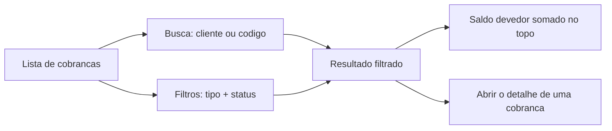

# Cobranças: a lista e o que mostra

A tela de **Cobranças** é a porta do módulo financeiro. Ela reúne todas as **faturas** do seu negócio em um só lugar: as que ainda têm valor a receber, as já quitadas e as canceladas. É aqui que você responde, num relance, à pergunta que mais importa: *quem ainda me deve, e quanto?*


**Por que esta tela te faz receber melhor:** em vez de caçar pedido por pedido para saber o que está em aberto, você vê o **saldo a receber** somado no topo e abre qualquer cobrança com um toque. Cobrança que aparece é cobrança que não fica esquecida.


## De onde vêm as cobranças

Você não cria uma cobrança nesta tela. A **fatura nasce sozinha quando o orçamento é ganho** — ao reservar uma locação ou confirmar uma venda. Por isso, se você ainda não ganhou nenhum orçamento, a lista mostra um aviso convidando você a ir para Orçamentos:

> **Nenhuma cobrança ainda.** As cobranças nascem de orçamentos ganhos. Ganhe um orçamento para gerar a primeira cobrança aqui.

Para entender como a fatura é montada (parcelas, vencimentos, sinal), veja [Faturas e parcelas](faturas-e-parcelas.md).

## O que cada cobrança mostra

Cada cobrança aparece como um cartão (no celular) ou como uma linha de tabela (em telas grandes). As informações são as mesmas:

| Informação | O que é |
| --- | --- |
| **Cliente** | O contato que vai pagar. |
| **Código do orçamento** | O pedido de origem da cobrança. |
| **Tipo** | Se é uma cobrança de **locação** (aluguel) ou de **venda**. |
| **Total** | O valor cheio da cobrança. |
| **Parcelas** | Em quantas parcelas o pagamento foi dividido. |
| **Saldo devedor** | Quanto ainda falta receber (só aparece quando há saldo em aberto). |
| **Status** | A situação real do pagamento — veja abaixo. |


O **saldo devedor** do cartão só aparece quando ainda há algo a receber. Se a cobrança já foi totalmente paga, ele some — o que você vê é o status **Paga**.


### Locação ou venda: o tipo da cobrança

O LocFlow atende os dois lados do seu negócio, e a cobrança carrega essa marca:

* **Locação (aluguel)** — a cobrança de um pedido reservado. Costuma ter **sinal** (a entrada para confirmar) mais o restante, ou parcelas com vencimentos ao longo do período.
* **Venda** — a cobrança de um item vendido. Em geral é mais direta: à vista ou parcelada.

O tipo aparece como um selo no cartão e serve também de filtro (mais abaixo).

## O status real da cobrança

Cada cobrança traz um selo colorido com a **situação real do pagamento** — somando tudo o que já entrou nas parcelas, por qualquer canal (online ou baixa manual):

| Status | O que significa |
| --- | --- |
| **Pendente** | Nada foi recebido ainda. |
| **Parcialmente paga** | Parte do valor já entrou; ainda falta receber. |
| **Paga** | Tudo recebido — a cobrança está quitada. |
| **Cancelada** | A cobrança foi cancelada (por exemplo, quando o pedido foi cancelado). |


O status é **derivado dos pagamentos**, não definido na mão. À medida que você recebe — pela [baixa manual](recebendo-pagamentos.md) ou pelo [pagamento online](pagamento-online.md) — o selo se atualiza sozinho, de Pendente para Parcialmente paga, até Paga.


## O saldo do que está em aberto

No topo da lista há um cartão de destaque:

> **Saldo devedor (resultado filtrado)**

Esse número é a **soma do que falta receber** considerando exatamente o que está na tela naquele momento. Ele acompanha a sua busca e os seus filtros: se você filtrar só as cobranças **pendentes** de **locação**, o saldo passa a somar apenas essas. É o seu "quanto tenho a receber" sob medida.


Quer saber quanto ainda tem a receber de um cliente, de um tipo de pedido ou de um período? Filtre a lista e leia o saldo no topo. Ele responde na hora, sem você somar nada.


## Encontrar uma cobrança

### Busca

O campo de busca é inteligente: procure pelo **nome do cliente** ou pelo **código do orçamento**. Conforme você digita, a lista (e o saldo no topo) se ajusta ao resultado.

### Filtros

Toque em **Filtros** para refinar por dois eixos, que combinam entre si:

* **Tipo** — Aluguel e/ou Venda.
* **Status** — Pendente, Parcialmente paga, Paga, Cancelada.

Por padrão, **tudo vem selecionado** (você vê todas as cobranças). Ao desmarcar opções, você restringe a lista — e o saldo do topo passa a refletir só o que sobrou. O botão **Limpar** devolve a lista ao padrão (todas).

## Abrir o detalhe

Toque em qualquer cobrança para abrir o **detalhe**: ali você vê as parcelas, os vencimentos, o que já foi pago, e tem as ações de receber e de gerar link de pagamento. Em telas grandes, o detalhe abre ao lado da lista; no celular, sobe como um painel. O detalhe sempre aponta de volta para o **orçamento de origem**.

Para o que fazer dentro do detalhe, veja [Recebendo pagamentos](recebendo-pagamentos.md) e [Pagamento online](pagamento-online.md).

## Por porte

A mesma tela serve a quem está começando e a quem fatura alto — ela cresce com você:

| Porte | Como a lista te ajuda |
| --- | --- |
| **Pequeno** (autônomo, MEI) | Uma lista simples do que entrou e do que falta. O saldo no topo já é o seu controle de recebimentos — sem planilha paralela. |
| **Médio** | Filtra por status para focar nas **pendentes** e por tipo para separar locação de venda; usa a busca para achar o cliente e cobrar na hora. |
| **Grande** | Em tela larga, vê tudo em tabela densa com colunas, cruza tipo + status para fechar o caixa por recorte e lê o saldo somado de cada visão. |

## Situações reais

* **"Quem ainda me deve?"** — Filtre por status **Pendente** e **Parcialmente paga**. A lista mostra só quem tem saldo, e o topo soma o total a receber.
* **Cobrar um cliente específico** — Busque pelo nome. Abra a cobrança e gere o [link de pagamento](pagamento-online.md) ou registre o que ele já pagou por fora.
* **Fechar o caixa da locação** — Filtre por tipo **Aluguel** e status **Paga** para ver o que já entrou no período; troque para **Pendente** para ver o que ainda falta.
* **Achei pelo número do pedido** — Digite o código do orçamento na busca: a cobrança daquele pedido aparece direto.

## Próximo passo

* Para entender como a fatura é montada (parcelas, sinal, vencimentos): [Faturas e parcelas](faturas-e-parcelas.md).
* Para registrar o que recebeu por fora (dinheiro, PIX, maquininha): [Recebendo pagamentos](recebendo-pagamentos.md).
* Para cobrar com link (PIX, cartão, boleto) e baixa automática: [Pagamento online](pagamento-online.md).
* Para ver de onde a cobrança nasce: [Acompanhando e fechando o orçamento](../orcamentos/acompanhando-e-fechando.md).
