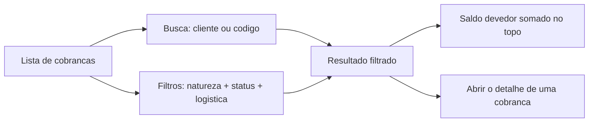

# Cobranças: a lista e o que mostra

A tela de **Cobranças** é a porta do módulo financeiro. Ela reúne todas as **faturas** do seu negócio em um só lugar: as que ainda têm valor a receber, as já quitadas e as canceladas. É aqui que você responde, num relance, à pergunta que mais importa: *quem ainda me deve, e quanto?*


**Por que esta tela te faz receber melhor:** em vez de caçar pedido por pedido para saber o que está em aberto, você vê o **saldo a receber** somado no topo e abre qualquer cobrança com um toque. Cobrança que aparece é cobrança que não fica esquecida.


## De onde vêm as cobranças

Você não cria uma cobrança nesta tela. A **fatura nasce quando você gera a cobrança** pelo orçamento. Se o Motor Operacional exigir cobrança para reservar, a geração abre junto com a reserva; nos demais casos, você escolhe quando gerar. Se ainda não houver nenhuma cobrança, a lista mostra um aviso convidando você a ir para Orçamentos:

> **Nenhuma cobrança ainda.** Abra um orçamento e toque em **Gerar cobrança** para criar a primeira.

Para entender como a fatura é montada (parcelas, vencimentos, sinal), veja [Faturas e parcelas](faturas-e-parcelas.md).

## O que cada cobrança mostra

Cada cobrança aparece como um cartão (no celular) ou como uma linha de tabela (em telas grandes). As informações são as mesmas:

| Informação | O que é |
| --- | --- |
| **Cliente** | O contato que vai pagar. |
| **Código do orçamento** | O pedido de origem da cobrança. |
| **Tipo** | Se é uma cobrança de **locação** (aluguel) ou de **venda**. |
| **Total** | O valor cheio da cobrança. |
| **Parcelas** | Em quantas parcelas o pagamento foi dividido. |
| **Vencimento** | A data da **próxima parcela que ainda pode receber** — veja abaixo. |
| **Pagamento combinado** | Como o cliente disse que vai pagar, quando alguém anotou — veja abaixo. |
| **Saldo devedor** | Quanto ainda falta receber (só aparece quando há saldo em aberto). |
| **Status** | A situação real do pagamento — veja abaixo. |


O **saldo devedor** do cartão só aparece quando ainda há algo a receber. Se a cobrança já foi totalmente paga, ele some — o que você vê é o status **Paga**.


### O vencimento: a próxima parcela que ainda pode receber {#vencimento}

A lista mostra **uma data por cobrança**: a **menor** entre as parcelas que **não estão pagas nem canceladas**. É a resposta à pergunta que decide o dia — *cobro hoje?* — sem você abrir a fatura para procurar.

Repare que não é "o vencimento da fatura": **quem vence é a parcela**. Numa cobrança parcelada, a data que aparece é a da parcela da vez; quando ela é paga, a lista já mostra a seguinte.


**Cobrança quitada ou cancelada aparece sem data.** Não há mais nada a receber, e uma data qualquer ali mandaria cobrar quem não deve nada. Na tabela fica um travessão; no cartão, a data apenas não aparece.


### A forma combinada na lista {#forma-combinada}

Quando alguém anotou **como o cliente disse que vai pagar** (veja [Emitindo a cobrança](emitindo-a-cobranca.md#pagamento-combinado)), o recado viaja com a cobrança:

* **No cartão** (celular), numa linha só, junto do vencimento — por exemplo: *"Pagamento combinado: Pix · metade na entrega · vence 15/09/2026"*. Sem combinado, a linha vira só *"Vence 15/09/2026"*; sem os dois, ela nem existe.
* **Na tabela** (telas grandes), na coluna **Forma combinada**. Ela **nasce desligada**: é um recado opcional que a maioria das cobranças não tem, e uma coluna quase toda em travessões roubaria largura das que decidem o dia. Quem trabalha com combinado liga a coluna no botão **Colunas** — ali ela aparece como *Forma combinada (indicativa)* — e a escolha fica gravada para você.


**É indicativo, e a tela repete isso de propósito.** O rótulo diz "combinado" em todos os lugares justamente para ninguém ler a linha como uma regra do sistema e deixar de receber de outro jeito quando o cliente muda de ideia na porta.


### Locação ou venda: o tipo da cobrança

O LocFlow atende os dois lados do seu negócio, e a cobrança carrega essa marca:

* **Locação (aluguel)** — a cobrança de um pedido reservado. Costuma ter **sinal** (a entrada para confirmar) mais o restante, ou parcelas com vencimentos ao longo do período.
* **Venda** — a cobrança de um item vendido. Em geral é mais direta: à vista ou parcelada.

O tipo aparece como um selo no cartão e serve também de filtro (mais abaixo).

## O status real da cobrança

Cada cobrança traz um selo colorido com a **situação real do pagamento** — somando tudo o que já entrou nas parcelas, por qualquer canal (online ou baixa manual):

| Status | O que significa |
| --- | --- |
| **Pendente** | Nada foi recebido ainda. |
| **Parcialmente paga** | Parte do valor já entrou; ainda falta receber. |
| **Paga** | Tudo recebido — a cobrança está quitada. |
| **Cancelada** | A cobrança foi cancelada (por exemplo, quando o pedido foi cancelado). |


O status é **derivado dos pagamentos**, não definido na mão. À medida que você recebe — pela [baixa manual](recebendo-pagamentos.md) ou pelo [pagamento online](pagamento-online.md) — o selo se atualiza sozinho, de Pendente para Parcialmente paga, até Paga.


## O saldo do que está em aberto

No topo da lista há um cartão de destaque:

> **Saldo devedor (resultado filtrado)**

Esse número é a **soma do que falta receber** considerando exatamente o que está na tela naquele momento. Ele acompanha a sua busca e os seus filtros: se você filtrar só as cobranças **pendentes** de **locação**, o saldo passa a somar apenas essas. É o seu "quanto tenho a receber" sob medida.


Quer saber quanto ainda tem a receber de um cliente, de um tipo de pedido ou de um período? Filtre a lista e leia o saldo no topo. Ele responde na hora, sem você somar nada.


## Encontrar uma cobrança

### Busca

O campo de busca é inteligente: procure pelo **nome do cliente** ou pelo **código do orçamento**. Conforme você digita, a lista (e o saldo no topo) se ajusta ao resultado.

### Filtros

Toque em **Filtros** para abrir a folha de filtros. Ela tem **três grupos**, que combinam entre si:

* **Tipo de negócio** — Aluguel, Venda.
* **Status** — Pendente, Parcialmente paga, Paga, Cancelada.
* **Logística** — a etapa em que está o **pedido de origem** da cobrança, na ordem do fluxo: Não iniciada, A separar, Separado, Saiu para entrega, Entregue, Retirado na loja, Saiu para retirada, Retirado, Devolvido na loja, A conferir, Conferido. É o grupo que responde à pergunta que trava a decisão de cobrar — *o material já rodou?* — e que nem o tipo nem o status respondem.

A regra é uma só, e a própria folha a diz: **"Sem nada marcado, a lista mostra todas as cobranças."** A lista abre **inteira**, e **marcar é recortar**: um toque em **Entregue** mostra só as cobranças de pedidos entregues — e só elas. Dentro de um grupo, marcar mais de uma opção amplia o recorte (*Pendente* **ou** *Parcialmente paga*); entre grupos, os recortes se somam (*Aluguel* **e** *Paga*).


**Um filtro é um toque.** Antes, o painel abria com tudo marcado, e "só as entregues" custava desmarcar todo o resto. Agora nada vem marcado — o que você toca é exatamente o que você vê.


Cada opção marcada vira um **chip com "x"**, logo abaixo do botão **Filtros** (e no topo da folha, em **Filtros aplicados**). Para tirar uma opção sem mexer nas outras — deixar só *Pendente* depois de ter marcado *Pendente* e *Paga* — basta tocar no "x" do chip dela. O número no botão **Filtros** conta **quantos grupos** estão recortando a lista, não quantas opções: *Pendente* e *Paga* marcados são **uma** pergunta só (o status), e o botão mostra **1**.

**Limpar** — ao lado do botão Filtros e no rodapé da folha — devolve a lista inteira de uma vez. **Concluído** só fecha a folha: os filtros valem ao vivo, e o saldo do topo acompanha cada toque.

```mermaid
flowchart LR
    L[Lista de cobrancas] --> B[Busca: cliente ou codigo]
    L --> F[Filtros: natureza + status + logistica]
    B --> R[Resultado filtrado]
    F --> R
    R --> S[Saldo devedor somado no topo]
    R --> D[Abrir o detalhe de uma cobranca]
```

## Abrir o detalhe

Toque em qualquer cobrança para abrir o **detalhe**: ali você vê as parcelas, os vencimentos, o que já foi pago, e tem as ações de receber e de gerar link de pagamento. Em telas grandes, o detalhe abre ao lado da lista; no celular, sobe como um painel. O detalhe sempre aponta de volta para o **orçamento de origem**.

Para o que fazer dentro do detalhe, veja [Recebendo pagamentos](recebendo-pagamentos.md) e [Pagamento online](pagamento-online.md).

## Por porte

A mesma tela serve a quem está começando e a quem fatura alto — ela cresce com você:

| Porte | Como a lista te ajuda |
| --- | --- |
| **Pequeno** (autônomo, MEI) | Uma lista simples do que entrou e do que falta. O saldo no topo já é o seu controle de recebimentos — sem planilha paralela. |
| **Médio** | Marca **Pendente** para focar no que falta e **Aluguel** ou **Venda** para separar os dois lados; usa a busca para achar o cliente e cobrar na hora. |
| **Grande** | Em tela larga, vê tudo em tabela densa com colunas, cruza natureza + status + etapa logística para fechar o caixa por recorte e lê o saldo somado de cada visão. |

## Situações reais

* **"Quem ainda me deve?"** — Marque **Pendente** e **Parcialmente paga** em Status. A lista mostra só quem tem saldo, e o topo soma o total a receber.
* **Cobrar um cliente específico** — Busque pelo nome. Abra a cobrança e gere o [link de pagamento](pagamento-online.md) ou registre o que ele já pagou por fora.
* **Fechar o caixa da locação** — Marque **Aluguel** e **Paga** para ver o que já entrou no período; para ver o que ainda falta, tire o chip *Paga* e marque *Pendente*.
* **"O material já foi entregue e ainda não cobrei"** — Marque **Entregue** em Logística e **Pendente** em Status: sobram os pedidos que já rodaram e ainda não pagaram nada.
* **Achei pelo número do pedido** — Digite o código do orçamento na busca: a cobrança daquele pedido aparece direto.
* **"O que vence esta semana?"** — A data na linha de cada cobrança já é a da **próxima parcela cobrável**. Marque **Pendente** e **Parcialmente paga** e leia as datas: as quitadas e as canceladas nem trazem data.
* **"Ele ia pagar no Pix ou na maquininha?"** — Se o vendedor anotou, está na própria linha da lista (*Pagamento combinado: …*). Em tela grande, ligue a coluna **Forma combinada** no botão **Colunas** para ver todas de uma vez.

## Próximo passo

* Para entender como a fatura é montada (parcelas, sinal, vencimentos): [Faturas e parcelas](faturas-e-parcelas.md).
* Para registrar o que recebeu por fora (dinheiro, PIX, maquininha): [Recebendo pagamentos](recebendo-pagamentos.md).
* Para cobrar com link (PIX, cartão, boleto) e baixa automática: [Pagamento online](pagamento-online.md).
* Para ver de onde a cobrança nasce: [Acompanhando e fechando o orçamento](../orcamentos/acompanhando-e-fechando.md).
