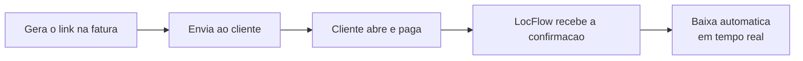
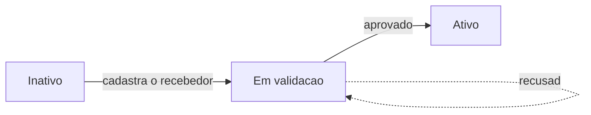

# Pagamento online

Com o pagamento online, o cliente paga **direto pelo link**, sem você precisar registrar nada. Quando ele paga, a fatura se atualiza sozinha — **em tempo real**. É a forma mais rápida e segura de receber, e a que mais reduz inadimplência.


**Por que isso te faz faturar mais:** quanto mais fácil pagar, mais gente paga — e mais cedo. Um link de PIX que o cliente abre e quita em segundos cobra melhor do que uma promessa de "te mando depois". Recebimento mais rápido, menos cobrança atrasada, menos calote.


## Como funciona

1. Na fatura, gere o **link de pagamento**.
2. Envie ao cliente — copie e mande por WhatsApp, e-mail, ou compartilhe pelo próprio celular.
3. O cliente abre a página de pagamento e paga a parcela.
4. O LocFlow recebe a confirmação e dá a **baixa automática**, atualizando a fatura na hora.

Operador e cliente acompanham o mesmo link ao vivo: quando o cliente gera ou paga uma cobrança, a sua tela atualiza sozinha — sem precisar recarregar nada.

## O link de pagamento

O link é **público e por fatura**: o cliente paga parcela a parcela por uma página segura. Você controla **quais métodos** o link aceita.

| Método | Padrão | Observação |
| --- | --- | --- |
| **PIX** | Ligado | Vem habilitado por padrão — o jeito mais rápido de receber. |
| **Boleto** | Desligado | Você liga quando quiser. Exige endereço do cliente. |
| **Cartão** | Desligado | Você liga quando quiser. |

Por padrão o link já vem com **PIX**. Para aceitar boleto ou cartão, é só ligar o método no link — um toque. Mantenha sempre ao menos um método habilitado.


**Dados do cliente:** alguns métodos pedem mais informação. **CPF/CNPJ e e-mail** são exigidos por todos — sem eles, o link nem é gerado. O **boleto** ainda precisa do endereço. O LocFlow mostra um checklist do que falta e deixa você completar ali mesmo, no mesmo gesto.


### Endereço personalizado

O link pode usar um endereço amigável com o nome da sua empresa, deixando a página de pagamento com a **sua identidade** — mais confiança para o cliente pagar. Domínio totalmente personalizado é um recurso dos planos superiores; veja [Domínio personalizado](../configuracoes/dominio-personalizado.md).

## Ativando o recebimento

Para receber online, a sua organização precisa de uma **integração de pagamento ativa** — o recebedor que recebe o dinheiro por você. A ativação é um cadastro guiado e passa por uma **validação** (KYC) antes de liberar.

| Estado | O que significa | O que fazer |
| --- | --- | --- |
| **Inativo** | Recebedor ainda não cadastrado. | Cadastre o recebedor da sua organização (cadastro guiado em 4 passos). |
| **Em validação** | Cadastro enviado, aguardando aprovação (KYC). | Conclua a verificação pelo link de KYC e aguarde a aprovação. |
| **Ativo** | Tudo aprovado. | Pronto: já dá para gerar PIX, boleto e cartão nas cobranças. |

Enquanto a integração não está ativa, a seção de cobrança online da fatura explica o motivo e oferece o atalho para ativar. Você configura tudo isso em **Configurações → Pagamento**.


**Quem ativa:** o cadastro do recebedor é feito por quem administra a conta. Se você não tem esse acesso, o sistema orienta a pedir ao responsável — ninguém fica travado sem entender o porquê.


## Recebíveis e transferências

Quando um cliente paga, o dinheiro **não cai direto** na sua conta bancária: ele fica retido no recebedor por um período (prazo de liquidação) e depois é transferido. Em **Configurações → Pagamento → Recebíveis** você acompanha o saldo e define como o dinheiro chega até você.

- **Saldo disponível** — já pode ser transferido para a sua conta.
- **Saldo em liquidação** — ainda em processamento, aguardando o prazo do recebimento.
- **Transferência automática** (recomendada) — o saldo vai para a sua conta sozinho, na frequência que você definir (diária, semanal ou mensal).
- **Transferência manual** — com a automática desligada, o saldo acumula e você solicita o saque do valor que quiser, quando quiser.

## Pagamento confirmado é definitivo

Pagamento online **confirmado é definitivo**. Diferente da baixa manual (que você lança e pode corrigir), o pagamento online é uma transação real, processada pelo recebedor — não dá para "desfazer" um pagamento confirmado.

Se sobrar valor a favor do cliente (por exemplo, uma edição que reduz o total depois de já ter sido pago), o LocFlow resolve pela política de cobrança da sua locadora — **crédito/vale** ou **reembolso**. Veja [Faturas e parcelas](faturas-e-parcelas.md).


**Antes de gerar de novo, atenção:** trocar o método ou gerar uma cobrança nova **cancela a anterior** — o código de PIX ou o boleto antigo deixa de valer para o cliente. O sistema sempre confirma antes. Gere de novo só quando realmente precisar; senão, o cliente pode pagar um código que já não vale.


## Situações reais

- **PIX no fechamento:** orçamento ganho, você gera o link e manda o PIX por WhatsApp. O cliente paga em dois minutos; a parcela fica **Paga** na hora e a logística pode seguir. Sem cobrança manual, sem espera.
- **Boleto para empresa:** o cliente é PJ e prefere boleto. Você completa o endereço no checklist, liga o **boleto** no link e envia. Quando ele paga, a baixa cai sozinha.
- **Cobrança por telefone:** o cliente liga querendo pagar. Direto da parcela, o operador gera o PIX e passa o código; assim que o cliente paga, a tela do operador atualiza ao vivo.


**Receba mais rápido, com menos inadimplência:** PIX e link prontos no instante do fechamento, baixa automática e confirmação em tempo real. O cliente paga onde está, e você acompanha o dinheiro entrar sem mover um dedo.


## Próximo passo

Para registrar o que entra por fora do sistema, veja [Recebendo pagamentos](recebendo-pagamentos.md). Para entender parcelas, status e valores a favor do cliente, volte a [Faturas e parcelas](faturas-e-parcelas.md).
