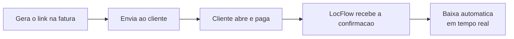
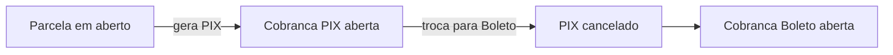
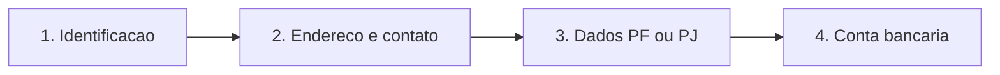
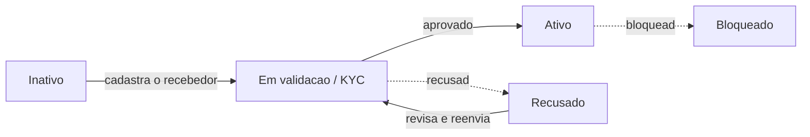

# Pagamento online

Com o pagamento online, o cliente paga **direto por um link**, sem você precisar registrar nada. Quando ele paga, a fatura se atualiza sozinha — **em tempo real**. É a forma mais rápida e segura de receber, e a que mais reduz inadimplência. Serve igual para **locação** e para **venda** de bens móveis.


**Por que isso te faz receber mais:** quanto mais fácil pagar, mais gente paga — e mais cedo. Um PIX que o cliente abre e quita em segundos cobra melhor do que uma promessa de "te mando depois". Recebimento mais rápido, menos cobrança atrasada, menos calote.


## Como funciona

1. Na fatura, gere o **link de pagamento**.
2. Envie ao cliente — copie e mande por WhatsApp, e-mail, ou compartilhe pelo próprio celular.
3. O cliente abre a página de pagamento e paga a parcela.
4. O LocFlow recebe a confirmação e dá a **baixa automática**, atualizando a fatura na hora.

Operador e cliente acompanham o mesmo link ao vivo: quando o cliente gera ou paga uma cobrança, a sua tela atualiza sozinha — sem precisar recarregar nada.

## O link de pagamento

O link é **público e por fatura**: o cliente paga **parcela a parcela** por uma página segura. Você controla **quais métodos** o link aceita.

| Método | Padrão | Observação |
| --- | --- | --- |
| **PIX** | Ligado | Vem habilitado por padrão — o jeito mais rápido de receber. |
| **Boleto** | Desligado | Você liga quando quiser. Exige o endereço do cliente. |
| **Cartão** | Desligado | Você liga quando quiser. |

Por padrão o link já vem só com **PIX**. Para aceitar boleto ou cartão, basta ligar o método no link — um toque. **Mantenha sempre ao menos um método habilitado.**


**Dados do cliente:** alguns métodos pedem mais informação. **CPF/CNPJ e e-mail** são exigidos por todos — sem eles, o link nem é gerado. O **boleto** ainda precisa do **endereço**. O LocFlow mostra um checklist do que falta e deixa você completar ali mesmo, no mesmo gesto.


### Endereço personalizado do link

O link pode usar um endereço amigável com o nome da sua empresa, deixando a página de pagamento com a **sua identidade** — mais confiança para o cliente pagar. Domínio totalmente personalizado é um recurso dos planos superiores; veja [Domínio personalizado](../configuracoes/dominio-personalizado.md).

## Pré-requisitos por método

Cada método pede um conjunto mínimo de dados do cliente. Alguns **bloqueiam** (sem eles a cobrança não é gerada); outros são apenas **recomendados** (ajudam, mas não travam).

| Método | Bloqueia sem | Recomendado | Por quê |
| --- | --- | --- | --- |
| **PIX** | CPF/CNPJ, e-mail | Telefone | O telefone melhora o registro, mas não trava a geração. |
| **Boleto** | CPF/CNPJ, e-mail, **endereço** | — | O boleto é registrado: sem endereço completo, a página do boleto não abre para o cliente. |
| **Cartão** | CPF/CNPJ, e-mail | Endereço | O endereço de cobrança é pedido **no momento do pagamento** (CEP do pagador); o cadastro só pré-preenche. |


Quando você liga **boleto** e falta o endereço, o LocFlow abre uma folha para completar e só habilita o método **depois que você salva** — o botão fica "Salvar e habilitar Boleto". Você nunca habilita um método que ainda não consegue cobrar.


O checklist do link mostra cada dado com um ✓ (já tem) ou um ponto âmbar (falta), e ao lado os ícones dos métodos que o exigem. **CPF/CNPJ e e-mail faltando** desligam o botão de gerar o link inteiro — porque nenhum método cobra sem eles.

## Cancelar e recriar: por que o código antigo deixa de valer

Há **no máximo uma cobrança aberta por parcela**. Por isso, quando uma nova cobrança precisa ser criada para a mesma parcela, a anterior é **cancelada** — o código de PIX ou o boleto antigo deixa de valer.


**Antes de gerar de novo, atenção:** trocar o método cria uma cobrança nova e **cancela a anterior**. O código de PIX ou o boleto antigo deixa de valer para o cliente. Gere de novo só quando realmente precisar; senão, o cliente pode pagar um código que já não vale. O sistema confirma antes de trocar.


**Importante — abrir a página de novo NÃO invalida o código.** Se o cliente já está vendo um PIX ou boleto e atualiza a página (ou volta nela), o LocFlow **reaproveita a mesma cobrança aberta** daquele método em vez de criar outra. O QR Code e o boleto que ele tem na mão continuam valendo. Só uma **troca de método** (ou um cartão, que é sempre uma nova tentativa) gera um instrumento novo e cancela o anterior.


**Cartão é diferente:** cada tentativa de cartão é uma transação própria, então o cartão nunca "reaproveita" — e a resposta é na hora (aprovado ou recusado, com o motivo em português).


## Pagamento confirmado é definitivo

Pagamento online **confirmado é definitivo**. Diferente da baixa manual (que você lança e pode corrigir), o pagamento online é uma transação real, processada pelo recebedor — não dá para "desfazer" um pagamento confirmado.

Se sobrar valor a favor do cliente (por exemplo, uma edição que reduz o total depois de já ter sido pago), o LocFlow resolve pela **política de cobrança** da sua locadora — **crédito/vale** ou **reembolso**. Veja [Faturas e parcelas](faturas-e-parcelas.md).

---

## Ativando o recebimento

Para receber online, a sua organização precisa de uma **integração de pagamento ativa** — o **recebedor**, a conta da sua locadora que vai receber os valores das cobranças. A ativação é um cadastro guiado e passa por uma **verificação** (KYC) antes de liberar.

Você configura tudo em **Configurações → Pagamento (Integração de Pagamento)**. Enquanto a integração não está ativa, a seção de cobrança online da fatura explica o motivo e oferece o atalho para ativar.


**Quem ativa:** o cadastro do recebedor é feito por quem administra a conta. Se você não tem esse acesso, o sistema orienta a pedir ao responsável — ninguém fica travado sem entender o porquê.


### Recebedor, KYC e aprovação

São três coisas que costumam confundir — explicadas em um lugar só, no texto do próprio app:

> **Recebedor** — a conta da sua locadora que vai receber os valores das cobranças.
> **Validação (KYC)** — checagem de identidade exigida por lei. O responsável confirma os dados pelo link.
> **Aprovação** — o recebedor libera os recebimentos. Só então a integração fica **Ativa**.

### O cadastro guiado do recebedor

O cadastro é um **wizard de 4 passos** (leva cerca de 8 minutos) e já vem **pré-preenchido** com os dados da sua organização para reduzir digitação.

| Passo | O que você informa |
| --- | --- |
| **1 · Identificação** | Quem vai receber: tipo (Pessoa Física ou Jurídica), nome, e-mail e CPF/CNPJ. Pode dar uma descrição interna (ex.: "Conta para recebimento das locações"). |
| **2 · Endereço e contato** | Endereço **completo** (incluindo complemento e ponto de referência) e um telefone. A verificação exige todos os campos. |
| **3 · Dados (PF ou PJ)** | **Pessoa Física:** data de nascimento, renda mensal e ocupação. **Pessoa Jurídica:** razão social, nome fantasia, faturamento anual e um **sócio administrador** completo (o representante legal com poderes de gestão). |
| **4 · Conta bancária** | Banco, agência, conta e dígito, tipo de conta e titular. Mostra um **resumo** dos passos anteriores para conferência antes de concluir. É a conta para onde os recebimentos vão. |


**Atalhos que poupam digitação:** no cadastro PJ, você pode marcar "usar o mesmo endereço/nome/e-mail/telefone do recebedor" para o sócio administrador, sem reescrever tudo. Em locadoras pequenas, o sócio costuma ser a mesma pessoa e o mesmo endereço da empresa.



**Na edição, alguns campos travam:** depois do cadastro criado, o **tipo de pessoa** e o **documento (CPF/CNPJ)** ficam bloqueados — mudá-los exigiria reabrir o cadastro no recebedor. Para corrigir esses dois, fale com o suporte.


### Estados da integração

A integração caminha por quatro marcos: **Cadastrar recebedor → Validação (KYC) → Aprovação → Recebendo.** Os estados que você vê:

| Estado | O que significa | O que fazer |
| --- | --- | --- |
| **Inativo** | Recebedor ainda não cadastrado. | Faça o cadastro guiado em 4 passos. |
| **Em validação (KYC)** | Cadastro enviado, aguardando a verificação de identidade. | **Gere o link de KYC** e envie ao responsável para confirmar a identidade. Depois, é aguardar a aprovação. |
| **Recusado** | A análise recusou o cadastro. | Revise os dados (documento e conta bancária) e **reenvie** para uma nova análise. |
| **Bloqueado** | A integração foi bloqueada. | Fale com o suporte para reativar. |
| **Ativo** | Tudo aprovado. | Pronto: PIX, boleto e cartão liberados nas cobranças, com repasse no seu banco. |


**O link de KYC** é o passo que mais gente esquece. Estar "Em validação" **não** é o mesmo que "Ativo": é preciso gerar o link de verificação e o responsável concluir a confirmação de identidade. Só depois da aprovação a cobrança online libera.


## Recebíveis e transferências

Quando um cliente paga, o dinheiro **não cai direto** na sua conta bancária: ele fica retido no recebedor por um período (prazo de liquidação) e depois é transferido. Em **Configurações → Pagamento → Recebíveis** você acompanha o saldo e define como o dinheiro chega até você.

| Saldo | O que é |
| --- | --- |
| **Disponível** | Já pode ser sacado/transferido para a sua conta agora. |
| **Em liquidação** | Ainda no prazo de processamento, aguardando liberar (em geral até 2 dias úteis). |

- **Transferência automática** (recomendada) — o saldo disponível vai para a sua conta sozinho, na frequência que você definir.
- **Transferência manual** — com a automática desligada, o saldo acumula e você **saca o valor que quiser, quando quiser** (até o limite do disponível).


**Por que o dinheiro não cai na hora:** segundo o próprio app, quando sua organização recebe um pagamento o valor fica **retido por um período que depende das configurações de transferência**. "Disponível" pode ser sacado agora; "em liquidação" ainda está no prazo do processador e não foi liberado para saque.


---

## Por porte

| Porte | Como tratar o pagamento online |
| --- | --- |
| **Autônomo / MEI** | Deixe só **PIX** (o padrão) e ligue a **transferência automática**. Você gera o link, manda no WhatsApp e o dinheiro entra sozinho. Não precisa pensar em mais nada. |
| **Médio** | Ligue **boleto** para clientes PJ que pedem, mantenha o checklist de dados em dia e acompanhe **disponível × em liquidação** para prever o caixa. |
| **Grande** | Combine os três métodos, use **transferência manual** para concentrar saques, e o **domínio personalizado** no link para reforçar a marca na hora de pagar. |

## Situações reais

- **PIX no fechamento:** orçamento ganho, você gera o link e manda o PIX por WhatsApp. O cliente paga em dois minutos; a parcela fica **Paga** na hora e a logística pode seguir. Sem cobrança manual, sem espera.
- **Boleto para empresa:** o cliente é PJ e prefere boleto. Você completa o endereço no checklist, o LocFlow salva e habilita o **boleto** no link, e envia. Quando ele paga, a baixa cai sozinha.
- **Cliente atualizou a página:** o cliente já estava com o QR Code do PIX aberto e recarregou a página. O LocFlow reaproveita a **mesma** cobrança — o código que ele tinha continua valendo, sem virar um novo.
- **Cobrança por telefone:** o cliente liga querendo pagar. Direto da parcela, o operador gera o PIX e passa o código; assim que o cliente paga, a tela do operador atualiza ao vivo.


**Receba mais rápido, com menos inadimplência:** PIX e link prontos no instante do fechamento, baixa automática e confirmação em tempo real. O cliente paga onde está, e você acompanha o dinheiro entrar sem mover um dedo.


## Próximo passo

- A fatura nasce ao **ganhar o orçamento** — veja [Acompanhando e fechando](../orcamentos/acompanhando-e-fechando.md).
- Para entender parcelas, status e valores a favor do cliente, volte a [Faturas e parcelas](faturas-e-parcelas.md).
- Para registrar o que entra **por fora** do sistema, veja [Recebendo pagamentos](recebendo-pagamentos.md).
