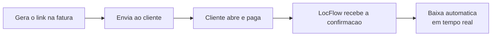
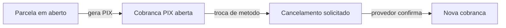
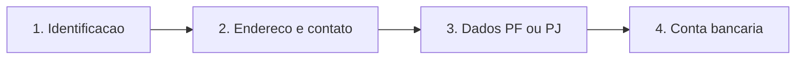
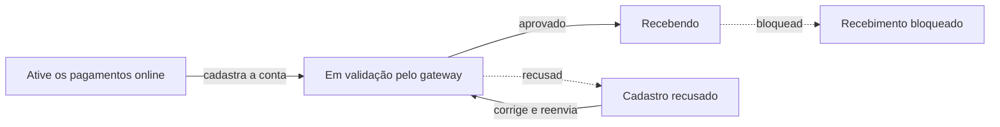

# Pagamento online

Com o pagamento online, o cliente paga **direto por um link**, sem você precisar registrar nada. Quando ele paga, a fatura se atualiza sozinha — **em tempo real**. É a forma mais rápida e segura de receber, e a que mais reduz inadimplência. Serve igual para **locação** e para **venda** de bens móveis.


**Por que isso te faz receber mais:** quanto mais fácil pagar, mais gente paga — e mais cedo. Um PIX que o cliente abre e quita em segundos cobra melhor do que uma promessa de "te mando depois". Recebimento mais rápido, menos cobrança atrasada, menos calote.


## Como funciona

```mermaid
flowchart LR
    A[Gera o link na fatura] --> B[Envia ao cliente]
    B --> C[Cliente abre e paga]
    C --> D[LocFlow recebe a confirmacao]
    D --> E[Baixa automatica<br/>em tempo real]
```

1. Na fatura, gere o **link de pagamento**.
2. Envie ao cliente — copie e mande por WhatsApp, e-mail, ou compartilhe pelo próprio celular.
3. O cliente abre a página de pagamento e paga a parcela.
4. O LocFlow recebe a confirmação e dá a **baixa automática**, atualizando a fatura na hora.

Operador e cliente acompanham o mesmo link ao vivo: quando o cliente gera ou paga uma cobrança, a sua tela atualiza sozinha — sem precisar recarregar nada.

## O link de pagamento

O link é **público e por fatura**: o cliente paga **parcela a parcela** por uma página segura. Você controla **quais métodos** o link aceita.

| Método | Padrão | Observação |
| --- | --- | --- |
| **PIX** | Ligado | Vem habilitado por padrão — o jeito mais rápido de receber. |
| **Boleto** | Desligado | Você liga quando quiser. Exige o endereço do cliente. |
| **Cartão** | Desligado | Você liga quando quiser. |

Por padrão o link já vem só com **PIX**. Para aceitar boleto ou cartão, basta ligar o método no link — um toque. **Mantenha sempre ao menos um método habilitado.**

### O link escreve no combinado {#o-link-e-o-combinado}

O link e o [pagamento combinado](emitindo-a-cobranca.md#pagamento-combinado) eram duas declarações da mesma intenção, digitadas duas vezes. Agora **gerar o link ou ligar uma forma nele escreve no combinado da cobrança**: link com PIX vira combinado "Pix"; link com PIX e cartão vira "Pix ou Cartão de crédito". A ficha mostra a linha com o selo **"segue o link"**.

Dois limites, de propósito:

* **A mão de gente vence.** Assim que alguém edita o combinado pelo lápis da ficha, ele para de seguir o link — ligar ou desligar um método no link não muda mais o que foi combinado. É o operador quem sabe o que o cliente disse; o link só ajuda enquanto ninguém disse nada.
* **O link só conhece o que ele oferece.** PIX, boleto e cartão. Dinheiro, maquininha, transferência e débito continuam sendo marcados à mão, e o link nunca os apaga.


**Dados do cliente:** alguns métodos pedem mais informação. **CPF/CNPJ e e-mail** são exigidos por todos — sem eles, o link nem é gerado. O **boleto** ainda precisa do **endereço**. O LocFlow mostra um checklist do que falta e deixa você completar ali mesmo, no mesmo gesto.


### Endereço personalizado do link

O link pode usar um endereço amigável com o nome da sua empresa, deixando a página de pagamento com a **sua identidade** — mais confiança para o cliente pagar. Domínio totalmente personalizado é um recurso dos planos superiores; veja [Domínio personalizado](../configuracoes/dominio-personalizado.md).

## Pré-requisitos por método

Cada método pede um conjunto mínimo de dados do cliente. Alguns **bloqueiam** (sem eles a cobrança não é gerada); outros são apenas **recomendados** (ajudam, mas não travam).

| Método | Bloqueia sem | Recomendado | Por quê |
| --- | --- | --- | --- |
| **PIX** | CPF/CNPJ, e-mail | Telefone | O telefone melhora o registro, mas não trava a geração. |
| **Boleto** | CPF/CNPJ, e-mail, **endereço** | — | O boleto é registrado: sem endereço completo, a página do boleto não abre para o cliente. |
| **Cartão** | CPF/CNPJ, e-mail | Endereço | O endereço de cobrança é pedido **no momento do pagamento** (CEP do pagador); o cadastro só pré-preenche. |


Quando você liga **boleto** e falta o endereço, o LocFlow abre uma folha para completar e só habilita o método **depois que você salva** — o botão fica "Salvar e habilitar Boleto". Você nunca habilita um método que ainda não consegue cobrar.


O checklist do link mostra cada dado com um ✓ (já tem) ou um ponto âmbar (falta), e ao lado os ícones dos métodos que o exigem. **CPF/CNPJ e e-mail faltando** desligam o botão de gerar o link inteiro — porque nenhum método cobra sem eles.

## Cancelar e recriar: o que acontece com a cobrança anterior

Há **no máximo uma cobrança aberta por parcela**. Por isso, antes de criar uma nova cobrança para a mesma parcela, o LocFlow pede o cancelamento da anterior e acompanha a resposta do provedor.

* **PIX:** depois que o cancelamento é confirmado, o QR Code e o copia-e-cola param de funcionar.
* **Boleto:** o registro da cobrança é cancelado no LocFlow e no provedor — mas **o título não sai do DDA do cliente**. Entenda o porquê logo abaixo.

```mermaid
flowchart LR
    P[Parcela em aberto] -->|gera PIX| C1[Cobranca PIX aberta]
    C1 -->|troca de metodo| X[Cancelamento solicitado]
    X -->|provedor confirma| C2[Nova cobranca]
```

## Boleto cancelado continua no DDA — e isso não é um defeito do LocFlow {#boleto-cancelado-continua-no-dda-e-isso-nao-e-um-defeito-do-locflow}

Todo boleto registrado entra numa base centralizada do sistema bancário (a CIP), que é o que o
DDA do seu cliente lê. Tirar um título dessa base antes da hora exige que o **emissor** comande a
baixa do registro — e o provedor de pagamentos usado pelo LocFlow (Stone/Pagar.me) **não executa
esse comando**. É uma limitação do emissor, confirmada por escrito pelo suporte do provedor: nem
ele consegue retirar o título.

Na prática, para um boleto cancelado:

* O título **continua aparecendo no DDA** do seu cliente até cerca de **60 dias após o
  vencimento** — depois disso expira sozinho e some.
* Durante esse período, o boleto **continua tecnicamente pagável** no banco. Se o cliente pagar
  mesmo assim, o LocFlow captura o pagamento e o trata como **recebimento tardio** — o dinheiro
  entra no histórico financeiro e você decide o destino (vale-locação ou devolução).
* O seu cliente **não tem nenhuma obrigação de pagar** um título de cobrança cancelada. O DDA é
  uma vitrine dos boletos emitidos no nome dele, não uma lista de dívidas exigíveis.


**O que dizer ao seu cliente (B2B):** "o boleto foi cancelado e não deve ser pago; ele continuará
visível no seu DDA por até 60 dias após o vencimento porque o registro bancário expira sozinho —
isso é do sistema bancário, não uma cobrança em aberto." Empresas com fluxo de contas a pagar
automatizado devem **remover o título da esteira de pagamento** para evitar pagamento indevido.



Por isso, prefira **PIX** quando houver chance de o valor ou o método mudarem: o QR cancelado
para de funcionar na hora. Use boleto quando a cobrança for firme — cancelamentos de boleto
deixam esse rastro no DDA que gera dúvida para o pagador.


**Importante — abrir a página de novo NÃO invalida o código.** Se o cliente já está vendo um PIX ou boleto e atualiza a página (ou volta nela), o LocFlow **reaproveita a mesma cobrança aberta** daquele método em vez de criar outra. O QR Code e o boleto que ele tem na mão continuam valendo. Só uma **troca de método** (ou um cartão, que é sempre uma nova tentativa) inicia a substituição do instrumento anterior.

**Recebeu parte por fora (dinheiro, maquininha)?** Registrar uma baixa manual — ou um recebimento na rua — muda o valor que resta a receber, então o PIX/boleto em aberto daquela parcela **é cancelado junto**: ele cobrava o valor antigo. O LocFlow avisa antes de você confirmar e, se ainda restar saldo, já oferece **gerar o novo PIX ou boleto pelo valor certo** na mesma tela.


**Cartão é diferente:** cada tentativa de cartão é uma transação própria, então o cartão nunca "reaproveita" — e a resposta é na hora (aprovado ou recusado, com o motivo em português).


## Pagamento confirmado não se desfaz na mão

Diferente da baixa manual (que você lança e pode [corrigir](recebendo-pagamentos.md#corrigir-uma-baixa) — a data, a forma e a conta, nunca o valor), o pagamento online é uma **transação real**, processada pelo recebedor. Não existe botão de "desfazer": o dinheiro saiu da conta do cliente e entrou na sua, e isso não se apaga por decisão de operador.

Se sobrar valor a favor do cliente (por exemplo, uma edição que reduz o total depois de já ter sido pago), o LocFlow resolve pela **política de cobrança** da sua locadora — **crédito/vale** ou **reembolso**. Veja [Faturas e parcelas](faturas-e-parcelas.md).

### E se o dinheiro voltar mesmo assim? {#estorno}

Um pagamento pode voltar por fora do LocFlow: você pede o reembolso ao processador, ou o cliente **contesta a compra no cartão** (chargeback). Quando isso acontece, o LocFlow é avisado pelo processador e **reage sozinho**:

- a **parcela reabre** na fatura — o cliente volta a dever;
- a **entrada sai do seu financeiro**, para o seu saldo não mostrar um dinheiro que não está mais lá;
- se aquele pagamento carregava um **repasse de parceria** repartido na fonte, o repasse é revertido junto.

Se esse dinheiro já tinha virado **vale-locação**, o LocFlow primeiro desconta o saldo de vale que
ainda estiver disponível. Quando o cliente já usou uma parte ou todo o vale, somente a diferença
sem lastro vira uma **nova cobrança avulsa** no nome dele. O vale nunca fica negativo, e o histórico
mantém ligados o crédito original, o estorno e a cobrança de recuperação.


**O que o sistema não desfaz é o dinheiro que já se moveu.** Se o repasse ao parceiro já tinha sido **quitado** por você antes do estorno, o valor **não** volta automaticamente da conta dele — recuperar isso é uma conversa comercial entre vocês. Os detalhes de como o estorno afeta repasse e taxa estão em [O dinheiro da parceria](../parcerias/dinheiro-da-parceria.md#estorno).


---

## Ativando o recebimento

Para receber online, a sua organização precisa de uma **integração de pagamento ativa** — o **recebedor**, a conta da sua locadora que vai receber os valores das cobranças (na tela, a **conta de recebimento**). A ativação é um cadastro guiado e passa por uma **verificação** (KYC) antes de liberar.

Você configura tudo em **Ajustes › Integração de Pagamento**. Enquanto a integração não está ativa, a seção de cobrança online da fatura explica o motivo e oferece o atalho para ativar.


**Quem ativa:** o cadastro do recebedor é feito por quem administra a conta. Se você não tem esse acesso, o sistema orienta a pedir ao responsável — ninguém fica travado sem entender o porquê.


### Recebedor, validação e aprovação

São três coisas que costumam confundir — explicadas em um lugar só, no **"?"** do topo da tela (**Como funciona a integração**):

> **Primeiro, quem recebe o dinheiro:** o recebedor é a conta da sua locadora dentro do gateway de pagamento, ligada à conta bancária em que você já trabalha. O cadastro leva por volta de 8 minutos, e dá para parar no meio e voltar depois.
> **Depois, a validação de identidade (KYC):** quem movimenta dinheiro de terceiros é obrigado por lei a confirmar com quem está falando. O gateway confere os seus dados e, em parte dos casos, pede uma **prova de vida** do responsável.
> **No fim, recebendo:** aprovado o cadastro, as cobranças passam a aceitar PIX, boleto e cartão, e o valor cai no seu saldo dentro do gateway.

### O cadastro guiado do recebedor

O cadastro é um **wizard de 4 passos** (leva cerca de 8 minutos) e já vem **pré-preenchido** com os dados da sua organização para reduzir digitação.

```mermaid
flowchart LR
    P1[1. Identificacao] --> P2[2. Endereco e contato]
    P2 --> P3[3. Dados PF ou PJ]
    P3 --> P4[4. Conta bancaria]
```

| Passo | O que você informa |
| --- | --- |
| **1 · Identificação** | Quem vai receber: tipo (Pessoa Física ou Jurídica), nome, e-mail e CPF/CNPJ. Pode dar uma descrição interna (ex.: "Conta para recebimento das locações"). |
| **2 · Endereço e contato** | Endereço **completo** (incluindo complemento e ponto de referência) e um telefone. A verificação exige todos os campos. |
| **3 · Dados (PF ou PJ)** | **Pessoa Física:** data de nascimento, renda mensal e ocupação. **Pessoa Jurídica:** razão social, nome fantasia, faturamento anual e um **sócio administrador** completo (o representante legal com poderes de gestão). |
| **4 · Conta bancária** | Banco, agência, conta e dígito e tipo de conta. Mostra um **resumo** dos passos anteriores para conferência antes de concluir. É a conta para onde os recebimentos vão. |


**Atalhos que poupam digitação:** no cadastro PJ, você pode marcar "usar o mesmo endereço/nome/e-mail/telefone do recebedor" para o sócio administrador, sem reescrever tudo. Em locadoras pequenas, o sócio costuma ser a mesma pessoa e o mesmo endereço da empresa.



**A conta precisa estar no mesmo CPF ou CNPJ do cadastro.** O LocFlow não pergunta mais quem é o titular da conta: o titular é o próprio recebedor (o nome, o documento e o tipo de pessoa que você informou no passo 1), porque o meio de pagamento só aceita conta no mesmo documento. A tela escreve a regra com o seu documento — por exemplo, *"A conta precisa estar no CNPJ da empresa — 00.000.000/0001-00. Conta de sócio ou de terceiro é recusada."* Uma conta em outro nome é recusada **antes** de salvar. Quem estava no meio do cadastro não perde o que já tinha preenchido.



**Na edição, alguns campos travam:** depois do cadastro criado, o **tipo de pessoa** e o **documento (CPF/CNPJ)** ficam bloqueados — mudá-los exigiria reabrir o cadastro no recebedor. Para corrigir esses dois, fale com o suporte.


### Estados da integração {#estados-da-integracao}

A integração caminha por quatro passos, que a tela mostra num passo a passo: **Cadastrar a conta → Validação automática → Aprovação → Recebendo.** Os estados que você vê:

```mermaid
flowchart LR
    I[Ative os pagamentos online] -->|cadastra a conta| V[Em validação pelo gateway]
    V -->|aprovado| A[Recebendo]
    V -.recusado.-> R[Cadastro recusado]
    R -->|corrige e reenvia| V
    A -.bloqueado.-> B[Recebimento bloqueado]
```

| Estado | O que significa | O que fazer |
| --- | --- | --- |
| **Ative os pagamentos online** | A conta de recebimento ainda não foi cadastrada. | Faça o cadastro guiado em 4 passos. |
| **Em validação pelo gateway** | Cadastro enviado; o gateway confere os dados sozinho. | Normalmente, só esperar — o app avisa quando aprovar. Se o gateway pedir a **prova de vida**, aparece o cartão para gerar o link (veja abaixo). |
| **Cadastro recusado pelo gateway** | A análise recusou o cadastro. | **Revisar dados** — corrija o que for preciso (inclusive o documento) e reenvie: é feito um novo credenciamento. |
| **Recebimento bloqueado pelo gateway** | A conta foi bloqueada no gateway. | Reenviar o cadastro **não** desbloqueia: **Falar com o suporte**. Enquanto isso, o saldo fica retido. |
| **Recebendo** | Tudo aprovado. | Pronto: PIX, boleto e cartão liberados nas cobranças, com repasse no seu banco. |


**A prova de vida é o passo que mais gente esquece.** Às vezes o gateway pede uma confirmação de identidade por biometria do responsável. Aí aparece o cartão **"Falta a prova de vida para liberar seu saldo"**, com o botão **Fazer prova de vida agora**: ele gera um link (e um QR Code) para abrir no próprio aparelho, enviar ao responsável ou copiar. O link **vale 20 minutos** — se expirar, gere outro ali mesmo. Sem a prova de vida, o valor recebido fica retido. E se o painel do meio de pagamento pediu a prova de vida enquanto a tela ainda mostra só "em validação", use **Pediram a prova de vida? Gerar link**, no mesmo cartão.


### Mais de uma conta de recebimento {#mais-de-uma-conta}

A sua organização pode ter **mais de uma conta de recebimento** — e escolher qual delas recebe. Com duas ou mais, a seção vira a lista **Contas de recebimento**, cada uma identificada pelo final do número da conta e com um selo: **RECEBENDO** (a que recebe hoje), **APROVADA**, **EM ANÁLISE**, **PROVA DE VIDA**, **RECUSADA** ou **BLOQUEADA**.

1. Para incluir uma, toque em **Cadastrar outra conta** — é o mesmo cadastro guiado, e a regra do documento continua valendo.
2. Para trocar a conta que recebe, toque na conta e em **Receber aqui**. Só uma conta **aprovada** pelo gateway pode passar a receber; se ainda não pode, o motivo aparece no lugar do botão.
3. Confirme em **Receber nesta conta?**. O diálogo mostra de onde para onde o dinheiro passa a ir e quatro consequências:

| Consequência | O que significa |
| --- | --- |
| **Cobranças novas** | Passam a cair na conta nova. Cobranças de cliente pedidas de novo são reemitidas nela. Já os PIX de quitação e de acerto de repasse que já tinham sido emitidos seguem na conta anterior até expirar — o app avisa isso ao reabrir um deles. |
| **Cobranças abertas** | As já emitidas continuam caindo na conta anterior até serem pagas ou reemitidas. As emitidas antes de 16/09/2026 seguem na conta anterior mesmo se forem pedidas de novo. |
| **Transferência automática** | É de cada conta e não é copiada — confira a da conta nova depois da troca, em **Recebíveis**. |
| **Saldo da conta atual** | Continua disponível para saque — nada é transferido entre as contas. |


**Cada conta tem o seu dinheiro.** Saldo, saque e antecipação são **por conta**: o cartão **Recebíveis** mostra a que recebe hoje, e cada conta da lista tem o próprio **Saldo desta conta**. Dá para sacar o que entrou numa conta mesmo depois de ela deixar de ser a que recebe. O saque sempre mostra **para qual conta** o dinheiro vai, antes do valor. Veja [Saldo e antecipação](saldo-e-antecipacao.md).


## Recebíveis e transferências

Quando um cliente paga, o dinheiro **não cai direto** na sua conta bancária: ele fica retido no recebedor por um período (prazo de liquidação) e depois é transferido. Em **Ajustes › Integração de Pagamento**, no cartão **Recebíveis**, você acompanha o saldo e define como o dinheiro chega até você.

| Saldo | O que é |
| --- | --- |
| **Disponível** | Já pode ser sacado/transferido para a sua conta agora. |
| **A receber** | Ainda no prazo de processamento, aguardando liberar. |

- **Transferência automática** (recomendada) — o saldo disponível vai para a sua conta sozinho, na frequência que você definir.
- **Transferência manual** — com a automática desligada, o saldo acumula e você **saca o valor que quiser, quando quiser** (até o limite do disponível), pelo botão **Sacar para o banco**.


**Por que o dinheiro não cai na hora:** quando sua organização recebe um pagamento, o valor fica **retido por um período que depende das configurações de transferência**. "Disponível" pode ser sacado agora; "A receber" ainda está no prazo do processador e não foi liberado para saque. Os detalhes estão em [Saldo e antecipação](saldo-e-antecipacao.md).


---

## Por porte

| Porte | Como tratar o pagamento online |
| --- | --- |
| **Autônomo / MEI** | Deixe só **PIX** (o padrão) e ligue a **transferência automática**. Você gera o link, manda no WhatsApp e o dinheiro entra sozinho. Não precisa pensar em mais nada. |
| **Médio** | Ligue **boleto** para clientes PJ que pedem, mantenha o checklist de dados em dia e acompanhe **disponível × a receber** para prever o caixa. |
| **Grande** | Combine os três métodos, use **transferência manual** para concentrar saques, e o **domínio personalizado** no link para reforçar a marca na hora de pagar. |

## Situações reais

- **PIX no fechamento:** orçamento ganho, você gera o link e manda o PIX por WhatsApp. O cliente paga em dois minutos; a parcela fica **Paga** na hora e a logística pode seguir. Sem cobrança manual, sem espera.
- **Boleto para empresa:** o cliente é PJ e prefere boleto. Você completa o endereço no checklist, o LocFlow salva e habilita o **boleto** no link, e envia. Quando ele paga, a baixa cai sozinha.
- **Cliente atualizou a página:** o cliente já estava com o QR Code do PIX aberto e recarregou a página. O LocFlow reaproveita a **mesma** cobrança — o código que ele tinha continua valendo, sem virar um novo.
- **Cobrança por telefone:** o cliente liga querendo pagar. Direto da parcela, o operador gera o PIX e passa o código; assim que o cliente paga, a tela do operador atualiza ao vivo.


**Receba mais rápido, com menos inadimplência:** PIX e link prontos no instante do fechamento, baixa automática e confirmação em tempo real. O cliente paga onde está, e você acompanha o dinheiro entrar sem mover um dedo.


## Próximo passo

- A fatura nasce quando você **gera a cobrança** — veja [Emitindo a cobrança](emitindo-a-cobranca.md).
- Para entender parcelas, status e valores a favor do cliente, volte a [Faturas e parcelas](faturas-e-parcelas.md).
- Para registrar o que entra **por fora** do sistema, veja [Recebendo pagamentos](recebendo-pagamentos.md).
