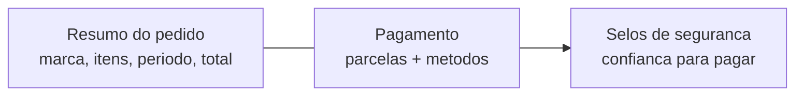

# A página de pagamento do cliente

Quando você gera um [link de pagamento](pagamento-online.md) e envia ao cliente, ele abre uma **página de pagamento**: uma tela pública, com a sua marca, onde ele vê o que está pagando e quita a fatura sozinho — por PIX, boleto ou cartão. É a ponta do seu cliente: a vitrine onde o dinheiro entra.

Esta página explica o que o **cliente** vê e por que ela transmite confiança. Para o lado de quem cobra (gerar o link, escolher métodos, baixa automática), veja [Pagamento online](pagamento-online.md).


**Por que isso te faz receber melhor:** uma página limpa, com o seu nome, o resumo do pedido e selos de segurança dá ao cliente a confiança de pagar na hora. Quanto menos dúvida ("é golpe?", "estou pagando o quê?"), mais gente paga — e mais cedo.


## O que o cliente vê

A página é organizada como um checkout moderno: de um lado o **resumo do que está sendo pago**, do outro o **pagamento**. Em telas grandes, lado a lado; no celular, empilhado.

### O resumo do pedido

No topo, a página mostra a **sua identidade** e o que o cliente está pagando:

* **A sua marca** — o **logo** e o **nome** da sua empresa (se você cadastrou o logo nas [configurações de identidade](../documentos/identidade-visual.md)). É a sua cara, não a do LocFlow.
* **A natureza e o número** — se é **Locação** ou **Venda**, com o código do orçamento.
* **O período** — no aluguel, as datas de retirada e devolução (ou do evento); na venda, a data quando se aplica.
* **Os itens** — a lista de **bens móveis** do pedido, cada um com **foto** (quando o item tem imagem cadastrada) e quantidade. Pedidos com muitos itens mostram os primeiros e um "+N itens" para não poluir.
* **O total** — o valor cheio da fatura, em destaque.


O resumo **não expõe dados pessoais do cliente** na tela (nome, CPF, endereço). Ele mostra só a sua marca, os itens e os valores — quem tem o link já é a pessoa certa para pagar.


### As parcelas e as formas de pagamento

Do lado do pagamento, o cliente vê a fatura **parcela a parcela**. Cada [parcela](faturas-e-parcelas.md) é uma cobrança própria, com seu **vencimento** e seu valor:

* Se a fatura tem **uma parcela**, a página mostra direto "Valor a pagar" e os métodos.
* Se tem **várias**, cada parcela aparece com "Parcela X/Y · vence DD/MM", e o cliente paga uma de cada vez. Parcela já paga aparece marcada com um *check* verde.

Para cada parcela em aberto, o cliente escolhe entre os **métodos que você habilitou** no link:

| Método | O que o cliente faz |
| --- | --- |
| **PIX** | Gera o QR Code (ou o código copia-e-cola) e paga pelo app do banco. |
| **Boleto** | Gera o boleto com linha digitável para pagar no banco. |
| **Cartão** | Digita os dados do cartão na própria página e paga na hora. |

Você controla quais métodos aparecem — o padrão é só **PIX**. Quem decide isso é você, no link; veja [Pagamento online](pagamento-online.md#o-link-de-pagamento).

### Atualização ao vivo

O cliente **não precisa recarregar** a página. Quando ele paga, a tela percebe sozinha e troca para "Parcela paga". Quando todas as parcelas são quitadas, aparece **"Tudo pago — obrigado!"**. Há também um atalho discreto **"Já paguei — atualizar status"** para quem quiser forçar a conferência.

E é o **mesmo link ao vivo dos dois lados**: enquanto o cliente paga, a sua tela de cobrança atualiza junto — sem você mexer em nada.

## Por que o cliente pode confiar

Pagar online só funciona se o cliente confiar na tela. A página foi feita para isso, e mostra **selos de segurança** explícitos.

* **"Pagamento seguro processado por um provedor de pagamento certificado."** — o dinheiro é processado por um provedor de pagamentos conhecido, não por uma "caixinha" qualquer.
* **No cartão:** *"Dados protegidos e enviados direto ao banco. Não guardamos o número do seu cartão."* — os dados do cartão vão **direto para o provedor de pagamento**; o número do cartão **não passa** pelos servidores do LocFlow nem ficam guardados.
* **A sua marca no topo** — o cliente reconhece de quem é a cobrança, o que por si só afasta a sensação de golpe.


Esses selos não são enfeite: eles respondem, antes de o cliente perguntar, as duas dúvidas que mais travam um pagamento online — "é seguro?" e "vão guardar meu cartão?". Página que tranquiliza é página que converte.


## O link é a credencial — trate-o como uma chave

O endereço do link **é** o acesso àquela cobrança. Quem tem o link consegue abrir a página e pagar; não há senha, login nem cadastro. Isso é de propósito: o cliente não deveria ter que criar conta só para te pagar.

Na prática, isso significa duas coisas:

* **Para o cliente, é simples:** ele recebe um endereço, abre, paga. Zero fricção.
* **Para você, é uma chave:** envie o link à **pessoa certa**. Ele dá acesso ao resumo do pedido e ao pagamento daquela fatura — então trate-o com o mesmo cuidado de qualquer dado de cobrança.


Cada link aponta para **uma fatura**. Ele não dá acesso ao seu sistema, aos seus outros clientes nem ao seu cadastro — só àquela cobrança. E o cliente nunca precisa de senha para pagar.


## O endereço amigável com o nome da sua empresa

Por padrão, o link tem um endereço técnico (uma sequência de caracteres). Mas, quando a sua organização tem um **identificador próprio** configurado, o LocFlow monta um endereço **amigável e reconhecível**, com o seu nome — o que aumenta a confiança do cliente na hora de pagar.

| Situação da sua conta | Como o link fica |
| --- | --- |
| **Sem identificador** | Endereço técnico (uma sequência única) — funciona perfeitamente, só não é "bonito". |
| **Com identificador da empresa** | `.../suaempresa/orc<número>` — o nome da empresa e o número do pedido aparecem no endereço. |
| **Com domínio próprio** (planos superiores) | `pagamento.suaempresa.com.br/orc<número>` — a página de pagamento no **seu** domínio. |


**Por que vale a pena:** um endereço com o seu nome (em vez de uma sequência aleatória) deixa o cliente mais à vontade para pagar — parece o que é: a sua empresa cobrando. O domínio totalmente personalizado é um passo a mais de marca; veja [Domínio personalizado](../configuracoes/dominio-personalizado.md).


## Quando algo não está pronto

A página é honesta com o cliente quando não há o que pagar:

* **Link inválido ou expirado** — se o endereço não corresponde a uma cobrança válida, a página avisa: *"Este link de pagamento é inválido ou expirou. Peça um novo link a quem enviou a cobrança."* Nesse caso, gere um link novo na fatura e reenvie.
* **Cobrança ainda não disponível** — se o cliente abre o endereço da empresa para um pedido que **ainda não tem cobrança gerada**, a página mostra só a sua marca e avisa que não há nada a pagar por ali ainda.
* **Tudo pago** — quando a fatura já está quitada, a página mostra a confirmação de agradecimento, sem oferecer pagar de novo.


Se o cliente disser que o link "não abre" ou "deu erro", quase sempre é um link **antigo**: trocar o método ou gerar a cobrança de novo invalida o código anterior. Gere um link novo na fatura e reenvie. Veja [Pagamento online](pagamento-online.md).


## Por porte

| Porte | Como a página de pagamento ajuda |
| --- | --- |
| **Pequeno** | Manda o link de PIX por WhatsApp e pronto — o cliente paga sozinho, a parcela baixa na hora. Sem maquininha, sem cobrança manual. |
| **Médio** | Liga boleto e cartão para atender clientes PJ, e usa o **endereço amigável** com o nome da empresa para passar mais confiança. |
| **Grande** | Coloca a página no **domínio próprio**, com a marca completa — o cliente paga numa tela que é a cara da empresa, indistinguível do seu site. |

## Situações reais

- **PIX em segundos:** você manda o link por WhatsApp, o cliente abre, toca em PIX, lê o QR pelo banco e paga. A página troca sozinha para "Parcela paga" e a sua tela de cobrança atualiza junto.
- **Boleto para a empresa do cliente:** o cliente é PJ e prefere boleto. Como você habilitou o boleto no link, ele gera a linha digitável na própria página e paga pelo banco — a baixa cai depois, automática.
- **"Esse link é confiável?":** o cliente desconfia. Ao abrir, vê o **logo da sua empresa** no topo, o resumo do pedido com os itens e o selo "pagamento seguro" — e paga tranquilo.
- **Pagou em três vezes:** a fatura tem três parcelas. O cliente abre o link e paga uma a uma, cada uma no seu vencimento, pelo mesmo endereço — sem precisar de um link novo a cada parcela.

## Próximo passo

Para o lado de quem cobra — gerar o link, escolher os métodos e a baixa automática —, veja [Pagamento online](pagamento-online.md). Para entender parcelas, vencimentos e valores a favor do cliente, volte a [Faturas e parcelas](faturas-e-parcelas.md). Para deixar a página com o seu domínio, veja [Domínio personalizado](../configuracoes/dominio-personalizado.md).
