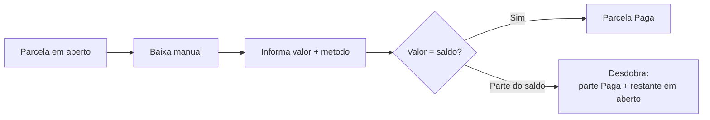

# Recebendo pagamentos

Nem todo pagamento entra pelo sistema. O cliente paga no balcão, passa o cartão na maquininha, faz um Pix para a sua conta ou entrega dinheiro na hora da entrega. Para esses casos existe a **baixa manual** — você dizendo ao LocFlow: "este valor já entrou". E para o dia a dia da cobrança, você também consegue **reagendar o vencimento** de uma parcela e ver o **histórico** de tudo que já foi tentado nela.


**Por que isso importa:** o dinheiro que entra por fora some do controle se ninguém registrar. Com a baixa manual, todo recebimento — de qualquer canal — aparece na fatura. Você sempre sabe quanto já recebeu e quanto ainda falta, sem planilha paralela e sem cobrar duas vezes quem já pagou.


A fatura já nasce pronta quando o orçamento é ganho (veja [Acompanhando e fechando](../orcamentos/acompanhando-e-fechando.md)) e se organiza em parcelas. Se ainda não viu como ela se monta, comece por [Faturas e parcelas](faturas-e-parcelas.md).

## Pagamento manual x pagamento online

Antes de registrar qualquer coisa, vale separar dois mundos que convivem na mesma fatura:

| | **Pagamento manual** | **Pagamento online** |
| --- | --- | --- |
| Quem dá a baixa | **Você** registra | Acontece **sozinho** |
| Quando usar | O dinheiro **já entrou** por fora (você só anota) | O cliente paga **pelo próprio sistema** |
| Métodos | Dinheiro, maquininha, Pix, transferência, cartão, boleto, outro | Pix, cartão ou boleto pelo link |
| O que liga | A baixa manual está sempre disponível na parcela | Depende da [integração de pagamento](pagamento-online.md) ativa |


**A regra de ouro:** a **baixa manual** é para o dinheiro que já entrou por fora — você confirma. O [Pagamento online](pagamento-online.md) é quando o cliente paga pelo próprio LocFlow e a baixa cai automática. Os dois podem aparecer na mesma fatura, até na mesma parcela.


## A baixa manual

Na parcela em aberto, você informa **quanto recebeu** e **por qual método**. O LocFlow atualiza o status na hora.

Se o valor recebido for **igual** ao saldo em aberto, a parcela fica **Paga**. Se for **parte** do saldo, a parcela **se desdobra** — a parte recebida vira uma parcela paga e o restante vira uma nova parcela em aberto, com o vencimento que você escolher. Essa é a regra da parcela atômica: não existe "meia paga". (Mais em [Faturas e parcelas](faturas-e-parcelas.md).)

### Os métodos de recebimento

Na hora da baixa, os métodos vêm **agrupados** para facilitar a leitura:

| Grupo | Métodos | Uso típico |
| --- | --- | --- |
| **Presencial** | Dinheiro, Maquininha, Outro | Cliente pagando na sua frente — balcão ou entrega. |
| **Digital** | Pix, Cartão, Boleto, Transferência | Pagamento que entrou por outro canal e você só registra. |

O método é apenas um **registro** de por onde o dinheiro entrou. Você escolhe na hora — ele não fica "preso" à parcela de antemão. É o seu controle de caixa, não uma cobrança que vai sair.

### A baixa nunca passa do saldo

Uma trava de segurança: **você não consegue baixar mais do que a parcela deve**. Se digitar um valor acima do saldo em aberto, o sistema avisa ("Valor acima do saldo em aberto") e o botão **Registrar baixa** fica bloqueado. Isso evita anotar a mais por engano e deixar a fatura "paga demais".

Se o cliente, de fato, pagou um valor a mais, esse excedente vira valor a favor dele (crédito ou reembolso, pela política da sua locadora) — veja [Faturas e parcelas](faturas-e-parcelas.md).


**Confira antes de registrar — é dinheiro.** A baixa manual entra direto no controle de caixa da fatura e fica no histórico da parcela. Registre só o que realmente entrou, com o método certo. Em caso de erro, fale com quem administra a cobrança na sua empresa.


## Recebendo na rua, com o motorista

Quando o pagamento acontece **na entrega ou na retirada**, quem recebe é o **motorista** — e ele registra direto do celular, na execução do roteiro. A baixa manual do operador fica no escritório; o recebimento em campo fica na tela do motorista, mais perto de quem está com o dinheiro na mão. Pela tela de cobrança do motorista dá para:

- **Gerar ou mostrar o Pix** ao cliente na hora (se o [pagamento online](pagamento-online.md) estiver ativo).
- **Registrar o recebimento presencial** (dinheiro, maquininha, transferência ou outro) que ele recebeu em campo.

O recebimento que o motorista registra na rua entra como **Aguardando conferência**: o dinheiro foi recebido em campo e a tesouraria confere depois, quando o caixa fecha. É um cuidado para o dinheiro de rua bater certinho no fim do dia.


**Quem faz o quê:** o operador financeiro dá a **baixa manual** no escritório; o motorista registra o **recebimento presencial** na rua. Cada ação aparece para quem tem a permissão correspondente. Se um botão não aparecer, é questão de permissão — fale com quem administra os acessos.


## Reagendar o vencimento de uma parcela

Cliente pediu mais prazo? Você pode mudar a data de vencimento de uma parcela **que ainda não foi paga**, sem mexer no valor. Na parcela, toque no ícone de **lápis**, escolha o **novo vencimento** e salve.

Algumas condições:

- Só aparece em parcelas com **saldo em aberto** (parcela já quitada não tem o que reagendar).
- Não muda o valor — apenas a data.


**Quando há boleto em aberto:** *"O boleto em aberto terá o vencimento atualizado — a linha digitável continua a mesma."* Ou seja, o cliente pode usar o mesmo boleto que já recebeu; só a data muda. (Esse aviso aparece na própria tela.)


## Histórico de pagamento da parcela

Toda parcela guarda um **histórico** — toque no ícone de **relógio** para abrir. Ele lista **todas as tentativas de pagamento** daquela parcela, da mais recente para a mais antiga, com o método, o desfecho e a data. É só leitura: serve para você entender o que já aconteceu ali.

Os desfechos que você pode ver:

| No histórico | O que significa |
| --- | --- |
| **Pago** | Pagamento online confirmado pelo provedor. |
| **Conferido** | Recebimento da rua já conferido pela tesouraria. |
| **Registrado na rua** | Recebimento presencial anotado em campo, aguardando conferência. |
| **Aguardando pagamento** | Cobrança online gerada, esperando o cliente pagar. |
| **Gerada** | Cobrança recém-criada (ainda preparando o código). |
| **Em divergência** | O caixa não bateu na conferência — precisa de atenção. |
| **Cartão recusado** | A tentativa no cartão não foi autorizada. |
| **Expirada** | A cobrança venceu sem ser paga. |
| **Cancelada** | A cobrança foi cancelada (ex.: você trocou o método e gerou outra). |


**Por que o histórico te ajuda:** se o cliente disser "já paguei" ou "o Pix não funcionou", você abre o histórico e vê exatamente o que rolou — método, valor e quando. Fim do "será que entrou?".


## A baixa por porte

A mesma baixa manual atende do autônomo à locadora com tesouraria:

| Porte | O que normalmente usa | Por quê |
| --- | --- | --- |
| **Autônomo / MEI** | Baixa manual simples (recebi, anotei) | Quer só não perder de vista o que entrou. |
| **Médio** | Baixa manual + reagendamento + histórico | Começa a dar prazo, conferir e justificar com o cliente. |
| **Grande** | Recebimento na rua com conferência de caixa + histórico completo | Vários pontos de recebimento (balcão, rua, online) que precisam bater no fim do dia. |

## Situações reais

- **Cliente paga metade no Pix:** a parcela é de R$ 800. O cliente mandou R$ 400 por Pix para a sua conta. Você dá a **baixa manual** de R$ 400 com método **Pix**: a parcela se desdobra em R$ 400 **Paga** e R$ 400 **em aberto**, com novo vencimento. Ele paga o restante na semana seguinte e você baixa o que falta.
- **Maquininha no balcão:** venda fechada, cliente passa o cartão na sua maquininha física. Você registra a baixa **Presencial → Maquininha** pelo valor total. A parcela fica **Paga** na hora.
- **Dinheiro na entrega:** o motorista entrega os itens e recebe R$ 300 em dinheiro. Ele registra **Recebimento presencial → Dinheiro** ali mesmo. A parcela vai para **Aguardando conferência** até o caixa fechar no fim do dia.
- **Cliente pediu mais uma semana:** a parcela vence sexta, mas o cliente pediu prazo. Você toca no **lápis**, joga o vencimento para a sexta seguinte e salva. Se havia boleto, a linha digitável continua valendo.
- **"Será que o Pix caiu?":** o cliente jura que pagou. Você abre o **histórico** da parcela e vê a tentativa de Pix marcada como **Expirada** — peça para ele refazer, ou gere uma nova cobrança.


**Não perca recebimento de vista:** registrando cada entrada — do balcão à rua —, você fecha o dia sabendo exatamente o que recebeu e por onde. Menos dinheiro "no ar", menos cobrança repetida de quem já pagou.


## Próximo passo

- Para o cliente pagar sozinho e a baixa cair automática, configure o [Pagamento online](pagamento-online.md).
- Para entender o desdobramento, os status e a estrutura da cobrança, volte a [Faturas e parcelas](faturas-e-parcelas.md).
- Para ver de onde a fatura veio, revise [Acompanhando e fechando](../orcamentos/acompanhando-e-fechando.md).
