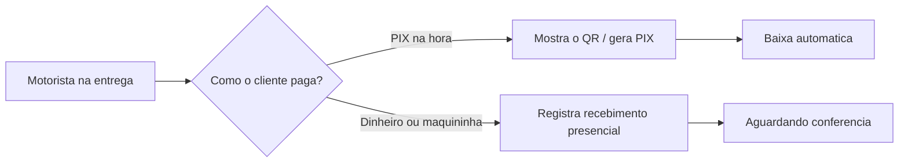

# Recebendo pagamentos

Nem todo pagamento entra pelo sistema. O cliente paga no balcão, passa o cartão na maquininha, faz um PIX para a sua conta ou entrega dinheiro na entrega. Para esses casos, você registra a **baixa manual** — também chamada de "receber por fora". É você dizendo ao LocFlow: "este valor já entrou".


**Por que isso importa:** o dinheiro que entra por fora some do controle se não for registrado. Com a baixa manual, todo recebimento — em qualquer canal — aparece na fatura. Você sempre sabe quanto já recebeu e quanto ainda falta, sem precisar de uma planilha paralela.


## Como funciona a baixa manual

Na parcela em aberto, você informa **quanto recebeu** e **por qual método**. O LocFlow atualiza o status na hora.

Se o valor recebido for **igual** ao saldo em aberto, a parcela fica **Paga**. Se for **parte** do saldo, a parcela **se desdobra** — a parte recebida vira uma parcela paga e o restante vira uma nova parcela em aberto, com o vencimento que você escolher (veja [Faturas e parcelas](faturas-e-parcelas.md)).

## Os métodos de recebimento

Na baixa manual, os métodos vêm agrupados para facilitar a leitura:

| Grupo | Métodos | Uso típico |
| --- | --- | --- |
| **Presencial** | Dinheiro, Maquininha, Outro | Cliente pagando na sua frente — balcão ou entrega. |
| **Digital** | PIX, Cartão, Boleto, Transferência | Pagamento que entrou por outro canal e você só registra. |

O método é apenas um **registro** de por onde o dinheiro entrou. Você escolhe na hora de dar a baixa — ele não fica "preso" à parcela de antemão.


**Baixa manual x pagamento online:** a baixa manual é para o dinheiro que **já entrou** por fora (você registra). O [Pagamento online](pagamento-online.md) é quando o cliente paga **pelo próprio sistema** (a baixa acontece sozinha). Os dois convivem na mesma fatura.


## A baixa nunca passa do saldo

Uma regra de segurança: **você não consegue baixar mais do que a parcela deve**. Se tentar registrar um valor acima do saldo em aberto, o sistema avisa e bloqueia. Isso evita registrar a mais por engano e deixar a fatura "paga demais".

Se o cliente, de fato, pagou um valor a mais, esse excedente vira valor a favor dele (crédito ou reembolso, pela política da sua locadora) — veja [Faturas e parcelas](faturas-e-parcelas.md).

## Recebendo na rua, com o motorista

Quando o pagamento acontece **na entrega ou na retirada**, quem recebe é o **motorista** — e ele registra direto do celular, na execução do roteiro. Pela tela de cobrança do motorista dá para:

- **Gerar ou mostrar o PIX** ao cliente na hora (se o [pagamento online](pagamento-online.md) estiver ativo).
- **Registrar o recebimento presencial** (dinheiro, maquininha, transferência ou outro) que ele recebeu em campo.

O recebimento que o motorista registra na rua entra como **Aguardando conferência**: o dinheiro foi recebido em campo e a tesouraria confere depois, quando o caixa fecha. É um cuidado para o dinheiro de rua bater certinho no fim do dia.


**Quem faz o quê:** o operador financeiro dá a **baixa manual** no escritório; o motorista registra o **recebimento presencial** na rua. Cada ação aparece para quem tem a permissão correspondente. Se um botão não aparecer, é questão de permissão — fale com quem administra os acessos.


## Situações reais

- **Cliente paga metade no PIX:** a parcela é de R$ 800. O cliente mandou R$ 400 por PIX para a sua conta. Você dá a **baixa manual** de R$ 400 com método **PIX**: a parcela se desdobra em R$ 400 **Paga** e R$ 400 **em aberto**, com novo vencimento. O cliente paga o restante na semana seguinte e você baixa o que falta.
- **Maquininha no balcão:** venda fechada, cliente passa o cartão na sua maquininha física. Você registra a baixa **Presencial → Maquininha** pelo valor total. A parcela fica **Paga** na hora.
- **Dinheiro na entrega:** o motorista entrega o material e recebe R$ 300 em dinheiro. Ele registra **Recebimento presencial → Dinheiro** ali mesmo. A parcela vai para **Aguardando conferência** até o caixa fechar no fim do dia.


**Não perca recebimento de vista:** registrando cada entrada — do balcão à rua — você fecha o dia sabendo exatamente o que recebeu e por onde. Menos dinheiro "no ar", menos cobrança repetida de quem já pagou.


## Próximo passo

Para o cliente pagar sozinho e a baixa cair automática, configure o [Pagamento online](pagamento-online.md). Para entender o desdobramento e os status, volte a [Faturas e parcelas](faturas-e-parcelas.md).
