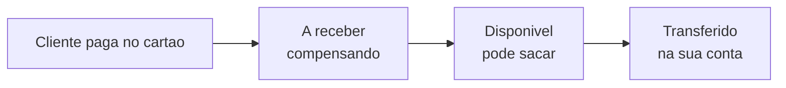
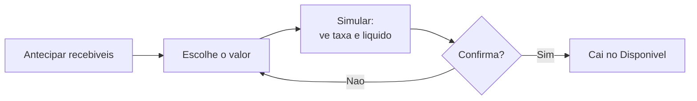

# Saldo e antecipação

Quando um cliente paga **pelo cartão** (pelo [Pagamento online](pagamento-online.md)), o dinheiro **não cai na hora** na sua conta bancária. Ele passa primeiro pelo **gateway de pagamento** (a Pagar.me), fica um tempo "compensando" e só depois vira saldo que você pode sacar. Esta página explica **o que você vê** na tela de recebimento e como usar cada parte — inclusive a **antecipação**, para receber antes.


**Por que isso importa:** sem essa visão, dá a sensação de que "o dinheiro não entrou". Ele entrou — só está no caminho normal do cartão. Aqui você acompanha cada centavo: o que já dá para sacar, o que ainda está a caminho e o que já foi para o banco. E, se precisar do dinheiro antes, **antecipa**.


## Onde você vê o seu saldo

- **Sua organização:** em **Configurações → Integração de Pagamento**, no card **Recebíveis**.
- **Parceiro externo:** em **Parcerias → Meu recebimento** (você vê o **seu próprio** saldo, separado do da organização).

## Os três números do seu saldo

O saldo vem direto do gateway e se divide em três partes. Todos os valores são o **líquido** que é seu.

| No app | O que é | Cor |
| --- | --- | --- |
| **Disponível** | Já compensou. **Pode ser transferido** para o seu banco agora. | Verde |
| **A receber** | Vendas no cartão que **ainda estão compensando** (no prazo do adquirente). Ainda não dá para sacar — mas **já é seu**. | Azul |
| **Já transferido** | Total que **já foi enviado** para a sua conta bancária ao longo do tempo. | Neutro |


**Disponível x A receber, na prática:**
**Disponível** = pode sacar agora. **A receber** = ainda no prazo do adquirente, ainda não liberado para saque. As duas somas juntas são o que você tem no gateway; o que já saiu para o banco aparece como **Já transferido**.


## Tirar o dinheiro do gateway (transferência)

O saldo **Disponível** vai para a sua conta bancária por **transferência**. Isso pode acontecer de duas formas:

- **Automática:** o gateway envia sozinho, no intervalo que você configurar (diário, semanal, etc.).
- **Manual:** quando a transferência automática está desligada, aparece o botão **Sacar agora** para você enviar o disponível na hora.

Só entra na transferência o que está **Disponível** — o que está **A receber** precisa compensar primeiro (ou ser **antecipado**, abaixo).

## Antecipação: receber antes

A **antecipação** traz o que está **A receber** para o seu saldo **Disponível** **antes** do prazo normal do cartão. É útil quando você precisa do dinheiro agora e topa pagar uma **taxa** por isso. Tudo acontece **pela nossa tela** — você não precisa entrar no painel da Pagar.me.


**Antecipar tem custo.** O adquirente cobra uma **taxa de antecipação** proporcional ao tempo que você está "adiantando". Por isso o LocFlow sempre mostra a **simulação** — quanto você recebe líquido e quanto é a taxa — **antes** de você confirmar. Nada é descontado sem você ver e concordar.


### Passo a passo

1. Na tela de recebimento, toque em **Antecipar recebíveis**.
2. O LocFlow consulta a sua **disponibilidade** e mostra o **máximo** que dá para antecipar hoje.
3. Informe **quanto** você quer antecipar (ou deixe o valor cheio) e toque em **Simular**.
4. Você vê a **simulação**: o **valor líquido** que cai na conta, a **taxa de antecipação**, o **custo** e a **data** em que o dinheiro fica disponível.
5. Se estiver bom, toque em **Confirmar**. Pronto — o valor entra no seu saldo **Disponível** assim que o gateway processar.

O valor antecipado cai no **Disponível** — de lá você transfere para o banco quando quiser (ou a transferência automática cuida disso). As antecipações que você já pediu aparecem em **Suas solicitações**, com o valor, a data e o status.


**Nem sempre está liberado.** A antecipação depende de haver recebíveis a receber **e** da janela do adquirente (pode ter horário-limite no dia). Se aparecer "ainda não está liberada para hoje", tente mais tarde ou no dia seguinte — o valor **A receber** continua seu e será pago normalmente mesmo sem antecipar.


## Perguntas comuns

- **"Meu saldo está zerado, mas vendi no cartão."** O valor provavelmente está em **A receber** (compensando). Ele vira **Disponível** no prazo do adquirente — ou você **antecipa** para receber antes.
- **"Recebi menos do que a venda."** No cartão, o adquirente desconta as taxas dele; se você antecipou, há também a **taxa de antecipação** (que você viu na simulação).
- **"Sou parceiro externo, vejo o saldo da organização?"** Não. Em **Meu recebimento** você vê **apenas o seu** saldo e antecipa **os seus** recebíveis.
- **"Onde vejo isso sem entrar na Pagar.me?"** Tudo aqui no LocFlow — é o mesmo saldo do painel do gateway, só que dentro do app.

## Próximo passo

- Para o cliente pagar no cartão e gerar esse saldo, configure o [Pagamento online](pagamento-online.md).
- Para registrar dinheiro que entrou por fora (Pix, maquininha, dinheiro), veja [Recebendo pagamentos](recebendo-pagamentos.md).
- Para parcerias e repasses, veja [Programa de Parceiros](../configuracoes/programa-de-parceiros.md).
