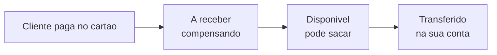
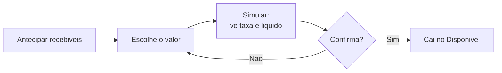

# Saldo e antecipação

Quando um cliente paga **pelo cartão** (pelo [Pagamento online](pagamento-online.md)), o dinheiro **não cai na hora** na sua conta bancária. Ele passa primeiro pelo **gateway de pagamento** (a Pagar.me), fica um tempo "compensando" e só depois vira saldo que você pode sacar. Esta página explica **o que você vê** na tela de recebimento e como usar cada parte — inclusive a **antecipação**, para receber antes.


**Por que isso importa:** sem essa visão, dá a sensação de que "o dinheiro não entrou". Ele entrou — só está no caminho normal do cartão. Aqui você acompanha cada centavo: o que já dá para sacar, o que ainda está a caminho e o que já foi para o banco. E, se precisar do dinheiro antes, **antecipa**.


## Onde você vê o seu saldo

- **Sua organização:** em **Ajustes › Integração de Pagamento**, no cartão **Recebíveis**. Ele mostra o saldo da conta que recebe hoje; se a sua organização tem [mais de uma conta de recebimento](pagamento-online.md#mais-de-uma-conta), cada conta da lista tem o próprio **Saldo desta conta** — dá para sacar e antecipar o que entrou em cada uma, mesmo depois de ela deixar de ser a que recebe.
- **Parceiro externo:** em **Recebimento**, nas **Suas áreas** do seu espaço (você vê o **seu próprio** saldo, separado do da organização).


**Para o parceiro, o Recebimento não é opcional.** Sem esse cadastro concluído e aprovado, o vendedor **não consegue gerar** o PIX que quita o seu repasse — o saldo continua nascendo e aparecendo em Ganhos, mas não há como pagá-lo pelo app. O mesmo vale no sentido contrário: se você recebeu do cliente na porta e ficou devendo à organização, precisa do cadastro para quitar. Veja [O recebedor](../parcerias/dinheiro-da-parceria.md#recebedor-do-parceiro).


## Os três números do seu saldo

O saldo vem direto do gateway e se divide em três partes. Todos os valores são o **líquido** que é seu.

| No app | O que é | Cor |
| --- | --- | --- |
| **Disponível** — *"Pode transferir agora"* | Já compensou. **Pode ser transferido** para o seu banco agora. | Verde |
| **A receber** — *"Recebíveis a compensar"* | Vendas no cartão que **ainda estão compensando** (no prazo do adquirente). Ainda não dá para sacar — mas **já é seu**. | Azul |
| **Já transferido** | Total que **já foi enviado** para a sua conta bancária ao longo do tempo. Em telas estreitas, aparece numa linha abaixo: *"Já transferido ao banco"*. | Neutro |

```mermaid
flowchart LR
    V[Cliente paga no cartao] --> R[A receber<br/>compensando]
    R --> D[Disponivel<br/>pode sacar]
    D --> B[Transferido<br/>na sua conta]
```


**Disponível x A receber, na prática:**
**Disponível** = pode sacar agora. **A receber** = ainda no prazo do adquirente, ainda não liberado para saque. As duas somas juntas são o que você tem no gateway; o que já saiu para o banco aparece como **Já transferido**.


## Tirar o dinheiro do gateway (transferência)

O saldo **Disponível** vai para a sua conta bancária por **transferência**. Isso pode acontecer de duas formas:

- **Automática:** o gateway envia sozinho, no intervalo que você configurar (diário, semanal ou mensal). Ela é **de cada conta de recebimento**: ao trocar a conta que recebe, confira a da conta nova.
- **Manual:** toque em **Sacar para o banco**, no bloco **Disponível**. A folha **Sacar para o meu banco** mostra **para qual conta** o dinheiro vai (*"Para: …"*) antes de você digitar o valor; ao concluir, mostra a **taxa da Stone** e quanto saiu do seu saldo.

Só entra na transferência o que está **Disponível** — o que está **A receber** precisa compensar primeiro (ou ser **antecipado**, abaixo). No financeiro da sua organização, cada saque concluído aparece como uma transferência **"Saque do gateway"**, com a taxa junto — veja [Taxas do pagamento online](taxas-do-gateway.md#saque-vira-transferencia).

## Antecipação: receber antes

A **antecipação** traz o que está **A receber** para o seu saldo **Disponível** **antes** do prazo normal do cartão. É útil quando você precisa do dinheiro agora e topa pagar uma **taxa** por isso. Tudo acontece **pela nossa tela** — você não precisa entrar no painel da Pagar.me.


**Antecipar tem custo.** O adquirente cobra uma **taxa de antecipação** proporcional ao tempo que você está "adiantando". Por isso o LocFlow sempre mostra a **simulação** — quanto você recebe líquido e quanto é a taxa — **antes** de você confirmar. Nada é descontado sem você ver e concordar.


### Passo a passo

1. Na tela de recebimento, toque em **Antecipar**, no bloco **A receber**. Abre a folha **Antecipar recebíveis**.
2. O LocFlow consulta a sua **disponibilidade** e mostra o **máximo** que dá para antecipar hoje.
3. Informe **quanto** você quer antecipar (ou toque em **Antecipar tudo**) e toque em **Simular**.
4. Você vê a **simulação**: quanto **você recebe**, o **valor solicitado**, a **taxa de antecipação**, o **custo operacional** (quando houver) e a data do **crédito**.
5. Se estiver bom, toque em **Confirmar**. Pronto — o valor entra no seu saldo **Disponível** assim que o gateway processar.

```mermaid
flowchart LR
    A[Antecipar recebiveis] --> B[Escolhe o valor]
    B --> C[Simular:<br/>ve taxa e liquido]
    C --> D{Confirma?}
    D -->|Sim| E[Cai no Disponivel]
    D -->|Nao| B
```

O valor antecipado cai no **Disponível** — de lá você transfere para o banco quando quiser (ou a transferência automática cuida disso). As antecipações que você já pediu aparecem em **Suas solicitações**, com o valor, a data e o status.


**Nem sempre está liberado.** A antecipação depende de haver recebíveis a receber **e** da janela do adquirente (pode ter horário-limite no dia). Se aparecer "ainda não está liberada para hoje", tente mais tarde ou no dia seguinte — o valor **A receber** continua seu e será pago normalmente mesmo sem antecipar.


## Perguntas comuns

- **"Meu saldo está zerado, mas vendi no cartão."** O valor provavelmente está em **A receber** (compensando). Ele vira **Disponível** no prazo do adquirente — ou você **antecipa** para receber antes.
- **"Recebi menos do que a venda."** No cartão, o adquirente desconta as taxas dele; se você antecipou, há também a **taxa de antecipação** (que você viu na simulação).
- **"Sou parceiro externo, vejo o saldo da organização?"** Não. Em **Recebimento** você vê **apenas o seu** saldo e antecipa **os seus** recebíveis.
- **"Troquei a conta que recebe. E o dinheiro da conta antiga?"** Continua nela, disponível para saque — nada é transferido entre as contas. Abra a conta antiga na lista e use o **Saldo desta conta**.
- **"Onde vejo isso sem entrar na Pagar.me?"** Tudo aqui no LocFlow — é o mesmo saldo do painel do gateway, só que dentro do app.

## Próximo passo

- Para o cliente pagar no cartão e gerar esse saldo, configure o [Pagamento online](pagamento-online.md).
- Para registrar dinheiro que entrou por fora (Pix, maquininha, dinheiro), veja [Recebendo pagamentos](recebendo-pagamentos.md).
- Para parcerias e repasses, veja [Preparando o dinheiro da parceria](../configuracoes/programa-de-parceiros.md) e [O dinheiro da parceria](../parcerias/dinheiro-da-parceria.md).
