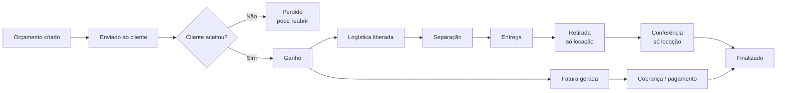
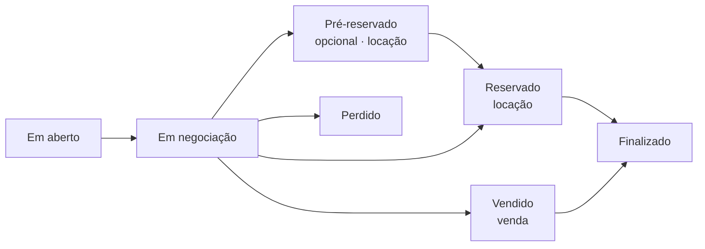
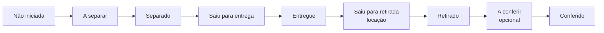

# O ciclo de um pedido

No LocFlow, **cada orçamento ganho vira uma operação que caminha sozinha** — da proposta à entrega e, na locação, até a devolução. Entender esse ciclo é entender o sistema inteiro: tudo gira em torno dele.


**Por que isso te faz faturar mais:** quando o pedido anda sozinho — fatura gerada na hora, equipe avisada, entrega organizada — você para de perder venda por esquecimento, atraso ou "deixa pra depois". Menos pedido parado = mais dinheiro entrando.


## O caminho completo

Leitura rápida: você **monta** o orçamento, **envia**, o cliente **aceita** (vira *Ganho*), o sistema **gera a fatura** e **libera a logística**; a equipe **separa**, **entrega** e — na locação — **retira** e **confere** na volta. Quando tudo se resolve, o pedido é **Finalizado**.

## As três trilhas dentro do ciclo

Um pedido tem três "linhas da vida" que andam em paralelo. Você acompanha qualquer uma a qualquer momento.

| Linha | O que controla | Onde você vê |
| --- | --- | --- |
| **Comercial** | A negociação: aberto → em negociação → ganho/perdido | Lista de orçamentos (funil) |
| **Financeira** | A cobrança: fatura → parcelas → pago | Cobranças |
| **Logística** | O material: separar → entregar → retirar → conferir | Roteiros e filas internas |

## Linha comercial: estados do orçamento

- **Em aberto** — criado, ainda sem ação.
- **Em negociação** — enviado ao cliente, aguardando a resposta.
- **Pré-reservado** *(opcional, só locação)* — um "segurar" antes de confirmar de vez. Quem quer pode **pular** e ir direto ao Reservado.
- **Reservado** *(locação)* / **Vendido** *(venda)* — o **ganho**. A partir daqui nascem a cobrança e a logística.
- **Perdido** — não fechou; pode ser **reaberto** para uma nova tentativa.


**Locação x venda:** na **locação** o item volta (tem retirada e conferência); na **venda** ele sai em definitivo (o ciclo termina na entrega). Veja [Locação e venda](locacao-e-venda.md).


## Linha logística: o caminho do material

Quanto da operação aparece depende de como você configura — o LocFlow **abstrai para o pequeno e revela para o grande** (veja [A filosofia do LocFlow](../primeiros-passos/filosofia.md)).

- **Separação** (*A separar → Separado*) e **Conferência** (*A conferir → Conferido*) são **opcionais** — quem está começando entrega direto; quem cresceu liga essas etapas para ter controle. Detalhes em [Logística](../logistica/visao-geral.md).

## Situações reais

- **Venda no balcão:** orçamento → Vendido → entrega na hora. Sem retirada, sem conferência.
- **Locação de evento:** orçamento → Reservado → separação → entrega na véspera → retirada no dia seguinte → conferência (checar avarias).
- **Entrega de última hora:** pulou o planejamento? Despacha **sob demanda**, uma entrega de cada vez — o sistema nunca trava o caminho mais simples.

## Próximo passo

Veja [Locação e venda](locacao-e-venda.md) ou vá direto para [Criando um orçamento](../orcamentos/criando-um-orcamento.md).
