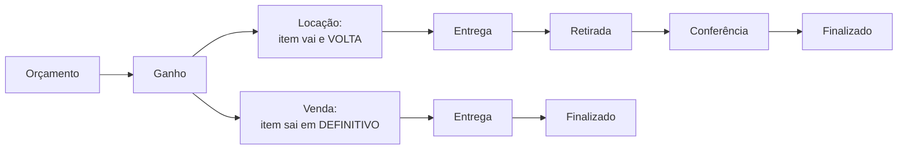

# Locação e venda

O LocFlow nasceu para **locadoras de bens móveis**, mas atende, no mesmo lugar, quem também **vende**. Não são dois sistemas: é o **mesmo** orçamento, a **mesma** cobrança e a **mesma** logística — muda só o que acontece com o item no fim.


**Por que isso aumenta seu faturamento:** muita locadora vende peças usadas, consumíveis ou itens de mostruário — e perde esse dinheiro por não ter onde registrar. Com locação **e** venda no mesmo fluxo, toda receita passa pelo seu controle.


## A diferença em uma imagem

## O que muda na prática

| Aspecto | Locação | Venda |
| --- | --- | --- |
| **O item** | Vai ao cliente e **retorna** | Sai em **definitivo** |
| **Estado de ganho** | *Reservado* | *Vendido* |
| **Logística** | Entrega **e** retirada (+ conferência opcional) | Só entrega |
| **Estoque** | Bloqueado pelo período e liberado na volta | Baixa definitiva |
| **Datas** | Período (início e fim do uso) | Data de entrega |

## A natureza é única por orçamento

Cada orçamento tem **uma natureza**: ou é de **locação**, ou é de **venda**. Você escolhe logo no início, e ela vale para o pedido inteiro — não se misturam aluguel e venda no mesmo orçamento.


**Trocar a natureza recomeça os itens.** Se você já adicionou itens e troca de Locação para Venda (ou o contrário), o orçamento **limpa os itens** — porque o significado de cada um muda (um aluguel vai e volta; uma venda sai em definitivo). O LocFlow avisa antes de trocar.


Precisa **alugar e vender** para o mesmo cliente na mesma ocasião? Faça **dois orçamentos**, um de cada natureza (ex.: um de locação para a estrutura, outro de venda para os consumíveis). Cada um segue o seu ciclo e gera a sua própria cobrança.


Para um produto aparecer como vendável, ligue **"Você vai vender este produto?"** no cadastro e informe o preço de venda. Um mesmo produto pode ter preço de **aluguel e de venda** — quem define o que acontece com ele é a **natureza do orçamento**. Veja [Catálogo: produtos](../cadastros/catalogo-produtos.md).


## Próximo passo

Entenda o todo em [O ciclo de um pedido](ciclo-de-um-pedido.md) ou comece a cadastrar em [Catálogo: produtos](../cadastros/catalogo-produtos.md).
