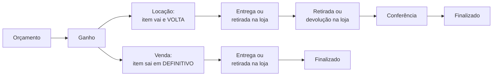

# Locação e venda

O LocFlow nasceu para **locadoras de bens móveis**, mas atende, no mesmo lugar, quem também **vende**. Não são dois sistemas: é o **mesmo** orçamento, a **mesma** cobrança e a **mesma** logística — muda só o que acontece com o item no fim.


**A venda faz parte do plano Pro.** No plano Starter, o LocFlow atende a locação: no orçamento, o botão **Venda** aparece travado, com a explicação *"Orçamento de venda faz parte de um plano superior. O seu plano atual contempla a locação; para vender produtos do seu estoque, atualize o plano em Minha Assinatura."* (Se alguém tentar salvar um orçamento de venda num plano sem venda, o LocFlow recusa com o mesmo recado.) No Pro entram, juntos, o orçamento de venda, habilitar produtos e kits para venda (com preço por condição: novo, seminovo ou usado), o estoque de venda e a NF-e de venda. Veja o seu plano em [Minha assinatura e créditos](../configuracoes/assinatura-e-creditos.md).



**Por que isso aumenta seu faturamento:** muita locadora vende peças usadas, consumíveis ou itens de mostruário — e perde esse dinheiro por não ter onde registrar. Com locação **e** venda no mesmo fluxo, toda receita passa pelo seu controle.


## A diferença em uma imagem

```mermaid
flowchart LR
    O[Orçamento] --> G[Ganho]
    G --> LOC[Locação:<br/>item vai e VOLTA]
    G --> VEN[Venda:<br/>item sai em DEFINITIVO]
    LOC --> ENT1[Entrega ou<br/>retirada na loja] --> RET[Retirada ou<br/>devolução na loja] --> CONF[Conferência] --> FIM1[Finalizado]
    VEN --> ENT2[Entrega ou<br/>retirada na loja] --> FIM2[Finalizado]
```

## O que muda na prática

| Aspecto | Locação | Venda |
| --- | --- | --- |
| **O item** | Vai ao cliente e **retorna** | Sai em **definitivo** |
| **Estado de ganho** | *Reservado* | *Vendido* |
| **Logística** | Ida **e** volta — pela equipe ou pela loja (+ conferência opcional) | Só a ida — entrega pela equipe ou retirada na loja |
| **Estoque** | Bloqueado pelo período e liberado na volta | Baixa definitiva |
| **Preço** | Preço de aluguel | Preço da **condição** do item (novo, seminovo ou usado) |
| **Datas** | Período (início e fim do uso) | Data de entrega |

## O tipo de negócio é único por orçamento

Cada orçamento tem **um tipo de negócio**: **Aluguel** ou **Venda**. Você escolhe logo no início, e ele vale para o pedido inteiro — não se misturam aluguel e venda no mesmo orçamento. Logo abaixo da escolha, a tela lembra a consequência: *"Itens voltam para o estoque"* (aluguel) ou *"Itens saem definitivamente"* (venda).


Antes, as telas chamavam esse campo de **"Natureza"**. É a mesma coisa — hoje ele aparece como **Tipo de negócio** no orçamento (formulário e ficha), nos filtros de orçamentos e de cobranças, no funil e no Painel de Estoque.



**Trocar o tipo de negócio recomeça os itens.** Se você já adicionou itens e troca de Aluguel para Venda (ou o contrário), o LocFlow pergunta antes — *"Trocar para venda?"* (ou *"Trocar para aluguel?"*) — e explica, por exemplo: *"Os 3 itens já adicionados serão removidos: os preços de aluguel e de venda são diferentes, e um orçamento usa uma tabela só."* A lista só é limpa quando você toca em **Trocar e limpar itens**. Com o carrinho vazio, a troca é imediata.


Precisa **alugar e vender** para o mesmo cliente na mesma ocasião? Faça **dois orçamentos**, um de cada tipo (ex.: um de aluguel para a estrutura, outro de venda para os consumíveis). Cada um segue o seu ciclo e gera a sua própria cobrança.


Para um produto aparecer como vendável, ligue **Permite venda?** no cadastro, marque as **condições** (Novo, Seminovo, Usado) e informe o preço de **cada** condição. No orçamento de venda, cada item precisa ter a sua condição — é ela que define o preço e de qual estoque a peça sai. Um mesmo produto pode ter preço de **aluguel e de venda**; quem define o que acontece com ele é o **tipo de negócio do orçamento**. Veja [Catálogo: produtos](../cadastros/catalogo-produtos.md) e [Estoque por natureza e condição](../cadastros/estoque-por-natureza-e-condicao.md).


## Próximo passo

Entenda o todo em [O ciclo de um pedido](ciclo-de-um-pedido.md) ou comece a cadastrar em [Catálogo: produtos](../cadastros/catalogo-produtos.md).
