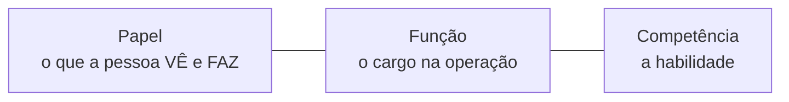

# Papéis, funções e competências

Conforme a equipe cresce, a pergunta deixa de ser "como faço?" e vira "**quem pode fazer?**". O LocFlow separa isso em três ideias simples — e você usa só o que precisar.


**Valor:** cada pessoa enxerga só o que usa. O motorista abre o app e vê **a rota dele** — não o financeiro nem o catálogo. Menos confusão, menos erro, e você delega sem medo.


## Os três conceitos

| Conceito | Responde | Exemplo |
| --- | --- | --- |
| **Papel** | O que a pessoa **acessa** no sistema (permissões) | *Motorista* só vê roteiros atribuídos a ele |
| **Função** | O **cargo** dela na operação | *Vendedor*, *Motorista*, *Atendente* |
| **Competência** | A **habilidade** que a função carrega | *Dirigir veículos*, *Vender orçamentos*, *Separação* |

A competência é o que liga a pessoa às tarefas: um canal de notificação "por competência" entrega só para quem tem aquela habilidade (ex.: avisos de follow-up vão para quem tem **Vender orçamentos**).

## Papéis prontos (você não monta do zero)

O LocFlow já vem com papéis de cada cargo — é só escolher ao convidar alguém:

| Papel | Para quem | Enxerga |
| --- | --- | --- |
| **Operador / Atendente** | Gestão e dia a dia | Orçamentos, frota, roteiros, equipe |
| **Motorista** | Quem roda a rota | Só os roteiros atribuídos a ele |
| **Separador** | Galpão (ida) | A fila *A separar → Separado* |
| **Conferente** | Galpão (volta) | A fila *A conferir → Conferido* |
| **Operador de Balcão** | Loja física (as duas pontas) | O [balcão](../logistica/balcao.md) — entrega **e** recebe do cliente, e pode registrar **em lote** |
| **Parceiro Externo** | Freteiro/parceiro | Roteiros e acordos combinados |


O **dono** entra como **Superadmin** (acesso total) — por isso, quem está sozinho nem percebe que papéis existem. Eles só aparecem quando você convida a primeira pessoa.


## Como isso escala (a filosofia na prática)

| Porte | Como você usa |
| --- | --- |
| **Começando** | Só o dono, acesso total. Nada a configurar. |
| **Crescendo** | Convida a equipe com os **papéis prontos** — um clique por pessoa. |
| **Estruturada** | **Personaliza** papéis e funções, permissão a permissão, por cargo. |

## Próximo passo

Para convidar e dar acesso, veja [Colaboradores e acessos](../configuracoes/colaboradores-e-acessos.md).
