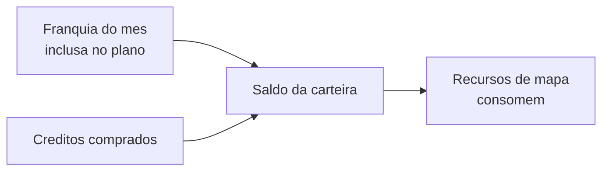

# Minha assinatura e créditos

Em **Minha assinatura** você acompanha o seu **plano** (o contrato com o LocFlow) e a sua **carteira de créditos** (usada em alguns recursos de mapa). São duas coisas separadas, em abas diferentes da mesma tela.

## Plano & faturas

É o seu contrato com o LocFlow. Aqui você vê em que plano está, o **ciclo de cobrança** e o **status** atual.

| Situação | O que significa |
| --- | --- |
| **Teste (trial)** | Período gratuito para experimentar. Sem cobrança até o fim do teste. |
| **Pago / ativo** | Contrato em vigor, cobrado a cada ciclo (mensal/anual). |

Nessa aba você também acompanha suas **faturas do LocFlow** e os **limites de uso** do plano. Conforme a permissão do seu usuário, dá para **alterar** ou **cancelar** o contrato e **pagar** uma fatura em aberto.


Recursos premium (como o [Domínio personalizado](dominio-personalizado.md)) dependem do plano. A disponibilidade aparece aqui, em **Minha assinatura**.


## Créditos

Alguns recursos que usam **mapas do Google** consomem créditos — eles cobrem o custo desses serviços. Seu plano já vem com uma **franquia mensal** de créditos; se precisar de mais, você compra.

### O que consome crédito

Só recursos que de fato chamam o mapa do Google. O que não usa mapa **não consome nada**.

| Ação | Consome? |
| --- | --- |
| Calcular **endereço no mapa** (geocodificação) de galpão/frete | Sim |
| **Traçar a rota** real do roteiro | Sim |
| **Otimizar a rota** (melhor ordem das paradas) — cobra por parada | Sim |
| Mostrar o pino no cadastro / onboarding | Não (é gratuito) |


Recursos que consomem crédito ficam sinalizados na própria tela, para você não ser pego de surpresa. O cálculo é reaproveitado quando possível (fica em cache), evitando cobrar de novo pela mesma coisa.


### Onde ver o saldo

Na aba **Créditos** você acompanha:

* **Sua carteira** — saldo total disponível, separado em **franquia do mês** (quanto ainda resta da franquia inclusa) e **comprados**.
* **Comprar créditos** — avulso (paga só o que precisa) ou em **pacotes** (leva mais por menos). Depende de permissão.
* **Extrato** — cada movimentação: entradas (compras, renovação da franquia) e saídas (consumo), com data e descrição.

O saldo atualiza **em tempo real** — assim que um recurso consome, o extrato registra.


**Valor:** a **otimização de rota** acerta a melhor ordem das paradas e o traçado real. Para uma operação com várias entregas no dia, isso é menos quilômetro rodado, menos combustível e mais entregas por motorista — um consumo pequeno de crédito que se paga rápido.


## Situações reais

* **Vou testar antes de pagar.** Durante o **teste**, use o LocFlow à vontade — sem cobrança. Ao final, escolha o plano em **Plano & faturas**.
* **Acabou a franquia no fim do mês.** Você fez muitas otimizações de rota e a franquia do mês acabou. Compre um pacote de créditos na aba **Créditos** e siga operando; a franquia renova no próximo ciclo.
* **Conferir um consumo.** Achou estranho um gasto? Abra o **Extrato** — cada linha mostra o que consumiu, quando e quanto.

## Próximo passo

* Use bem os créditos de rota em [Planejando o roteiro](../logistica/planejando-o-roteiro.md).
* Veja os recursos premium ligados ao plano em [Domínio personalizado](dominio-personalizado.md).
* Em dúvida? Veja [onde tirar dúvidas](../primeiros-passos/onde-tirar-duvidas.md).
