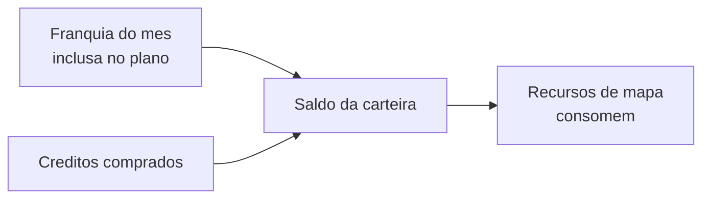

# Minha assinatura e créditos

Em **Minha assinatura** você acompanha duas coisas separadas, em abas diferentes da mesma tela:

* **Plano & faturas** — o seu **contrato com o LocFlow**: em que plano você está, o ciclo de cobrança e o status.
* **Créditos** — a sua **carteira**, usada por alguns recursos de mapa.

São coisas distintas. Mexer numa não mexe na outra.


A **assinatura do LocFlow** (o que você paga *para usar o sistema*) não tem nada a ver com as cobranças que **você emite para os seus clientes** por locação ou venda. Para receber dos seus clientes, veja [Pagamento online](../cobranca/pagamento-online.md).


## A assinatura é comprada na web {#assinatura-na-web}

Pelas regras das lojas de aplicativos (Google Play e App Store), **comprar, trocar de plano e comprar créditos só acontece no navegador**, no painel web do LocFlow. No celular essas telas são **apenas para acompanhar** — você vê plano, status, faturas e saldo, mas a compra em si é feita na web.


No app, ao tentar uma ação de compra você verá um aviso explicando isso. No Android aparece o botão **"Gerenciar no painel web"** (que leva à área da sua conta). No iPhone, a mensagem é mais neutra e orienta falar com o administrador da conta. Em qualquer caso: **abra o navegador para comprar ou trocar de plano.**


## Plano & faturas {#plano-e-faturas}

É o seu contrato com o LocFlow. Aqui você vê o plano, o **ciclo de cobrança** (mensal ou anual) e o **status** atual.

### Os planos por nível {#planos-por-nivel}

O LocFlow tem planos de diferentes **níveis** — do mais enxuto, para quem está começando, aos mais completos, para operações maiores. Quanto maior o nível, mais limites de uso e mais recursos liberados (alguns recursos premium, como o [Domínio personalizado](dominio-personalizado.md), só aparecem a partir de certo plano).


A escolha de qual plano cabe na sua operação é assunto da página de planos no site. Aqui na ajuda a gente só explica **como funciona** a tela — sem nomes nem valores, que mudam com o tempo.


### O status do contrato {#status-do-contrato}

O selo ao lado do plano mostra em que pé está a sua assinatura:

| Status | O que significa |
| --- | --- |
| **Em teste** | Período gratuito para experimentar. **Sem cobrança** até o teste acabar. |
| **Ativo** | Contrato em vigor, cobrado a cada ciclo. Tudo certo. |
| **Pagamento pendente** | Falta concluir o pagamento para o plano começar a valer. |
| **Em carência** | Houve um problema com o pagamento; atualize o método para não perder acesso. |
| **Inadimplente** | Há fatura em atraso. Quite para destravar o plano e voltar ao normal. |
| **Cancelado** | A cobrança recorrente foi encerrada. Dá para **reativar** quando quiser. |

### Período de teste (trial) {#periodo-de-teste}

Durante o teste você usa o LocFlow à vontade, **sem nenhuma cobrança**. A tela mostra quantos **dias de teste grátis** faltam e a data em que ele termina. Quando o teste acaba, a tela passa a exibir a data da **próxima cobrança**.


No período de teste, em **Meu contrato** aparece *"Sem cobrança no período de teste. Depois, vale a mensalidade do plano contratado."* — ou seja, você só começa a pagar quando o teste vira plano pago.


### Faturas, limites e troca de plano {#faturas-e-limites}

Ainda na aba **Plano & faturas**, conforme a permissão do seu usuário, você encontra:

* **Meu contrato** — plano, status, ciclo e datas do período.
* **Minhas faturas** — histórico, vencimentos e pagamento das faturas do LocFlow.
* **Meus limites** — o uso do mês contra as cotas do seu plano (mês a mês).
* **Editar contrato** — trocar de plano (sempre na web). Com faturas em aberto, a troca fica bloqueada até a quitação.
* **Zona de perigo** — o **cancelamento** do contrato.


**Cancelar o contrato** encerra a cobrança recorrente na hora, mas a sua organização e os perfis continuam no LocFlow — é só **reativar** quando quiser voltar a operar.


### Direito de arrependimento (7 dias) {#arrependimento-cdc}

Se você acabou de assinar e mudou de ideia, o **Código de Defesa do Consumidor** garante o **arrependimento em até 7 dias**. Na seção **Meu contrato**, em *"Reembolso por arrependimento"*, o LocFlow consulta se você ainda está no prazo e mostra:

* o **valor estimado do reembolso integral** da cobrança inicial;
* **quantos dias faltam** para encerrar o prazo e a data final.

Ao solicitar, a cobrança inicial é **estornada por inteiro**, a assinatura é encerrada e o contrato fica cancelado. O estorno em si segue os prazos do seu **banco / operadora do cartão**.


A entrada é discreta e só consulta o prazo quando você toca nela. Se o prazo já passou (ou não se aplica), a própria tela explica o motivo.


## Créditos {#creditos}

Alguns recursos que usam **mapas do Google** consomem **créditos** — eles cobrem o custo desses serviços. Pense neles como uma "moeda" só para o mapa. Seu plano já vem com uma **franquia mensal** de créditos; se precisar de mais, você compra (na web).

### O que consome crédito {#o-que-consome}

Só os recursos que de fato **chamam o mapa do Google**. O que não usa mapa **não consome nada**.

| Ação | Consome? |
| --- | --- |
| Calcular o **endereço no mapa** (geocodificação) de um galpão ou no cálculo de frete | Sim |
| **Traçar a rota** real do roteiro | Sim |
| **Otimizar a rota** (melhor ordem das paradas) — cobra **por parada** | Sim |
| Mostrar o pino no cadastro / no onboarding | **Não** (é gratuito) |


Recursos que consomem crédito ficam **sinalizados na própria tela**, para você não ser pego de surpresa. E o cálculo é **reaproveitado** quando possível (fica em cache), evitando cobrar de novo pela mesma coisa.


### Sua carteira e o saldo {#carteira-e-saldo}

A aba **Créditos** mostra a sua carteira com o **saldo total disponível**, separado em:

* **Franquia do mês** — quanto ainda resta da franquia inclusa no plano (ex.: *"80 de 200"*).
* **Comprados** — créditos que você comprou e que não expiram com o mês.

O consumo gasta primeiro o que faz sentido para o seu saldo; a franquia **renova no próximo ciclo**. Saldos grandes aparecem de forma compacta (ex.: *"12,3 K"*), para você ler sem uma parede de números.

O saldo atualiza **em tempo real**: assim que um recurso consome, o **Extrato** registra.

### Comprar créditos {#comprar-creditos}

Comprar créditos é feito **na web** (lembra do aviso lá em cima). Quando você compra, escolhe entre:

* **Avulso** — paga só pelo que precisa, ajustando a quantidade.
* **Pacotes** — leve mais por menos; quanto maior o pacote, maior a **economia** (aparece um selo de desconto).


A compra depende de **permissão** (gerenciar o contrato). No app, em vez dos botões de compra, aparece o aviso para concluir no painel web.


### Extrato {#extrato}

No **Extrato** você confere cada movimentação, com data e descrição:

* **Entradas** (verde, com `+`) — compras e a renovação da franquia do mês.
* **Saídas** (com `−`) — cada consumo de mapa (geocodificar, traçar ou otimizar rota).

Achou um gasto estranho? O Extrato mostra exatamente **o que consumiu, quando e quanto**.


**Por que isso vale a pena:** a **otimização de rota** acerta a melhor ordem das paradas e o traçado real. Numa operação com várias entregas no dia, isso é menos quilômetro rodado, menos combustível e mais entregas por motorista — um consumo pequeno de crédito que se paga rápido.


## Situações reais {#situacoes-reais}

* **Vou testar antes de pagar.** Durante o teste, use à vontade — sem cobrança. Ao final, escolha o plano (no navegador, pela página **Plano & faturas**).
* **Me arrependi logo depois de assinar.** Dentro de 7 dias, abra *"Reembolso por arrependimento"* em **Meu contrato**: a tela mostra o prazo e o valor do estorno integral.
* **Acabou a franquia no fim do mês.** Fez muitas otimizações de rota e a franquia acabou? Compre créditos (na web) e siga operando; a franquia renova no próximo ciclo.
* **Estou no celular e quero trocar de plano.** No app é só acompanhar. Abra o **painel web** no navegador para trocar de plano ou comprar créditos.
* **Conferir um consumo.** Abra o **Extrato** — cada linha mostra o que consumiu, quando e quanto.

## Próximo passo {#proximo-passo}

* Use bem os créditos de rota em [Planejando o roteiro](../logistica/planejando-o-roteiro.md).
* Veja os recursos premium ligados ao plano em [Domínio personalizado](dominio-personalizado.md).
* Para receber dos seus clientes (que é outra coisa), veja [Pagamento online](../cobranca/pagamento-online.md).
* Em dúvida? Veja [onde tirar dúvidas](../primeiros-passos/onde-tirar-duvidas.md).
