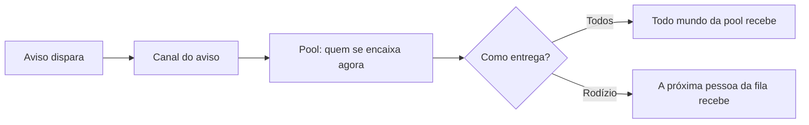

# Canais de notificação

Em vez de dizer, em cada aviso, "quem recebe isto", você configura **canais** e os **reaproveita**. Um **canal** responde a duas perguntas:

* **Quem recebe?** — a **pool** (de onde saem os destinatários).
* **Como chega?** — **Todos** (todo mundo da pool) ou **Rodízio** (um por vez, em revezamento).

Aí, em cada aviso da [Central de Notificações](central-de-notificacoes.md), você só **aponta para um canal**. Mudou o canal? Todos os avisos que o usam acompanham — sem reconfigurar um por um.


Quando você abre a lista de canais, o LocFlow lembra: *"Canais definem quem recebe e como (todos, por competência, responsável ou rodízio). Um canal pode ser reaproveitado em vários avisos."*


## O que é um canal 

Pense no canal como uma **lista de distribuição inteligente**. Ele não guarda nomes de pessoas; guarda uma **regra** de quem deve receber. Quando o aviso dispara, o sistema resolve a regra **na hora** e entrega para quem se encaixa naquele momento.

Por isso um canal "por competência" sempre acerta o alvo: se um colaborador novo ganha a competência, ele **já entra** na pool, sem você mexer no canal.

## Quem recebe: a pool 

A **pool** é a origem dos destinatários. Você pode escolher uma ou **combinar várias** num mesmo canal.

### Toda a organização 

Todo mundo da sua organização entra na pool. Bom para avisos que interessam ao time inteiro (ex.: a equipe saiu do galpão).

### Por competência 

Só quem tem a **competência** marcada entra na pool. As competências disponíveis são:

* **Vender orçamentos**
* **Operar logística**
* **Conferência**
* **Separação**
* **Dirigir veículos**

A competência vem da **função** de cada colaborador. Para um canal por competência funcionar, atribua a competência às pessoas certas — veja [Papéis, funções e competências](../conceitos/papeis-funcoes-competencias.md). Assim o canal entrega **só para quem tem a habilidade** — e, no modo rodízio, reveza entre elas.

### Responsável pela operação 

Mira **quem está por trás daquela operação**, descoberto pelo sistema, sem você nomear ninguém. Na **logística**, é **quem está executando a rota** (o motorista/condutor). É a forma de falar **direto com a pessoa certa** sobre algo que só diz respeito a ela.

### Cliente 

A pool **Cliente** mira o contato do pedido (por exemplo, lembretes via WhatsApp).


A pool **Cliente** está **em breve**: depende de recursos de mensagem ao cliente que ainda estão chegando. Por ora, monte canais com **organização**, **competência** e **responsável pela operação**.


## Como entrega: Todos ou Rodízio 

Definida a pool, escolha **como** ela vira destinatário. É uma escolha **única** por canal.

### Todos 

*"Envia para todos."* Todo mundo da pool recebe o mesmo aviso. Use quando o aviso é informação que **todos do grupo** devem ter.

### Rodízio 

*"1 pessoa por vez."* Cada novo aviso vai para a **próxima pessoa** da pool, em revezamento. Use para **dividir a carga** de um grupo que faz a mesma tarefa.

> **Exemplo.** Pedro e João têm a competência **Vender orçamentos**. Com um canal de **rodízio** sobre essa competência, os avisos de follow-up se dividem: o 1º vai para o Pedro, o 2º para o João, o 3º para o Pedro… A mesma ideia serve para **separadores** ou **conferentes** dividindo ordens.


A distribuição do rodízio é **justa mesmo quando um aviso é reprocessado**: ninguém da fila é "pulado".


## Canais padrão 

Toda organização já vem com canais prontos — você não monta tudo do zero:

| Canal | Quem recebe | Como entrega |
| --- | --- | --- |
| **Organização** | Toda a organização | Todos |
| **Responsável pela operação** | Quem está por trás da operação (ex.: quem executa a rota) | — |
| **Vendedores (rodízio)** | Competência *Vender orçamentos* | Rodízio |

Na lista, um canal padrão traz o selo **"Recebe por padrão"**. Você pode **editar a pool e o roteamento** dele e reaproveitá-lo nos avisos — mas **não pode removê-lo**, porque ele é a opção que os avisos usam quando você não escolhe outra.


Ao abrir um canal padrão, o LocFlow avisa: *"Este canal recebe os avisos por padrão — você pode ajustar, mas não remover."*


## Criar um canal 

Na lista de canais, toque no **+** para criar um. Preencha:

1. **Nome** — como você reconhece o canal (ex.: *Vendedores (rodízio)*).
2. **Descrição** (opcional) — o que este canal faz.
3. **Como entrega** — **Todos** ou **Rodízio**.
4. **Quem recebe** — marque uma ou mais pools (e, em *Por competência*, marque as competências).
5. **Ativo** — deixe ligado para o canal ficar disponível para uso.

Salve. O canal novo já aparece para ser escolhido em qualquer aviso da Central de Notificações.


Você chega à gestão de canais por **Ajustes → Central de Notificações → Gerenciar canais**, ou direto pelo seletor de canal de um aviso (botão **Gerenciar canais**).


## Editar um canal 

Toque no canal na lista para editar **nome, descrição, pool e roteamento**. A mudança vale **imediatamente** para **todos os avisos** que apontam para ele — esse é o ponto de reaproveitar canais.

Um canal pode ser deixado **Inativo** (badge **"Inativo"** na lista) quando você quer guardá-lo sem usá-lo por enquanto.

## Remover um canal 

Para apagar um canal (que **não** seja padrão), abra-o e use **Remover canal**, na zona ao final da tela. Você confirma a remoção num diálogo.

### Remover desvincula de todos os avisos 


*"Remover este canal o desvincula de todos os avisos que o usam."* Os avisos que apontavam para ele deixam de tê-lo — revise depois quais canais esses avisos passam a usar.


Por isso, antes de remover um canal que está em uso, vale **conferir quais avisos** dependem dele e, se for o caso, **apontá-los para outro canal** primeiro. Canais **padrão** não podem ser removidos (eles seguram a opção que os avisos usam por padrão).

## Situações reais 

* **"Meus dois vendedores estão recebendo todos os follow-ups."** Crie (ou ajuste para) um canal de **Rodízio** sobre a competência **Vender orçamentos** e aponte o aviso de follow-up para ele. Os novos avisos passam a se dividir, um para cada vez.
* **"Só quem está na rota deveria receber o aviso de ajuste em execução."** Use um canal com a pool **Responsável pela operação** — o sistema resolve, na hora, quem está executando aquela rota.
* **"Contratei um separador novo e ele não recebe os avisos de separação."** O canal por competência está certo; falta dar a **competência Separação** à **função** dele. Veja [Papéis, funções e competências](../conceitos/papeis-funcoes-competencias.md).
* **"Criei um canal de teste e quero apagar."** Abra o canal e use **Remover canal**. Confira antes se algum aviso o estava usando — ele será desvinculado deles.

## Próximo passo 

* [Central de Notificações](central-de-notificacoes.md) — escolha qual canal cada aviso usa, ligue/desligue avisos e ajuste o nível de atenção.
* [Papéis, funções e competências](../conceitos/papeis-funcoes-competencias.md) — atribua competências para os canais "por competência" entregarem certo.
