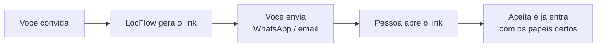

# Colaboradores e acessos

Quando você está sozinho, o LocFlow faz tudo por você — com acesso total. Conforme a equipe chega, a pergunta vira "**quem pode fazer o quê?**". Aqui você convida pessoas, define o que cada uma acessa e organiza as habilidades da operação.

Antes de continuar, vale entender a ideia por trás disso em [Papéis, funções e competências](../conceitos/papeis-funcoes-competencias.md) — é o conceito que esta tela coloca em prática.


**Valor:** cada pessoa enxerga só o que usa. O motorista abre o app e vê **a rota dele** — não o financeiro nem o catálogo. Você delega sem medo, evita erro e ganha tempo: convidar alguém é mandar **um link** pelo WhatsApp.


## Convidar é mandar um link

No LocFlow você **não define a senha** da pessoa, e informar o e-mail é **opcional**. O convite gera um **link** — e esse link É a credencial. Você manda por WhatsApp, e-mail ou qualquer app, e quem recebe entra direto.

No convite você informa **o nome** de quem está chamando, **um ou mais papéis** e — se quiser — o **e-mail** da pessoa (opcional). Informar o e-mail **vincula o convite a ele**: só quem entrar com esse e-mail consegue aceitar, uma camada extra de segurança para o link não cair em mãos erradas. Deixou em branco? Qualquer um com o link aceita. Quem aceita pode entrar pelo navegador, sem instalar nada, ou pelo app LocFlow se já tiver instalado — e cai direto na tela de aceitar, sem o cadastro de empresa nova.


Como o link é a credencial, **trate-o como uma senha**: mande só para a pessoa certa. O convite tem **prazo de validade**; se expirar, é só gerar outro. Convites enviados ficam visíveis em **Convites pendentes**, onde você pode **copiar o link** de novo a qualquer momento.


## Papéis prontos (você não monta do zero)

O LocFlow já vem com um papel para cada cargo. No convite, basta marcar. O **papel** controla o que a pessoa **acessa** no sistema:

| Papel | Para quem | O que enxerga |
| --- | --- | --- |
| **Operador / Atendente** | Gestão e dia a dia | Orçamentos, frota, roteiros, equipe |
| **Motorista** | Quem roda a rota | Só os roteiros atribuídos a ele |
| **Separador** | Galpão (ida) | A fila *A separar → Separado* |
| **Conferente** | Galpão (volta) | A fila *A conferir → Conferido* |
| **Parceiro** | Freteiro / parceiro externo | Roteiros e acordos combinados |


O **dono** entra como acesso total — por isso, quem está sozinho nem percebe que papéis existem. Eles só aparecem quando você convida a primeira pessoa.


### Vários papéis na mesma pessoa

No mesmo convite você pode marcar **mais de um papel**. É comum: um colaborador que **dirige a rota** e também **confere o material na volta** recebe *Motorista* + *Conferente*. Ao aceitar, todos os papéis marcados são atribuídos de uma vez — sem precisar de dois convites.

Antes de convidar, você pode tocar no ícone de **olho** ao lado de cada papel para ver **exatamente quais permissões** ele inclui.

## Personalizar um papel ou função

Os papéis prontos resolvem a maioria dos casos. Quando a sua operação pede algo sob medida, você personaliza — sem perder o original:

* **Personalizar um papel:** parte de um papel do sistema (ex.: *Atendente*) e ajusta as permissões, criando uma cópia só da sua organização. Também dá para **criar um papel do zero** pelo link "Criar papel personalizado".
* **Criar uma função nova:** funções dizem **o que a pessoa sabe fazer** (competências). Você pode criar funções próprias ou personalizar as do sistema.

Tudo isso fica na aba **Funções & Papéis**, que mostra as duas camadas lado a lado: **Funções** (operacional) e **Papéis** (acesso). Itens do sistema aparecem com a etiqueta *Sistema*; os seus, com *Personalizado*.

### As competências (o que a pessoa sabe fazer)

A **função** reúne competências. Elas não dão acesso a telas — dizem **habilidade**, e é por elas que a logística sabe quem pode fazer cada tarefa. As competências do LocFlow são:

| Competência | Habilita | Observação |
| --- | --- | --- |
| **Dirigir Veículos** | Conduzir veículos da frota | Depende de CNH válida |
| **Vender Orçamentos** | Emitir e conduzir orçamentos (aluguel ou venda) | — |
| **Operar Logística** | Operar roteiros, entregas e retiradas | — |
| **Separação** | Separar e preparar o material para envio | — |
| **Conferência** | Conferir o material no retorno ao galpão | — |


Papel e função são **eixos diferentes**: o papel libera **o que a pessoa vê**; a função registra **o que ela sabe fazer**. Um *Motorista* tem o papel de motorista (vê só a rota dele) e a função de motorista (competência *Dirigir Veículos*, que pede CNH).


## Quem já está cadastrado

A aba **Pessoas** lista a equipe em três grupos:

* **Com acesso** — quem já tem login ativo.
* **Sem acesso** — colaboradores cadastrados que ainda não entram no sistema. Use **Conceder acesso** para enviar o convite.
* **Convites pendentes** — convites enviados aguardando o aceite (com link para copiar de novo).

Em cada pessoa você ajusta **funções e CNH** e vê eventuais **pendências** (por exemplo, motorista sem CNH cadastrada).

## Situações reais

* **Convidar um motorista.** Você contratou um motorista. Em **Pessoas → Convidar**, escreva o nome dele e marque o papel **Motorista**. Gere o link, toque em **Copiar link** e mande no WhatsApp. Ele abre, aceita e já vê **só os roteiros atribuídos a ele**. Depois, na ficha dele, cadastre a CNH para liberar a competência *Dirigir Veículos*.
* **Pessoa que faz duas coisas.** Seu ajudante de galpão também sai para conferir devoluções. No convite, marque **Separador** e **Conferente** juntos — um link só.
* **Atendente sem acesso ao financeiro.** O papel *Operador / Atendente* já não abre dados sensíveis de cobrança que você não queira expor; se precisar de algo ainda mais restrito, **personalize** o papel removendo as permissões que sobram.


As opções desta tela dependem das **permissões** do seu usuário. Se você não vê "criar papel" ou "personalizar", seu perfil não tem esse acesso — fale com quem administra a conta.


## Próximo passo

* Entenda o modelo por trás disso em [Papéis, funções e competências](../conceitos/papeis-funcoes-competencias.md).
* Veja como tudo se encaixa no [Ciclo de um pedido](../conceitos/ciclo-de-um-pedido.md).
* Em dúvida com um termo? Consulte o [Glossário](../primeiros-passos/glossario.md) ou veja [onde tirar dúvidas](../primeiros-passos/onde-tirar-duvidas.md).
