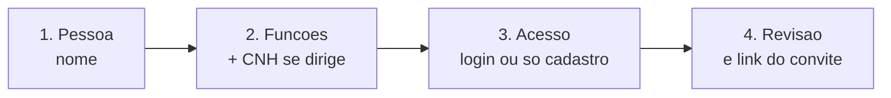
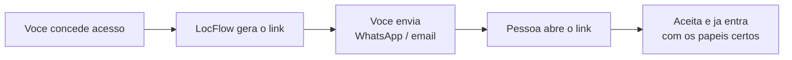

# Colaboradores e acessos

Quando você está sozinho, o LocFlow faz tudo por você — com acesso total. Conforme a equipe chega, a pergunta vira "**quem pode fazer o quê?**". Aqui você cadastra pessoas, define o que cada uma acessa e organiza as habilidades da operação.

Antes de continuar, vale entender a ideia por trás disso em [Papéis, funções e competências](../conceitos/papeis-funcoes-competencias.md) — é o conceito que esta tela coloca em prática.


**Valor:** cada pessoa enxerga só o que usa. O motorista abre o app e vê **a rota dele** — não o financeiro nem o catálogo. Você delega sem medo, evita erro e ganha tempo: dar acesso a alguém é mandar **um link** pelo WhatsApp.


## Cadastrar é diferente de dar acesso

São duas coisas separadas, e essa é a primeira escolha que muda tudo:

* **Cadastrar** registra a pessoa na sua equipe — com nome, funções e dados como a CNH. Ela aparece na lista, mas **não entra** no sistema.
* **Dar acesso** gera o **convite** (um link) para essa pessoa fazer login e usar o app ou o navegador.

Você pode fazer as duas coisas de uma vez (no cadastro guiado, basta dizer que a pessoa terá login) ou só cadastrar agora e **conceder acesso depois**, quando quiser. É comum cadastrar o time inteiro de uma vez e ir liberando o acesso conforme cada um começa.

## Cadastro guiado em 4 passos

Toque no **+** na aba **Pessoas** para abrir o **Novo colaborador**. Ele é um assistente que vai te guiando — você avança em **Continuar** e pode **Voltar** a qualquer momento sem perder o que já preencheu.

| Passo | O que você define |
| --- | --- |
| **1. Pessoa** | O **nome** do colaborador. Só isso para começar. |
| **2. Funções** | O que ela faz na operação (dirigir, vender, separar…). Se uma função pede **dirigir**, aparece um bloco para a **CNH**. |
| **3. Acesso** | Vai ter login? Se **sim**, você escolhe **onde** ela usa (app ou navegador), o **e-mail** (opcional) e os **papéis**. Se **não**, fica só cadastrada. |
| **4. Revisão** | Um resumo de tudo. Se houver login, o **link do convite** aparece pronto para copiar ou enviar. |


Você só consegue avançar quando o passo está completo: no passo 1, o nome; no passo 3 (com login), pelo menos um papel marcado e o e-mail válido, se preenchido. Os outros passos são livres.


### O atalho inteligente dos papéis

No passo 3, o LocFlow já **sugere os papéis** com base nas funções que você marcou — por exemplo, escolheu a função de dirigir, ele propõe o papel **Motorista**. A sugestão vem pré-marcada; você ajusta à vontade. E ele também já **pré-seleciona o dispositivo**: quem dirige tende a usar o **app no celular**; os demais, o **navegador** (você pode trocar).

## Conceder acesso a quem já está cadastrado

Para uma pessoa que está em **Sem acesso**, toque em **Conceder acesso →** no card dela. Aqui você não repete o cadastro — só decide o acesso:

* **Papéis** — marque um ou mais (veja [as permissões de cada um](#papeis-prontos)).
* **Onde vai usar** — app no celular ou navegador no computador.
* **E-mail** (opcional) — vincula o convite, como no cadastro.

Toque em **Gerar convite e enviar**: o link nasce na hora, pronto para copiar e mandar.

## Convidar é mandar um link

No LocFlow você **não define a senha** da pessoa, e informar o e-mail é **opcional**. O convite gera um **link** — e esse link É a credencial. Você manda por WhatsApp, e-mail ou qualquer app, e quem recebe entra direto.

Quem aceita pode entrar pelo navegador, sem instalar nada, ou pelo app LocFlow se já tiver instalado — e cai direto na tela de aceitar, sem o cadastro de empresa nova.

### Onde a pessoa vai usar (app ou navegador)

No convite você escolhe **como o link se comporta ao ser aberto**, com a pergunta *"Como [nome] vai usar a LocFlow?"*:

| Opção | Para quem | Por quê |
| --- | --- | --- |
| **Aplicativo no celular** | Motoristas e equipe de campo | Entregas, separação e rotas se fazem na rua, no celular. |
| **Navegador no computador** | Escritório / administrativo | Orçamentos, cobrança e relatórios pedem tela maior. |

Não é uma trava — é só por onde o link abre primeiro. A pessoa continua podendo usar os dois.

### O e-mail vinculado (camada extra)

Informar o **e-mail** no convite **o vincula àquela pessoa**: só quem entrar autenticado com esse e-mail consegue aceitar. É uma camada extra de segurança para o link não cair em mãos erradas. Deixou em branco? Qualquer um com o link aceita.


Como o link é a credencial, **trate-o como uma senha**: mande só para a pessoa certa. O convite tem **prazo de validade**; se expirar, é só gerar outro. Convites enviados ficam visíveis em **Convites pendentes**, com o link para **copiar de novo** a qualquer momento.


## Papéis prontos (você não monta do zero)

O LocFlow já vem com um papel para cada cargo. No convite, basta marcar. O **papel** controla o que a pessoa **acessa** no sistema:

| Papel | Para quem | O que enxerga |
| --- | --- | --- |
| **Operador / Atendente** | Gestão e dia a dia | Orçamentos, frota, roteiros, equipe |
| **Motorista** | Quem roda a rota | Só os roteiros atribuídos a ele |
| **Separador** | Galpão (ida) | A fila *A separar → Separado* |
| **Conferente** | Galpão (volta) | A fila *A conferir → Conferido* |
| **Parceiro** | Freteiro / parceiro externo | Roteiros e acordos combinados |


O **dono** entra como acesso total — por isso, quem está sozinho nem percebe que papéis existem. Eles só aparecem quando você convida a primeira pessoa.


### Vários papéis na mesma pessoa

No mesmo convite você pode marcar **mais de um papel**. É comum: um colaborador que **dirige a rota** e também **confere o material na volta** recebe *Motorista* + *Conferente*. Ao aceitar, todos os papéis marcados são atribuídos de uma vez — sem precisar de dois convites.

Antes de convidar, você pode tocar no ícone de **olho** ao lado de cada papel para ver **exatamente quais permissões** ele inclui.

## A CNH do motorista (avisa, nunca bloqueia)

Quando você escolhe uma função que **exige dirigir**, aparece um bloco de **CNH**. Você informa:

* **Número** da habilitação;
* **Categoria(s)** — **A**, **B**, **C**, **D** ou **E** (pode marcar mais de uma);
* **Validade**.

A regra de ouro: **a CNH nunca trava o cadastro**. Você pode concluir sem ela ou com ela vencida — o LocFlow só **avisa**.


Sem CNH válida, fica **pendente** para a pessoa dirigir rotas. Você ainda pode concluir o cadastro.


A CNH é considerada **regularizada** quando tem categoria informada e **validade futura**. Se a validade já passou, o aviso fica mais forte: *"CNH vencida — precisa de renovação. Fica pendente para dirigir rotas até a validade ser atualizada."* É uma pendência que aparece no card da pessoa (veja [Pendências](#pendencias)) — ela não some sozinha, mas também não impede você de seguir trabalhando.

## O veículo padrão do condutor

Para quem **dirige**, a ficha do colaborador (em **Editar**) traz um campo de **Veículo padrão**: o veículo que essa pessoa usa no dia a dia. Você busca pela **placa** e seleciona.

Para que serve? Para **adiantar o seu trabalho**: ao atribuir ou executar um roteiro com esse colaborador, o LocFlow já **infere** o veículo dele — você não precisa escolher toda vez. É opcional, aparece **só para quem dirige**, e dá para **limpar** quando quiser (tocando no **X** ao lado).


O veículo padrão é uma **sugestão**, não uma amarra: no roteiro você pode trocar para outro veículo da [frota](../cadastros/frota.md) sempre que precisar.


## Personalizar um papel ou função

Os papéis prontos resolvem a maioria dos casos. Quando a sua operação pede algo sob medida, você personaliza — sem perder o original:

* **Personalizar um papel:** parte de um papel do sistema (ex.: *Atendente*) e ajusta as permissões, criando uma cópia só da sua organização. Também dá para **criar um papel do zero** pelo link "Criar papel personalizado".
* **Criar uma função nova:** funções dizem **o que a pessoa sabe fazer** (competências). Você pode criar funções próprias ou personalizar as do sistema.

Tudo isso fica na aba **Funções & Papéis**, que mostra as duas camadas lado a lado: **Funções** (operacional) e **Papéis** (acesso). Itens do sistema aparecem com a etiqueta *Sistema*; os seus, com *Personalizado*.

### As competências (o que a pessoa sabe fazer)

A **função** reúne competências. Elas não dão acesso a telas — dizem **habilidade**, e é por elas que a logística sabe quem pode fazer cada tarefa. As competências do LocFlow são:

| Competência | Habilita | Observação |
| --- | --- | --- |
| **Dirigir Veículos** | Conduzir veículos da frota | Depende de CNH válida (mas não bloqueia o cadastro) |
| **Vender Orçamentos** | Emitir e conduzir orçamentos (aluguel ou venda) | — |
| **Operar Logística** | Operar roteiros, entregas e retiradas | — |
| **Separação** | Separar e preparar o material para envio | — |
| **Conferência** | Conferir o material no retorno ao galpão | — |


Papel e função são **eixos diferentes**: o papel libera **o que a pessoa vê**; a função registra **o que ela sabe fazer**. Um *Motorista* tem o papel de motorista (vê só a rota dele) e a função de motorista (competência *Dirigir Veículos*, que pede CNH).


## Quem já está cadastrado

A aba **Pessoas** lista a equipe e os convites, e você filtra por três grupos (cada um com a contagem ao lado):

* **Com acesso** — quem já tem login ativo.
* **Sem acesso** — colaboradores cadastrados que ainda não entram no sistema. Use **Conceder acesso** para enviar o convite.
* **Convites pendentes** — convites enviados aguardando o aceite (com link para copiar de novo).

A busca encontra por **nome ou e-mail**. Em cada pessoa você ajusta **funções e CNH** em **Editar funções e CNH →** e vê eventuais **pendências**.

### As pendências do colaborador

Quando algo importante falta, o card da pessoa mostra um aviso âmbar com a **pendência** — por exemplo, um motorista sem CNH cadastrada ou com a CNH vencida. Se houver mais de uma, ele resume a quantidade.

A pendência **não impede** a pessoa de existir no sistema nem você de trabalhar; ela é um **lembrete visível** do que regularizar. No caso da CNH, basta abrir a ficha, preencher os dados e salvar — o aviso vira **ok**.

## Situações reais

* **Convidar um motorista.** Você contratou um motorista. Em **Pessoas → +**, escreva o nome, marque a função de **dirigir** e informe a **CNH** (ou conclua sem ela e regularize depois). No passo de acesso, deixe o papel **Motorista** sugerido, escolha **app no celular** e gere o link. Toque em **Copiar link** e mande no WhatsApp — ele abre, aceita e já vê **só os roteiros atribuídos a ele**.
* **Pessoa que faz duas coisas.** Seu ajudante de galpão também sai para conferir devoluções. No passo de acesso, marque **Separador** e **Conferente** juntos — um link só.
* **Cadastrar agora, liberar depois.** Você está montando o time, mas alguns só começam mês que vem. No passo de acesso, escolha **Só cadastro**. Eles ficam em **Sem acesso**, e você toca em **Conceder acesso →** no dia que cada um entrar.
* **CNH vencendo.** O sistema mostra a pendência de CNH vencida no card do motorista. Abra **Editar funções e CNH →**, atualize a **validade** e salve. O aviso some.


As opções desta tela dependem das **permissões** do seu usuário. Se você não vê "criar papel" ou "personalizar", seu perfil não tem esse acesso — fale com quem administra a conta.


## Próximo passo

* Entenda o modelo por trás disso em [Papéis, funções e competências](../conceitos/papeis-funcoes-competencias.md).
* Cadastre os veículos da equipe em [Frota](../cadastros/frota.md).
* Veja como tudo se encaixa no [Ciclo de um pedido](../conceitos/ciclo-de-um-pedido.md).
* Em dúvida com um termo? Consulte o [Glossário](../primeiros-passos/glossario.md) ou veja [onde tirar dúvidas](../primeiros-passos/onde-tirar-duvidas.md).
