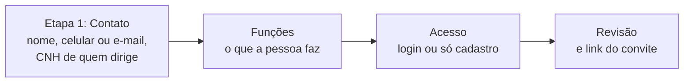
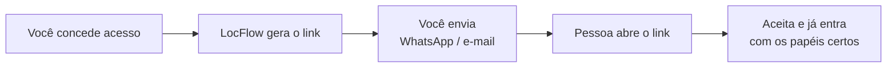

# Colaboradores e acessos

Quando você está sozinho, o LocFlow faz tudo por você — com acesso total. Conforme a equipe chega, a pergunta vira "**quem pode fazer o quê?**". Aqui você cadastra pessoas, define o que cada uma acessa e organiza as habilidades da operação.

Antes de continuar, vale entender a ideia por trás disso em [Papéis, funções e competências](../conceitos/papeis-funcoes-competencias.md) — é o conceito que esta tela coloca em prática.


**Valor:** cada pessoa enxerga só o que usa. O motorista abre o app e vê **a rota dele** — não o financeiro nem o catálogo. Você delega sem medo, evita erro e ganha tempo: dar acesso a alguém é mandar **um link** pelo WhatsApp.


## Cadastrar é diferente de dar acesso

São duas coisas separadas, e essa é a primeira escolha que muda tudo:

* **Cadastrar** registra a pessoa na sua equipe — com nome, funções e dados como a CNH. Ela aparece na lista, mas **não entra** no sistema.
* **Dar acesso** gera o **convite** (um link) para essa pessoa fazer login e usar o app ou o navegador.

Você pode fazer as duas coisas de uma vez (no cadastro, basta dizer que a pessoa terá login) ou só cadastrar agora e **conceder acesso depois**, quando quiser. É comum cadastrar o time inteiro de uma vez e ir liberando o acesso conforme cada um começa.

## Cadastro em duas etapas: a pessoa, depois funções e acesso

Na aba **Pessoas**, toque no **+** (**Cadastrar colaborador**). O cadastro tem **duas etapas**, e a primeira é o mesmo formulário de [Contatos](../cadastros/contatos.md) — porque um colaborador também é um contato da sua empresa.

```mermaid
flowchart LR
    A[Etapa 1: Contato<br/>nome, celular ou e-mail,<br/>CNH de quem dirige] --> B[Funções<br/>o que a pessoa faz]
    B --> C[Acesso<br/>login ou só cadastro]
    C --> D[Revisão<br/>e link do convite]
```

**Etapa 1 — a pessoa.** O formulário abre como **Novo colaborador**, com o tipo **Colaborador** já marcado. O obrigatório é o **nome** e pelo menos **um canal de contato** (celular ou e-mail); o documento e os demais dados são opcionais. O cartão da **CNH** já vem aberto: para quem dirige, informe ali o número, a categoria e a validade. Toque no botão redondo de **salvar** (o disquete, no canto de baixo): a pessoa já fica salva — o aviso diz *"Contato salvo. Agora, funções e acesso."* — e o app segue para a etapa 2.

**Etapa 2 — funções e acesso.** No topo aparece *"Etapa 2 de 2 · [nome] já está salvo"*, e o assistente segue em três passos (você avança em **Continuar** e pode **Voltar** sem perder nada):

| Passo | O que você define |
| --- | --- |
| **Funções** | O que a pessoa faz na operação (dirigir, vender, separar…). Marque **pelo menos uma**. Se uma função pede **dirigir**, aparece o bloco da **CNH**, já com o que você preencheu na etapa 1. |
| **Acesso** | **Sim, vai ter login** ou **Só cadastro**. Com login, você escolhe **onde** ela vai usar (app ou navegador), o **e-mail** (opcional) e **o que ela pode ver e fazer no app** — os papéis. |
| **Revisão** | Um resumo de tudo. Toque em **Concluir**. Se houver login, o **link do convite** aparece pronto para **Copiar**, **Enviar por WhatsApp** ou **Enviar por e-mail** — e, se você informou o e-mail no passo Acesso, o convite **já sai por e-mail sozinho** (o link fica em **Ver link do convite**). |


Para avançar: em **Funções**, pelo menos uma função marcada; em **Acesso**, a escolha entre login e só cadastro — e, com login, pelo menos um papel marcado e o e-mail válido, se preenchido.


### O atalho inteligente dos papéis

No passo **Acesso**, o LocFlow já **sugere os papéis** com base nas funções que você marcou — por exemplo, escolheu a função de dirigir, ele propõe o papel **Motorista**. A sugestão vem pré-marcada; você ajusta à vontade. E ele também já **pré-seleciona o dispositivo**: quem dirige tende a usar o **app no celular**; os demais, o **navegador** (você pode trocar).

## Conceder acesso a quem já está cadastrado

Para uma pessoa que está em **Sem acesso**, toque em **Conceder acesso →** no card dela. Aqui você não repete o cadastro — só decide o acesso:

* **Papéis** — marque um ou mais (veja [as permissões de cada um](#papeis-prontos)).
* **Onde vai usar** — app no celular ou navegador no computador.
* **E-mail** (opcional) — vincula o convite, como no cadastro.

Toque em **Gerar convite e enviar**: o link nasce na hora, pronto para copiar e mandar.

## Convidar é mandar um link

No LocFlow você **não define a senha** da pessoa, e informar o e-mail é **opcional**. O convite gera um **link** — e esse link É a credencial. Você manda por WhatsApp, e-mail ou qualquer app, e quem recebe entra direto.

```mermaid
flowchart LR
    A[Você concede acesso] --> B[LocFlow gera o link]
    B --> C[Você envia<br/>WhatsApp / e-mail]
    C --> D[Pessoa abre o link]
    D --> E[Aceita e já entra<br/>com os papéis certos]
```

Quem aceita pode entrar pelo navegador, sem instalar nada, ou pelo app LocFlow se já tiver instalado — e cai direto na tela de aceitar, sem o cadastro de empresa nova.

### Onde a pessoa vai usar (app ou navegador)

No convite você escolhe **como o link se comporta ao ser aberto**, com a pergunta *"Como [nome] vai usar a LocFlow?"*:

| Opção | Para quem | Por quê |
| --- | --- | --- |
| **Aplicativo no celular** | Motoristas e equipe de campo | Entregas, separação e rotas se fazem na rua, no celular. |
| **Navegador no computador** | Escritório / administrativo | Orçamentos, cobrança e relatórios pedem tela maior. |

Não é uma trava — é só por onde o link abre primeiro. A pessoa continua podendo usar os dois.

### O e-mail vinculado (camada extra)

Informar o **e-mail** no convite **o vincula àquela pessoa**: só quem entrar autenticado com esse e-mail consegue aceitar — se outra pessoa abrir o link, o LocFlow avisa *"Este convite é para fulano@… Entre com essa conta para aceitar."* É uma camada extra de segurança para o link não cair em mãos erradas. Deixou em branco? Qualquer um com o link aceita.

**E tem um efeito prático:** com o e-mail preenchido, **o LocFlow envia o convite por e-mail sozinho** — você não precisa copiar e mandar. O link continua disponível na tela para você reenviar por WhatsApp se quiser.


Como o link é a credencial, **trate-o como uma senha**: mande só para a pessoa certa. O convite tem **prazo de validade**; se expirar, é só gerar outro. Convites enviados ficam visíveis em **Convites pendentes**, com o link para **copiar de novo** a qualquer momento.


## Papéis prontos (você não monta do zero)

O LocFlow já vem com um papel para cada cargo. No convite, basta marcar. O **papel** controla o que a pessoa **acessa** no sistema — no app, a lista aparece como *"O que ela pode ver e fazer no app"*:

| Papel | Para quem | O que enxerga |
| --- | --- | --- |
| **Administrador** | Sócio ou braço direito | Praticamente tudo. Só fica de fora o que **encerra a conta**: apagar a organização e mexer no contrato de assinatura (cancelar, trocar de plano, pedir reembolso) — isso continua exclusivo do dono. Ele **vê** plano, consumo e faturas normalmente |
| **Operador / Atendente** | Gestão e dia a dia | Orçamentos, contatos, cobranças, frota, roteiros, estoque e equipe — e as **notas fiscais de serviço (NFS-e) e de remessa**: emite, vê, lista e cancela. A **NF-e de venda** fica de fora: é recurso do plano Pro e quem libera é o dono ou o Administrador |
| **Motorista** | Quem roda a rota | Só os roteiros em que está escalado. **Registra** a execução quando é o **motorista responsável**; quando vai junto como **ajudante**, acompanha a rota e comenta nas paradas, sem registrar |
| **Separador** | Galpão (ida) | A fila *A separar → Separado* |
| **Conferente** | Galpão (volta) | A fila *A conferir → Conferido* |
| **Operador de Loja** | Loja física (as duas pontas) | A [Loja](../logistica/balcao.md) — entrega **e** recebe do cliente, e pode registrar **em lote** |
| **Operador de Manutenção** | Quem conserta o material | A [bancada de manutenção](../estoque/manutencao.md): manda itens para a bancada e os tira de lá, põe em quarentena o que está em dúvida, e enxerga galpões e saldos de aluguel e venda |
| **Encarregado de Manutenção** | Quem decide o destino do material | Tudo o que o Operador de Manutenção faz e, além disso, as saídas **sem volta**: o descarte (baixa do patrimônio), a reclassificação (por exemplo, do aluguel para a venda de usados) e a decisão sobre o que está em quarentena |


O **dono** entra como acesso total — por isso, quem está sozinho nem percebe que papéis existem. Eles só aparecem quando você convida a primeira pessoa.



**Mudança de acesso: o Operador / Atendente passou a emitir notas fiscais.** Todo membro que está no papel **Operador / Atendente** do sistema ganhou as permissões de **NFS-e** e de **NF-e de remessa** — inclusive em organizações que criaram uma cópia personalizada do Operador, porque criar a cópia não move ninguém para ela: quem foi convidado antes continua no papel do sistema. Só quem está **na cópia personalizada** não recebeu; para esses, marque no papel copiado as permissões de NFS-e e de NF-e de remessa (e **não** o pacote *Emitir documentos fiscais* inteiro, que também libera a NF-e de venda).

Cada ação cobra a permissão do **tipo** da nota: quem cancela NFS-e não cancela, por tabela, a NF-e de venda; quem não tem a NF-e de venda não a vê na Central de notas nem no orçamento. Quando falta algo, a recusa diz se o que falta é o **plano** ou o **papel**. E **configurar** a [Integração Fiscal](integracao-fiscal.md) continua sendo de quem administra a conta: um papel personalizado montado só com as permissões de configuração vê a Integração Fiscal, mas não a Central de notas.



**Procurando o papel de "Parceiro"? Ele não está aqui — e não deveria estar.** Parceiro é gente **de fora**, não da sua equipe, e por isso entra por outro caminho: **Rede de Parceiros → convidar parceiro**. O papel dele é fixo (você não escolhe nem edita) e dá acesso **só aos pedidos que você repassar a ele**. Veja [Entrando na rede](../parcerias/entrando-na-rede.md) e [Parceiro Logístico Externo](../parcerias/parceiro-logistico-externo.md).


### Uma permissão que vale conhecer: dispensar a evidência

Se a sua empresa exige **comprovação** (foto, vídeo, assinatura) para fechar uma entrega, retirada ou atendimento na loja, o LocFlow **não fecha o registro sem ela**. Só que nem sempre a prova é possível: quem lança no escritório o que aconteceu ontem não tem como fotografar o passado.

Para esses casos existe a **dispensa de evidência** — fechar o registro escrevendo um **motivo obrigatório**, que fica gravado junto e aparece na [auditoria](historico-de-auditoria.md). É uma permissão **separada**, e a distribuição dela tem uma lógica:

| Quem tem | Por quê |
| --- | --- |
| **O dono** e o **Administrador** | Têm, junto com todo o resto da gestão — o Administrador recebe tudo, menos o que encerra ou cobra a conta |
| **Operador / Atendente** | É a retaguarda: lança o que já aconteceu, sem ter como voltar no tempo e fotografar |
| **Operador de Loja** | Já registrava vários atendimentos de uma vez; a permissão só dá nome ao que ele fazia |
| **Motorista** e **Parceiro Externo** | **Não têm** — e não é esquecimento. Eles estão no ponto da entrega justamente para **produzir** a prova; dar a eles a chave de pular a prova esvaziaria a política. No caso do parceiro externo isso nem é configurável: o papel dele é fixo |


Se você personalizar um papel, pense duas vezes antes de incluir essa permissão em quem trabalha em campo. Ela não é um atalho de conveniência — é uma exceção que fica registrada com nome, hora e motivo.


### Vários papéis na mesma pessoa

No mesmo convite você pode marcar **mais de um papel**. É comum: um colaborador que **dirige a rota** e também **confere o material na volta** recebe *Motorista* + *Conferente*. Ao aceitar, todos os papéis marcados são atribuídos de uma vez — sem precisar de dois convites.

Antes de convidar, você pode tocar no ícone de **olho** ao lado de cada papel para ver **exatamente quais permissões** ele inclui.

## A CNH do motorista (avisa, nunca bloqueia)

A CNH entra em dois lugares — e é **uma só**: no cartão **CNH** da etapa 1 (o cadastro da pessoa) e, quando você escolhe uma função que **exige dirigir**, no bloco **"Dirigir exige CNH válida"** do passo Funções. O que você preencheu antes já chega preenchido, e editar ali **atualiza a ficha também**. Você informa:

* **Número** da habilitação;
* **Categoria** — escolha a combinação **como está na carteira**: **ACC**, **A**, **B**, **AB**, **C**, **AC**, **D**, **AD**, **E** ou **AE**;
* **Validade**.

A regra de ouro: **a CNH nunca trava o cadastro**. Você pode concluir sem ela ou com ela vencida — o LocFlow só **avisa**.


Sem CNH válida, fica **pendente** para a pessoa dirigir rotas. Você ainda pode concluir o cadastro.


A CNH é considerada **regularizada** quando tem categoria informada e **validade futura**. Se a validade já passou, o aviso fica mais forte: *"CNH vencida — precisa de renovação. Fica pendente para dirigir rotas até a validade ser atualizada."* É uma pendência que aparece no card da pessoa (veja [Pendências](#pendencias)) — ela não some sozinha, mas também não impede você de seguir trabalhando.

## O veículo padrão do condutor

Para quem **dirige**, a ficha do colaborador (em **Editar**) traz um campo de **Veículo padrão**: o veículo que essa pessoa usa no dia a dia. Você busca pela **placa** e seleciona.

Para que serve? Para **adiantar o seu trabalho**: ao atribuir ou executar um roteiro com esse colaborador, o LocFlow já **infere** o veículo dele — você não precisa escolher toda vez. É opcional, aparece **só para quem dirige**, e dá para **limpar** quando quiser (tocando no **X** ao lado).


O veículo padrão é uma **sugestão**, não uma amarra: no roteiro você pode trocar para outro veículo da [frota](../cadastros/frota.md) sempre que precisar.


## Personalizar um papel ou função

Os papéis prontos resolvem a maioria dos casos. Quando a sua operação pede algo sob medida, você personaliza — sem perder o original:

* **Personalizar um papel:** parte de um papel do sistema (ex.: *Operador / Atendente*) e ajusta as permissões, criando uma cópia só da sua organização. Também dá para **criar um papel do zero** — pelo botão **Nova permissão** ou pelo link **Criar papel personalizado**, nas telas de convite e de conceder acesso.
* **Criar uma função nova:** funções dizem **o que a pessoa sabe fazer** (competências). Você pode criar funções próprias (**Nova função**) ou personalizar as do sistema.

Tudo isso fica na aba **Acessos** do módulo Colaboradores, ao lado de **Pessoas** (no caminho do topo da tela, ela ainda aparece como *Funções & Papéis*). Ela tem dois cartões: **Funções** — o que a pessoa faz na operação — e **Permissões de acesso** — o que a pessoa pode ver e fazer dentro do app, ou seja, os **papéis**. Cada lista separa os **Personalizados** dos de **Padrão do sistema**, e os do sistema têm o botão **Personalizar**.

### Montar as permissões por atividade

Ao criar uma permissão de acesso, a escolha abre em **Por atividade**: em vez de caçar permissões uma a uma, você marca **o que a pessoa vai fazer** e o LocFlow marca as permissões por baixo. As atividades são:

| Atividade | O que inclui |
| --- | --- |
| **Cuidar de clientes e orçamentos** | Cadastrar clientes, montar orçamentos, mudar o status (reservar, vender, perder), usar os endereços salvos e manter as regras de desconto |
| **Manter o catálogo de produtos e kits** | Criar e editar produtos, kits e categorias |
| **Comandar a logística** | Planejar e atribuir roteiros, acompanhar entregas e retiradas, mudar o status logístico e gerir a frota |
| **Controlar o estoque e os galpões** | Entradas, saídas, transferências, ajustes, manutenção e baixas, além das consultas de disponibilidade |
| **Cobrar e receber dos clientes** | Faturas e parcelas, cobrança online e baixa de pagamentos recebidos |
| **Cuidar do financeiro da empresa** | Lançamentos, plano de contas, recorrências e liquidação de parcelas |
| **Emitir documentos fiscais** | Contratos, faturas de locação, NFS-e e NF-e (venda e remessa) |
| **Gerir parcerias e repasses** | Acordos com parceiros, diretório e perfil público de parceria |
| **Gerenciar a equipe e os acessos** | Cadastrar colaboradores, enviar convites e definir papéis e permissões — inclui ver o [histórico de auditoria](historico-de-auditoria.md) |
| **Configurar a empresa** | Dados e logo da organização, horários, modelos de documento, automações, notificações e integrações — **não** inclui excluir a organização |

Cada atividade abre para mostrar, item a item, o que ela concede. Prefere a lista completa? Troque para **Detalhado**, com busca. E **Ver resumo** mostra só o que está marcado, para conferir antes de salvar.


**Você só concede o que você mesmo tem.** Uma permissão que não está no seu próprio papel não pode ser dada a outra pessoa.


### As competências (o que a pessoa sabe fazer)

A **função** reúne competências. Elas não dão acesso a telas — dizem **habilidade**, e é por elas que a logística sabe quem pode fazer cada tarefa. As competências do LocFlow são:

| Competência | Habilita | Observação |
| --- | --- | --- |
| **Dirigir Veículos** | Conduzir veículos da frota | Depende de CNH válida (mas não bloqueia o cadastro) |
| **Vender Orçamentos** | Emitir e conduzir orçamentos (aluguel ou venda) | — |
| **Operar Logística** | Operar roteiros, entregas e retiradas | — |
| **Separação** | Separar e preparar o material para envio | — |
| **Conferência** | Conferir o material no retorno ao galpão | — |
| **Atendimento na loja** | Atender o cliente presencialmente na loja — as retiradas e devoluções no galpão | — |
| **Manutenção** | Reparar itens na bancada de manutenção e devolvê-los ao estoque | — |
| **Pagar contas** | Acompanhar e quitar o que a organização deve — contas a pagar e faturas de cartão | É o público do canal *Quem cuida do financeiro* |


Papel e função são **eixos diferentes**: o papel libera **o que a pessoa vê**; a função registra **o que ela sabe fazer**. Um *Motorista* tem o papel de motorista (vê só a rota dele) e a função de motorista (competência *Dirigir Veículos*, que pede CNH).


## Quem já está cadastrado

A aba **Pessoas** lista a equipe e os convites, e você filtra por três grupos (cada um com a contagem ao lado):

* **Com acesso** — quem já tem login ativo.
* **Sem acesso** — colaboradores cadastrados que ainda não entram no sistema. Use **Conceder acesso** para enviar o convite.
* **Convites pendentes** — convites enviados aguardando o aceite (com link para copiar de novo).

A busca encontra por **nome ou e-mail**. Cada cartão mostra os papéis da pessoa, eventuais **pendências** e as ações que o seu acesso permite:

| Ação no cartão | O que faz |
| --- | --- |
| **Conceder acesso →** | Para quem está **sem acesso**: gera o convite (veja acima). |
| **Copiar link** | Para quem tem **convite em aberto**: copia o link de novo, para reenviar. |
| **Editar funções e CNH →** | Ajusta as funções e os dados da habilitação. |
| **Editar papéis →** | Para quem **já tem acesso**: troca o que a pessoa pode ver e fazer no app. |
| **Excluir** | Pergunta *"Enviar para a lixeira?"*: a pessoa vai para a **Lixeira** e o acesso dela é **revogado na hora** (quem não tinha acesso simplesmente sai da equipe). |


**Excluiu por engano?** O colaborador fica em **Ajustes › Conta e segurança › Lixeira**, de onde dá para **restaurar**. Veja [Lixeira](lixeira.md).


### As pendências do colaborador

Quando algo importante falta, o card da pessoa mostra um aviso âmbar com a **pendência** — por exemplo, um motorista sem CNH cadastrada ou com a CNH vencida. Se houver mais de uma, ele resume a quantidade.

A pendência **não impede** a pessoa de existir no sistema nem você de trabalhar; ela é um **lembrete visível** do que regularizar. No caso da CNH, basta abrir a ficha, preencher os dados e salvar — o aviso vira **ok**.

## Situações reais

* **Convidar um motorista.** Você contratou um motorista. Em **Pessoas → +**, escreva o nome e o celular e preencha a **CNH** (ou siga sem ela e regularize depois); toque em **salvar**. Em **Funções**, marque a função de **dirigir**. No passo **Acesso**, deixe o papel **Motorista** sugerido, escolha **app no celular** e conclua. Toque em **Copiar** ao lado do link e mande no WhatsApp — ele abre, aceita e já vê **só os roteiros em que está escalado**.
* **Pessoa que faz duas coisas.** Seu ajudante de galpão também sai para conferir devoluções. No passo de acesso, marque **Separador** e **Conferente** juntos — um link só.
* **Cadastrar agora, liberar depois.** Você está montando o time, mas alguns só começam mês que vem. No passo de acesso, escolha **Só cadastro**. Eles ficam em **Sem acesso**, e você toca em **Conceder acesso →** no dia que cada um entrar.
* **CNH vencendo.** O sistema mostra a pendência de CNH vencida no card do motorista. Abra **Editar funções e CNH →**, atualize a **validade** e salve. O aviso some.


As opções desta tela dependem das **permissões** do seu usuário. Se você não vê "criar papel" ou "personalizar", seu perfil não tem esse acesso — fale com quem administra a conta.


## Próximo passo

* Entenda o modelo por trás disso em [Papéis, funções e competências](../conceitos/papeis-funcoes-competencias.md).
* Proteja a entrada da equipe com a [Verificação em duas etapas](verificacao-em-duas-etapas.md).
* Cadastre os veículos da equipe em [Frota](../cadastros/frota.md).
* Veja como tudo se encaixa no [Ciclo de um pedido](../conceitos/ciclo-de-um-pedido.md).
* Em dúvida com um termo? Consulte o [Glossário](../primeiros-passos/glossario.md) ou veja [onde tirar dúvidas](../primeiros-passos/onde-tirar-duvidas.md).
