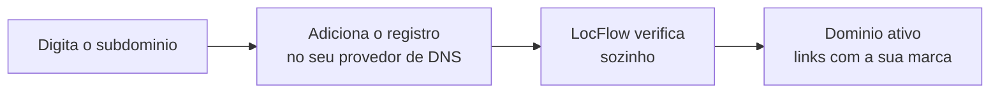

# Domínio personalizado

Toda vez que você fecha um orçamento, o LocFlow gera um [link de pagamento](../cobranca/pagamento-online.md) para enviar ao cliente. Por padrão, esse link usa o endereço oficial do LocFlow, já com o **nome da sua empresa** no caminho. Com o **domínio personalizado**, o link passa a usar **o seu próprio endereço** — sua marca do começo ao fim:

| | Endereço do link |
| --- | --- |
| **Hoje (padrão)** | `pagamento.locflow.com.br/sua-empresa/orc1` |
| **Com domínio próprio** | `pagamento.suaempresa.com.br/orc1` |

O cliente abre uma [página de pagamento](../cobranca/pagina-de-pagamento.md) com a sua cara — e o endereço também é o seu. Mais confiança, menos "isso é golpe?", mais gente pagando na hora.


**Cada orçamento ganho gera um link automático:** `…/orc1`, `…/orc2`, e assim por diante. O domínio personalizado troca só a parte da frente do endereço (o domínio) — o resto continua igual.


## É para você?

Esse é um recurso para quem já tem **domínio próprio** e quer levar a marca até o último detalhe — geralmente operações maiores, com site e e-mail no próprio domínio. Faz parte de um **plano superior**.


**Você não precisa disso para cobrar.** Mesmo sem o domínio próprio, o seu **endereço oficial LocFlow** — que já traz o nome da sua empresa — funciona desde o primeiro dia, é **gratuito e fica ativo para sempre**. O domínio personalizado é um endereço **a mais**, com a sua marca; o oficial nunca deixa de funcionar.


A disponibilidade aparece em **Ajustes → Domínio personalizado**. Se o seu plano ainda não inclui, a tela mostra um botão **Fazer upgrade**.


**A contratação ou troca de plano é feita na versão web** (no navegador). No celular, você consulta o seu plano e gerencia a assinatura, mas a compra em si acontece no site — é uma exigência das lojas de aplicativos. Veja [Minha assinatura e créditos](assinatura-e-creditos.md).


## Antes de começar

Você vai precisar de:

* Um **domínio próprio** já registrado (ex.: `suaempresa.com.br`), num provedor como **Registro.br**, GoDaddy, Hostinger, Cloudflare, entre outros.
* Acesso ao **painel de DNS** desse provedor (onde você gerencia o domínio).
* Escolher um **subdomínio dedicado** para o pagamento — recomendamos `pagamento.suaempresa.com.br`.


Use sempre um **subdomínio** (`pagamento.suaempresa.com.br`), **nunca** o domínio raiz pelado (`suaempresa.com.br`). O raiz costuma já estar em uso pelo seu site e não é aceito aqui.


## Como funciona, em 3 passos

A própria tela resume a conexão em três etapas, e acompanha o progresso de cada uma:

1. **Informe seu subdomínio** — digite o endereço onde quer receber os pagamentos.
2. **Aponte o DNS** — o LocFlow te dá **um registro** para adicionar no seu provedor de domínio, com o passo a passo.
3. **Verificação automática** — o LocFlow confirma a propagação e **emite o certificado de segurança (cadeado / HTTPS)**, sem custo extra.

## Passo a passo

1. No app, abra **Ajustes → Domínio personalizado**.
2. No campo **Domínio**, digite o endereço que você quer usar — só o domínio, **sem `https://` e sem barra** (ex.: `pagamento.suaempresa.com.br`). Toque em **Começar configuração**.
3. O LocFlow mostra um **registro de DNS** para você criar — um **CNAME**, com três campos: **Tipo**, **Nome** e **Valor (alvo)**. Toque em qualquer um para **copiar**.
4. Abra o **painel de DNS** do seu provedor de domínio e **crie esse registro exatamente como mostrado** (veja abaixo como).
5. Pronto. **Você não precisa apertar mais nada:** o LocFlow verifica sozinho de tempos em tempos. Se quiser conferir na hora, puxe a tela para baixo para **atualizar**.
6. Quando o domínio estiver pronto, o selo muda de **Aguardando DNS** para **Domínio ativo** (verde) — e seus links já passam a usar o seu endereço.


A **propagação do DNS** pode levar de alguns **minutos a algumas horas** — é normal. Você pode fechar o app e voltar depois: a verificação continua acontecendo em segundo plano e ativa assim que o domínio estiver pronto. Não precisa configurar nada de certificado/HTTPS: o LocFlow cuida do cadeado de segurança automaticamente, sem custo extra.


### O que cada estado significa

| Selo na tela | O que está acontecendo |
| --- | --- |
| **Aguardando DNS** (âmbar) | Você já registrou o domínio, mas o LocFlow ainda não confirmou o registro no seu provedor. Confira se o CNAME foi salvo certo e aguarde a propagação. |
| **Domínio ativo** (verde) | Tudo certo: o cadeado de segurança foi emitido e os links já saem com o seu endereço. |

## Como criar o registro no seu provedor

O passo 4 acontece **fora do LocFlow**, no painel de quem cuida do seu domínio. O nome das telas muda de provedor para provedor, mas o caminho é sempre parecido:

1. Entre no painel do seu provedor de domínio e procure por **"DNS"**, **"Zona DNS"** ou **"Gerenciar registros"**.
2. Clique em **adicionar registro**.
3. Preencha com os dados que o LocFlow mostrou:
   * **Tipo:** `CNAME`.
   * **Nome / Host:** o que aparece no campo **Nome** (ex.: `pagamento`).
   * **Valor / Destino / Aponta para:** o que aparece no campo **Valor (alvo)**.
4. Salve.


Copie e cole **exatamente** o que o app mostra (sem espaços a mais, sem trocar maiúsculas/minúsculas). Um caractere fora do lugar impede a verificação. Em caso de dúvida sobre onde colar, o suporte do seu provedor de domínio ajuda — esse é um procedimento comum.


## Situações reais

* **Locadora com site próprio.** Você já tem `suaempresa.com.br` para o site. Cria o subdomínio `pagamento.suaempresa.com.br` só para o LocFlow: o site continua intocado, e os links de cobrança ganham a sua marca. O cliente vê tudo no mesmo domínio que já conhece.
* **Vendedor que quer parecer maior.** Você vende bens móveis e quer que o link de pagamento não tenha "locflow" no meio. Aponta o subdomínio, espera a verificação, e a partir daí cada orçamento ganho já gera o link no seu endereço.
* **Ainda em planejamento.** Você ainda não tem domínio (ou não está no plano que inclui). Sem problema: segue cobrando normalmente pelo **endereço oficial LocFlow**, que já traz o nome da sua empresa, e ativa o domínio próprio quando fizer sentido.

## Perguntas frequentes

**Ainda não tenho um domínio. Preciso?**\
Só para usar o domínio próprio. Sem ele, seu **endereço oficial LocFlow** já funciona normalmente — você não fica sem cobrar.

**O endereço antigo para de funcionar?**\
Não. O endereço oficial continua ativo. O domínio próprio é um endereço **a mais**, com a sua marca.

**Posso trocar o domínio depois?**\
Pode. É só informar o novo endereço e tocar em **Atualizar domínio** — a verificação recomeça e o anterior é desativado automaticamente.

**Tem custo de certificado de segurança (HTTPS)?**\
Não. O cadeado de segurança é emitido e renovado pelo LocFlow, sem custo extra para você.

## Próximo passo

* [A página de pagamento do cliente](../cobranca/pagina-de-pagamento.md) — o que o cliente vê ao abrir o link, com a sua marca.
* [Pagamento online](../cobranca/pagamento-online.md) — como gerar o link e escolher os métodos de pagamento.
* [Minha assinatura e créditos](assinatura-e-creditos.md) — onde ver e mudar o seu plano.
