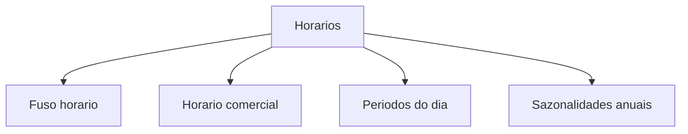

# Horários e sazonalidades

Tudo no LocFlow que tem data e hora — orçamentos, reservas, entregas, retiradas, motores — usa o **relógio da sua organização**. Aqui você acerta esse relógio. É rápido de configurar e evita o erro mais chato de todos: combinar uma entrega no horário errado.


**Valor:** com o fuso e o horário certos, a logística calcula janelas e prazos sobre os dias em que você realmente atende. Menos retrabalho, menos cliente esperando na porta fechada, agenda mais confiável.


A tela de **Horários** reúne quatro configurações:

| Configuração | Para que serve |
| --- | --- |
| **Fuso horário** | O fuso usado em motores, orçamentos e operações com data/hora. |
| **Horário comercial** | Os dias e horas em que sua organização funciona. |
| **Períodos do dia** | Faixas nomeadas (Manhã, Tarde…) para classificar orçamentos e escalas. |
| **Sazonalidades anuais** | Períodos recorrentes de alta demanda (Natal, Carnaval…). |

## Fuso horário

Define o fuso da organização (padrão: horário de Brasília). É a base de **toda** conta de data e hora — por isso é o primeiro a conferir. Se você atende em outra região, ajuste aqui para que prazos e janelas apareçam no horário local correto.

## Horário comercial

Você marca, dia a dia da semana, se a organização está **Aberta** e, em caso afirmativo, o **horário de início e fim**. Os dias marcados como abertos entram nos **cálculos de entrega e atendimento** — ou seja, a logística só programa janelas dentro do seu funcionamento.


Deixou domingo desligado? A operação entende que não há entrega/retirada nesse dia ao montar a agenda. Ligue de novo quando quiser atender.


## Períodos do dia

São **faixas de horário com nome** — por exemplo *Manhã* (08:00–12:00), *Tarde* (12:00–18:00), *Noite* (18:00–22:00). Você cria quantos quiser, cada um com início e fim. Servem para **classificar** orçamentos, reservas e escalas de atendimento de um jeito que a equipe entende na hora ("entrega na manhã"), sem precisar decorar horários exatos.

## Sazonalidades anuais

Cadastre os **períodos de alta demanda que se repetem todo ano** — Natal e Ano Novo, Carnaval, festas juninas, alta temporada. O intervalo é definido por **dia e mês** (sem ano), porque ele vale para sempre, repetindo a cada ano.


**Valor:** marcar a sazonalidade ajuda você a **antecipar o pico** — reforçar estoque, organizar a equipe e não vender o que não vai conseguir entregar. Quem se planeja para a alta temporada fatura mais e estressa menos.


## Situações reais

* **Sábado meio período.** Sua locadora abre sábado só de manhã. No **Horário comercial**, deixe sábado *Aberto* das 08:00 às 12:00. A logística para de oferecer entrega à tarde de sábado.
* **Entrega "de manhã".** Em vez de combinar "entre 8 e 12", você cria o período **Manhã** uma vez e passa a usar esse rótulo em todo orçamento — a equipe toda fala a mesma língua.
* **Pico de fim de ano.** Cadastre a sazonalidade *Natal e Ano Novo* (ex.: 15/12 → 05/01). Todo ano ela aparece sozinha, lembrando você de reforçar a operação naquele intervalo.


O que você consegue ver e editar depende das **permissões** do seu usuário. Se uma configuração de horário não aparece, peça acesso a quem administra a conta.


## Próximo passo

* Veja como a janela de entrega entra na rota em [Planejando o roteiro](../logistica/planejando-o-roteiro.md).
* Configure as regras da operação em [Motores operacionais](motores-operacionais.md).
* Em dúvida com um termo? Consulte o [Glossário](../primeiros-passos/glossario.md).
