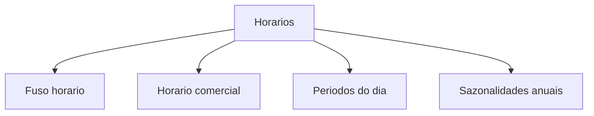

# Horários e sazonalidades

Tudo no LocFlow que tem data e hora — orçamentos, reservas, entregas, retiradas, motores — usa o **relógio da sua organização**. Aqui você acerta esse relógio. É rápido de configurar e evita o erro mais chato de todos: combinar uma entrega no horário errado.


**Valor:** com o fuso e o horário certos, a logística calcula janelas e prazos sobre os dias em que você realmente atende. Menos retrabalho, menos cliente esperando na porta fechada, agenda mais confiável.


A tela de **Horários** reúne quatro configurações:

| Configuração | Para que serve |
| --- | --- |
| **Fuso horário** | O fuso usado em motores, orçamentos e operações com data/hora. |
| **Horário comercial** | Os dias e horas em que sua organização funciona. |
| **Períodos do dia** | Faixas nomeadas (Manhã, Tarde…) para classificar janelas e o frete. |
| **Sazonalidades anuais** | Épocas recorrentes de alta demanda (Natal, Carnaval…). |


O que você consegue ver e editar depende das **permissões** do seu usuário (veja [Colaboradores e acessos](colaboradores-e-acessos.md)). Se uma configuração de horário não aparece na lista, é porque seu acesso não a inclui — peça a quem administra a conta. Cada uma das quatro tem permissões próprias.


## Fuso horário {#fuso-horario}

Define o fuso da organização — a referência de **toda** conta de data e hora (padrão: horário de Brasília). Por isso é o primeiro a conferir. Se você atende em outra região, ajuste aqui para que prazos e janelas apareçam no horário local correto.

A tela mostra o **fuso atual** com a hora de agora ("agora são 14:32"), para você confirmar de relance que está certo. Há duas formas de mudar:

### Usar minha localização {#usar-minha-localizacao}

O jeito mais rápido. Toque em **Usar minha localização** e, com a sua permissão, o LocFlow lê as coordenadas do aparelho e descobre o fuso sozinho. A própria tela explica:

> Com sua permissão, detectamos o fuso horário com base nas coordenadas do dispositivo.


Se você negar o acesso à localização ou estiver com o GPS desligado, o app avisa e você segue pela escolha manual abaixo. Nada trava.


### Escolher manualmente {#escolher-fuso-manual}

Em **Selecionar manualmente**, busque por cidade ou região e toque no fuso desejado. Cada opção mostra o deslocamento (ex.: *GMT-03:00*) e a hora atual naquele fuso, para você comparar. A lista cobre os fusos do Brasil mais comuns.


Só quem pode **editar a organização** muda o fuso. Sem esse acesso, a tela mostra o fuso atual mas não deixa alterar.


## Horário comercial {#horario-comercial}

Você marca, dia a dia da semana, se a organização está **Aberta** e, em caso afirmativo, o **horário de início e fim**. A própria tela resume:

> Configure os dias e horários de funcionamento da organização. Os dias marcados como "Aberta" são considerados nos cálculos de entrega e atendimento.

Cada dia tem um botão liga/desliga. Ao ligar, aparecem os dois campos de hora (começam sugeridos em **08:00** e **18:00**, que você ajusta). Depois é só **Salvar horários**.


Deixou domingo desligado? A operação entende que não há entrega/retirada nesse dia ao montar a agenda. Ligue de novo quando quiser atender.


### Onde o horário comercial aparece

O grande efeito está **dentro do orçamento**. Ao escolher a janela de uma entrega ou retirada, surge a opção **Horário Comercial** já preenchida com a faixa daquele dia da semana — por exemplo *Horário Comercial (08:00–18:00)*. Se a data cair num dia que você deixou **fechado**, essa opção aparece desabilitada como *Fora do Horário Comercial*: é o sistema te avisando que ali não tem expediente. Veja como a janela funciona em [Movimentos, janelas e galpão de origem](../orcamentos/movimentos-e-janelas.md).

## Períodos do dia {#periodos-do-dia}

São **faixas de horário com nome** — por exemplo *Manhã* (08:00–12:00), *Tarde* (12:00–18:00), *Noite* (18:00–22:00). Cada período tem um **nome**, um **início** e um **fim**. Você cria quantos quiser e remove quando não precisar mais.

Servem para **falar de horário sem decorar números**. Em vez de combinar "entre 8 e 12", a equipe inteira diz "entrega na Manhã" — e todo mundo entende a mesma coisa.

### Onde os períodos aparecem

Dois lugares importantes consomem os períodos que você cadastra aqui:

- **Na janela do orçamento.** Ao montar a janela de uma entrega ou retirada e escolher um **Intervalo Salvo**, seus períodos aparecem na lista logo abaixo do horário comercial, ordenados pelo horário de encerramento. Um clique e a janela está pronta.
- **No motor de frete.** Você pode cobrar um valor diferente conforme o **período do dia** do transporte (ex.: um adicional de noite). Veja [Motor de Frete: como calcula](motor-de-frete.md).


Os períodos só viram opção no frete depois de cadastrados aqui. Se você abrir a regra de frete por período do dia e a lista estiver vazia, é porque ainda não criou nenhum — o app inclusive avisa: *"Cadastre períodos do dia em Configurações para usar esse gatilho."*


## Sazonalidades anuais {#sazonalidades-anuais}

Cadastre as **épocas de alta demanda que se repetem todo ano** — Natal e Ano Novo, Carnaval, festas juninas, alta temporada. Cada sazonalidade tem um **nome** e um intervalo de **início e fim definido por dia e mês**, sem o ano:

> Períodos recorrentes de alta demanda que se repetem todo ano (ex.: Natal e Ano Novo, Carnaval). O intervalo é definido por dia e mês, sem considerar o ano.

A razão de não ter ano: o período **vale para sempre**, repetindo a cada virada de calendário. Você cadastra uma vez e ele aparece todo ano sozinho.

### Épocas que cruzam o ano {#sazonalidade-cruza-ano}

Um caso comum é a época que **começa num ano e termina no outro** — como o fim de ano. O LocFlow trata isso naturalmente. A própria tela de cadastro explica:

> O intervalo é inclusivo nas duas extremidades e suporta períodos que cruzam a virada do ano (ex.: 18/12 → 02/01).

Ou seja, basta informar início **18/12** e fim **02/01** que o sistema entende a passagem de dezembro para janeiro. "Inclusivo nas duas extremidades" quer dizer que o primeiro e o último dia também contam.


**Valor:** marcar a sazonalidade ajuda você a **antecipar o pico** — reforçar estoque, organizar a equipe e não vender o que não vai conseguir entregar. Quem se planeja para a alta temporada fatura mais e estressa menos.


### Onde as sazonalidades aparecem

Além de servirem de lembrete visual do seu calendário de picos, as épocas alimentam o **motor de frete**: você pode cobrar um valor diferente **durante uma época** (ex.: adicional de alta temporada). Ao montar a regra, suas sazonalidades aparecem como opções de quando o frete acontece. Veja [Motor de Frete: como calcula](motor-de-frete.md).


Como nos períodos do dia, a época precisa estar cadastrada aqui para virar opção no frete. Sem nenhuma, o app avisa: *"Cadastre épocas em Configurações para usar esse gatilho."*


## Situações reais

* **Atendo em Manaus, não em São Paulo.** Em **Fuso horário**, toque em *Usar minha localização* (ou busque *Manaus* na lista). A partir daí todo prazo e janela aparece no horário local certo.
* **Sábado meio período.** Sua locadora abre sábado só de manhã. No **Horário comercial**, deixe sábado *Aberta* das 08:00 às 12:00. No orçamento, a janela de sábado já vem com essa faixa, e a tarde não é oferecida.
* **Entrega "de manhã".** Em vez de combinar "entre 8 e 12", crie o período **Manhã** uma vez e passe a usar esse rótulo em todo orçamento — a equipe toda fala a mesma língua.
* **Frete mais caro à noite.** Crie o período **Noite** aqui e depois, no motor de frete, configure um adicional para esse período.
* **Pico de fim de ano.** Cadastre a sazonalidade *Natal e Ano Novo* (ex.: 18/12 → 02/01). Todo ano ela aparece sozinha, lembrando você de reforçar a operação — e você pode usá-la para cobrar um frete de alta temporada.

## Próximo passo

* Veja como horário comercial e períodos viram janela em [Movimentos, janelas e galpão de origem](../orcamentos/movimentos-e-janelas.md).
* Use períodos e épocas para variar o frete em [Motor de Frete: como calcula](motor-de-frete.md).
* Defina quem pode editar cada configuração em [Colaboradores e acessos](colaboradores-e-acessos.md).
* Em dúvida com um termo? Consulte o [Glossário](../primeiros-passos/glossario.md).
