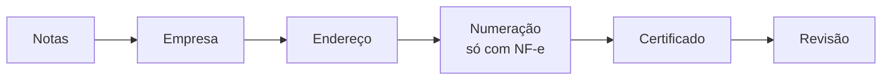
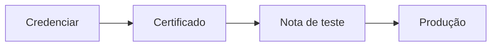

# Integração Fiscal

A **Integração Fiscal** faz a nota fiscal sair **do próprio LocFlow**: a nota nasce do orçamento, com os dados do cliente, dos itens e dos valores que você já preencheu — sem redigitar nada em outro sistema.

Você configura uma vez, em **Ajustes › Integrações › Integração Fiscal**, num assistente guiado. E o caminho começa **sem risco**: primeiro você testa, depois liga a emissão de verdade.


**Primeiro é teste.** A integração começa em **homologação**: as notas emitidas ali são de mentira — **sem valor fiscal, sem custo e sem consequência**. Só quando você estiver seguro é que liga a **produção**, e a primeira nota real sai valendo.


## O que dá para emitir {#tipos-de-nota}

No primeiro passo do assistente você marca **só as notas que pretende emitir** — dá para habilitar as outras depois.

| Nota | Quando se usa | Plano |
| --- | --- | --- |
| **NFS-e** | A nota de **serviço**: a locação faturada como prestação de serviço | Todos os planos |
| **NF-e de remessa** | Acompanha os bens móveis que **saem** para o cliente e **voltam**, numa locação. Não é venda: regulariza o transporte dos itens | Todos os planos |
| **NF-e de venda** | A nota de **produto**: o item sai **em definitivo**, com os impostos da venda | **Pro** |
| **MDF-e** | O manifesto de transporte que agrupa as notas de um roteiro | **Em breve** — aparece, mas ainda não pode ser marcado |

Qual nota cabe em cada operação é assunto de duas páginas próprias: [Nota fiscal na locação](../conceitos/nota-fiscal-na-locacao.md) e [Nota fiscal na venda](../conceitos/nota-fiscal-na-venda.md). Na dúvida, combine com o seu contador antes de marcar.

## Quem configura e quem emite {#quem-pode}

São duas coisas diferentes, com permissões diferentes:

| Ação | Quem faz |
| --- | --- |
| **Configurar** a integração (cadastro da empresa, certificado, virar para produção) | Quem administra a conta — o dono e o **Administrador** |
| **Emitir, ver e cancelar** notas | Quem tem a permissão fiscal. O papel **Operador / Atendente** já nasce com a **NFS-e** e a **NF-e de remessa**. A **NF-e de venda** fica de fora do papel padrão: é liberada pelo dono ou pelo Administrador |

Quem só opera notas e encontra a integração ainda desligada vê, no lugar do botão **Configurar**, o pedido: *"Peça a um administrador da organização para configurar a integração fiscal."* Para distribuir as permissões, veja [Colaboradores e acessos](colaboradores-e-acessos.md#papeis-prontos).

## Antes de começar {#antes-de-comecar}

Tenha à mão:

* O **CNPJ** da empresa — o LocFlow busca na Receita a razão social, o endereço e o regime.
* O **regime tributário**: MEI, Simples Nacional, Lucro Presumido ou Lucro Real.
* A **inscrição municipal** (obrigatória para a NFS-e) e a **inscrição estadual** (obrigatória para a NF-e).
* O **certificado digital A1** — um **arquivo** `.pfx` ou `.p12` — e a **senha** dele.


**O certificado tem de ser A1 (arquivo).** O modelo **A3**, em cartão ou token físico, **não funciona** aqui. Se ainda não tem, compre um e-CNPJ A1 numa Autoridade Certificadora — a emissão costuma ser rápida e online.



**Mantenha o [Perfil da Empresa](perfil-da-empresa.md) completo.** O assistente fiscal já começa preenchido com os dados de lá — nome, e-mail, endereço e inscrições.


## O assistente, passo a passo {#passo-a-passo}

Abra **Ajustes › Integrações › Integração Fiscal** e toque em **Começar credenciamento**. O assistente vai de um passo a outro em **Continuar**; o **?** ao lado de cada campo explica o termo e leva de volta a esta página.

| Passo | O que você faz |
| --- | --- |
| **1. Notas** | Marca os tipos de nota que vai emitir. Se marcar a **NFS-e**, escolhe também **como** emiti-la: Nacional ou Municipal (veja [abaixo](#nfse-nacional-ou-municipal)). |
| **2. Empresa** | **Comece pelo CNPJ** e toque em **Consultar Receita**: os dados chegam preenchidos e você só confere. Prefere digitar? Use **Prefiro preencher manualmente**. Aqui ficam razão social, nome fantasia, e-mail fiscal, telefone e o **regime tributário**. |
| **3. Endereço** | O endereço fiscal da empresa — comece pelo **CEP** e o resto vem preenchido. Logo abaixo, as **inscrições da empresa**: a municipal (para a NFS-e), a estadual (para a NF-e) e, conforme o caso, a alíquota do Simples e o código de serviço. |
| **4. Numeração** | **Só aparece se você marcou alguma NF-e.** Decide como as notas serão numeradas (veja [abaixo](#numeracao)). |
| **5. Certificado** | Escolhe o arquivo `.pfx` ou `.p12` e digita a senha. Ainda não tem o arquivo? Marque **Enviar o certificado depois** — o cadastro segue e o certificado entra mais tarde. |
| **6. Revisão** | Um resumo de tudo. Confira e toque em **Credenciar**. |


**O LocFlow não guarda o seu certificado nem a senha.** O arquivo vai protegido direto ao provedor fiscal que transmite as notas, e é descartado em seguida.


### Simples Nacional: a alíquota efetiva {#aliquota-simples}

Se a empresa é **ME ou EPP do Simples Nacional** e emite **NFS-e Nacional**, o assistente pede a **alíquota efetiva do Simples** e o **mês da apuração** (MM/AAAA). Ela não é a alíquota da tabela: é o percentual que a empresa realmente paga, que muda com o faturamento dos últimos 12 meses — está no extrato do **PGDAS-D** do último mês apurado, ou com o seu contador. Sem ela, a nota nacional não é aceita. O **MEI** não informa: paga valor fixo.

Depois do credenciamento, a alíquota continua editável a qualquer momento: na tela da integração, toque em **Atualizar** ao lado da *Alíquota do Simples*. Quando o mês informado fica antigo, a linha fica em âmbar — é o lembrete de revisar.

### Numeração da NF-e {#numeracao}

Toda NF-e tem uma **série** e um **número** sequencial. O passo pergunta: *"Sua empresa já emite NF-e por outro sistema?"*

* **Não — primeira vez emitindo NF-e.** As notas saem numa série própria nova. Nada a preencher.
* **Sim — já emitimos por outro sistema.** Aí você escolhe como continuar:
  * **Começar numa série própria** *(recomendado)* — as notas novas saem na **série 101**, virgem, sem risco de conflito com a numeração antiga. O contador verá duas séries, o que é normal na troca de emissor.
  * **Continuar a numeração atual** *(avançado)* — informe a **série atual** e o **número da última nota emitida** no sistema anterior.


**Confira o número da última nota com cuidado.** Um número menor que o real faz a nota ser **recusada por duplicidade** até acertar. Ele está na listagem de notas do sistema antigo, no XML ou DANFE da última nota, ou com o seu contador.


## NFS-e Nacional ou Municipal {#nfse-nacional-ou-municipal}

Ao marcar a NFS-e, o assistente pergunta **"Como emitir a NFS-e?"**:

| Modo | Quando usar |
| --- | --- |
| **NFS-e Nacional** | A locação de bem móvel **não tem ISS** — sem código de serviço municipal. Funciona se a **sua prefeitura aderiu ao Emissor Nacional** (confira no Mapa da NFS-e, no portal gov.br). **O MEI é sempre nacional.** |
| **NFS-e Municipal** | Emitida pela prefeitura, com o **código de serviço** da lista oficial de serviços (a da Lei Complementar 116) e com ISS. É o caminho quando há **serviço ou mão de obra** na nota, ou quando a sua prefeitura mantém **emissor próprio** e não aderiu ao Emissor Nacional. |

Assim que o município da empresa é conhecido, o assistente mostra **o que se sabe da NFS-e da sua prefeitura** e qual modo ela recomenda. No modo **Municipal**:

* o **código de serviço padrão** é escolhido do catálogo da sua prefeitura — busque pela descrição (*"locação"*, *"festa"*) ou pelo código. Toda NFS-e já sai com ele, e dá para informar outro na hora de emitir uma nota diferente;
* o **código tributário municipal** e o **CNAE principal** só aparecem quando a sua prefeitura os exige.

## Do teste à produção {#do-teste-a-producao}

Depois de credenciar, a tela da integração mostra o **Roteiro do credenciamento**, com quatro marcos — e só o cartão do próximo passo fica aberto:

1. **Credenciar** — o cadastro da empresa enviado ao provedor fiscal.
2. **Certificado** — o certificado A1 aceito. Se você deixou para depois, envie no cartão de certificado, logo abaixo.
3. **Nota de teste** — emita uma nota de **teste** pela Central de notas (botão **Emitir nota de teste**). Ela sai em homologação, **sem valor fiscal**. Com a nota autorizada, o próximo passo libera.
4. **Produção** — toque em **Ativar emissão em produção** e confirme. A partir daí, **as notas passam a ter valor fiscal real** junto à SEFAZ e à prefeitura.


**Sua prefeitura não tem ambiente de teste?** Alguns municípios não oferecem homologação de NFS-e. Nesse caso a nota de teste é **dispensada** — e a tela avisa que a **primeira nota real já sai valendo**. Confira os dados com atenção antes de ativar.



**A virada para produção pede confirmação, e é para valer.** Só ative quando a sua nota de teste tiver sido emitida e autorizada. Se você não emite notas (só configura), o roteiro diz a quem pedir a nota de teste.


## Os estados da integração {#estados}

O selo aparece no item de Ajustes e no topo da tela da integração:

| Selo em Ajustes | Na tela da integração | O que significa |
| --- | --- | --- |
| **Inativo** | — | A integração ainda não foi começada. |
| **Em credenciamento** | *Cadastro iniciado* ou *Em credenciamento* | O cadastro foi aberto e ainda falta concluir algum passo. |
| **Homologação** | *Em homologação* | Pronta para testar: as notas saem **sem valor fiscal** e **sem custo**. |
| **Ativo** | *Ativo (produção)* | Emitindo notas de verdade. |
| **Suspenso** | *Suspenso* | A emissão está parada. Abra a tela da integração para ver o que falta. |

## Depois de ativa {#depois-de-ativa}

Na tela da integração você continua tendo:

* **Abrir Central de Notas** — a lista das notas emitidas, com busca e filtros por tipo, origem e situação (autorizadas, processando, rejeitadas e canceladas). Ela também está no menu, em **Fiscal › Notas Fiscais**.
* **Editar dados do emissor** — os dados cadastrais, a alíquota e a numeração continuam editáveis. O **CNPJ** não: ele é a identidade fiscal da empresa, e trocá-lo significa recomeçar o credenciamento do zero.
* **Renovar certificado A1** — o certificado vale **um ano**. A tela mostra até quando ele vale (*"Válido até…"*); quando chegar a hora, envie o arquivo novo no mesmo cartão, sem refazer o cadastro.
* **Ativar** outro tipo de nota — os tipos que você não marcou aparecem com o atalho **Ativar**, que reabre o assistente.

As notas em si — emitir a partir do orçamento ou avulsa, acompanhar, baixar o PDF e o XML, cancelar — são feitas pela **Central de notas** e pelas **Ações rápidas** do orçamento. Veja [Emitir uma nota fiscal](../fiscal/emitir-nota.md) e [Central de notas](../fiscal/central-de-notas.md).

### O que custa {#creditos}

Cada nota emitida **em produção** consome **créditos** da carteira da organização, e aparece no extrato como *Emissão de nota fiscal*. As notas de teste, em homologação, **não consomem**. Veja [Minha assinatura e créditos](assinatura-e-creditos.md#o-que-consome).

### Avisos que você pode receber {#avisos}

A [Central de Notificações](central-de-notificacoes.md#avisos-do-financeiro) tem três avisos fiscais, no grupo **Financeiro**:

* **Nota fiscal recusada** — a SEFAZ ou a prefeitura recusou uma nota. O motivo vem no aviso; a correção e o reenvio acontecem na Central de notas.
* **Nota fiscal presa no envio** — uma nota ficou aguardando o provedor e o sistema desistiu de conferir sozinho; alguém precisa verificar a situação dela.
* **Lançamento cancelado com nota fiscal ativa** — uma conta a receber foi cancelada, mas a nota dela segue autorizada; confira se a nota também precisa ser cancelada.


**Os arquivos da nota também vão para a nuvem.** Com a [Sincronização em Nuvem](sincronizacao-em-nuvem.md) conectada, o PDF e o XML de cada nota autorizada ganham uma cópia no seu Google Drive, na pasta **Contábil**. O nome desses arquivos segue o padrão definido em [Nomes de arquivo](nomes-de-arquivo.md).


## Por porte {#por-porte}

| Porte | Como costuma usar |
| --- | --- |
| **Autônomo / MEI** | Só a **NFS-e**, sempre pelo padrão **nacional**. Credencia, emite uma nota de teste e ativa — é o caminho mais curto. |
| **Médio** | **NFS-e** + **NF-e de remessa**, para a nota acompanhar os bens móveis que saem e voltam. Quem emitia por outro sistema escolhe a **série própria** e não se preocupa com a numeração antiga. |
| **Grande** | As três notas, incluindo a **NF-e de venda** (plano Pro), com a emissão distribuída à equipe pelas permissões e a configuração restrita a quem administra. |

## Situações reais {#situacoes-reais}

* **"Ainda não tenho o certificado."** Faça o cadastro assim mesmo e marque **Enviar o certificado depois**. O roteiro para no marco *Certificado* até você enviar o arquivo.
* **"Não sei se a minha prefeitura aderiu ao Emissor Nacional."** Escolha a NFS-e e veja o cartão da sua prefeitura no próprio assistente; na dúvida, confira no Mapa da NFS-e (gov.br) ou com o contador.
* **"Já emitia NF-e por outro sistema."** No passo **Numeração**, escolha **Começar numa série própria**: a série 101 começa do zero e nunca colide com as notas antigas.
* **"Quero que o atendente emita a nota do orçamento."** O papel **Operador / Atendente** já emite NFS-e e NF-e de remessa. A NF-e de venda precisa ser liberada à parte, por quem administra a conta.
* **"Mudou a faixa do Simples."** Na tela da integração, toque em **Atualizar** ao lado da alíquota, informe o novo percentual e o mês da apuração.

## Perguntas frequentes {#perguntas-frequentes}

**O que é homologação?**\
É o ambiente de teste do fisco. A nota emitida ali é real no formato, mas **não tem valor fiscal** e não consome créditos. Serve para você conferir que tudo está certo antes de emitir de verdade.

**Por que a minha nota foi recusada?**\
O motivo da recusa vem no aviso **Nota fiscal recusada** e no detalhe da nota, na Central de notas — corrija o que ele aponta e reenvie por lá. Duas recusas que o próprio assistente ajuda a evitar: a **numeração duplicada** da NF-e (veja [Numeração da NF-e](#numeracao)) e a falta da **alíquota do Simples** na NFS-e nacional (veja [Simples Nacional](#aliquota-simples)).

**Posso usar o certificado A3?**\
Não. Só o **A1**, em arquivo `.pfx` ou `.p12`.

**O LocFlow fica com o meu certificado?**\
Não. O arquivo e a senha vão protegidos direto ao provedor fiscal e são descartados.

## Próximo passo {#proximo-passo}

* Entenda qual nota usar em [Nota fiscal na locação](../conceitos/nota-fiscal-na-locacao.md) e [Nota fiscal na venda](../conceitos/nota-fiscal-na-venda.md).
* Emita a primeira nota em [Emitir uma nota fiscal](../fiscal/emitir-nota.md) e acompanhe tudo na [Central de notas](../fiscal/central-de-notas.md).
* Veja as outras conexões em [Integrações](integracoes.md).
* Defina quem emite em [Colaboradores e acessos](colaboradores-e-acessos.md).
* Deixe os dados da empresa completos em [Perfil da Empresa](perfil-da-empresa.md).
