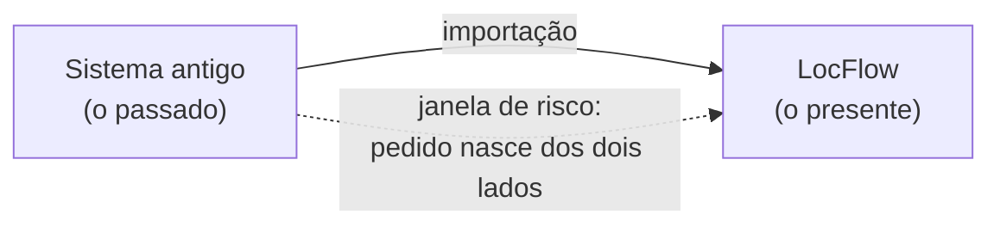
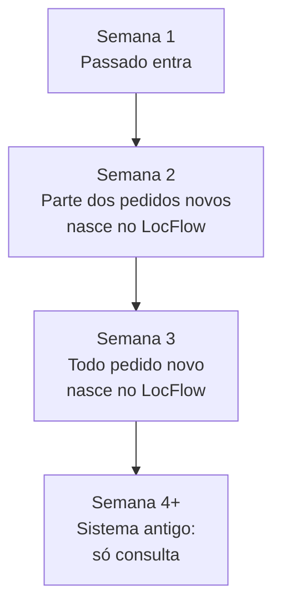

# Migrar com segurança

Importar a planilha é a parte fácil — leva alguns minutos e o LocFlow te guia passo a passo. O que
costuma dar errado numa troca de sistema é **tudo o que acontece em volta**: o pedido que entrou por
WhatsApp na quinta e ninguém lançou em lugar nenhum, o cliente que virou dois cadastros porque a
planilha era de antes da última atualização, a equipe que ficou uma semana sem saber onde lançar.

Esta página é o **plano da virada**. Ela não fala de botões (isso está em
[Importando dados de outro sistema](importacao-de-dados.md)) — fala de **decisões**: qual estratégia
usar, que dia virar, o que trazer, como conferir e o que fazer se algo falhar.


**Leia antes de exportar a primeira planilha.** Meia hora aqui economiza uma semana de retrabalho —
e a maior parte do que dá errado numa migração é decidido *antes* de qualquer dado se mexer.


## O risco não é a planilha — é a semana da virada

Numa troca de sistema existe sempre uma janela em que **dois sistemas coexistem**. É nessa janela
que os pedidos se perdem: um nasce no sistema antigo, outro no novo, e ninguém sabe mais qual é a
verdade sobre aquele cliente.

Todo o resto desta página existe para **encurtar essa janela e deixar claro, a cada dia, qual
sistema manda**.


**A regra de ouro, e a única que você não pode quebrar:** cada pedido vive em **um sistema só**.
O que começou no sistema antigo termina lá; o que nasceu no LocFlow vive aqui. Sem essa regra,
alguém dá baixa duas vezes — ou não dá nenhuma.


## Escolha a sua estratégia de virada

Existem três formas conhecidas de trocar de sistema. Não existe a "melhor" — existe a que combina
com o **tamanho da sua operação** e com **quantos pedidos você tem abertos** no momento da troca.

| Estratégia | Como funciona | Boa para | O custo dela |
| --- | --- | --- | --- |
| **Virada direta** | Um dia marcado: importa tudo e, no dia seguinte, só o LocFlow | Operação **pequena**, poucos pedidos em andamento | Se algo der errado, dá errado para todo mundo ao mesmo tempo |
| **Virada gradual** ⭐ | O passado entra de uma vez; **os pedidos novos** passam a nascer no LocFlow aos poucos, e os antigos terminam no sistema velho | A **maioria** — operação média e grande | Leva algumas semanas e exige disciplina com a regra de ouro |
| **Duplo lançamento** | Tudo é lançado **nos dois sistemas** ao mesmo tempo, por um período curto, para comparar os resultados | Quem tem exigência formal de auditoria ou não pode errar um centavo | Dobra o trabalho da equipe — só sustentável por 2 a 4 semanas |


**Na dúvida, escolha a virada gradual.** Ela é a que mais reduz risco: os problemas aparecem em
escala pequena, um a um, e dá tempo de resolver antes que afetem a operação inteira. Foi para ela
que o LocFlow foi desenhado — importar de novo nunca duplica nada, então você pode ir trazendo
dados em rodadas.


### O porte da sua operação já dá a dica

O LocFlow entende sozinho [o porte da sua operação](../primeiros-passos/porte.md). Use-o como
ponto de partida:

| Porte | Estratégia sugerida | Janela típica |
| --- | --- | --- |
| **Pequeno** (1–2 pessoas, 1 galpão) | Virada direta | 1 dia + 30 dias de consulta ao sistema antigo |
| **Médio** (3–9 pessoas, 2–3 galpões) | Virada gradual | 3 a 4 semanas |
| **Grande** (10+ pessoas, 4+ galpões) | Virada gradual, **por área ou por galpão** | 6 a 8 semanas |

Numa operação grande, vire **uma frente por vez**: comece por um galpão, uma equipe ou uma linha de
produto. Quando aquela frente estiver rodando redonda, leve a próxima. Ninguém precisa aprender
tudo no mesmo dia.

## Como funciona a virada gradual, na prática

É o "encaminhar o trânsito aos poucos": você não fecha a estrada velha — você **desvia o fluxo novo**
para a estrada nova, e deixa quem já estava na antiga chegar ao destino por lá.

1. **Semana 1 — o passado entra.** Importe os contatos e o histórico. A equipe passa a semana
   navegando no LocFlow com **os dados reais de vocês**, sem pressão nenhuma: nada do que ela faz
   aqui afeta a operação, porque os pedidos novos ainda estão nascendo no sistema antigo.
2. **Semana 2 — o fluxo novo começa a desviar.** Escolha um recorte e passe **só ele** a nascer no
   LocFlow: um vendedor, um galpão, os pedidos abaixo de certo valor, ou simplesmente "os pedidos
   de segunda e terça". Os demais continuam no sistema antigo.
3. **Semana 3 — todo pedido novo nasce no LocFlow.** O sistema antigo para de receber coisa nova.
   Ele ainda está vivo porque tem pedidos abertos terminando o ciclo lá.
4. **Semana 4 em diante — o antigo vira arquivo.** Quando o último pedido aberto lá for entregue,
   devolvido e cobrado, o sistema antigo passa a ser **só consulta**.


**Não migre pedidos em andamento.** Um pedido que já foi entregue e ainda vai voltar tem estado
espalhado: reserva, saída de estoque, cobrança parcial, retorno pendente. Trazer isso pela metade
cria um fantasma que ninguém consegue fechar. Deixe-o terminar onde nasceu.


## Que dia e que hora virar

A janela da virada é uma **decisão de operação**, não de tecnologia. Três filtros:

* **Fuja do pico.** Para a maioria das locadoras, o pico é o ciclo de montagem e retirada de
  eventos — em geral quinta, sexta e segunda. **Terça e quarta de manhã** costumam ser o vale.
* **Fuja do fechamento.** Evite virar em fechamento de mês, semana de emissão de notas ou véspera
  de feriado prolongado. Você quer a equipe inteira disponível **no dia seguinte**, não afogada.
* **Fuja da sexta.** Virar na sexta significa descobrir o problema no sábado, com todo mundo fora.
  Vire no **começo da semana**: sobram dias úteis para ajustar.


**Reserve o dia seguinte.** O dia da importação é tranquilo — é no dia seguinte, quando a equipe
começa a usar de verdade, que aparecem as dúvidas. Deixe a agenda do responsável mais leve nesse dia.


## O congelamento: a regra que evita dado perdido

Este é o passo que quase todo mundo pula — e é o que mais causa perda de dado.

Entre o momento em que você **exporta** a planilha do sistema antigo e o momento em que você
**termina de importar** no LocFlow, existe uma janela. Tudo o que for cadastrado no sistema antigo
nessa janela **não está na sua planilha** e, portanto, não vai entrar.

**Como resolver:**

1. Avise a equipe: **"a partir de agora, nenhum cliente novo é cadastrado no sistema antigo"**.
2. Exporte a planilha.
3. Importe no LocFlow (leva minutos, não dias).
4. Libere: **os cadastros novos passam a ser feitos no LocFlow**.


**A janela precisa ser curta — e ela é.** Exportar, conferir e importar cabe numa manhã. Se por
algum motivo a janela esticar, anote **numa folha de papel** os clientes cadastrados nesse meio-tempo
e cadastre-os no LocFlow depois. Um post-it resolve o que um sistema não consegue adivinhar.


## O que trazer — e o que deixar para trás

A tentação é trazer tudo. **Resista.** Migração é uma das raras oportunidades de fazer faxina na
base — e todo dado ruim que você traz vai atrapalhar por anos.

### Traga

* **Clientes ativos** — quem comprou ou alugou nos últimos 2 ou 3 anos. Esses são a sua carteira.
* **O histórico de pedidos deles** — é o que faz o LocFlow classificar quem é cliente ativo e quem é
  **cliente fidelizado**, e o que dá contexto ao seu vendedor na hora de negociar.
* **CPF/CNPJ, sempre que existir.** É o elo entre o cliente e o histórico dele — sem ele, o pedido
  antigo não encontra o dono.

### Deixe para trás

* **Base morta.** Cliente que não compra há 5 anos, com telefone que não existe mais, só polui a
  busca da sua equipe. Ele continua no sistema antigo se você precisar consultar um dia.
* **Duplicados óbvios.** Se o mesmo cliente aparece três vezes na planilha com grafias diferentes,
  junte antes de importar. É muito mais fácil resolver no Excel do que depois, no LocFlow.
* **Colunas que só faziam sentido no sistema antigo** — códigos internos, flags de controle,
  campos que ninguém preenchia.


**Dados pessoais têm dono, e a lei é clara.** A LGPD trabalha com o princípio da **minimização**:
guarde apenas o dado que você realmente precisa, pela finalidade para a qual ele foi coletado.
Migrar uma base inteira "por garantia" aumenta o seu risco sem aumentar o seu resultado. Aproveite
a virada para descartar o que não tem mais uso — e, quando desativar o sistema antigo de vez,
verifique com o fornecedor dele como os dados serão eliminados.


## Higiene da planilha antes de importar

Cinco minutos no Excel evitam dezenas de linhas bloqueadas:

| Cuidado | Por quê |
| --- | --- |
| **Uma aba só, títulos na primeira linha** | É assim que o LocFlow lê a planilha. Se a primeira linha for um cliente, ele vira "cabeçalho" |
| **Uma linha por cliente** | Cliente repetido vira cadastro repetido (a menos que o CPF/CNPJ seja igual — aí o LocFlow reaproveita) |
| **CPF/CNPJ na mesma coluna dos dois arquivos** | É o elo entre contato e histórico. Com ou sem máscara, tanto faz |
| **Nada de linhas de total ou subtotal** | Aquele "TOTAL GERAL" no fim da planilha vira um cliente chamado "TOTAL GERAL" |
| **Até 10.000 linhas por arquivo** | Passou disso, divida (por ano, por letra inicial) e importe em partes — nenhuma parte duplica a outra |


**Você não precisa renomear colunas.** O LocFlow pergunta, coluna por coluna, o que cada uma
significa — mostrando um **dado real** da sua planilha ao lado. Não perca tempo arrumando cabeçalho.


## A conferência: como saber que deu certo

"Importou" não é o mesmo que "está certo". Faça as **três conferências** abaixo — juntas, elas
levam 15 minutos e são o que separa uma migração bem-sucedida de uma surpresa daqui a dois meses.

### 1. A conta fecha?

Na tela de conferência, o LocFlow mostra três números: **entram**, **com ressalva** e **ficam de
fora**. Some os três: o resultado tem que ser exatamente o **total de linhas da sua planilha**.

> 1.247 entram + 212 com ressalva + 37 ficam de fora = 1.284 linhas ✅

Se não fechar, algo na planilha está fora do formato (linha em branco no meio, aba errada).

### 2. A amostra bate?

Depois de importar, abra **10 clientes no LocFlow** e compare com o sistema antigo: nome, telefone,
CPF/CNPJ, quantidade de pedidos. Escolha-os de propósito:

* 3 clientes **grandes** (os que mais movimentam);
* 3 clientes **com acento, cedilha ou "&" no nome** (é onde erro de acentuação aparece);
* 3 clientes **antigos**, dos primeiros anos;
* 1 cliente **sem CPF/CNPJ**, se houver.

Batendo essa amostra, a migração está saudável.

### 3. Os totais batem?

Se você importou o histórico, compare **o total movimentado num ano** entre os dois sistemas
(ex.: soma dos pedidos de 2024). Pequenas diferenças são esperadas quando linhas ficaram de fora —
grandes diferenças significam que alguma coluna foi ligada ao campo errado.


**Anote os números antes de virar.** Escreva num papel: quantos clientes e quantos pedidos existem
no sistema antigo. É a única forma de conferir depois — e leva 2 minutos.


## Ressalva não é erro

Na conferência, três coisas diferentes acontecem com as suas linhas — e a diferença importa:

| Resultado | O que significa | O que fazer |
| --- | --- | --- |
| **Entram** | O cadastro entra completo | Nada |
| **Com ressalva** | O cadastro **entra**, mas falta um pedaço (ex.: contato sem CPF/CNPJ, endereço incompleto) | Nada agora. Complete na ficha do cliente quando precisar |
| **Ficam de fora** | Falta algo sem o que o cadastro não existe (ex.: sem nome) | Corrija na planilha e importe de novo — só essas linhas |


**Você não precisa resolver tudo antes de importar.** Traga as que entram agora e volte com as
corrigidas depois: reimportar **nunca duplica** — quem já existe com o mesmo CPF/CNPJ é reaproveitado.


## Se algo der errado: o plano B

A boa notícia é que numa migração para o LocFlow o plano B é sempre o mesmo: **o sistema antigo
continua lá**. Você não apagou nada dele. Mas vale ter os cenários mapeados:

| O que aconteceu | O que fazer |
| --- | --- |
| **A conexão caiu no meio da importação** | Nada se perdeu. Volte à tela e toque em **Continuar de onde parou** — o que já entrou está salvo e não duplica |
| **Liguei uma coluna ao campo errado e percebi na conferência** | Volte um passo e ajuste. **Nada foi gravado ainda** |
| **Liguei errado e só percebi depois de importar** | [Fale com o suporte](../primeiros-passos/onde-tirar-duvidas.md): a importação fica registrada e conseguimos ajudar a corrigir |
| **Importei a planilha errada** | Fale com o suporte antes de importar a certa |
| **A equipe não se adaptou na primeira semana** | Volte um passo na virada gradual: reduza o recorte de pedidos que nascem no LocFlow e retome no ritmo que der |


**Não desative o sistema antigo no dia da virada.** Mantenha o acesso a ele por **pelo menos 30
dias** (o ideal são 90). Ele é o seu backup vivo e a sua referência para conferir qualquer dúvida.
Só cancele quando a equipe passar duas semanas inteiras sem precisar abrir.


## Quem faz o quê

Migração sem dono é migração que empaca. Defina **três papéis** — podem ser três pessoas ou a mesma
pessoa acumulando, desde que estejam claros:

| Papel | Responsabilidade |
| --- | --- |
| **Responsável pela migração** | Exporta, importa, acompanha. É quem sabe "de onde veio cada dado" |
| **Quem confere** | Faz as três conferências. **Não deve ser a mesma pessoa que importou** — olhos novos acham o que os cansados não veem |
| **Quem avisa** | Comunica a equipe, os clientes recorrentes e os fornecedores sobre a mudança |

## Comunicar a mudança

* **A equipe** precisa saber, com data: quando parar de cadastrar no antigo, quando começar a lançar
  no LocFlow e a quem perguntar. Um aviso no grupo, no dia anterior, resolve.
* **Os clientes recorrentes** notam a mudança nos documentos (o número do pedido muda). Um aviso
  curto — "estamos com sistema novo, o número do seu pedido mudou" — evita telefonema.
* **A ponte entre os dois mundos:** se a sua planilha tinha o número original de cada pedido, ele
  continua **pesquisável** no LocFlow. Sua equipe encontra qualquer pedido antigo buscando pelo
  número velho, ao lado do código novo. É a ponte que segura a transição.

## Checklist da virada

**Antes (D-7)**

* [ ] Estratégia escolhida (direta, gradual ou duplo lançamento)
* [ ] Data e hora marcadas — fora do pico, começo de semana
* [ ] Três papéis definidos (quem importa, quem confere, quem avisa)
* [ ] Catálogo de itens já cadastrado no LocFlow
* [ ] Planilha de teste importada uma vez, só para ver o formato

**No dia (D)**

* [ ] Equipe avisada: para de cadastrar no sistema antigo
* [ ] Números anotados: quantos clientes e quantos pedidos existem hoje
* [ ] Planilhas exportadas (clientes e pedidos)
* [ ] Faxina rápida: base morta e duplicados fora
* [ ] **Contatos importados** → conferência 1 (a conta fecha?)
* [ ] **Histórico importado** → conferência 1 de novo
* [ ] Conferência 2 (amostra de 10 clientes)
* [ ] Conferência 3 (total movimentado num ano)
* [ ] Equipe liberada para usar o LocFlow

**Depois (D+1 a D+30)**

* [ ] Linhas que ficaram de fora corrigidas e reimportadas
* [ ] Sistema antigo mantido como consulta
* [ ] Pedidos abertos no antigo acompanhados até fecharem
* [ ] Duas semanas sem ninguém abrir o sistema antigo → pode cancelar

## Quando chamar a gente

Você consegue fazer sozinho — a importação foi desenhada para isso. Mas **chame o suporte sem
cerimônia** se:

* a sua base passa de alguns milhares de clientes;
* o sistema antigo não exporta para Excel/CSV;
* você tem obrigação de auditoria e precisa do duplo lançamento;
* a virada é de uma operação com vários galpões ou equipes;
* ou simplesmente se você quiser alguém do lado no dia.


[Fale com o suporte](../primeiros-passos/onde-tirar-duvidas.md) — acompanhamos a sua virada de
perto, do planejamento à conferência. Não custa nada e evita o susto.

