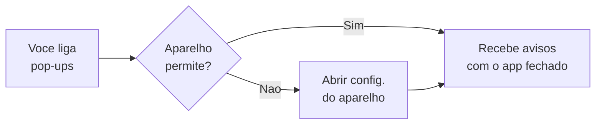

# Minha conta e preferências

Esta é a sua área **pessoal** no LocFlow. Aqui você vê como entra no sistema, ajusta como o app te avisa e, se um dia precisar, exclui a sua conta. Nada aqui mexe nos dados da empresa nem no trabalho dos seus colegas — é só seu.


**Uma distinção que vale ouro:** *Minha conta* é **você** (seu login, suas preferências). Os **dados da empresa** (nome, documento, equipe, integrações) ficam em outras telas de Ajustes. Veja [Usuário × organização](#usuario-vs-organizacao) mais abaixo.


## Acesso: como você entra no LocFlow

No topo de **Minha conta** aparece o cartão **Acesso**: ele mostra **com qual conta você está conectado** e um selo **Conectada** confirmando que está tudo certo. O que você pode fazer aqui depende de **como** você entrou:

| Você entra com… | O que aparece |
| --- | --- |
| **Conta Google** | Seu e-mail Google e uma nota: para trocar e-mail ou senha, use as **configurações da sua conta Google** (o LocFlow não guarda sua senha do Google). |
| **E-mail e senha** | Seu e-mail de login, mais dois atalhos: **Alterar e-mail de login** e **Alterar senha**. |

### Alterar e-mail ou senha (login por e-mail)

Se você entra por **e-mail e senha**, dá para mudar os dois aqui mesmo:

* **Alterar e-mail de login** — você digita o novo e-mail e o LocFlow envia um **e-mail de confirmação**. A troca só vale **depois que você confirma** na sua caixa de entrada (confira também o **spam**).
* **Alterar senha** — você define a nova senha (pelo menos 6 caracteres) e confirma repetindo. A mudança vale na hora.


**Entrou pelo Google?** Então não há senha do LocFlow para trocar — quem cuida do seu e-mail e senha é a **conta Google**. O LocFlow só confirma que ela está conectada.


### Sair da conta

Em **Sessão**, o botão **Sair** encerra a sessão **neste dispositivo** — útil em um aparelho compartilhado. Você volta a entrar normalmente da próxima vez. Sair **não** apaga nada: é só desconectar.

***

## Foto de perfil

No topo de **Minha conta** você pode colocar uma **foto sua**. Ela é **opcional** e **pessoal** — assim como a empresa tem o **logotipo** dela, você tem o **seu rosto** no sistema. Não muda nada da operação; serve para que a equipe te reconheça de relance.

**Onde ela aparece:** como o seu **avatar** nas telas em que o LocFlow mostra pessoas — por exemplo, na **Equipe da operação** ao montar um roteiro (quem conduz e quem acompanha). Em vez de um círculo genérico, aparece a sua cara.


**Sem foto? Sem problema.** Por padrão você entra **sem foto**, e o LocFlow mostra as suas **iniciais** num círculo colorido. A foto é um capricho a mais — coloque quando quiser.


### Como adicionar, trocar ou remover

* **Adicionar / Trocar** — toque em **Adicionar foto** (ou **Trocar foto**), escolha uma imagem da galeria e **ajuste o quadrado** (a foto fica **redonda**, então centralize o rosto). Pronto: ela já vale em todo lugar.
* **Remover** — toque em **Remover** e confirme. Você volta a aparecer com as **iniciais** até colocar uma nova.


**Dica de imagem:** use uma foto **quadrada** (proporção 1:1), em **PNG** ou **JPG**, de até **2 MB**. Como ela é exibida em círculo, um rosto centralizado fica melhor do que uma imagem de corpo inteiro.


A foto é **sua** e segue **você** (sua conta), não a empresa — cada pessoa da equipe coloca a própria. Quem ainda não colocou continua aparecendo pelas iniciais, sem prejuízo nenhum.

***

## Preferências pessoais

As **preferências** valem **só para você, neste aparelho**. Elas controlam como o LocFlow te **avisa** — sem afetar a operação da sua equipe. Cada pessoa tem as suas, e quem entra em mais de um aparelho ajusta em cada um.


**Por que é pessoal:** o motorista pode querer **som** a cada novidade; você, no escritório, prefere **silêncio**. Como a preferência é sua e do seu aparelho, cada um escolhe sem atrapalhar o outro. Isso é diferente de **quais avisos a empresa dispara** — isso é da [Central de Notificações](central-de-notificacoes.md).


### Som de notificação

Toca um **som curto** quando chega uma notificação nova **em tempo real**, com o app aberto. Vem **desligado** por padrão — ligue se quiser ser avisado pelo ouvido.

### Notificações pop-up

Mostra avisos **mesmo com o app fechado ou em segundo plano** (a clássica notificação que aparece na tela do celular). Também vem **desligada** por padrão.

No celular, ao **ligar** os pop-ups, o LocFlow pede a **permissão do aparelho** para enviar notificações. Se você recusar, dá para abrir as **configurações do aparelho** e permitir depois — sem isso, o sistema operacional não deixa o app avisar com ele fechado.

### Aparência


**Em breve.** Estamos preparando ajustes de **aparência** — como o **modo escuro** nas telas que tiverem suporte. A seção já aparece na tela marcada como *Em breve*; quando liberarmos, é só ligar.


***

## Usuário × organização: o que é meu e o que é da empresa

Essa é a confusão mais comum — e a regra é simples: **conta** é você, **organização** é a empresa.

| É **seu** (usuário) | É da **empresa** (organização) |
| --- | --- |
| Seu login (e-mail/senha ou Google) | Nome, e-mail e documento (CPF/CNPJ) da empresa |
| Sua **foto de perfil** (avatar) | O **logotipo** da empresa |
| Suas preferências (som, pop-up) | A equipe e quem acessa o quê |
| Sair / excluir **sua** conta | Plano, faturas, integrações, modelos |

Os dados da **empresa** ficam em outras telas de Ajustes — como [Colaboradores e acessos](colaboradores-e-acessos.md), [Integrações](integracoes.md) e [Minha assinatura e créditos](assinatura-e-creditos.md). Cada pessoa da equipe tem **sua própria** conta e preferências, mas todas compartilham a **mesma** organização.

***

## Excluir minha conta

No fim da tela há a opção, discreta, de **Excluir minha conta**. Ela existe para garantir que você sempre tenha o controle do seu acesso — inclusive direto pelo celular.

Para evitar exclusão por engano, é preciso **digitar uma frase de confirmação** (`EXCLUIR MINHA CONTA`) antes de concluir. É o mesmo cuidado que os grandes apps adotam.


**Esta ação não pode ser desfeita.** Excluir sua conta **desativa o seu acesso** e te **desconecta**. Pense nela como o último passo, não o primeiro.


### O que acontece (e o que NÃO acontece)

* **Sua conta é desativada** e você é desconectado de imediato.
* **A empresa continua de pé.** Excluir a **sua** conta **não** apaga a organização nem os dados dela. Se você é dono do negócio, encerrar a empresa é **outro** processo — não é por aqui.
* **Documentos e registros exigidos por lei são mantidos** pelos prazos legais (a legislação obriga guardar certos comprovantes por um tempo, mesmo após a saída de uma pessoa).
* **Se você é o único acesso da empresa**, pense duas vezes: ao se excluir, ninguém mais entra. Antes disso, considere [conceder acesso a outra pessoa](colaboradores-e-acessos.md).


**Só quer parar de receber avisos?** Não precisa excluir nada — basta **desligar** o som e os pop-ups nas [Preferências](#preferencias-pessoais). E para sair de um aparelho compartilhado, use o **Sair** em [Sessão](#sair).


## Situações reais

* **Quero que a equipe me reconheça.** Coloque uma **foto de perfil** em Minha conta — ela passa a aparecer como seu avatar na **Equipe da operação** dos roteiros. Sem foto, aparecem suas iniciais.
* **Troquei de celular.** Suas preferências (som, pop-up) são **por aparelho** — no novo celular, ligue de novo o que quiser. O login continua o mesmo.
* **Mudei meu e-mail de contato.** Se você entra por e-mail e senha, troque em **Alterar e-mail de login** e **confirme** pelo link que chega na nova caixa. Se entra pelo Google, troque na sua conta Google.
* **Vou sair da empresa.** Você pode **excluir sua conta** — a empresa e os dados dela permanecem. Se você for o único acesso, **conceda acesso a alguém antes**.
* **Não quero ser incomodado no fim de semana.** Desligue **Notificações pop-up** nas Preferências; ligue de novo quando voltar ao trabalho.

## Próximo passo

* [Central de Notificações](central-de-notificacoes.md) — escolha **quais** avisos a empresa dispara (diferente das suas preferências pessoais).
* [Colaboradores e acessos](colaboradores-e-acessos.md) — cadastre a equipe e dê acesso por link.
* [Minha assinatura e créditos](assinatura-e-creditos.md) — o plano e a carteira de créditos da empresa.
