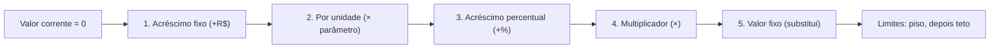
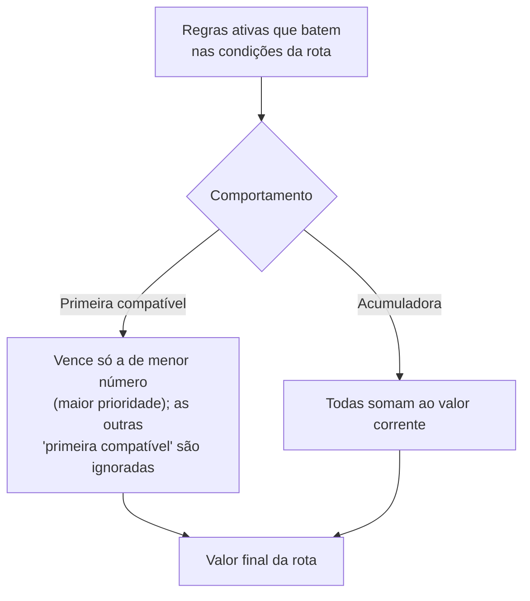
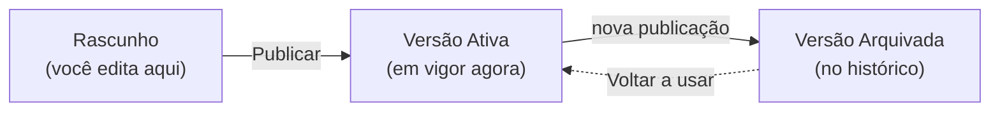

# Motor de Frete avançado

Esta página é para quem escolheu o perfil **Avançado** do Motor de Frete — o **editor de regras**, com condições aninhadas e várias ações por regra. É um bloco denso, opt-in: se a sua operação cobra de um jeito só, ou por algumas situações, comece pelos perfis mais simples em [Motores operacionais](motores-operacionais.md). Aqui a gente desce ao detalhe e aos números.


**Você não precisa do Avançado para começar.** O motor tem três perfis, e a tela de configuração pergunta logo de cara: *"Como você cobra pelo seu frete?"* Quem tem **um método único** usa o perfil Simples; quem tem **vários métodos combinados** usa o Intermediário; o Avançado é *"Quero montar regras manualmente"* — editor com condições aninhadas e múltiplas ações por regra. Você pode mudar de perfil depois.


## O que é uma regra {#anatomia-da-regra}

No perfil Avançado, o motor é uma **lista de regras**. Cada regra é uma unidade independente que responde a duas perguntas: **quando se aplica** e **o que faz com o valor**. Para cada frete, o motor olha a lista inteira, separa as regras que se encaixam e combina o resultado.

Uma regra tem estas partes:

| Parte | O que define |
| --- | --- |
| **Nome e descrição** | Identificam a regra para você (ex.: *"Frete base por km"*). A descrição é opcional. |
| **Prioridade** | Um número. **Menor número = mais prioritária.** Define a ordem em que as regras são avaliadas. |
| **Conflito com outras regras** | Se a regra **vence sozinha** ou **acumula** com as demais (veja [abaixo](#conflito)). |
| **Condições** | **Quando** a regra se aplica. Sem nenhuma condição, ela vale para qualquer rota. |
| **Ações** | **O que** a regra faz com o valor — acréscimos, multiplicadores, valor fixo. Toda regra precisa de ao menos uma ação. |
| **Limites** | Piso, teto e distância mínima cobrada (opcionais). |


Texto de ajuda do app, sobre as **condições**: *"Definem quando a regra é aplicada. Sem condições, a regra vale para qualquer Rota Estimada."* E: *"Podem ser combinadas com E / OU e agrupadas de forma aninhada para lógicas mais complexas."*


A **Rota Estimada** é o caminho que o motor calcula entre o galpão de origem e o destino. O frete **não** é cobrado por viagem, e sim **por rota** — é o ponto que mais confunde, então vale fixar antes de avançar.

### A cobrança é por rota, não por viagem {#por-rota-nao-por-viagem}


Aviso fiel ao que o app mostra: **A cobrança é por rota, não por viagem.**

* **Venda (2 cobranças):** 2 rotas — se houver entrega: ida + volta.
* **Aluguel (4 cobranças):** 4 rotas — se houver entrega: ida + volta; se houver retirada: ida + volta.


O motor **analisa cada rota estimada** e aplica nela todas as regras que se encaixam, somando tudo no final. Numa locação com entrega e retirada, são quatro rotas — então uma regra de *"R$ 125 por rota"* fecha o frete em **R$ 500**. Pensar "por rota" é o que faz os números baterem.

## Condições: o "quando" {#condicoes}

As condições são o filtro da regra. Você compara um **parâmetro** (distância, município, peso…) com um valor, usando um comparador (`>`, `=`, `entre`, `está na lista`, `dentro do intervalo`, etc.). Pode combinar várias condições e **agrupá-las** de forma aninhada:

* **E (todas)** — todas as condições e subgrupos precisam ser verdadeiros.
* **OU (qualquer)** — basta uma condição ou subgrupo ser verdadeiro.

Exemplo de ajuda do app: *"Distância percorrida maior que 50km E (Município de destino é Sorocaba OU Município de destino é Votorantim)."* O parêntese é um **subgrupo** com operador OU dentro de um grupo com operador E.

## Ações: o "o quê" — e a ordem é sempre respeitada {#acoes-ordem}

Aqui está o coração do Avançado. Uma regra pode ter **várias ações**, e elas **não** são aplicadas na ordem em que você as cadastrou. O motor aplica sempre na **mesma ordem matemática fixa** — isso garante que o resultado seja previsível, independentemente de como você montou a regra.


Texto de ajuda do app, **verbatim**: *"Cada regra pode ter várias ações. Independente da ordem em que foram cadastradas, o cálculo segue sempre:"*

1. **Acréscimo fixo (R$)**
2. **Por unidade (R$/km, R$/min…)**
3. **Acréscimo percentual (%)**
4. **Multiplicador (×)**
5. **Valor fixo (substitui o corrente; ações posteriores atuam sobre ele)**

*"Uma regra com acréscimo fixo de R$ 50 e R$ 1,00/km soma primeiro o fixo, depois o variável por distância."*


O que cada ação faz com o **valor corrente** (o valor acumulado da regra até ali, começando em zero):

| Ordem | Ação | O que faz |
| --- | --- | --- |
| 1 | **Acréscimo fixo** | Soma um valor fixo em reais ao valor corrente. |
| 2 | **Por unidade** | Multiplica um parâmetro numérico (km, min, kg, m³) por uma taxa e **soma** ao valor corrente. |
| 3 | **Acréscimo percentual** | Soma uma porcentagem **calculada sobre o valor corrente** (ex.: +20%). |
| 4 | **Multiplicador** | Multiplica o valor corrente por um fator (ex.: ×1,5). |
| 5 | **Valor fixo** | **Substitui** o valor corrente por um valor fixo. Ações posteriores atuam sobre esse novo valor. |


Como o **Valor fixo** é o último da ordem e **substitui** tudo o que veio antes, combiná-lo com outras ações na mesma regra costuma anular as anteriores. Se a intenção é "este valor e ponto final", use só a ação Valor fixo. Se é "este valor mais alguma coisa em cima dele", lembre que o que vem **depois** de um Valor fixo (numa próxima regra acumuladora, por exemplo) é que continua o cálculo.


## Limites por regra {#limites}

Depois que **todas** as ações da regra rodam, o motor aplica os limites — primeiro o piso, depois o teto.


Ajuda do app, **verbatim**:

* **Piso** — valor mínimo cobrado pela regra. Se o resultado ficar abaixo, sobe para o piso.
* **Teto** — valor máximo. Se ultrapassar, cai para o teto.
* **Distância mínima cobrada** — se a distância percorrida for menor que esse valor, o cálculo "por unidade" usa esse mínimo.

*"R$ 1,00/km com piso de R$ 80 e distância mínima de 30km garante que fretes curtos nunca saiam abaixo do mínimo operacional."*


Note a diferença: o **piso/teto** age sobre o **resultado** da regra; a **distância mínima cobrada** age antes, sobre o **parâmetro** de distância usado no cálculo "por unidade" — fretes mais curtos que o mínimo são cobrados como se tivessem a distância mínima. Como tudo é por rota, o piso e o teto também valem **por rota**, não pela viagem inteira.

## Como as regras se combinam: o conflito {#conflito}

Cada regra declara como se comporta quando **outras regras** também se aplicam ao mesmo frete. São dois comportamentos:


Ajuda do app, **verbatim**:

* **Primeira compatível** — dentre as regras com esse comportamento, só a de maior prioridade (menor número) é executada. As demais são ignoradas.
* **Acumuladora** — sempre executada se as condições baterem, somando ao que as outras regras já calcularam.

*"Você pode ter 'Sorocaba' e 'Araçoiaba' como Primeira compatível (só uma vale por destino) e ainda uma 'Taxa de combustível' como Acumuladora, que soma sempre."*


Na tela, esses comportamentos aparecem como **"Só esta regra vence"** (primeira compatível) e **"Acumula com outras"** (acumuladora).

A ordem das regras é a **prioridade** (menor número primeiro). Entre as regras "primeira compatível", isso decide qual vence; as acumuladoras entram sempre que suas condições baterem.

## Parâmetros disponíveis {#parametros}

São as variáveis que você compara nas condições e usa nas ações "por unidade".


Ajuda do app, **verbatim**:

* **Geotemporais** (condição e ação) — distância percorrida, distância radial, tempo de transporte com trânsito e sem trânsito.
* **Carga** (condição e ação) — peso bruto e volume. Hoje tratados como constantes por rota: a disposição dos materiais por veículo ainda não é considerada.
* **Categóricos** (só condição) — município de origem/destino, classe veicular, veículo e tipo de rota (ida ou volta).
* **Temporais** (só condição) — intervalos de tempo do dia e intervalos sazonais anuais. Exigem horários estimados de saída e chegada da Rota.


Dois pontos práticos que decorrem disso:

* Os parâmetros que você usa **determinam o que o orçamento vai pedir** antes de calcular o frete. Use distância e o motor exige o destino e o galpão; use peso ou volume e ele exige os itens; use intervalo sazonal e ele exige as datas; use intervalo horário e ele exige os horários. É o mesmo "o LocFlow só pede o que a regra precisa" descrito em [Valores: frete](../orcamentos/valores.md#frete).
* **Classe veicular** e **veículo específico** estão previstos como parâmetros, mas o cadastro que os alimenta ainda está em construção — o editor avisa quando você seleciona um deles.

## A política de aprovação é à parte {#aprovacao}

Cuidado para não confundir: **as regras decidem o valor; elas não decidem se o frete precisa de aprovação.** A aprovação é uma **política global** do motor, única para a organização, que age sobre o **valor final** depois de calculado — Automática, Por valor (acima de um limite) ou Sempre manual. Ela está documentada em [Motores operacionais](motores-operacionais.md#motor-de-frete) e em [Aprovação de orçamentos](../orcamentos/aprovacao.md). Mudar uma regra não muda a política, e vice-versa.

## Versionamento: rascunho, publicar e histórico {#versionamento}

O Motor de Frete é **versionado**. Isso muda como você trabalha: você não edita "ao vivo" a configuração que está valendo — você edita um **rascunho** e, quando está satisfeito, **publica**.


Ajuda do app sobre o versionamento, **verbatim**: *"Toda alteração no motor cria uma nova versão. Versões anteriores ficam preservadas — você consegue auditar exatamente qual configuração foi usada em qualquer frete já calculado."*


Na tela do motor existem duas abas:

* **Produção** — a configuração **em vigor**, que está sendo usada nos cálculos. Mostra desde quando está publicada e o link **Ver histórico de versões**.
* **Rascunho** — onde você monta ou ajusta as regras sem afetar o que está valendo.

Quando você publica, o app confirma: *"Esta ação irá publicar e tornar a configuração ativa para toda a organização. Deseja continuar?"* A partir daí, **a nova versão entra em vigor de imediato** e a anterior passa a ficar **arquivada** — preservada no histórico.


A publicação vale **a partir do momento em que você publica** — não há, hoje, como agendar uma versão para entrar em vigor numa data futura. Se você quer trocar a tabela de frete num dia específico, publique nesse dia.


### Ver versões anteriores {#ver-versoes}

Em **Ver histórico de versões** você vê a lista completa: o **rascunho** atual (se houver), a versão **Ativa** em destaque e as **Arquivadas** (recolhidas, para não poluir). Cada cartão mostra o número da versão e o período de vigência — *"Vigente desde…"* para a ativa, *"Registrado em…"* para as demais.

Ao abrir uma versão você vê os **dados daquela versão** (suas regras, exatamente como estavam) e:

* Se for uma **Arquivada**, o botão **Voltar a usar esta publicação** — que reativa aquela versão de imediato. O app avisa: *"A versão X volta a ser a ativa; a publicação vigente passa a ficar arquivada."* É a forma de desfazer uma mudança sem reconstruir tudo à mão.
* Se for um **Rascunho**, o botão **Continuar no rascunho**, que leva de volta ao editor.

Esse histórico é o que dá **auditoria**: para qualquer frete já calculado, você consegue olhar exatamente qual versão do motor produziu aquele número.

## Situações reais {#situacoes-reais}

* **Base por km com mínimo operacional.** Uma regra *"Frete base por km"*, sem condições (vale para qualquer rota), com a ação **Por unidade** de R$ 1,00/km, **distância mínima cobrada** de 30 km e **piso** de R$ 80. Fretes curtos nunca saem abaixo do mínimo; longos crescem com a distância.
* **Destino específico que vence sozinho.** Uma regra *"Para Sorocaba"* com condição "município de destino é Sorocaba", ação Valor fixo + por km, marcada como **"Só esta regra vence"**. Junto, uma *"Taxa de combustível"* de +10% marcada como **"Acumula com outras"** — que soma em cima do destino, qualquer que seja.
* **Sazonalidade e horário.** Uma regra com condição de **período sazonal** (alta temporada) e um **multiplicador ×1,3**; outra com **intervalo horário** noturno e um **acréscimo fixo**. Como usam parâmetros temporais, o orçamento vai pedir as datas e os horários antes de liberar o cálculo.
* **Troca de tabela.** Você monta a nova tabela no **rascunho**, publica num dia combinado e, se algo der errado, abre o histórico e usa **Voltar a usar esta publicação** na versão anterior.

## Próximo passo {#proximo-passo}

* [Motores operacionais](motores-operacionais.md) — a visão geral dos motores e a **política de aprovação** do frete.
* [Valores: mão de obra, frete e descontos](../orcamentos/valores.md) — como o frete entra no orçamento e o **frete automático x manual**.
* [Aprovação de orçamentos](../orcamentos/aprovacao.md) — o que acontece quando um frete pede aval.
* [Horários e sazonalidades](horarios-e-sazonalidades.md) — onde você cadastra os períodos sazonais que as condições usam.
