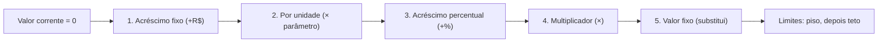
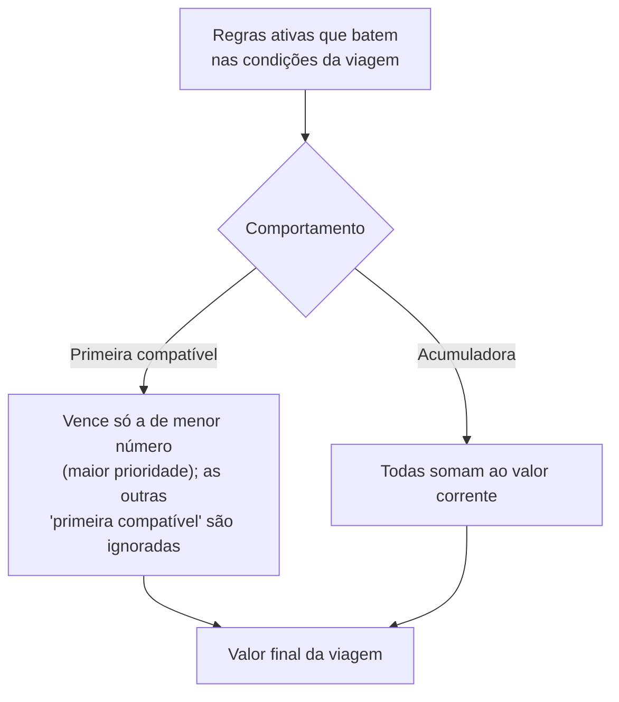

# Motor de Frete avançado

Esta página é para quem escolheu o perfil **Avançado** do Motor de Frete — o **editor de regras**, com condições aninhadas e várias ações por regra. É um bloco denso, opt-in: se a sua operação cobra de um jeito só, ou por algumas situações, comece pelos perfis mais simples em [Motores operacionais](motores-operacionais.md). Aqui a gente desce ao detalhe e aos números.


**Você não precisa do Avançado para começar.** O motor tem três perfis, e a tela de configuração pergunta logo de cara: *"Como você cobra pelo seu frete?"* Quem tem **um método único** usa o perfil Simples; quem tem **vários métodos combinados** usa o Intermediário; o Avançado é *"Quero montar regras manualmente"* — editor com condições aninhadas e múltiplas ações por regra. Você pode mudar de perfil depois.


## O que é uma regra {#anatomia-da-regra}

No perfil Avançado, o motor é uma **lista de regras**. Cada regra é uma unidade independente que responde a duas perguntas: **quando se aplica** e **o que faz com o valor**. Para cada frete, o motor olha a lista inteira, separa as regras que se encaixam e combina o resultado.

Uma regra tem estas partes:

| Parte | O que define |
| --- | --- |
| **Nome e descrição** | Identificam a regra para você (ex.: *"Frete base por km"*). A descrição é opcional. |
| **Prioridade** | Um número. **Menor número = mais prioritária.** Define a ordem em que as regras são avaliadas. |
| **Conflito com outras regras** | Se a regra **vence sozinha** ou **acumula** com as demais (veja [abaixo](#conflito)). |
| **Condições** | **Quando** a regra se aplica. Sem nenhuma condição, ela vale para qualquer viagem. |
| **Ações** | **O que** a regra faz com o valor — acréscimos, multiplicadores, valor fixo. Toda regra precisa de ao menos uma ação. |
| **Limites** | Piso, teto e distância mínima cobrada (opcionais). |


Texto de ajuda do app, sobre as **condições**: *"Definem quando a regra é aplicada. Sem condições, a regra vale para qualquer Rota Estimada."* E: *"Podem ser combinadas com E / OU e agrupadas de forma aninhada para lógicas mais complexas."*


A **Rota Estimada** é o caminho de **ida e volta** que o motor calcula entre o galpão de origem e o destino de um movimento. O frete é cobrado **por viagem** — cada movimento (a entrega ou a retirada), com a ida e a volta contando como uma coisa só. É o ponto que mais confunde, então vale fixar antes de avançar.

### A cobrança é por viagem {#por-rota-nao-por-viagem}


Aviso fiel ao que o app mostra: **A cobrança é por viagem.**

* **Venda:** 1 viagem — a entrega (ida e volta).
* **Aluguel:** 2 viagens — a entrega (ida e volta) e a retirada (ida e volta).


O motor **analisa cada viagem** e aplica nela todas as regras que se encaixam, somando tudo no final. Numa locação com entrega e retirada, são **duas viagens** — então uma regra de *"R$ 250 por viagem"* fecha o frete em **R$ 500**. Pensar "por viagem" é o que faz os números baterem.

## Condições: o "quando" {#condicoes}

As condições são o filtro da regra. Você compara um **parâmetro** (distância, município, peso…) com um valor, usando um comparador (`>`, `=`, `entre`, `está na lista`, `dentro do intervalo`, etc.). Pode combinar várias condições e **agrupá-las** de forma aninhada:

* **E (todas)** — todas as condições e subgrupos precisam ser verdadeiros.
* **OU (qualquer)** — basta uma condição ou subgrupo ser verdadeiro.

Exemplo de ajuda do app: *"Distância percorrida maior que 50km E (Município de destino é Sorocaba OU Município de destino é Votorantim)."* O parêntese é um **subgrupo** com operador OU dentro de um grupo com operador E.

## Ações: o "o quê" — e a ordem é sempre respeitada {#acoes-ordem}

Aqui está o coração do Avançado. Uma regra pode ter **várias ações**, e elas **não** são aplicadas na ordem em que você as cadastrou. O motor aplica sempre na **mesma ordem matemática fixa** — isso garante que o resultado seja previsível, independentemente de como você montou a regra.


Texto de ajuda do app, **verbatim**: *"Cada regra pode ter várias ações. Independente da ordem em que foram cadastradas, o cálculo segue sempre:"*

1. **Acréscimo fixo (R$)**
2. **Por unidade (R$/km, R$/min…)**
3. **Acréscimo percentual (%)**
4. **Multiplicador (×)**
5. **Valor fixo (substitui o corrente; ações posteriores atuam sobre ele)**

*"Uma regra com acréscimo fixo de R$ 50 e R$ 1,00/km soma primeiro o fixo, depois o variável por distância."*


O que cada ação faz com o **valor corrente** (o valor acumulado da regra até ali, começando em zero):

| Ordem | Ação | O que faz |
| --- | --- | --- |
| 1 | **Acréscimo fixo** | Soma um valor fixo em reais ao valor corrente. |
| 2 | **Por unidade** | Multiplica um parâmetro numérico (km, min, kg, m³) por uma taxa e **soma** ao valor corrente. |
| 3 | **Acréscimo percentual** | Soma uma porcentagem **calculada sobre o valor corrente** (ex.: +20%). |
| 4 | **Multiplicador** | Multiplica o valor corrente por um fator (ex.: ×1,5). |
| 5 | **Valor fixo** | **Substitui** o valor corrente por um valor fixo. Ações posteriores atuam sobre esse novo valor. |

```mermaid
flowchart LR
  Z["Valor corrente = 0"] --> A["1. Acréscimo fixo (+R$)"]
  A --> B["2. Por unidade (× parâmetro)"]
  B --> C["3. Acréscimo percentual (+%)"]
  C --> D["4. Multiplicador (×)"]
  D --> E["5. Valor fixo (substitui)"]
  E --> L["Limites: piso, depois teto"]
```


Como o **Valor fixo** é o último da ordem e **substitui** tudo o que veio antes, combiná-lo com outras ações na mesma regra costuma anular as anteriores. Se a intenção é "este valor e ponto final", use só a ação Valor fixo. Se é "este valor mais alguma coisa em cima dele", lembre que o que vem **depois** de um Valor fixo (numa próxima regra acumuladora, por exemplo) é que continua o cálculo.


## Limites por regra {#limites}

Depois que **todas** as ações da regra rodam, o motor aplica os limites — primeiro o piso, depois o teto.


Ajuda do app, **verbatim**:

* **Piso** — valor mínimo cobrado pela regra. Se o resultado ficar abaixo, sobe para o piso.
* **Teto** — valor máximo. Se ultrapassar, cai para o teto.
* **Distância mínima cobrada** — se a distância percorrida for menor que esse valor, o cálculo "por unidade" usa esse mínimo.

*"R$ 1,00/km com piso de R$ 80 e distância mínima de 30km garante que fretes curtos nunca saiam abaixo do mínimo operacional."*


Note a diferença: o **piso/teto** age sobre o **resultado** da regra; a **distância mínima cobrada** age antes, sobre o **parâmetro** de distância usado no cálculo "por unidade" — fretes mais curtos que o mínimo são cobrados como se tivessem a distância mínima. Como tudo é por viagem, o piso e o teto também valem **por viagem**, não pela operação inteira.


**Piso e teto limitam a contribuição daquela regra — não o acumulado.** Num empilhamento de regras acumuladoras (várias somando ao mesmo frete), o teto de uma regra limita **só o que aquela regra soma**, não o total que as regras anteriores já haviam somado. Ou seja: o teto **não engole** o que já estava no valor; ele apenas corta o excesso da própria contribuição. Do mesmo jeito, o piso garante o **mínimo daquela contribuição**, não o mínimo do frete inteiro.

Exemplo: uma regra base já somou **R$ 200** na viagem. Uma segunda regra acumuladora tentaria somar **R$ 86**, mas tem **teto de R$ 50**. O resultado é **R$ 250** — os R$ 200 ficam intactos e a segunda regra entra com R$ 50 (o teto da sua contribuição). O teto **não** derruba o frete para R$ 50. Você vê esse número por completo no [Situações reais](#situacoes-reais) abaixo.


## Como as regras se combinam: o conflito {#conflito}

Cada regra declara como se comporta quando **outras regras** também se aplicam ao mesmo frete. São dois comportamentos:


Ajuda do app, **verbatim**:

* **Primeira compatível** — dentre as regras com esse comportamento, só a de maior prioridade (menor número) é executada. As demais são ignoradas.
* **Acumuladora** — sempre executada se as condições baterem, somando ao que as outras regras já calcularam.

*"Você pode ter 'Sorocaba' e 'Araçoiaba' como Primeira compatível (só uma vale por destino) e ainda uma 'Taxa de combustível' como Acumuladora, que soma sempre."*


Na tela, esses comportamentos aparecem como **"Só esta regra vence"** (primeira compatível) e **"Acumula com outras"** (acumuladora).

```mermaid
flowchart TD
  R["Regras ativas que batem<br/>nas condições da viagem"] --> P{Comportamento}
  P -->|Primeira compatível| U["Vence só a de menor número<br/>(maior prioridade); as outras<br/>'primeira compatível' são ignoradas"]
  P -->|Acumuladora| S["Todas somam ao valor corrente"]
  U --> T["Valor final da viagem"]
  S --> T
```

A ordem das regras é a **prioridade** (menor número primeiro). Entre as regras "primeira compatível", isso decide qual vence; as acumuladoras entram sempre que suas condições baterem.

## Parâmetros disponíveis {#parametros}

São as variáveis que você compara nas condições e usa nas ações "por unidade".


Ajuda do app, **verbatim**:

* **Geotemporais** (condição e ação) — distância percorrida, distância radial, tempo de transporte com trânsito e sem trânsito.
* **Carga** (condição e ação) — peso bruto e volume. Contam uma vez por viagem; a disposição dos materiais por veículo ainda não é considerada.
* **Categóricos** (só condição) — município de origem/destino e **especificação veicular**.
* **Temporais** (só condição) — intervalos de tempo do dia e intervalos sazonais anuais. Exigem horários estimados de saída e chegada da Rota.


Sobre a **especificação veicular**: ela é a **ficha técnica do veículo** (o modelo, com marca, ano e combustível) que você cadastra na Frota — não um rótulo genérico. A condição aceita três formas de comparação: a especificação da viagem **é** uma que você aponta, **não é** ela, ou **está na lista** (ou fora da lista) de várias especificações que você seleciona. Os valores vêm direto do seu [cadastro de frota](../cadastros/frota.md#classes-e-especificacoes) — você escolhe entre as fichas reais que já existem. É o parâmetro que permite cobrar diferente conforme o porte do veículo que faz a viagem.


Para uma regra de especificação veicular disparar, a viagem precisa **saber qual veículo a transporta** — o que só acontece quando você **distribui a carga em viagens** no orçamento. Sem essa distribuição, o frete calcula normalmente pelo padrão (uma viagem por movimento) e as regras que dependem da especificação simplesmente não entram. Por isso, ao usar esse parâmetro, o orçamento **oferece** a distribuição da carga; ele não a torna obrigatória.


Um ponto prático que decorre disso: os parâmetros que você usa **determinam o que o orçamento vai pedir** antes de calcular o frete. Use distância e o motor exige o destino e o galpão; use peso ou volume e ele exige os itens; use intervalo sazonal e ele exige as datas; use intervalo horário e ele exige os horários. É o mesmo "o LocFlow só pede o que a regra precisa" descrito em [Valores: frete](../orcamentos/valores.md#frete).

## A política de aprovação é à parte {#aprovacao}

Cuidado para não confundir: **as regras decidem o valor; elas não decidem se o frete precisa de aprovação.** A aprovação é uma **política** que age sobre o **valor final** depois de calculado — nada tem a ver com quais regras montaram esse valor. Mudar uma regra não muda a política, e vice-versa.

Essa política **não é mais única da organização**: ela é **por detentor**. No LocFlow, o frete pode ser da **sua própria organização** (você mesmo entrega) ou de um **fornecedor de frete** — uma transportadora parceira cadastrada. Cada detentor tem a sua política de aprovação, editada uma de cada vez. Para o frete próprio, há três modos — **Automática**, **Aprovar acima de um valor** e **Sempre exigir aprovação**. Para um fornecedor, aparece um **quarto modo**:

| Modo | O que faz |
| --- | --- |
| **Aguardar resposta do fornecedor** | Todo frete daquele fornecedor nasce **pendente**, aguardando a confirmação dele antes do orçamento seguir. É o padrão seguro para frete terceirizado — evita fechar um frete que ninguém confirmou. |

Onde configurar e todos os detalhes: [Motores operacionais → Operação do Frete](motores-operacionais.md#operacao-do-frete), [Frete por fornecedor: o detentor da política](motor-de-frete-detentor.md) e, para o efeito no funil, [Aprovação de orçamentos](../orcamentos/aprovacao.md).

## Versionamento: rascunho, publicar e histórico {#versionamento}

O Motor de Frete é **versionado**. Isso muda como você trabalha: você não edita "ao vivo" a configuração que está valendo — você edita um **rascunho** e, quando está satisfeito, **publica**.


Ajuda do app sobre o versionamento, **verbatim**: *"Toda alteração no motor cria uma nova versão. Versões anteriores ficam preservadas — você consegue auditar exatamente qual configuração foi usada em qualquer frete já calculado."*


Na tela do motor existem duas abas:

* **Produção** — a configuração **em vigor**, que está sendo usada nos cálculos. Mostra desde quando está publicada e o link **Ver histórico de versões**.
* **Rascunho** — onde você monta ou ajusta as regras sem afetar o que está valendo.

Quando você publica, o app confirma: *"Esta ação irá publicar e tornar a configuração ativa para toda a organização. Deseja continuar?"* A partir daí, **a nova versão entra em vigor de imediato** e a anterior passa a ficar **arquivada** — preservada no histórico.

```mermaid
flowchart LR
  D["Rascunho<br/>(você edita aqui)"] -->|Publicar| A["Versão Ativa<br/>(em vigor agora)"]
  A -->|nova publicação| Q["Versão Arquivada<br/>(no histórico)"]
  Q -.->|Voltar a usar| A
```


A publicação vale **a partir do momento em que você publica** — não há, hoje, como agendar uma versão para entrar em vigor numa data futura. Se você quer trocar a tabela de frete num dia específico, publique nesse dia.


### Ver versões anteriores {#ver-versoes}

Em **Ver histórico de versões** você vê a lista completa: o **rascunho** atual (se houver), a versão **Ativa** em destaque e as **Arquivadas** (recolhidas, para não poluir). Cada cartão mostra o número da versão e o período de vigência — *"Vigente desde…"* para a ativa, *"Registrado em…"* para as demais.

Ao abrir uma versão você vê os **dados daquela versão** (suas regras, exatamente como estavam) e:

* Se for uma **Arquivada**, o botão **Voltar a usar esta publicação** — que reativa aquela versão de imediato. O app avisa: *"A versão X volta a ser a ativa; a publicação vigente passa a ficar arquivada."* É a forma de desfazer uma mudança sem reconstruir tudo à mão.
* Se for um **Rascunho**, o botão **Continuar no rascunho**, que leva de volta ao editor.

Esse histórico é o que dá **auditoria**: para qualquer frete já calculado, você consegue olhar exatamente qual versão do motor produziu aquele número.

## Situações reais {#situacoes-reais}

Comece pelos casos rápidos e depois acompanhe os **três exemplos passo a passo** — cada um com o número final da conta. Todos os cálculos são **por viagem**: num aluguel com entrega e retirada, o mesmo cálculo roda duas vezes (uma por viagem) e os resultados se somam.

**Casos rápidos:**

* **Base por km com mínimo operacional.** Uma regra *"Frete base por km"*, sem condições (vale para qualquer viagem), com a ação **Por unidade** de R$ 1,00/km, **distância mínima cobrada** de 30 km e **piso** de R$ 80. Fretes curtos nunca saem abaixo do mínimo; longos crescem com a distância.
* **Sazonalidade e horário.** Uma regra com condição de **período sazonal** (alta temporada) e um **multiplicador ×1,3**; outra com **intervalo horário** noturno e um **acréscimo fixo**. Como usam parâmetros temporais, o orçamento vai pedir as datas e os horários antes de liberar o cálculo.
* **Troca de tabela.** Você monta a nova tabela no **rascunho**, publica num dia combinado e, se algo der errado, abre o histórico e usa **Voltar a usar esta publicação** na versão anterior.

### Exemplo 1 — Condições aninhadas E/OU, com adicional por distância {#exemplo-condicoes-aninhadas}

Você quer cobrar um adicional quando a viagem é **longa** e vai **para o interior** — ou quando ela exige um **caminhão**, independentemente do destino.

Monte **uma regra** *"Adicional interior/carga pesada"*, marcada como **Acumula com outras**:

* **Condições** (um grupo **E** com um subgrupo **OU** dentro):
  * Distância percorrida **maior que** 50 km
  * **E** — subgrupo **OU**:
    * Município de destino **está na lista** [Sorocaba, Votorantim]
    * **OU** Especificação veicular **é** *"Caminhão 3/4"*
* **Ações:** acréscimo fixo **R$ 120** + **R$ 2,50/km**  + acréscimo percentual **+10%**

Agora uma viagem para **Sorocaba** cuja Rota Estimada (ida e volta) soma **80 km**. A condição é verdadeira: `80 > 50` **E** (Sorocaba está na lista). A regra dispara e, como é a única a se aplicar, o valor corrente começa em zero. As ações rodam na **ordem canônica**:

| Passo | Ação | Conta | Valor corrente |
| --- | --- | --- | --- |
| 1 | Acréscimo fixo | 0 + 120 | R$ 120,00 |
| 2 | Por unidade | 120 + (80 × 2,50) | R$ 320,00 |
| 3 | Acréscimo percentual | 320 + 10% | **R$ 352,00** |

**Resultado: R$ 352,00 na viagem.** Se, em vez de Sorocaba, o destino fosse uma cidade fora da lista mas a viagem exigisse o *"Caminhão 3/4"*, o subgrupo **OU** ainda daria verdadeiro pela especificação — e a conta seria a mesma. Basta um dos dois lados do OU bater.

### Exemplo 2 — Ordem canônica das ações + "Só esta regra vence" × "Acumula" {#exemplo-ordem-e-conflito}

Aqui você combina **quatro ações numa mesma regra** e vê como o conflito entre regras decide quem soma. Três regras:

| Regra | Condição | Ações | Conflito | Prioridade |
| --- | --- | --- | --- | --- |
| *"Base capital"* | destino **é** São Paulo | fixo R$ 50 + R$ 3,00/km + **+20%** + **×1,5** | Só esta regra vence | 10 |
| *"Base litoral"* | destino **é** Santos | fixo R$ 90 + R$ 4,00/km | Só esta regra vence | 20 |
| *"Taxa de combustível"* | (sem condição) | **+10%** | Acumula com outras | 30 |

Uma viagem para **São Paulo** com **60 km** de Rota Estimada. Entre as regras **"Só esta regra vence"**, só *"Base capital"* bate (o destino não é Santos), então **ela vence** e roda a partir de zero, na ordem canônica:

| Passo | Ação | Conta | Valor corrente |
| --- | --- | --- | --- |
| 1 | Acréscimo fixo | 0 + 50 | R$ 50,00 |
| 2 | Por unidade | 50 + (60 × 3,00) | R$ 230,00 |
| 3 | Acréscimo percentual | 230 + 20% | R$ 276,00 |
| 4 | Multiplicador | 276 × 1,5 | R$ 414,00 |

Fechada a regra vencedora, entra a **acumuladora** *"Taxa de combustível"*, que soma **sobre** os R$ 414,00:

| Passo | Ação | Conta | Valor corrente |
| --- | --- | --- | --- |
| 5 | Acréscimo percentual (+10%) | 414 + 10% | **R$ 455,40** |

**Resultado: R$ 455,40 na viagem.** Repare em dois pontos: a ordem das ações dentro de *"Base capital"* é sempre a canônica (o multiplicador ×1,5 vem **por último**, depois do +20%), não a ordem em que você as cadastrou; e a *"Taxa de combustível"* **acumula** por cima de qualquer regra de destino que tenha vencido. Se a viagem fosse para Santos, *"Base litoral"* venceria no lugar — e a taxa somaria igual.


Se você acrescentasse uma ação **Valor fixo** dentro de *"Base capital"*, ela **substituiria** todo o resultado dos passos 1 a 4 (o Valor fixo é o último da ordem e zera o que veio antes). Use Valor fixo apenas quando a intenção é *"este preço e ponto final"*.


### Exemplo 3 — Limites por contribuição num empilhamento {#exemplo-limites-contribuicao}

Este exemplo mostra o ponto que mais confunde: **o teto de uma regra limita só o que ela soma, não o total já acumulado.** Duas regras acumuladoras:

| Regra | Ação | Limite | Conflito | Prioridade |
| --- | --- | --- | --- | --- |
| *"Base por km"* | R$ 2,00/km | — | Acumula | 10 |
| *"Pedágios e taxas"* | fixo R$ 20 + **+30%** | **teto R$ 50** | Acumula | 20 |

Uma viagem de **100 km**. A primeira regra roda a partir de zero:

* *"Base por km"*: 0 + (100 × 2,00) = **R$ 200,00**. Sem limites, contribui os R$ 200 inteiros. Valor corrente = R$ 200,00.

Agora a segunda regra soma **sobre** os R$ 200,00 — mas seu **teto de R$ 50 vale para a própria contribuição**, não para o acumulado:

| Etapa | Conta | Valor |
| --- | --- | --- |
| Ações de *"Pedágios e taxas"* sobre R$ 200 | 200 + 20 = 220 → 220 + 30% = 286 | R$ 286,00 (bruto) |
| Contribuição bruta desta regra | 286 − 200 | R$ 86,00 |
| Teto corta a **contribuição** para R$ 50 | — | R$ 50,00 |
| Valor final | 200 + 50 | **R$ 250,00** |

**Resultado: R$ 250,00 na viagem.** Os R$ 200 da *"Base por km"* ficam **intactos** — o teto não "engole" o acumulado, só apara o excesso dos R$ 86 que a segunda regra tentou somar, deixando R$ 50. (Se o teto agisse sobre o acumulado, o frete despencaria para R$ 50 e a base sumiria — não é o que acontece.)

O **piso** funciona pelo mesmo princípio, ao contrário: garante o **mínimo daquela contribuição**. Imagine uma terceira regra *"Mínimo de deslocamento"* de **R$ 1,00/km com piso de R$ 80**, acumulando numa viagem curta de 30 km. Sua contribuição seria 30 × 1,00 = R$ 30, mas o piso a **eleva para R$ 80** — o mínimo daquela regra, somado por cima do que já havia. O piso não é o mínimo do frete inteiro; é o mínimo do que **aquela regra** entrega.

## Próximo passo {#proximo-passo}

* [Motores operacionais](motores-operacionais.md) — a visão geral dos motores e a **política de aprovação** do frete, por detentor.
* [Frete por fornecedor: o detentor da política](motor-de-frete-detentor.md) — como cada fornecedor de frete tem a sua própria aprovação.
* [Valores: acréscimos, frete e descontos](../orcamentos/valores.md) — como o frete entra no orçamento e o **frete automático x manual**.
* [Aprovação de orçamentos](../orcamentos/aprovacao.md) — o que acontece quando um frete pede aval.
* [Horários e sazonalidades](horarios-e-sazonalidades.md) — onde você cadastra os períodos sazonais que as condições usam.
