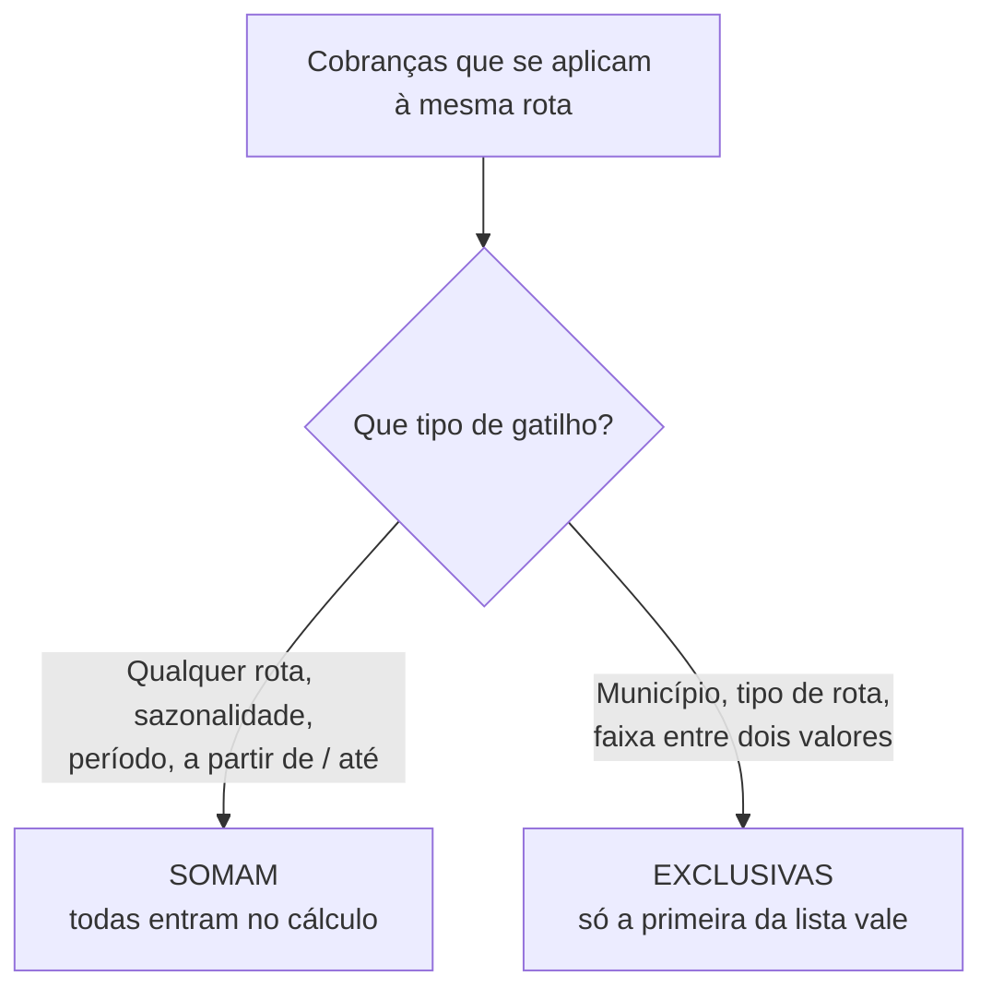

# Montando as cobranças do frete

O **Motor de Frete** é onde você ensina o LocFlow a **calcular sozinho o valor do transporte**. Em vez de digitar o frete à mão a cada orçamento, você descreve uma vez como cobra — "R$ 4 por quilômetro", "R$ 500 fixo para Sorocaba", "taxa de combustível em toda rota" — e o sistema aplica isso automaticamente no orçamento.

Esta página é sobre **montar essas cobranças**: quando cada uma entra, como ela calcula o valor, e o que acontece quando duas se aplicam à mesma rota. Aqui você está configurando o **cálculo** do frete.


Não confunda com a **política de aprovação** do frete (automática / acima de um limite / sempre manual), que vive no **Motor Operacional de Frete** e está em [Aprovação de orçamentos](../orcamentos/aprovacao.md). São coisas diferentes: lá você decide **quem precisa autorizar** um frete; aqui você decide **quanto ele custa**.


## O que é uma cobrança {#o-que-e-uma-cobranca}

Você pensa em **cobranças**, não em fórmulas. Uma **cobrança** responde a duas perguntas:

1. **Quando ela se aplica?** — em qualquer rota, só para certos municípios, só acima de tantos km, só em alta temporada… Isto é o **gatilho**.
2. **Quanto ela cobra?** — um valor fixo, um valor por quilômetro, um valor por minuto, ou uma combinação desses.

Você pode ter **uma só** cobrança que vale para todo frete, ou **várias** cobranças, cada uma para uma situação. O cálculo final do frete de um orçamento é a soma do que cada cobrança aplicável apurar para aquela rota.

### Como você cobra pelo seu frete? {#perfis}

Ao abrir o motor, o LocFlow pergunta qual perfil descreve a sua operação. A escolha não muda o resultado do cálculo — muda **quanto** você precisa configurar:

| Perfil | Para quem |
| --- | --- |
| **Tenho um método único de cobrança** | *"Uma cobrança que vale para todos os fretes. Mais fácil de configurar."* É o **mais comum**. |
| **Tenho vários métodos de cobrança** | *"Várias cobranças combinadas — uma por situação (município, distância, época do ano…)."* |
| **Quero montar regras manualmente** | *"Editor avançado com condições aninhadas e múltiplas ações por regra."* |

Você pode trocar de perfil depois. Esta página cobre os perfis de **uma** e de **várias** cobranças — que dão conta da grande maioria das operações.

## Passo 1 — Quando essa cobrança se aplica? {#gatilho}

O **gatilho** é a situação que liga a cobrança. O LocFlow organiza as opções por eixo:

| Eixo | Gatilhos | O que significa |
| --- | --- | --- |
| **Universal** | Qualquer rota | *"Cobra sempre, em toda rota."* |
| **Percurso da rota** | Município de destino · Município de origem · Distância percorrida · Tempo de transporte · Distância em linha reta | Pelo lugar, pelos quilômetros, pela duração ou pela distância radial entre origem e destino. |
| **Trajeto e carga** | Tipo de rota (ida/volta) · Peso da carga · Volume da carga | Diferente para ida e volta, ou pela carga transportada. |
| **Quando o frete acontece** | Sazonalidade · Período do dia | Em épocas do ano (Natal, alta temporada…) ou faixas do dia (manhã, pico…). |


**Sazonalidade** e **período do dia** usam as épocas e os horários que você cadastra em [Horários e sazonalidades](horarios-e-sazonalidades.md). Se a lista aparecer vazia, cadastre-os primeiro: *"Cadastre épocas em Configurações para usar esse gatilho."*


Escolher um gatilho **substitui** o anterior — cada cobrança tem **um** gatilho. Alguns pedem detalhe ali mesmo: município pede a lista de cidades; tipo de rota pede **Só na ida** ou **Só na volta**.

### A cobrança é por rota, não por viagem {#por-rota-nao-por-viagem}

Esse é o aviso operacional mais importante do motor, e ele aparece destacado na tela. **Verbatim:**

> **A cobrança é por rota, não por viagem.**
>
> **Venda (2 cobranças):** 2 rotas
> &nbsp;&nbsp;&nbsp;↳ se houver entrega: ida + volta
>
> **Aluguel (4 cobranças):** 4 rotas
> &nbsp;&nbsp;&nbsp;↳ se houver entrega: ida + volta
> &nbsp;&nbsp;&nbsp;↳ se houver retirada: ida + volta

Em palavras: o LocFlow calcula cada **rota** (cada perna do caminho) separadamente. Uma entrega já são **duas** rotas — o caminhão vai (ida) e volta (ida + volta). Na locação, há também a **retirada**, que soma outras duas. Por isso uma cobrança de **R$ 100 fixo** não vira R$ 100 no frete: ela incide em **cada rota** aplicável.


Pense no valor da cobrança como o custo de **uma perna do caminho**, não da operação inteira. É o que evita sobrecobrar sem perceber.


## Passo 2 — Cobrar por essa medida, ou usá-la como critério? {#cobrar-x-criterio}

Quando o gatilho é **numérico** (distância, tempo, distância em linha reta, peso ou volume), o LocFlow faz uma pergunta extra — porque uma medida pode servir a dois papéis bem diferentes:

| Escolha | O que faz | Verbatim |
| --- | --- | --- |
| **Cobrar por ela** | A medida **vira preço**: você define um valor por unidade no próximo passo. | *"Vou definir um preço por [unidade] no próximo passo."* |
| **Usar como critério** | A medida **vira condição**: a cobrança só entra quando a medida está dentro de um valor que você definir. | *"Cobrar só quando [medida] estiver dentro de um valor que eu definir."* |

Esta é a distinção central do motor. Um exemplo com **distância**:

* **Cobrar por ela** → "cobro R$ 4 **por quilômetro** rodado". A distância multiplica o valor.
* **Usar como critério** → "só cobro a taxa de longa distância **a partir de 50 km**". A distância apenas **liga ou desliga** a cobrança; o valor vem do Passo 3.

Quando você escolhe **usar como critério**, define o recorte:

| Modo | Significa |
| --- | --- |
| **A partir de** | A medida tem que ser **maior ou igual** ao valor (ex.: distância ≥ 50 km). |
| **Até** | A medida tem que ser **menor ou igual** ao valor (ex.: peso ≤ 100 kg). |
| **Entre dois valores** | A medida tem que cair numa **faixa** (ex.: entre 50 e 100 km). |


A mesma medida pode aparecer em **duas** cobranças com papéis diferentes: uma usa a distância **como critério** ("acima de 50 km, +R$ 80 fixo") e outra cobra **por ela** ("R$ 4/km em toda rota"). Não há contradição — são cobranças distintas que somam.


## Passo 3 — Quanto você cobra por rota? {#quanto-cobrar}

Aqui você define o valor. São **três formatos combináveis** — pode ligar quantos quiser, e eles **se somam**:

| Formato | O que faz | Verbatim |
| --- | --- | --- |
| **Valor fixo** | Um valor em reais sempre que a cobrança se aplica. | *"Cobro esse valor sempre que a cobrança se aplica."* |
| **Por km rodado** | Multiplica o valor pela distância da rota. | *"Multiplico esse valor pela distância da rota."* |
| **Por minuto de transporte** | Multiplica o valor pela duração da rota em minutos. | *"Multiplico esse valor pela duração da rota em minutos."* |

No formato **por minuto** você ainda escolhe **considerar trânsito** (estimativa do mapa, mais realista) ou não (tempo de rota ideal).

Combinar é o caso comum: uma cobrança "Qualquer rota" com **R$ 30 fixo + R$ 4 por km** vira, numa rota de 20 km, `30 + (4 × 20) = R$ 110` — **por rota**.


O cálculo por **km** e por **minuto** usa a **rota real** medida no mapa entre o galpão e o destino — não a linha reta nem faixa de CEP. Por isso o cálculo de frete no orçamento **consome créditos** (ele consulta o mapa). Veja [Valores](../orcamentos/valores.md#frete).


## Passo 4 — Limites (opcional) {#limites}

A maioria das cobranças não precisa de nada aqui. Os limites servem para **controlar valores extremos**, e cada um vale **por rota**, igual à cobrança:

| Limite | Verbatim |
| --- | --- |
| **Cobro no mínimo (piso)** | *"Se o cálculo der menos que esse valor, cobro esse mínimo."* |
| **Cobro no máximo (teto)** | *"Se o cálculo der mais que esse valor, cobro esse máximo."* |
| **Distância mínima cobrada** | *"Para cobranças por km: distâncias menores que esse valor são tratadas como esse valor."* |

Exemplo: cobrança "R$ 4/km" com **piso de R$ 50**. Uma entrega de 8 km daria R$ 32, mas o piso garante o mínimo de **R$ 50**. Já a **distância mínima cobrada** atua antes da conta — se você define 10 km, uma rota de 6 km é calculada **como se fosse 10 km**.

## Como as cobranças se combinam (ou conflitam) {#combinar-x-conflitar}

Quando você tem **várias** cobranças, o LocFlow precisa saber se elas **somam** ou se **uma exclui a outra**. Ele decide isso sozinho, pela natureza do gatilho — você não precisa entender o mecanismo, mas vale conhecer a lógica:

* **Acumuladoras (somam):** "Qualquer rota", sazonalidade, período do dia e os critérios **a partir de** / **até** isolados. São cobranças que se **empilham** — a taxa de combustível soma à cobrança por km, que soma à taxa de alta temporada.
* **Exclusivas (a primeira vence):** município (origem ou destino), tipo de rota e **faixas** (entre dois valores). Estas expressam "para *este* caso, *este* preço" — não faz sentido somar "R$ 500 para Sorocaba" com "R$ 700 para Campinas" na mesma rota.

### Quando duas exclusivas se sobrepõem {#conflito}

Se você cadastra duas cobranças exclusivas que **podem valer ao mesmo tempo** (por exemplo, uma lista de municípios que inclui a mesma cidade), o LocFlow avisa na hora de salvar. **Verbatim:**

> **Essas duas cobranças se sobrepõem.**
> Quando ambas se aplicam à mesma entrega, o motor usa só a primeira da lista. Escolha qual deve vir primeiro.

Você decide a ordem com **Manter esta ordem** ou **Inverter ordem**. A que ficar **em primeiro** é a que prevalece quando as duas se aplicam.


Esse aviso só aparece para cobranças **do mesmo tipo** de gatilho que claramente se cruzam (dois municípios, duas faixas de distância…). Sobreposições entre **tipos diferentes** (um município *e* uma faixa de km) não geram esse aviso — elas dependem da rota concreta e são resolvidas no momento do cálculo.


## Situações reais {#situacoes-reais}

| Situação | Como montar |
| --- | --- |
| **Cobro sempre por distância** | Uma cobrança · gatilho **Qualquer rota** · **Por km rodado** (ex.: R$ 4/km). Perfil de cobrança única resolve. |
| **Taxa fixa de saída + por km** | Uma cobrança · **Qualquer rota** · ligue **Valor fixo** (R$ 30) **e** **Por km** (R$ 4). Eles somam, por rota. |
| **Preço fechado por cidade** | Uma cobrança por município de destino, cada uma com seu **Valor fixo**. São **exclusivas**: a rota cai numa cidade só. |
| **Cobro só rotas longas** | Gatilho **Distância**, **usar como critério**, **a partir de 50 km**; no valor, **R$ 80 fixo**. Abaixo de 50 km, não entra. |
| **Frete mais caro na alta temporada** | Uma cobrança extra com gatilho **Sazonalidade** (a época cadastrada) e um **Valor fixo**. Ela **soma** ao frete normal naquele período. |
| **Garantir um mínimo de frete** | Na sua cobrança por km, abra **Limites** e defina **Cobro no mínimo** (piso). |

## Por porte {#por-porte}

| Porte | Como costuma usar |
| --- | --- |
| **Autônomo / MEI / pequeno** | Uma **cobrança única** (perfil "método único") — geralmente por km, ou um fixo simples. Configura em minutos e esquece. |
| **Médio** | Algumas cobranças combinadas: por km em toda rota + faixas ou municípios para casos especiais + um piso de frete. |
| **Grande / muitas filiais** | Várias cobranças por município, tipo de rota e faixas, com sazonalidade e período do dia; quando precisa de lógica fina (condições aninhadas), o editor manual. |

O LocFlow **abstrai para o pequeno e revela para o grande**: você começa com uma cobrança e vai acrescentando situações conforme a operação pede.

## Para quem quer os detalhes {#detalhes}

* **1 cobrança = 1 regra de cálculo.** Os três formatos (fixo, por km, por minuto) ligados na mesma cobrança viram **componentes somados** dentro dela; a ordem matemática é cuidada pelo sistema.
* **A ordem da lista importa só para as exclusivas.** Entre cobranças que somam, a ordem é indiferente. Entre exclusivas que se cruzam, vale **a primeira** — é o que o aviso de sobreposição deixa você decidir.
* **As exclusivas são avaliadas antes das acumuladoras.** Isso permite o padrão "para Sorocaba uso R$ 500 fixo, **e em cima disso** somo a taxa de combustível": a cobrança específica define a base, e as que somam se acrescentam.
* **"A partir de 0" não é critério.** Se você marca "usar como critério" mas o mínimo é zero, na prática a cobrança vale para qualquer rota — o sistema entende isso como "cobrar sempre".

## Próximo passo {#proximo-passo}

* Onde o resultado aparece no orçamento: [Valores: mão de obra, frete e descontos](../orcamentos/valores.md#frete)
* Quem autoriza fretes altos: [Aprovação de orçamentos](../orcamentos/aprovacao.md)
* Cadastrar épocas e horários para os gatilhos: [Horários e sazonalidades](horarios-e-sazonalidades.md)
* Visão geral dos motores: [Motores operacionais](motores-operacionais.md)
