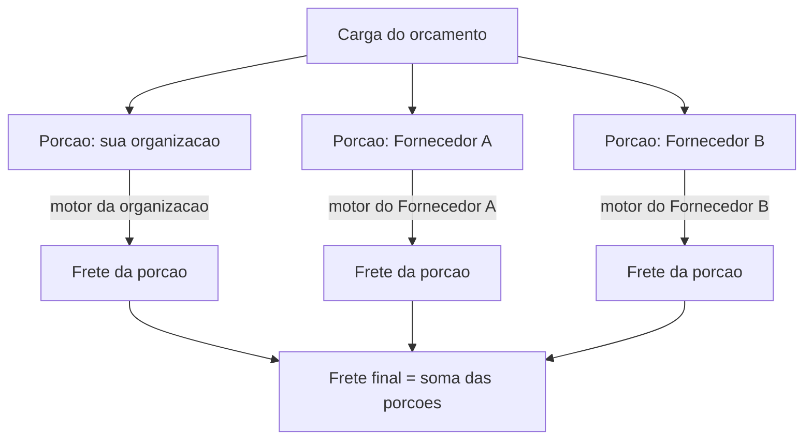

# Motor de Frete por detentor

Até aqui, o [Motor de Frete](motor-de-frete.md) foi apresentado como **um** motor: as suas regras, o seu jeito de cobrar o transporte. Mas quando você terceiriza frete — reparte a carga com **fornecedores** —, cada um deles cobra do seu jeito. O LocFlow trata isso do jeito certo: **cada transportadora tem o seu próprio motor**, e o frete de um orçamento é montado somando o que cada uma cobra pela parte que leva.

Chamamos cada transportadora de **detentor** (quem detém os veículos): pode ser a **sua própria organização** ou um **fornecedor de frete** cadastrado. Esta página é sobre como dar um motor a cada detentor, como o frete se compõe quando a carga é dividida e como o frete terceirizado espera a confirmação do fornecedor.


**Onde fica:** o motor de cada detentor está em **Ajustes › Motores › Motor de Frete** (com um seletor de detentor no topo). A política de aprovação e a estratégia de alocação ficam em **Ajustes › Motores › Operação do frete**. Configurar quem são os seus fornecedores é assunto de [Fornecedores de frete](../parcerias/fornecedores-de-frete.md).


## Cada detentor tem o seu motor {#cada-detentor-tem-o-seu-motor}

Um fornecedor de frete não cobra pelas **suas** regras — ele cobra pelas **dele**. Por isso, no LocFlow, cada detentor mantém a **sua própria configuração de frete**, com o **seu** histórico de versões, independente dos demais. O motor da sua organização é um; o motor de cada fornecedor é outro.

Ao abrir o **Motor de Frete**, você vê no topo um **seletor de detentor**. Ele começa na **sua organização** (o padrão) e lista, abaixo, cada **fornecedor de frete** cadastrado que presta frete. Ao escolher um fornecedor, **a tela inteira reancora nele**: o perfil, as cobranças, o simulador, as versões — tudo passa a ser do fornecedor selecionado. Você configura o motor dele exatamente como configuraria o seu (os [perfis](motor-de-frete.md#os-tres-perfis), as [cobranças](motor-de-frete-cobrancas.md), a Rota Estimada, o "por viagem"), e publica uma versão que vale só para ele.


**O seletor de detentor só aparece quando faz sentido.** É preciso ter **permissão** para listar fornecedores de frete, ter o **plano** que libera o recurso e ter ao menos um **fornecedor cadastrado**. Sem isso, o Motor de Frete mostra apenas o da sua organização — como sempre foi. Veja [Colaboradores e acessos](colaboradores-e-acessos.md).


Enquanto você não configura o motor de um fornecedor, ele parte de um **padrão seguro**: nenhum frete dele é fechado sem confirmação (mais sobre isso em [Aguardar resposta do fornecedor](#aguarda-resposta-fornecedor)).

## Frete por porção: a soma das partes {#frete-por-porcao}

Nem toda carga cabe numa transportadora só. Às vezes a sua frota leva metade e um fornecedor leva o resto; às vezes dois fornecedores dividem a operação. Quando isso acontece, a carga se reparte em **porções** — e cada porção é o conjunto de viagens que roda sob **um** detentor.

A regra é simples e justa:


**O frete final é a soma das porções.** Cada porção é cotada pelo Motor de Frete do **seu próprio detentor** — nunca pelo motor da sua organização. As viagens que ficam com um fornecedor são cobradas pelas regras **dele**; as que ficam com você, pelas suas. O total do frete é a soma de todas as porções, e é esse valor único que o cliente vê.


Isso é o que garante que o número bate com a realidade: você **paga cada fornecedor pela tabela dele**, então o frete do orçamento precisa refletir cada tabela, e não uma média ou uma regra única aplicada a todos. Uma alocação com veículos de **dois ou mais detentores** é uma **alocação mista** — e o LocFlow a sinaliza como tal.


**Uma porção que não calcula não derruba as outras.** Se faltar um dado para cotar a parte de um detentor (um endereço que o mapa não acha, uma regra que exige horário que ainda não foi informado), só **aquela** porção fica sem valor — as demais continuam somando normalmente. O LocFlow avisa qual porção ficou incompleta, para você resolver só o que falta.


Onde você **monta** essa divisão e vê a composição transportadora por transportadora é no bloco **Valores** do orçamento — veja [A composição do frete](../orcamentos/valores.md#composicao-do-frete). Aqui tratamos de como o resultado se forma; lá, de como você opera.

## Estratégia de alocação {#estrategia-de-alocacao}

Quando há mais de uma forma de repartir a carga entre os detentores disponíveis, qual o LocFlow deve **recomendar**? Isso é a **estratégia de alocação** — uma configuração da **sua organização** (não do detentor), definida em **Operação do frete**. Ela é só a **recomendação inicial**: em cada orçamento você pode trocar a estratégia **só para aquele pedido**, no painel de frete.

| Estratégia | O que ela recomenda | Efeito no valor |
| --- | --- | --- |
| **Menor valor ao cliente** *(recomendado)* | A combinação mais barata — a que sai com o **menor frete** para o cliente. | Cada arranjo possível é cotado pelos motores dos detentores e vence o de **menor soma**. Fecha mais barato. |
| **Melhor aproveitamento** | O melhor **encaixe** da carga: menos folga e menos viagens nos veículos. | Prioriza lotar bem os veículos (tende a usar a sua própria frota). Pode não ser o mais barato, mas rende menos idas. |
| **Montar manualmente** | Nada automático — **você** distribui a carga à mão em cada orçamento. | O valor é o que a sua montagem gerar. Controle total, sem sugestão. |


**A estratégia é da organização; a aprovação é de cada detentor.** A forma de repartir a carga é uma decisão única da sua operação — por isso ela vive só na configuração da **organização**, e as linhas de fornecedor não a definem. Já **se** um frete precisa de aval (a política de aprovação) é definido **por detentor**, como você verá a seguir.


Sem você mexer em nada, a organização já vem em **Menor valor ao cliente** — porque fechar mais barato é o que a maioria quer. Suba para **Melhor aproveitamento** quando priorizar lotar os veículos, ou vá para **Montar manualmente** quando cada carga for tão diferente que não valha automatizar.

## "Aguardar resposta do fornecedor" {#aguarda-resposta-fornecedor}

Frete próprio é uma coisa: você fecha o valor e segue. Frete de **fornecedor** é outra: você depende de alguém **fora** da sua operação confirmar que topa a corrida pelo valor combinado. Seria arriscado fechar um orçamento com frete terceirizado que ninguém confirmou.

Por isso, além dos três modos de aprovação que você já conhece — **automático**, **acima de um limite** e **sempre manual** —, existe um quarto modo, específico para fornecedores:


**Aguardar resposta do fornecedor** é o **padrão de todo frete terceirizado**. Quando um orçamento inclui uma porção de fornecedor, ele **nasce Pendente**, aguardando o fornecedor confirmar — antes de entrar no funil. É o freio que impede fechar, sem querer, um frete que o parceiro ainda não aceitou.


Na prática: assim que um fornecedor entra na composição do frete, o orçamento fica **travado como Pendente** (a pré-etapa do funil), esperando a resposta. Nesta versão, quem responde pelo fornecedor é um **operador interno** — a pessoa confirma a corrida e o orçamento é liberado para seguir. É a mesma mecânica de qualquer orçamento que aguarda aval: enquanto pendente, mudar de status, gerar cobrança e liberar a logística ficam bloqueados. Tudo isso está detalhado em [Aprovação de orçamento](../orcamentos/aprovacao.md).

Esse quarto modo é o **padrão** de um fornecedor novo — você não precisa configurá-lo. A sua própria organização segue no padrão histórico (**automático**): frete próprio fecha sozinho, a menos que você ligue uma regra de aprovação por valor. Para revisar todos os modos, veja [Operação do Frete](motores-operacionais.md#operacao-do-frete).

## Por porte {#por-porte}

| Se você é… | Como o frete por detentor te serve |
| --- | --- |
| **Autônomo / micro** | Você entrega tudo. Um detentor só (a sua organização), um motor só. Nem chega a ver o seletor de fornecedores. |
| **Médio** | Começa a repartir com um ou outro fornecedor em picos. Cadastra o motor de cada um, deixa em **Menor valor ao cliente** e confirma os fretes terceirizados quando chegam. |
| **Grande / muitas filiais** | Vários fornecedores, cada um com a sua tabela e o seu histórico de versões. A estratégia de alocação e a divisão por porção mantêm o frete fiel a cada contrato. |

A filosofia é a de sempre: **abstrair para quem quer simplicidade, revelar números e flexibilidade para quem quer controle.**

## Situações reais {#situacoes-reais}

- **Carga que não cabe na sua frota.** Metade vai no seu caminhão, metade num fornecedor. O frete sai como a **soma das duas porções** — a sua pela sua tabela, a dele pela dele.
- **Novo fornecedor na praça.** Você cadastra o fornecedor, abre o Motor de Frete, troca o detentor no topo para ele e configura as regras dele. A partir daí, toda vez que ele entrar num orçamento, é a tabela dele que cota.
- **"Por que meu orçamento nasceu Pendente?"** Porque tem uma porção de fornecedor. Ele espera a **confirmação do fornecedor** antes de andar — é o padrão do frete terceirizado.
- **"Quero o frete mais barato possível."** Deixe a estratégia em **Menor valor ao cliente**: o LocFlow compara os arranjos pelos motores de cada detentor e recomenda o de menor soma.
- **Um endereço que o mapa não acha só numa das pontas.** A porção daquele detentor fica sem valor e o app avisa; as outras porções continuam somando. Você corrige só o que faltou.

## Próximo passo {#proximo-passo}

- Entenda como o motor calcula (Rota Estimada, "por viagem", perfis) em [Motor de Frete: como calcula](motor-de-frete.md).
- Veja o quadro completo dos motores e da política de aprovação em [Motores operacionais](motores-operacionais.md).
- Cadastre e gerencie quem leva o seu frete em [Fornecedores de frete](../parcerias/fornecedores-de-frete.md).
- Monte a divisão e veja a composição no orçamento em [Valores: mão de obra, frete e descontos](../orcamentos/valores.md#composicao-do-frete).
- Entenda a pré-etapa Pendente e como aprovar em [Aprovação de orçamento](../orcamentos/aprovacao.md).
- Dúvida em algum termo? Consulte o [glossário](../primeiros-passos/glossario.md).
